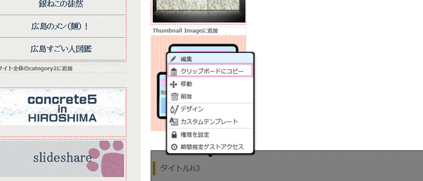
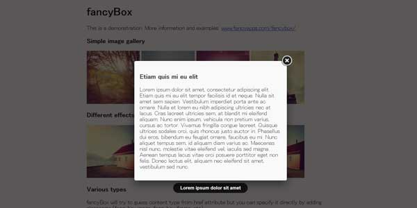
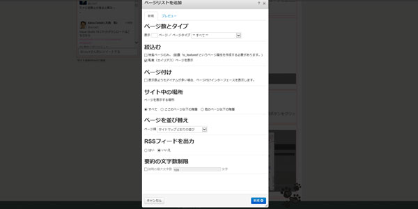

## ブロックのすべての設定がコピーできる
ブログを書くときなどはどの記事もおそらく似たようなブロックから構成されていると思います。
私の場合は画像ブロック、記事ブロック、シンタックスハイライターなど。

ブロックによってはいったんブロックを編集してさらにカスタムテンプレートに変えたり、デザインを追加するなどしなくてはいけないので結構面倒…。
そこでよく使うブロックはクリップボードにコピーしておきます。

## クリップボードにコピーしたらペースト

コピーしたらブロックを選択してペーストするだけです。
うれしいのは今までコピーした履歴が残っており、不要になればゴミ箱ボタンをクリックすればよいだけです。

## こんなとき便利その1。一度書いた記事を分割したいとき

一度書いた記事と記事の間に画像や地図を挿入したいときなど挟みたいなど、やっぱり分割して入れアウトを変更したいたいときに使ってます。

## こんなとき便利その2。設定が面倒なブロックを中身だけ変えて使いまわす
ページリストブロックなどはどのページを表示するか、どの階層を表示するか、何ページ表示するかなど、こまかい設定もあります。
さらにカスタムテンプレートに変えたりするとまた同じ設定を一からするのは超面倒。別のページでまったく同じ設定を使いたいときはぜひコピーしておきましょう。
もちろん同じページタイプの同じエリアにまったく同じブロックを使うのであればグローバルエリアに設定してしまった方が良いです。

最近アドオンからシンタックスハイライターのブロックをDL（無料）したんですがこれも結構面倒。

（実は頑張って自作しようと思ったのですが面倒になって断念）

、コードやソースのサンプルを書くときに使うのですが、選べる言語があほみたいにあり、ここから探すのが面倒。選べる言語の数、数えたらヤになるだろうな…。
C言語に至ってはC（Mac）とかまであるし…。

いろんなニーズがあるとはいえ、無駄な言語まであるのでいちいち探すのに手間がかかり、最高に使い勝手が悪い。しかも追加したJQueryと相性が悪いのか、それ自体が機能がイマイチなのか列番号表示をオンにしてもされない。ここも原因を調べればいいのですが、面倒なので放置してます。ページがごちゃごちゃしてない方が好きなので良しとしてます。

## まとめ
多少不便なブロックを使うときもコンクリの編集機能が優秀なおかげで助けられてます。
ブロックをコピーしてためておくと、記事を書くとき効率的。

あとは画像のアップロードがもっと楽になればいいな～。
