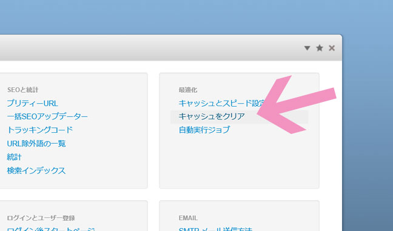

## 「キャッシュをクリア」してみよう
挙動が不審な場合はとりあえずキャッシュをクリアしてみましょ。

* 編集画面 > システムと設定 > キャッシュとクリア

とディレクトリをたどって探してもいいですが、右上の検索バーに「キャッシュとクリア」で検索した方が断然早いです。

よく使うので右上の星印をポチってお気に入りに追加しておくと便利です。

## まとめ

なーんだ、これだけ？

と思うけど、おかしい時はこれだけで結構解決します。

困った時にぜひやってみてください。
