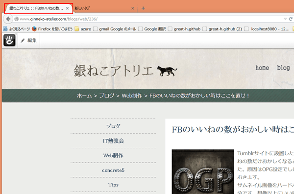

## タイトルの表示方法の変更は簡単
ヘッダー内に入るこれ↓コロンの2セットがどうも好きじゃなかったのでやっとのこさ修正。



## 6系
config/site.php内を書き換えます。

* 「%1$s」…サイト名
* 「%2$s」…ページ名

```
define('PAGE_TITLE_FORMAT', '%1$s :: %2$s');
```

上記はデフォルト。なので次のようにお好みで書き換えます。

```
define('PASSWORD_SALT', 'XXXXXXXXXXXXXXXXXXXXXXXXXXX');
define('PAGE_TITLE_FORMAT', '%1$s | %2$s');
```

## 7~8系
application/config/concrete.phpに以下を追加。<br>concrete.phpファイルがなければ作ります。


[ページタイトルのカスタマイズ方法 concrete5公式ページ](http://concrete5-japan.org/help/faq/how_to_customize_page_title/)

* 「サイト名 - ページ名」…%1$s-%2$s
* 「サイト名｜ページ名」…%1$s | %2$s
* 「サイト名」…%1$s
* 「ページ名」…%2$s
