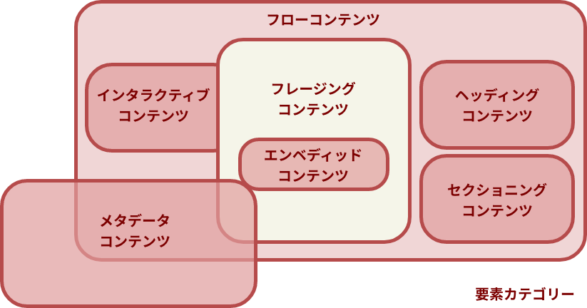

## aタグ（リンク）にまつわるお困りごと3つ

この記事では初心者がつまずきがちの3つのお困りごとの解消法と原因をご紹介します

* ナビゲーションをクリックしても反応しない！？
* aタグの中に画像を配置して下側にできたアキをどうにかしたい!!
* リンクのど真ん中に文字や画像を配置したい

## お困りごと1・あれ？！ナビゲーションをクリックしても反応しない！？
こんなナビを作ってみたものの、見た目はキレイにできているのにクリックしてもテキスト部分しかリンクが反応しない。。。。

そんなことあります。


テキスト以外のエリアをクリックしてもちゃんとリンクへ飛ぶようにしたいですよね？


このようにナビゲーションを配置したい時に書きがちなコードです。

`display: flex`でナビのliタグを横方向に並べ、幅を均等に振り分けます。

```
&lt;!-- HTML -->
&lt;ul>
  &lt;li><a href="/">ホーム</a></li>
  <li><a href="blog/">ブログ</a></li>
  <li><a href="profile/">プロフィール</a></li>
  <li><a href="contact/">お問合わせ</a></li>
</ul>

/* CSS */
* {
  box-sizing: border-box;
}

ul {
  display: flex;
  flex-wrap: wrap;
}

li {
  width: 25%;
  text-align: center;
  border-left: 1px solid #fff;
}

li:first-child {
  border-left: none;
}

a {
  padding-top: 20px;
  padding-bottom: 20px;
}
```

残念ながらこのコードではリンクの範囲はliタグと同じサイズになりません。

### 解決法：CSSでaタグにプロパティdisplay:blockをセットするだけ

ではどうすればいいのか。


解決方法はカンタンです。
aタグにCSSでプロパティ`display:block`をセットするだけです。

### 原因の解説
理由はaタグの初期値は`display: inline`、つまりaタグがインラインレベルの要素だからです。

displayは要素の表示形式を指定するプロパティで`inline`を指定すると通常、**内側のコンテンツ（テキストなど）以上のサイズに大きくなることはありません**。

そのためliタグの中に**インラインレベルの要素をおくからアキができてしまう**わけです。


プロパティ`display`を活用して表示形式を変えましょう。

## お困りごと2・aタグの中に画像を配置して下側にできたアキをどうにかしたい!!
画像を入れ子にしたら下の方にこんな感じのアキが！！


### 解決法：CSSでimgタグにプロパティvertical-align: bottomをセット
この現象は初心者あるあるです。

解消法はCSSでimgタグに`vertical-align: bottom`をセットするだけです。
```
<!-- HTML -->
<a href="/"></a>

/* CSS */
a {
  display: block;
  width: 300px;
  height: 300px;
  border: 2px solid #333;
}

img {
  width: 100%;
  height: auto;
  vertical-align: bottom;/* ←これが重要 */
}
```

### 原因の解説
プロパティ`vertical-align`はインライン要素の縦方向の位置を調整するプロパティです。
アイコンの位置上付、下付きなどの文字位置の調整もプロパティ`vertical-align`を使います。

imgタグの下になぜ余白ができるのか。


**インラインレベルの要素はアルファベットをベースに作られているから**です。
```
vertical-align: baseline;
```
HTMLはもともと英語圏の人が作ったものなので、文字にはベースラインが基準になるようにセットされてます。小文字の「g」や「j」下に突き抜けます。

imgタグなどのインラインレベルの要素はこれらの文字と同じ振る舞いをするので下に変なアキができてしまうのです。


画像の位置のたての位置の基準を一番下に変えれば良いだけです。

```vertical-align: bottom;```
## お困りごと3・リンクの範囲を縦方向にも広げて文字位置を縦横方向真ん中に配置したい

イラストのようなナビゲーションメニューを作る時、**高さを寸分狂わず決まった高さにしたい!!**しかもリンクのテキストは上下左右ピタッとセンタリングしたい。

なのに`padding`や`height`を駆使してもなぜかうまくいかないことってありませんか？
### 解決法：aタグにプロパティdisplay:flexをセットして配置を調整
解決法はdisplay: flexを使い倒します。

* aタグに高さをセットする
* `display: flex`
* `justify-content: center`
* `align-items: center`

```
* {
  box-sizing: border-box;
  line-height: 1.8;
}

ul {
  display: flex;
  flex-wrap: wrap;
  background: #4D4D4D;
  list-style: none;
}

li {
  width: 25%;
  text-align: center;
  border-left: 1px solid #fff;
}

li:first-child {
	border-left: none;
}

a {
  height: 70px;
  text-decoration: none;
  color: #fff;
  display: flex;
  justify-content: center;
  align-items: center;
}
```

### 原因と解説
プロパティdisplayをflexにすると**子要素やコンテンツの縦方向や横方向並びと位置をコントロールできます**。

**flex-direction**というプロパティをセットで使うのですが、初期値は**row**がセットされており子要素は横並びになります。なので縦方向に並べたい時は**column**をセットしておきます。

並べていく方向のコンテンツの位置をコントロールできるのが**justify-content**で、centerにするとこの場合、コンテンツは横方向にセンタリングされます。

縦方向に対しての位置をコントロールするプロパティが**align-items**です。値を**center**にするとaタグの縦方向に対し真ん中にコンテンツを配置できます。

## おまけ・HTML5の要素について要素がどうカテゴライズされているか知っておこう
インライン、ブロック要素という言い方はHTML5ではなくなりました。

ただ、この記事では便宜上aタグとimgタグを**インラインレベルの要素**と説明しています。


インライン、ブロックの解説は難しいですね。

### 要素は分類できる
要素（HTLMタグ）、つまりコンテンツは7つに分類できます。

* **メタデータ・コンテンツ** ... 文書情報や別文書との関係などを定義するコンテンツ
* **フロー・コンテンツ** ... 文書の本体に現れる一般的なコンテンツ
* **セクショニング・コンテンツ** ... セクションの範囲を定義するコンテンツ
* **ヘッディング・コンテンツ** ... 見出しを表すコンテンツ
* **フレージング・コンテンツ** ... 段落内で使用するようなコンテンツ
* **エンベッディッド・コンテンツ** ... 文書内に埋め込みを行うコンテンツ
* **インタラクティブ・コンテンツ** ... ユーザーが操作可能なコンテンツ



aタグやimgタグは、HTML5では主にフレージングコンテンツの一種ですが同時に**ユーザーが操作可能**なのでインタラクティブコンテンツでもあります。

さらに、imgタグは「画像を埋め込む」コンテンツでもあるのでエンベッディッド・コンテンツにも属します。

とても複雑ですね。

要素の特性を知る上では重要ですが、こんなことイチイチ気にしていたらコーディングできないです。

たとえはフレージング・コンテンツであるspanや、strongの中にpタグやdivタグを入れたら文書構造が破綻するぐらいは知っておいた方がいいですが、気になったら都度調べる程度で十分です。

| 種類 | タグ | 備考 |
| ---- | ---- | ---- |
| フローコンテンツ | &lt;a>, &lt;abbr>, &lt;address>,&lt;area>（map要素内にある場合）&lt;article>, &lt;aside>, &lt;audio>,<br>&lt;b>, &lt;bdi>, &lt;bdo>, &lt;blockquote>,&lt;br>, &lt;button>,<br> &lt;canvas>, &lt;cite>, &lt;code>, &lt;data>, &lt;datalist>, &lt;del>,&lt;details>, &lt;dfn>, &lt;div>, &lt;dl>,<br>&lt;em>, &lt;embed>, &lt;fieldset>, &lt;figure>, &lt;footer>, &lt;form>,<br>&lt;h1>-&lt;h6>, &lt;header>,&lt;hr>, &lt;i>, &lt;iframe>, &lt;img>,&lt;input>,<br> &lt;ins>, &lt;kbd>, &lt;keygen>, <br>&lt;label>, &lt;main>, &lt;map>, &lt;mark>,&lt;menu>, &lt;meter>, &lt;nav>, &lt;noscript>,<br>&lt;object>, &lt;ol>, &lt;output>, &lt;p>, &lt;picture>, &lt;pre>, <br>&lt;progress>, &lt;q>, &lt;ruby>, &lt;s>,<br>&lt;samp>, &lt;script>, &lt;section>, &lt;select>,&lt;small>, &lt;span>, &lt;strong>, &lt;sub>, &lt;sup>,<br>&lt;table>, &lt;template>, &lt;textarea>,<br> &lt;time>, &lt;u>, &lt;ul>, &lt;var>, &lt;video>, &lt;wbr>, テキスト|
|メタデータコンテンツ|&lt;base>, &lt;link>, &lt;meta>, &lt;noscript>, &lt;script>, &lt;style>, &lt;template>, &lt;title>|
|ヘッディングコンテンツ|&lt;h1> ~ &lt;h6>|見出し|
|セクショニングコンテンツ|&lt;article>, &lt;aside>, &lt;nav>, &lt;section>||
|フレージングコンテンツ|&lt;a>, &lt;abbr>, &lt;area> （map要素内にある場合）<br> &lt;audio>, &lt;b>, &lt;bdi>, &lt;bdo>, &lt;br>, &lt;button>,<br> &lt;canvas>, &lt;cite>, &lt;code>, &lt;data>,<br>	&lt;datalist>, &lt;del>, &lt;dfn>, &lt;em>, &lt;embed>,<br> &lt;i>, &lt;iframe>, &lt;img>, &lt;input>, &lt;ins>, &lt;kbd>,<br> &lt;keygen>, &lt;label>, &lt;map>, &lt;mark>, &lt;meter>,<br> &lt;noscript>, &lt;object>, &lt;output>, &lt;picture>,<br> &lt;progress>, &lt;q>, &lt;ruby>, &lt;s>,<br> &lt;samp>, &lt;script>, &lt;select>, &lt;small>,<br> &lt;span>, &lt;strong>, &lt;sub>, &lt;sup>,<br> &lt;template>, &lt;textarea>, &lt;time>,<br> &lt;u>, &lt;var>, &lt;video>, &lt;wbr>, テキスト||
|エンベディッドコンテンツ|&lt;audio>, &lt;canvas>, &lt;embed>, &lt;iframe>, &lt;img>, &lt;object>, &lt;picture>, &lt;video>||
|インタラクティブコンテンツ|&lt;a> （HTML 5.1ではhref属性がある場合に限る）,<br>&lt;audio> （controls属性がある場合）,<br>&lt;button>, &lt;details>, &lt;embed>, &lt;iframe>,<br>&lt;img> （usemap属性がある場合）,<br>&lt;input> （type="hidden"の場合は除く）,<br><&lt;keygen>, &lt;label>,<br>&lt;object><br>（usemap属性がある場合）（HTML 5.1では除外）,<br>&lt;select>, &lt;textarea>, &lt;video> （controls属性がある場合）||

## まとめ・この記事を読んでくださった方へ
この記事は私がブログを始めた頃、2014年に書いたものです。

ありがたいことに、いまだに毎月たくさんの人に読んでもらっています。
きっとコーディングで行き詰ってこの記事にたどり着いていると思うので、少しでもわかりやすくなるよう何度もメンテナンスしています。お役に立てたら幸いです^ ^。

最後まで、お読みいただきありがとうございました。
