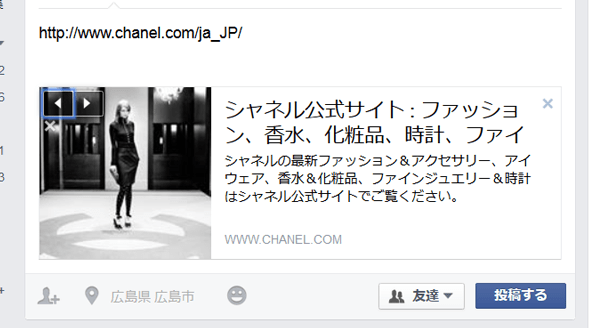
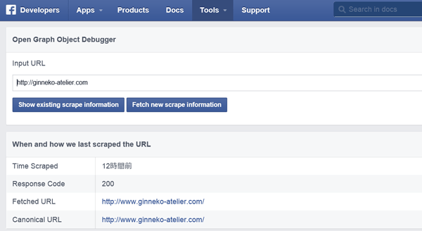

## 恐るべしFBのクローラ
いいねが押せない状態で長いことハマってました。
やっと、やっと解明することができました。天にも昇る気持ちです！
原因はFBのクローラ（ウェブ上の文書や画像などを周期的に取得し、自動的にデータベース化するプログラム）のことです。

参考サイト<br>
[Facebookのいいね数がおかしい・シェアしてもトップページのURLしか出てこないバグの対処法](https://ushigyu.net/2012/05/11/fix_facebook_number_of_like/)

Facebookのクローラが一度いいねやシェアしてしまうとサイト必要情報を取得しにくるわけです。

Facebookクローラが取得する主な情報

* 取得時間
* サイトの種類
* サイト名
* ページの説明
* アプリID
* ページの画像
* ページのURL※

他の方がハマってたパターンはOGP設定してなかったせいで、Facebookが勝手にOGPを判断して、全てのページがトップページと同じいいねの数になっているっていう事例を見かけました。

私の場合はOGP設定でトップページのURLを設定してしまったせいで、どのページをいいねしてもトップページのいいねの数になってそれ以上いいねを押せなくなってしまいました。

自ら設定しているわけですから、まさに墓穴を掘ったわけです…-o-;

他のSNSはこんなことになってないので長い間頭を悩ませました…。

## OGPを直さねばならぬ…が、OGPってそもそもなんぞ？
OGP（Open Graph Protocol）とはFacebookやmixiなどで使われている共通の仕様でSNSでシェアするのには欠かせないもので、「このウェブページは、こんな内容です」ということを明言してくれるというものです。

たとえばシャネルのURLをFacebookのウォールに投稿しようとするとこんな感じで表示されます。

最低限のOGPを設定するにはこんな感じで`<head>`内に記述します。



```
<meta property="og:title" content="タイトル">
<meta property="og:type" content="サイトのタイプ">
<meta property="og:description" content="サイトの簡単な説明">
<meta property="og:url" content="サイトURL">
<meta property="og:image" content="OGPの画像">
<meta property="og:site_name" content="サイトの名前">
```
タイプの選択がキモっぽい。

以前はblogとかもあったみたいですけど公式サイトから消えてるので大雑把には3つのタイプを使い分けた方が良いみたい。

* 「website」・・・ウェブサイトのトップページ（ホーム）に指定
* 「article」・・・下層ページやブログの記事ページに指定
* 「profile」人物を表します。有名人やミュージシャンに適していますが、個々のプロファイルに使用することができます。
* 「blog」・・・※ブログのトップページに指定、だったのですが、2013/05/01現在公式サイトから消えています

参考
* [MILL KEY WEB](http://millkeyweb.com/facebook-ogp/)
* [html999](http://html999.sitemix.jp/)
さらに詳しくは公式サイトのこちらを参考にした方がよいです（英文）。
[http://ogp.me/](http://ogp.me/)

## OGPを直す（Tumblrバージョン）
早速、OGP設定しましょう。ただしTumblrバージョンです。

他のブログサイトもお作法が違うかもしれませんが同じ要領で修正可能なはずです。

FacebookのSNSボタンの設定さえ問題なければ、個別ページごとのいいねの取得数を表示できるようになります。

OGPのタイトル、タイプ、URLをそれぞれページ別に変更できるようにします。
```
<meta property="og:title" content="{Title}{block:PermalinkPage}{block:PostSummary} ｜— {PostSummary}{/block:PostSummary}{/block:PermalinkPage}">
<meta property="og:type" content="{block:IndexPage}website
	{/block:IndexPage}{block:IfNotIndexPage}article{/block:IfNotIndexPage}">
<meta property="og:url" content="{block:IndexPage}/
	{/block:IndexPage}{Permalink}">
```

* 「タイトル」…タイトルとサブタイトルを表示
* 「タイプ」…「website」であるトップページ以外は「article」に切り替える
* 「URL」…個別ページ以外はトップページに切り替えることで個別ページごとのURLを取得し、各ページにいいねの数が表示できるようにする

トップページにを設定する場合はタグ`{block:IndexPage}`内に記述すれば適応されます。それ以外のページに対しては`{block:IfNotIndexPage}`内に記述すればOKです。

このように例外条件を適応したいときは"IfNot"をタグに追記します。ただ、テンプレによって初期的に設定がないことがあります。そのような場合には<head>内に下記の通りMeta要素を作って追記したらいいみたいです。

```
//<head>内に記述
<meta name="if:IndexPage" content="1">
//使用例
{block:IfNotIndexPage}何かしら{/block:IfNotIndexPage}
```

## Facebookをデバック
一度データベースに登録されたOGPはデバックしてやる必要があります。

ページ数が多いと超面倒です…。できるだけ早めに気づいて処理しましょう。

面倒ですが１個、１個URLをリセットしてやる必要があります。

下記リンクにアクセスしてURLをリセットします。

[Facebook Debugger](https://developers.facebook.com/tools/debug)



## まとめ
OGP設定とFacebook、本当に気を付けた方が良いです。
SNSでのシェアが有効なことは身にしみてわかってるので、今後はOGPをもっと意識してサイトを作成しようと思います。
