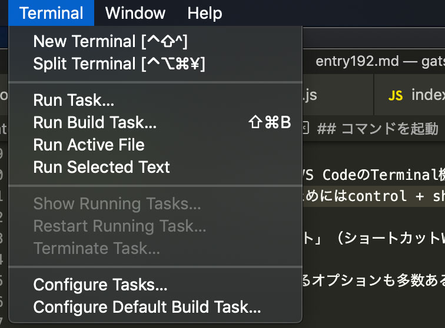
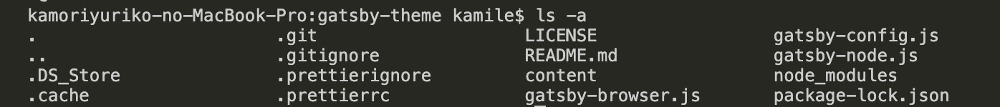
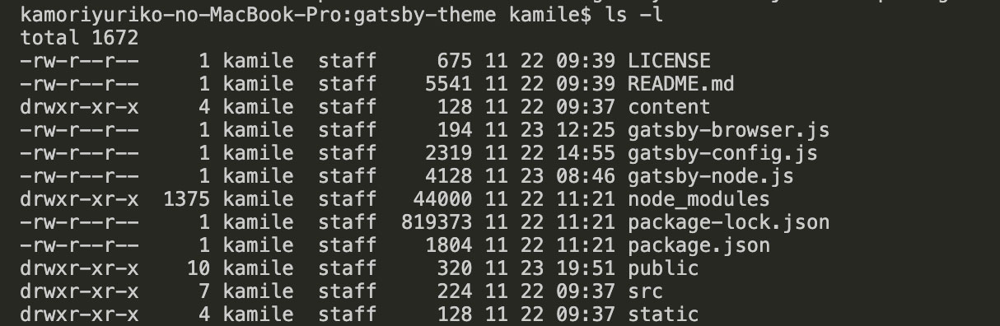

## コマンドラインってなんぞ？
コマンドラインとは**キーボードを使い命令を入力して操作するツール**のことを指します。<br>
イラレやフォトショのようにマウスで直感的に使えるアプリケーションとは違い、Windows・Macともにテキストのやりとりだけで操作するのが特徴。<br>
プログラミングの環境構築したり実際にプログラムを実行したりする際に使い方を覚えておくと便利です。

余談ですが、イラレやフォトショのようにマウスで操作できるアプリケーションのことを**GUI（Graphical User Interface）**、テキストだけで操作するものを**CUI（Character User Interface）**と言います。

## コマンドを起動
少し前はiTermを使っていましたが、現在はVS CodeのTerminal機能を主に使っているのでそちらを使っていることを前提に説明します。<br>
Mac の VS Codeでターミナルを起動するためにはcontrol + shift + @でいけます。

もちろん上部メニューの Terminal > New Terminal からでもOK!!



※ ちなみにWindowsの人は「コマンドプロンプト」（ショートカットWindowsキー+ｓでcmdと入力すれば起動可能）で十分事足りると思います。

コマンドには実行すること以外にそれに対するオプションも多数あるのでそちらも合わせて紹介します。

### cd:階層の移動
`cd`コマンドは参照したいディレクトリへ移動したい時に使います。

###  ls：現在のディレクトリの構造を調べる
`ls`コマンドを使いましょう。
たまに不可視ファイ（先頭に.があるファイルなど）があってなんのこっちゃってことありますが、そんなとき便利。

```
$ ls
```
#### lsコマンドの便利なオプション:-a（すべて表示）
参照ディレクトリ内のファイルをすべて表示してくれます。<br>
とりわけ見つけにくいのが**先頭に.（ピリオド）があるファイル**などです。<br>
作ったはずのファイルがファインダー（Macのファイル管理のアプリ）でみても見つからないなんてことはプログラミング初学者に陥りやすいケースですね。



```
$ ls -a
```
#### lsコマンドの便利なオプション:-l（詳細の表示）
どんなステータスのファイルがあるかを調べる時に便利です。



```
$ ls -l
```
ステータスは以下の通り。<br>
なんでこのファイル書き込めないの？って悩んだ時に使えるコマンドです。
* ファイルタイプ
* パーミション
* ハードリンクの数
* オーナー名
* グループ名
* バイトサイズ
* タイムスタンプ
* ファイル名

#### lsコマンドの便利なオプション:-1（縦に表示）
これは敬愛するしろたん師匠が言ってたコマンドです。<br>
とりあえずどんなファイルがあるかみたい時、一列に並べれば数量が把握しやすいです。
```
$ ls -1
```

### history:忘れんぼうさんのためのお助けコマンド
「前回どんなコマンド使ったっけ？」ってなる人に必須のコマンドは`history`です。<br>
今まで打ち込んだコマンドの履歴をたどれます。


デフォルトだとhistoryの履歴って1000件らしいです。<br>
今回履歴保存方法は割愛します。

```
$ history
```

### fillall finder:MacのFinderの表示がおかしくなった！！
たまにマックのFinderに表示されるべきものが表示できないのに`ls`コマンドを叩くとあるってなことがあります。<br>
そんなときは再起動が一番。

アップルの設定からも再起動可能ですが、コマンドから以下を叩くだけで再起動可能なので便利です。

```
$ fillall finder
```
### rm -R :とにかくディレクトリごと有無も言わずに削除したい
とにかく有無も言わずにすべて削除したい時は以下のコマンドで解決！

```
rm -R ディレクトリ名
```
### sudo :管理者権限の切り替え
スーパーユーザーで実行する。<br>
パスワードを求められますがほとんどのコマンドはこれで実行可能。
```
sudo コマンド
```
### exit / command + c:作業を抜ける
意外と紹介されていないので。<br>
ショートカット`command + c`もしくは`exit`と入力すれば大抵の実行中の作業は抜けられます。

## まとめ
現在現役フロントエンドエンジニアとして最低このくらい知ってたら便利かなーというコマンドをまとめてみました。

実際はもっと、もーーーーっと使います。<br>
黒い画面は倦厭されがちですがまじでなんでもできますのでぜひ積極的にできるところから使うことをオススメします。<br>
この記事がみなさんのコーディングライフの一助となれば幸いです。

最後までお読みいただきありがとうございました。
