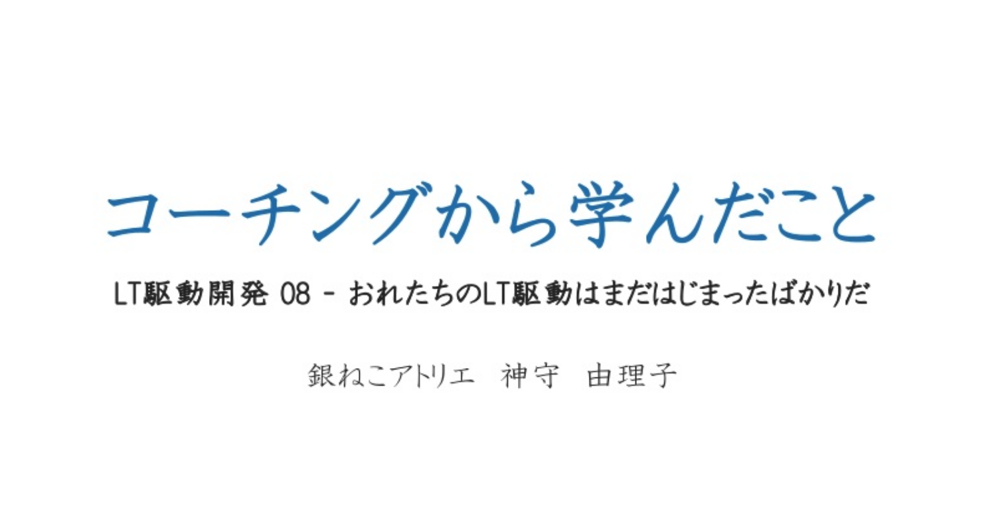

## そもそもLT駆動ってなんぞや
私は人前で話をするのが苦手でした。
人前で上手に話しできるようになりたいなーと思っている矢先、LT勉強会を友達がやっていると知り参加することにしました。

> IT勉強会に参加していますか？
> IT勉強会で一番勉強になるのは発表者と言われることがあります。
> つまり、発表する機会をつくるこで勉強になる人が増えるのではないかというのがLT駆動開発の試みです。
> 「ライトニングトークをする」という前提で日々開発をすることで勉強しながら開発をしようということです。
> 1月を除いた第一土曜日に開催予定です。
> 参加者が最近勉強したことを5分から15分程度の発表しましょう。

[LT駆動開発](http://ltdd.doorkeeper.jp/)より 
当時私も人前に立つ機会が増えたのでお邪魔させていただきました。

## 若い頃、人生で助けられた「コーチング」についてお話したかった
コーチングについてお話させていただきました。

コーチングとの出会いは昔勤めていた会社の人間関係が殺伐としていて改善しようとしてそのメソッドを取り入れたのがきっかけです。

人間関係が本当にカオスでした。。。。

当時の私は人間関係がつらくて、つらくて、つらくて、、、、、ナメクジのように悩んでいたのでコーチングに出会った時の衝撃たるやなんとやら…。

当日、ご参加いただいた方にはその悪しき負のオーラに少しでも触れていただくことができたかと思います。間違ってもダークサイドに引きずりこまれないようにご注意ください。

今もちょいちょいコーチングから学んだメソッドといういかマインド（考え方）が役になってるので是非紹介しよう！と思い立った次第です。

[コーチングから学んだこと | slideshare](https://www.slideshare.net/yurikamimori/ss-39881805)

## まとめ
そもそも、LT駆動参加者は 
人間関係なんぞに悩んでない。 
私の話は必要なかったぽいです。

今度ぜひまた参加したいのでその時はもっとネタ的な話にしようと思います。
