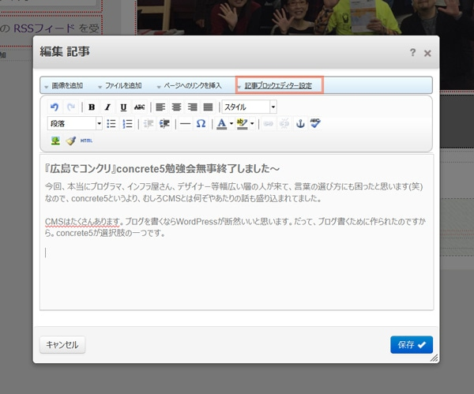
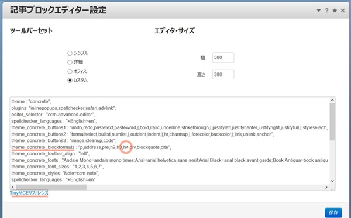

## 『広島でコンクリ』concrete5勉強会無事終了しました
今回、本当にプログラマ、インフラ屋さん、デザイナー等幅広い層の人が来て、言葉の選び方にも困ったと思います(笑) 
なので、concrete5というより、むしろCMSとは何ぞやあたりの話も盛り込まれてました。

ときどき笑いを交えるところはさっすがKatzさん！関西人ならではと思いました。

制作事例では何千～何万のページにも耐えうる屈強さに驚きでした。 
結構有名どころのサイトもconcrete5で作られてるんですよね～。ここら辺の情報はコミュニティや当日参加者の特権ということで伏せておきます。へっへっへ…。
## セッション中気になったものをさっそく試してみた
一番使うであろう記事エディターについて。 
concrete5では記事エディターにはTinyMCEが使われているのですが、必要に応じてカスタムできます。 
記事ブロックエディター設定をクリックします。

印象に残ったセッションを小出しに感想も含めてご紹介。

### TinyMCEってなんぞや？WYSIWYGエディターをカスタムできる
一番使うであろう記事エディターについて。 
concrete5では記事エディターにはTinyMCEが使われているのですが、必要に応じてカスタムできます。 
記事ブロックエディター設定をクリックします。

ツールバーセットをカスタムにセットし、試しにh4を追加してみました～。 
よく使うタグはこのようにセットしておけば、わざわざHTMLで編集しなくても済みますね。

左下に親切にもTinyMCEの使い方のリファレンスもついてます。 
ただし日本語ではないので分かりにくい場合はコチラをご参考に。

[TinyMCE](http://tinymce.vla.jp/) の紹介

ユーザーすべてがHTMLに詳しいわけではありません。

うっかりボタンぽちって画面が変わってパニック～！ 
もう使いたくない!!!

とか、ならないためにも、使ってほしくない・いらない機能はあえてなくしてしまった方がいいときもあります。カスタマイズできるので結果トラブル防止もできますね！

その他、concrete5には優れた権限設定がありますのでそこら辺もぜひ活用しまくりたいところですね。

## 当日のまとめ
とりあえず当日の様子をTwitterまとめました。これを見ながら、思いだしつついろいろなネタを思いだしてみることにします。

[Twitterまとめ](http://togetter.com/li/746270)
## 最後に…
ご参加の皆さん、ありがとうございました～。
