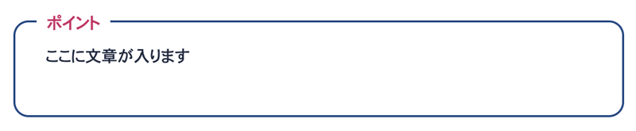

### この記事の対象
* WordPressを少し改造したり、カスタマイズできる
* WordPressでブログをカスタマイズしたい
* HTMLやCSSがわかる

<msg txt="簡単な実装から順番に紹介していきます！！！"></msg>

## ショートコードの作り方
ショートタグは投稿でphpの代わりに使えるワードプレス専用のタグです。

[ショートコードAPI](https://wpdocs.osdn.jp/%E3%82%B7%E3%83%A7%E3%83%BC%E3%83%88%E3%82%B3%E3%83%BC%E3%83%89_API)

変数や関数が使えるのでとっても便利です。

たとえば、サイトのURLのショートタグを作りたいときのコードの書き方はこんな感じ。functions.phpに追記するだけです。

```php
function home_url(){
    $home = esc_url( home_url() );
    return $home;
}
add_shortcode('URL', 'home_url');
```

`add_shortcode`関数でショートコードとして呼び出すことができます。

```php
add_shortcode(ショートコード名, 関数);
```

投稿記事内にショートコードを利用できるようになります。

```html
<a href="[URL]">トップページ</a>
```

### ヘビーに使うバナーをショートコードとして登録し呼び出す
バナーやコンバージョンエリアを呼び出すのに便利です。

```php
function banner(){
  $banner = '<div>';
  $banner .= '<a href="' . esc_url( home_url() ) . '/campaign/">';
  $banner .= '';
  $banner .= '</img>';
  $banner .= '<div>';
  return $banner;
}
add_shortcode('banner', 'banner');
```
記事内でバナー表示したいところに追加します。
```html
キャンペーンやってるよ！！
[banner]
```

## ショートコードに引数を使って値を追加する
次はショートコードに値（引数）を追加する方法です。

現在は`extract`を使う方法は推奨されてません。

先ほどのバナーのショートコードを改造してみます。

```php
function banner( $atts ){
  $atts = shortcode_atts(
    array(
      //取得したい値のキー
      'page' => '',
      'src' => '',
    ),
    $atts,
    'banner'//ショートコード名
  );

  $banner = '<div>';
  //同じサイト内のスラッグなど
  $banner .= '<a href="' . esc_url( home_url( $atts['page'] .'/' ) ). '">';
  $banner .= '';
  $banner .= '</a>';
  $banner .= '<div>';
  return $banner;
}
add_shortcode( 'banner', 'banner' );
```
これで画像とリンク先を差し替えることができるようになります。
```html
[banner page="campaign2" src="https://hogehoge.com/images/banner.png"]
```

## ショートコード内に文を入れる
ショートとタグの中に文も追加できます。

カンタンなものでこんな装飾もできますし、吹き出し装飾なんかも作れます。



```php
function box( $atts, $content ){
  $atts = shortcode_atts(
    array(
      //取得したい値のキー
      //デフォルト値を入れておいてあげても○
      'label' => '',
    ),
    $atts,
    'box'//ショートコード名
  );

  $box = '<div class="box">';
  $box .= '<h2>'. esc_html( $atts[ 'label']) . '</h2>';
  //同じサイト内のスラッグなど
  $box .= $content;
  $box .= '<div>';
  return $box;
}
add_shortcode( 'box', 'box' );
```

```html
[box label="ポイント"]ここに文章が入ります[/box]
```

### コンテンツだけ追加したいとき
コンテンツだけ追加したいときは、第一引数を`null`か`''`あたりにしておきます。

```php
function box( $atts = null, $content ) {
  return '<div>' . $content . '</div>';
}
```

## ショートコードの入れ子
ショートコードは装飾にめっちゃ便利ですが、入れ子にしたいこともあります。

そんなときは`shortcode_unautop`と`do_shortcode`を使います。
```php
function box( $atts, $content ){
  $content = do_shortcode( shortcode_unautop( $content ) );
  //省略
  return $box;
}
```

先ほど作ったショートコードを例にとると、装飾の中にショートコードを含めることができるようになります。

```html
[box label="ポイント"]
ただいまキャンペーン中です。
[banner]
[/box]
```

## そのほか、ショートコードで便利なTips
そのほかショートコードで便利な方法がいくつかあるので、まとめておきます。

### テンプレート内（phpファイル内）で呼び出す
テンプレート内では`do_shortcode`関数を使って呼び出します。

```php
echo do_shortcode('[box]');
```
### ショートコードを取り除く
逆にサイトの説明などにショートコードが抜き出しで出てしまうことがあります。そんなときは`strip_shortcodes`でショートコードが取り除けます。

```php
strip_shortcodes( $content );
```


## まとめ
ショートコードはうまく使うと超便利！装飾の幅も広がり記事やページがめっちゃ華やかになります。

ただ、テーマの乗り換えをするときに使えないショートコードなども出てきた後々大変にはなることもありますので、メンテナンス性を考えて、うまく利用しましょう！

皆さんのコーディングライフの一助となれば幸いです。

今回も最後までお読みいただきありがとうございました。
