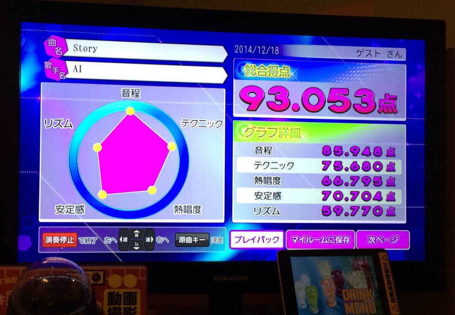

## この記事を書いたきっかけ：ゆるい広島 Advent Calendar 2014にジョインしたためです
この記事はゆるい広島 [Advent Calendar 2014](http://www.adventar.org/calendars/334)の24日目のエントリーです。前日はaikakohamaさんの『[みんなと行きたい広島観光スポット](http://aika.co/hiroshima-tourist-spots/)』でした。伴天連なつかしー！（笑）

## まず、「RGのうろ覚えカラオケ」とは？
まずこのネタを知らないとお話になりません。

私が知っているからと言ってみんなが知っていると思いこむことは大きな過ちなのでここから説明いたします。
レーザーラモンというお笑い2人組グループがいます。

RGとHGという二人組なのですが、HGは数年前にハードゲイでブレイクし、ハードゲイとか言いつつグラビアアイドルと結婚しました。

[レイザーラモンHG　Wikipedia](http://ja.wikipedia.org/wiki/%E3%83%AC%E3%82%A4%E3%82%B6%E3%83%BC%E3%83%A9%E3%83%A2%E3%83%B3HG)より

一方、RGはあるあるネタをやっている方です。

[レイザーラモンRG　Wikipedia](http://ja.wikipedia.org/wiki/%E3%83%AC%E3%82%A4%E3%82%B6%E3%83%BC%E3%83%A9%E3%83%A2%E3%83%B3RG)

…しかし、Wikipediaよくまとめられてるね。素晴らしい！ちなみにこの二人広島とはあまり関係ありません。

このRGがネタの一つとして曲をよく覚えていないのに適当に歌ううろ覚えカラオケというネタがあります。

これは「あるある」と「うろ覚えカラオケ」をmixしたネタですがおおむねこんな感じです。

### ではうろ覚えで90点以上点を取るためには？
もちろん、普通考えるとそんな点数取るのは難しいですよね。 
そこである程度の条件が必要です。
* 加点機能の付いた採点アプリを使うこと
* テクニックのしゃくり・ビブラートは必須
* 覚えているところはきちんと歌う
それでは詳しく説明いたします。

### 加点機能の付いた採点アプリを使うこと
まず、覚えていない歌では音程やリズムを激しく外すので高得点は不可能です。なのでビブラートやしゃくり（あればフォールなど）で加点を稼いで点数を上乗せします。

私の最近使ったカラオケの機種がJoysoundだったので[分析採点3](http://camp.joysound.com/bunseki3/)だったと思います。

### テクニックのしゃくり・ビブラートは必須
しゃくりは半音上げたり下げたりするテクニックで、ビブラートは音が震える感じです。
うまく説明できないので、探してたらいいサイトを見つけました！

[しゃくりとビブラートでカラオケ高得点を狙おう！](http://press.share-wis.com/karaoke-high-point)

こちらを参考に！これを多用すれば加点がガンガン取れるので普段から使うクセを付けておけばいいですね！
ちなみにビブラートは鼻歌を歌ってるとうまくなる気がします。

## うろ覚えで歌ってどんなメリットがあるの？
これはあくまで私の個人的な見解ですが、たまーにガチで歌うますぎるとちょっとひくことありませんか？

歌うまいけどうろ覚えで歌ってるとある程度ゆるさがあっていいと思います。

「**この歌うろ覚えなのー、てへぺろ**」とか言っていると、

気になるあの人と恋に発展するチャンスが巡ってくる可能性があります。多分。

ただし、あまりブリブリしすぎたら同性からは嫌われる可能性があるので気を付けてください。

本日クリスマス・イブですがクリスマスまであと1日！コンパとかある人は試してみてもいいかもしれません。
ただし、どんな結果になろうと一切責任は負いかねますので、自己責任でお願いします。
## まとめ
あなたもうろ覚えカラオケで高得点をたたき出せば笑いもとりつつゆるーく褒められ、シングルの人はいいことあるかも！？

ちなみに、やってみて実際に高得点をたたき出すことができました～。
まだまだ忘年会・新年会もあると思うので皆さんもネタを身につけて盛り上げましょう～。

こんなくだらないブログに最後までおつきあいいただきありがとうございました！！！
