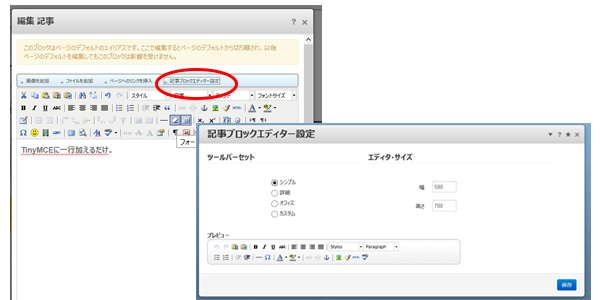
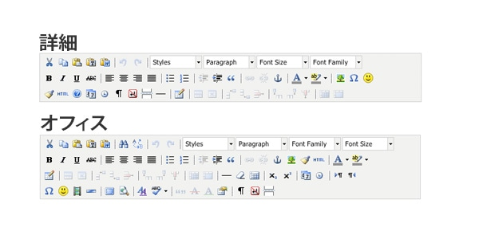
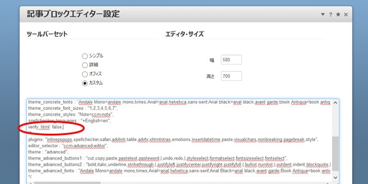

## TinyMCEをカスタムする
記事ブロックはhtmlも書けますが`<section>`などhtml5のタグが書けません。書いても打ち消されてしまいます。
htmlブロックを使えば？と思うところですが、リンクを簡単に追加したり、画像を差し替えたりなど…後日の編集を考えると記事ブロックで作った方が断然便利です。以前も実はTinyMCEについては触れてます。

[「広島でコンクリ」concrete5勉強会vol4開催しました](https://ginneko-atelier.com/blogs/concrete5/275/)
TinyMCEというものが使われていて、これがまたカスタマイズできるんです。 
記事ブロック、右側に記事ブロックエディター設定をクリックするとツールバーとエディターサイズを編集できるようになってます。

ツールバーセットはシンプル、詳細、昔のエクセルのツールバーを思わせるオフィスの三種類があります。

html5のタグに対応するためにはカスタムしてしまいましょう。

ツールバーのセットをカスタムを選び、以下を一行足します。

TinyMCEはカンマ区切りなので、直前のコードの終わりにカンマを足します。

## 記事ブロックを改造して対応するつもりでした
CMSの会では同じhtmlのソースをCMS化するということだったのですが、html5の突っ込めない記事ブロックをどうしたものか、んーと悩んだ結果、ブロックをカスタムして対応するつもりでした。

いつも頼もしい広島でコンクリのコミュメンバー・藤井さんからの助言でTinyMCEをカスタムすればいいということで助言をいただきました。ありがとう！藤井さん！

## 結局…まとめ
実は時間がなくて、TinyMCEの話まで至れませんでした。ごめんなさい。 
まだ、当日お話できなかったコンポーザーのことなどもまとめますので今しばらくお待ちください。
