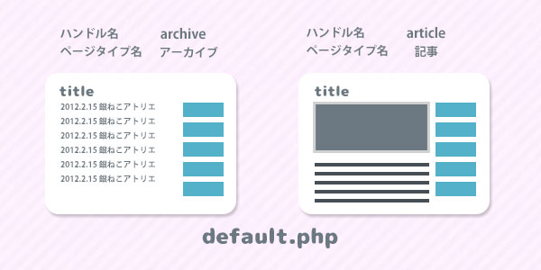
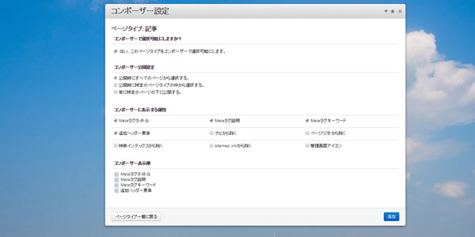
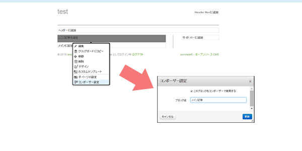
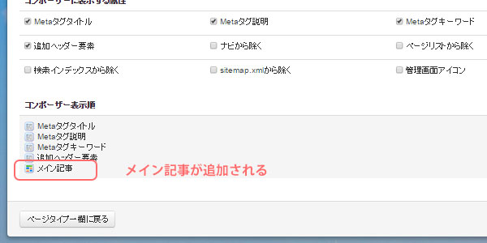

## すごい広島でやることを設定
「すごい広島」とはやることを設定したり、何をどこまでできたか、次回何をやるかなど報告し合ったりする場です。

webデザイナー、エンジニアなどいろんな人がいるので分からないことがあれば気軽に聞けるのもいいですね。昨日色々教えてもらったのでそれについてもまた別途記事でも書こう。

今回私はコンクリのページタイプについてまとめるというのをしてみました。

## ページタイプとは？
ページタイプとはページの元となるテンプレート。

concrete5のテーマのなかに、オリジナルテーマならdefault.phpというページのテンプレートの元となるファイルを作ります。既存のテーマならdefault.phpが必ず用意されてます。

## 他のCMSと比べながら説明してみると…
まあ、他のCMSに比べると分かりやすいかな。。？とはいえ、機能とか根本が違うから何とも言えないけどイメージしやすいと思いちょっと比較。

有名どころでいうとWordPressになりますが記事一覧を出力するページにはarchive.php、記事そのものにはpage.phpといった感じでテンプレート用のファイルを作りますが、concrete5にはエリア内に自由にブロックを配置できるので特殊なページ出ない限りテンプレートをわざわざ用意しなくても、特殊なページ以外は基本のページ（default.php）で事足ります。

## 同じファイルを利用していろんなページタイプを作るには…？
ページタイプを追加からハンドル名・ページタイプ名を付けてページタイプを追加すればOKです。<br>
以降やり方は説明しますが、通常基本のページ（default.php）を利用してページタイプの設定をちょこちょこっと変えるだけ。



ただしブロックを使わずに直にphpで作る、レイアウトや構成がdefault.phpでは対応できないなど、特殊なページテンプレートを作る場合はページタイプのハンドルとページタイプの元となるファイルを同じ名前する必要があります。

実はテンプレートとなるページタイプでさえも難易度の高いものからカンタンなものまで柔軟に作ることができるのもconcrete5の魅力の1つと思ってます！

具体的なやり方は以下です。

## ページタイプを追加・設定する
ページタイプは管理画面＞ページタイプ＞ページタイプ追加から追加します。
追加したらページタイプの設定も同時に行えます。

この設定は後日変更可能です。


ページタイプ名・ハンドル名・アイコン・初期値を設定できます。

記事の一覧ページなど、検索に引っかかってほしくないページなどはここで設定してあげます。

ページタイプはたいてい増えて雑多になることもあるのでアイコンをPage Type Iconsという名前でファイルセット追加して整理してあげてもいいですね。

## コンポーザーを設定する
concrete5とはいえ、いつもいつも直感的に編集していると面倒なこともあります。<br>
そんな時はコンポーザー機能を使っていわゆるブログの記事を書くときの管理画面みたいなものなのですが、記事、サムネイル画像など定型的な部分のみ抜粋して編集できるようにする事ができます。

ここでの設定ですが、コンポーザーで編集可能にしたり、コンポーザーでの表示する項目の順番を入れ替えたりなど、かなり柔軟に設定できます。



また、ページの公開場所も3パターンで設定できます。

* 公開時にすべてのページから選択する
* 公開時に特定のページタイプの中から選択する
* 常に特定のページの下に公開する

記事などどこのページの配下に公開するかなど決まりきったページタイプはあらかじめここを設定してあげればいいですし、特定のページタイプの下に公開できるというのもいいですね。ここら辺うまく利用すればサイト運用にとても役立ちます。
## デフォルトを設定する
ここからがconcrete5らしいところではありますが、ページのテンプレートも画面そのまま直感的に作ることができます。

ページタープ＞デフォルトからデフォルトページのブロックを追加していきます。
コンポーザーで編集できるようにしたい場合はコンポーザー設定、ブロック名（コンポーザーで表示される部分） といった感じで設定しておきます。



コンポーザー設定に戻るとメイン記事が増えます。
同じような感じでメイン画像とかも追加できます。


## 余談
5.7だとデフォのブロックでページタイトルブロックがあるので、ブロックをポーンと入れておくだけでタイトルを出力できて便利なんですけど、
5.6のタイトルはちょっと工夫が必要かなー 。

ブロックを作るか、ファイルに以下のコード書いてタイトルを出力するしかなさそう。
```
<?php echo $c->getCollectionName(); ?>
```
## まとめ
今回はページタイプについてまとめましたが、いろいろ触っているとまだまだまとめきれてないのですが、とりあえず昨日のすごい広島で自分に課したタスクはおわったぞい。
