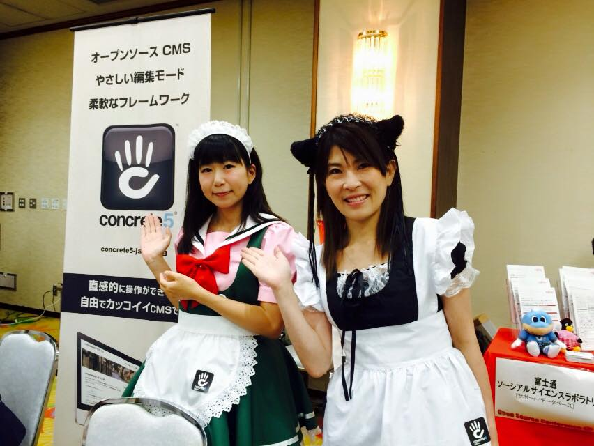

## OSCってなんぞや？
まずはOSC(オープンソースカンファレンス)についての説明から…。

> オープンソースカンファレンスは、オープンソースの今を伝えるイベントです。東京だけでなく、北は北海道、南は沖縄まで全国各地で開催しています。 
> オープンソース関連のコミュニティや協賛企業・後援団体による、セミナーやプロダクトの展示などを入場・参加料が無料でご覧いただけるイベントです。 
> 引用：[オープンソースカンファレンス](http://www.ospn.jp/)

## OSC(オープンソースカンファレンス)でのイベントレポート
今年は日々コミュニティ活動している、concrete5の紹介をすべく参加。 
ちなみに去年の様子は[コチラ](/blogs/entry195/)

今年はブース出展のみとさせていただきました。

今年は、客寄せのために体を張ってみました。

メイドさん!!!

おかげさまでブースは非常に目立ってました！

助っ人にメイドアーティストのしじみちゃんを召喚。 
（※写真左しじみちゃんの詳しい情報についてはこちら）

おかげさまで、「今日初めてCMSという言葉を知った」という方にまでお声がけいただきました＾ω＾

わざわざ尾道から来られた方も!!

私のブログなども読んでいただいてるようで「銀ねこ」さんと呼ばれてとても嬉しかったです。少しは浸透してきたのだと思い、じんわり感銘を受けました。

コンクリ愛に熱弁をふるいすぎて一人の人に長〜くお話ししてしまいました。

あと、一部の親しい方にはついでにVisualStudio Codeのデモまでしてしまいました。。。ゴメンなさい…。

何はともあれ、OCSとっても楽しかった。 
お声がけいただいた方、お友達になってくれた方ありがとうございます！

来年も是非参加しようと思います！

## 今後の活動
10月10日、ヒーロー島でVisualStudio Codeのお話しをします。

* [.NET勉強会ヒーロー島勉強会 with 実践ワークシート協会 秋の収穫祭](http://heroshima.jp/EventInfo/20151010)
翌日の酒祭りがメインのイベントです。実は広島、日本有数の酒どころです。
是非ご参加ください。

といいつつ、超大物隠しゲストが来ます！

* 申し込みは[こちら](http://heroshima.connpass.com/event/17901/)
また、詳細は未定ですが他県の勉強会で話をしたり、CMSの勉強会で他のCMSとコラボできればと思ってます。
