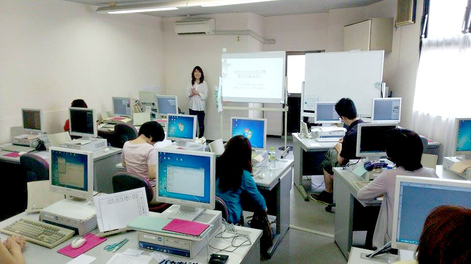
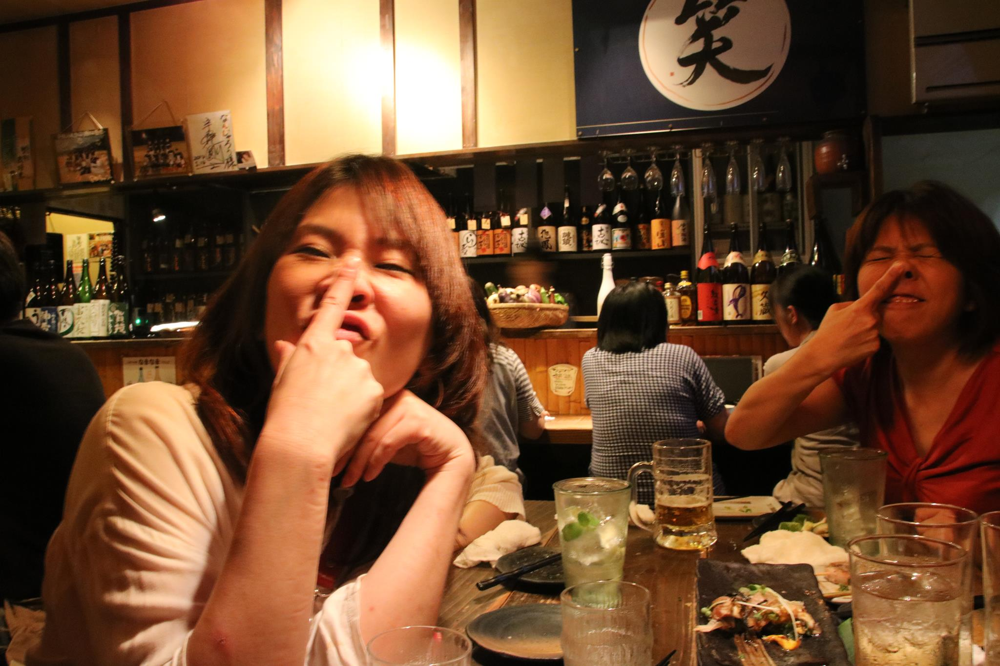

## インストひろしまってなんぞ？
インストひろしまとは広島のインストラクターの能力向上のために設立された団体です。

> 個人での継続学習で優劣を競ったインストラクターという職業が限界を迎えた今、広島でインストラクターに従事している我々有志が企業の垣根を越え、現場で培ってきた知識、スキル、経験、思い、価値観を共有して相互に成長を促し、これを新たな職業に進化させて行くことを目的とする。 
> 設立趣意より引用

詳しくはウェブサイトを御覧ください 
[インストひろしま](http://it-inst.com/)

パソコンのインストラクターといえばついExcelやWordなどのOffice製品を思いつきがちですが、最近はWebやDesignの職業訓練も行うところもあり、Adobe製品を置いている学校もあるとのこと。

## 身近にphotoshopを感じてもらいたかったので…

最初、photoshopの講師を依頼された時、ネタをどうしようか悩んだのですが、フォトショ詐欺という言葉もあることですし、やっぱり写真加工かな〜と。

え、私？フォトショ詐欺超得意ですww。

余談ですが友人の社員証用の写真を10kgは痩せさせたことがあります。本人は痩せてないんですが笑。

さておき、写真好きの方もいるしきっと役に立つはず。
## ネタはこんな感じで進めました
写真の幅が足りない・ゆがんだ画像の修正・明るさや鮮やかさの調整など、わりと難易度低めに設定したつもりだったのですが、Adobe製品特有の直感的なマウスとショートカットの操作がやや難しかったようです。

最後にデモで人の写真のレタッチをデモしました！ 
みなさん、photoshopの力を感じてもらえたのではないでしょうか？？

そうです。世の中のモデルさん、アイドル、みんなやってるんですよ。

**みんな、騙されてるんです！**

見合い写真などもどうなってるかわかりませんからね…。現物確認は大切です。
## まとめ
なによりも、みなさん一生懸命されてたのでこちらもとても楽しかったです。

いつも教える側のインストラクターのみなさん、きっと新鮮だったことと思います。

photoshopは家庭用ソフトとしてはお値段的にもかなりお高いソフトなので、廉価バージョンのelementsで十分機能するので、使ってみたい人はぜひそちらを試していただければ。

懇親会もとっても楽しかったです！ 
また、ぜひお会いしましょう〜〜。

みなさん、ありがとうございます＆お疲れさまでした〜。

※当写真は加工しておりません。ごめんなさい。
