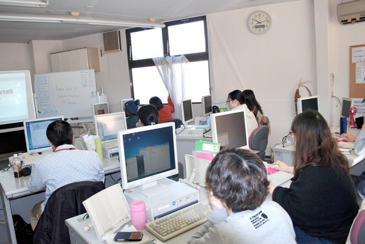
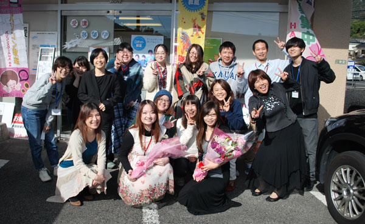

## 授業ではCMSconcrete5のテーマづくりにチャレンジしました

* 1日目 … サーバやphpなどのことを軽く説明。XAMPPを使ってローカルに環境構築する
* 2日目 … CMSとはどんなものか？というお話と、CMSconcrete5をインストールしてページを編集したり、ページを追加してざっと機能を体感してみる
* 3日目 … Bootstrapのテンプレを使ってテーマを作る。

concrete5を通じてCMSとはなんぞや？デモ環境なんぞや？等々知ってもらいたかったのでこのようなカリキュラムになりました。今考えると、いろいろと言葉足らずだったなとも反省しております。。。。

とはいえ、文字コード問題などでファイルが動かないなど、多少トラブルがありましたがみんな何とかテーマを作成することができました。

そして、Webフォントやバージョン管理のことなども小出しに。。。どれも知っておいて損のないことです。

生徒の皆さん、やってみて一様に感想は「難しかった！」とのこと。

そりゃそうですよね…。皆さんにとっては、はじめて聞くもの見るものも多かったでしょうし、正直ついていくのも精一杯だったと思います。

ただ、簡単であれば、私たちWeb制作者は必要ないですね。それだからこそ、Web制作には価値があり、仕事になるということも同時にわかっていただければと思います。

ぜひ、今後に活かしてほしいものです。

## 「働く」ということを考察する
あくまで私自身の個人の見解です。

仕事している間は起きている時間の大半を占めてるわけです。心を病んでしまう・つまらない・やりたくない…こういったネガティブな感情や不満でいっぱいだったり、強いストレスにさらされるような仕事をすることは人生めちゃくちゃ損してると、私は思います。

### 仕事をしていてときめきやワクワクを感じていますか？

私は仕事をする時「ワクワクできるか」、「ときめく仕事か」などが大切で、今私自身、実際に身体的にストレスが強いことも多いですが、それが感じられないくらい仕事自体は楽しいです。

コード書いてるときやそれが形になった時、仕事しているときってとてもワクワクするんです。

だから常に新しい知識を仕入れて、技術を学んで自分を高めていくのも苦になりません。 
だって楽しいから。

向上心と探求心が持てて、誇りを持てる仕事であれば続けていけるものです。

### 経験こそ宝です。前職の経験も活かしましょう
そして、今まで培った経験も大切に。

生徒のみなさんにも言いましたが私はもともと美容関係で転職してこの世界に入りました。 
**転職で職歴を汚すという考えはナンセンス**だと思います。

転職は決して恥ではありません。

前職がどんな職種でも経験は宝。ずっとITにいる人よりも、違った視点で見れたりするもの。 
面接に備えて、今後役に立ちそうな前職で得たスキルや特技はリストアップしておくとよいと思います。

仕事を選ぶ上で、環境、仕事の内容など重要になる部分は個人差があると思いますがある程度指標を決めて仕事を選ぶといいと思います。

## どうせなら、度肝をぬいてやれ
最後に質疑応答を行いました。

そこで「就職を有利に進めるためにどうすればいいか？」のような質問をうけました。

ノートパソコンに仮想環境作ってconcrete5でオリジナルテーマのデモサイト作って面接の時に持って行けばいい

口で説明するよりも見せる方が早いです。 
たとえば、2~3ページでいいんです。CMSを知っていて、それを使って構築できる、キチンとテスト環境で構築できるなどプラスの印象が残るはずです。教育コストが少ないと期待してもらえます。

### 会社によっては採用の基準に可能性も見越す
どうせなら度肝を抜いてやりましょう！ 
わたしなら骨のあるやつだと感心します。

ぜひ誰かチャレンジしてほしいものです。

さておき、技術的な質問、勉強会に参加したいなどとても意欲的な生徒さんたちに出会えて最高の3日間を終えることができました。

## さいごに
3日間CMSconcrete5のテーマを作りましたが、私自身気づきも多く有意義な時間を過ごせとても勉強になりました。

私も皆さんと同様職業訓練校出身です。

私の知り合いには皆さんと同様職業訓練校出身で今活躍している人います。 
前職の知識や経験をフルに活かしながら…。

なので自信をもって！胸を張って！就活に臨んでください！ 
卒業制作も楽しみにしてます~＾＾

またお会いしましょう。

3日間ありがとうございました。

