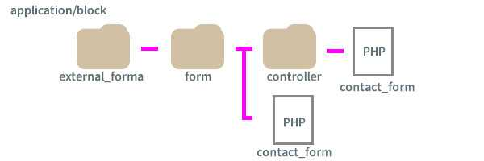

## 外部フォームとは？
concrete5には外部フォームというブロックがあります。<br>
ここに自分でphpをゴリゴリ書いて独自のフォームを作成することができます。

もちろん、デフォでもフォームブロックは用意されておりも管理画面でお問い合わせ内容などの管理もできて便利です。…が、デザインの自由度も効かないし自動返信もできませんので今一歩な使い勝手。。。。

ということでやはりお好みのフォームを作りたいときは外部フォームブロックがおすすめです！！

ただ、こいつを使うときはある程度のphpスキルが必要です。<br>
ちょっと敷居が高いですが、コンクリにはバリデートやフォームに関するヘルパーも用意されてるので多少phpかじってる私でも問題なくフォームつくることができました。ちょっと興奮気味ですよ笑

今回はデフォのフォームブロックを参考にしました。

## 下準備
フォーム送信の流れは以下の通り。

1. フォーム項目の登録。
2. バリデート（文字数とかきちんとアドレスを登録をできてるかなど）を判定して問題なければ送信。
3. メールがサイトオーナーとフォーム送信者の両方に届く。
4. thanksメッセージを表示。

例えば今回下記のようなフォームにします。

* アンケート（3択）
* メールアドレス
これを実現するために必要なのは以下のファイル。

* フォームのコントローラー（挙動の制御）
* フォームのビュー（見た目）
* メールの中身

今回は Controller、Wiew はapplication/block/external_form内にformというフォルダを新規作成してその中に配置します。
(packagesにまとめる際のことはまた改めて追記します〜)

今回はファイル名をcontact_form.phpとしました。
見た目を整形していく用のビューのファイルはform直下に配置します。挙動の制御をするコントローラーファイルはさらにその直下にcontrollerフォルダを作って同じ名前のファイルを置きます。

今回はファイル名をcontact_form.phpとしました。<br>
見た目を整形していく用のビューのファイルはform直下に配置します。挙動の制御をするコントローラーファイルはさらにその直下にcontrollerフォルダを作って同じ名前のファイルを置きます。



application/mail直下に送信するメール内容のテンプレートになるmail_complete.phpという名前でファイルを配置します。

## コントローラー、ビュー、メールのテンプレを作る

フォームのバリデート、送信後の挙動などをこのファイルで設定します。

今回application/block直下に置くのでnamespaceを Application\Block\ExternalForm\Form\Controllerとします。

5.6と違い、useで使いたいもの？クラス？を呼び出さないと使えないようです。ベースのフレームワークsymphonyのせいだろうか。。。。

ここではCoreとUserInfoをuseで設定します。

これがないとユーザー情報を呼び出したりCore::makeでバリデートやメールヘルパー（Viewと少し呼び出し方が違います）が使えません。

```
<?php
namespace Application\Block\ExternalForm\Form\Controller;
use Concrete\Core\Controller\AbstractController;
use Core;
use UserInfo;

class ContactForm extends AbstractController {

    public function action_send_mail($bID = false)
    {
        //ここに処理を書く
    }
}
```
バリデートと送信後の処理処理を設定します。

なので以下のような処理になります。
まだバリデートをしっかり研究してないので（汗今の所こんな感じです。
Core::make('helper/validation/strings')の中にemailのバリデートを発見したので以下のようにチェック。名前は1文字以上、選択項目は何かしらあればOKという感じでバリデートをかけました。

Core::make('helper/mail')で超便利なメールヘルパーも呼び出します。

ここについてはまだ研究中で後日追記しようと思います。

```
<?php
namespace Application\Block\ExternalForm\Form\Controller;
use Concrete\Core\Controller\AbstractController;
use Core;
use UserInfo;

class ContactForm extends AbstractController {

    public function action_send_mail($bID = false)
    {

        if ($this--->bID == $bID) {
            // validation/form ヘルパーを呼び出し
            $email = Core::make('helper/validation/strings');

            // postデータを登録
            $post = $this->post();
            // 登録内容の検証
            $errormsg = '';
            if(implode($this->post('magazine')) == null){
                $errormsg .= 'いずれか選択してください。';
            }
            if($this->post('name') == null){
                $errormsg .= '名前を登録は必須です。';
            }
            if(!$email->email($this->post('email'))){
                $errormsg .= '有効なメールアドレスを入力してください。';
            }
            if($errormsg){
                $this->set('error', $errormsg);
            }
            else{
                $mh = Core::make('helper/mail');
                $adminUserInfo = UserInfo::getByID(USER_SUPER_ID);
                $mh->bcc($adminUserInfo->getUserEmail());//サイトオーナーへbcc送信
                $mh->from($adminUserInfo->getUserEmail(), '銀ねこアトリエ');;//メール送信元

                $mh->to($this->post('email'));//登録者への自動返信
                //パラメータをゲット
                $mh->addParameter('name', $this->post('name'));
                $mh->addParameter('email', $this->post('email'));
                $mh->addParameter('magazine', $this->post('magazine'));

                $mh->load('mail_complete');//メールテンプレの読み込み
                @$mh->sendMail();//メール送信
                $this->set('response',true);//メールが送れた後の処理
                return true;
            }
        }
    }
}
```

ビューの方はこんな感じになります。<br>
ここからはフォームヘルパーが本領発揮！

Loader::helper('form');でヘルパー呼び出し、$formにヘルパーを格納。<br>
$form->radio('thing[]', 'radio01')?>といった形で 各フォーム部品を作成します。

バリデートでエラーが出たらエラーメッセージが表示され、うまく送信できたら表示が切り替わる処理になってます。

## まとめ
コンクリで外部フォームを使えばお問い合わせフォーム作成も大変じゃないです。<br>
ぜひ一度お試しください。
