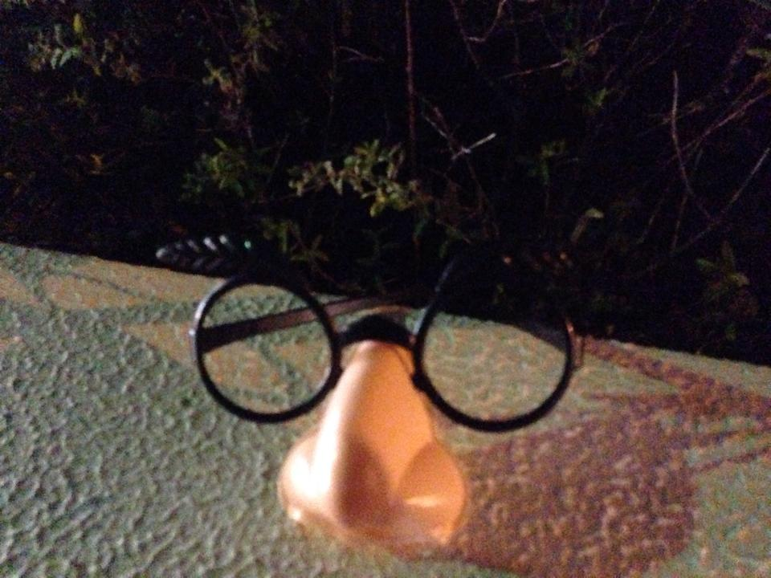

## アドベントカレンダー「ふつうの広島」2015
前日の亜紀さんからのバトンタッチ。翌日エントリーのかけなびさんにプレッシャーがかけられるよう、超絶炸裂した記事を頑張って書こうと思います。

## 広島だから？何故だろう…広島という地域で出会えるいろんなものについてご紹介
私は生まれも育ちも広島でかれこれうん十年広島に住んでます。

広島にいるから？広島だから？？？まあ、広島に住んでるといろんなものや人に出会えます。 
今まで出会って印象深かったもの５つをご紹介します。

広島って本当素敵な町。この記事を読んで、ふつうに素敵な町だと思っていただければ幸いです。肩の力を抜いて生きていける町だと思います。

### 第5位・中央分離帯に取り残されたおじいちゃん、もしくはおばあちゃん
主に安佐南区、アストラムライン沿いで見かけることが多いです。
横断歩道が長いのか、歩くスピードが遅いのか、中央分離帯でおろおろしたおじいちゃんおばあちゃんがよく取り残されてます。

心細そうにおろおろしている姿を見ると、きゅんと心が痛みます。

広島県でも住宅街が多い安佐南区。

中央分離帯に取り残されたおじいちゃん、おばあちゃんはかなりの高確率で出会えます。

出会ったときは、とにかく無事を祈ります。

### 第4位・ハグレニワトリ
実はこれもエンカウントしたのは安佐南区周辺・五日市インター付近です。

農家から脱走したのか、それともドナドナ中（切なくなっちゃうので詳しくは書きません。想像力で埋めてください）搬送車から落ちたかはわかりません。

とにかく、身がしまっておいしそうなニワトリでした。

ニワトリは初めての車の往来に挟まれて完全に動きが固まってました。

私も運転中、道路のど真ん中にいるニワトリに動揺し一瞬目を疑いましたが、ニワトリでした。

まさかあんな場所にニワトリが…。

衝撃的で忘れられませんでした。。。

### 第3位・大人のお…
これもなんでこんなところに落ちてたんだろう。。。。

広島の草沼道路を沼田に抜けた付近の中央分離帯に落ちてました。

中央分離帯とは魔の空間なんだろうか。。。。

そして、自分の動体視力を恨みます。

何が落ちてたのかは皆さんのご想像にお任せします。

### 第2位・宴会グッズ鼻付きメガネ

あれは数年前の忘年会シーズンぐらいだったと思います。

※こちらは実際の写真になります。 
会社からの帰路にある、とあるわりと大きな会社の敷地内の植え込み付近にありました。

何だろう、何に使ったのだろう。。。気になって仕方ない。。。むしろ拾いたい。。。。 
拾ったら絶対かけたくなる。。。。

衝動を抑えてとりあえず帰宅しました。

今となってはちょっぴり後悔してます。何故かって？あれ以来鼻メガネが落ちていたことはありませんので。

### 第1位・ガードレールをまたぐツキノワグマ
私が若かりし頃、走り屋という種族がたくさんいました。 
その種族は改造したスポーツカーで峠（ただの山道）を登ったり降りたりして自分の技量を磨いてました。

私の当時お付き合いしていた人もその種族で、もっぱらデートはこちらは微塵も望んでもいない、山を登ったり下ったりの繰り返しでした。車酔いというおまけつき。

同乗者そっちのけで己の運転テクニックに陶酔する男の隣でひたすら車酔いに耐えるなど、今考えなくても苦行の他ないです。

そんな意味不明な峠を攻めるという自己満に付き合っていたときです。 
広島の湯来という地域の山奥で…

ツキノワグマに遭遇。

まじか……。

クマ、移動中でガードレール跨いでる最中だし。。。。

その間抜けさに愛くるしいとさえ思えましたが、ツキノワグマです。 
生身で出会えば危険です。

その時はさすがに車の中でよかった、と。

今も昔も中国地方の山を散策する際はツキノワグマにエンカウントする可能性はあるので十分注意してください。

ただ遠目に見る分にはツキノワグマもかわいいですよw

## まとめ
私、振り返ると普通に広島で暮らしてきていろんな出会いがありました。

広島に住んでて、よかったなーと思います。

あ、私本当に普通に暮らしてるだけです。 
時に刺激的でクスッと笑える広島って素敵ですね。

この町に住んでてよかったー。
