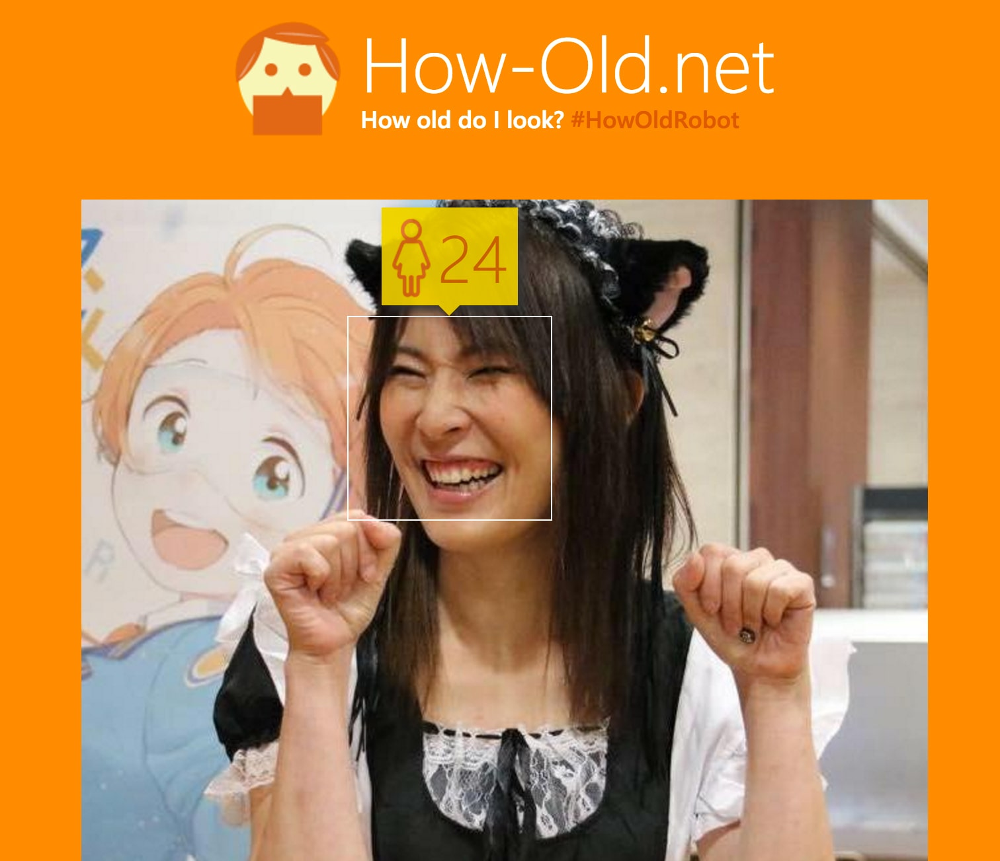
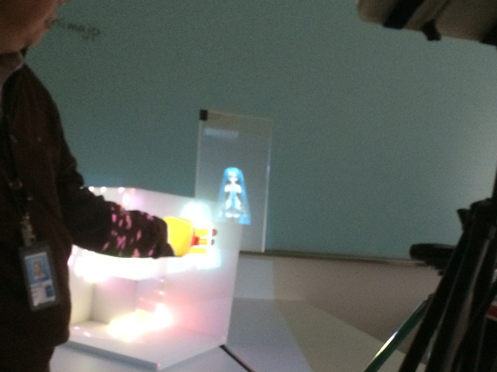
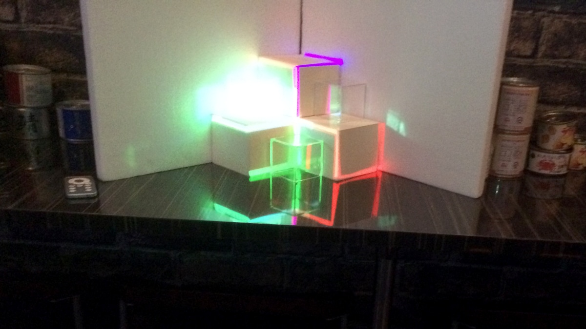

## ヒーロー島てなんぞ？
ヒーロー島は広島を中心に活動している IT エンジニアのコミュニティです。
アプリ作ったり、クラウドについて勉強したり、センサーのお話ししたりなど主にMicrosoftの技術を中心に勉強したりしてます。

飲んだくれが多いので（私もそのうちの一人）勉強会が開催されるたびに懇親会で肝臓にダメージを食らいます。

サイト：[ヒーロー島](http://heroshima.jp/)
## 恐るべし、機械学習
今回の目玉はなんといってもmicrosoftのエンジニアジニアス平井氏が来広。

今回は機械学習(machine learning)について。

一時話題になった、年齢識別サービスHow old do I look?もmicrosoftの機械学習が使われており、写真データから顔のしわや作りなどから年齢を識別するもの。
サイト：[http://how-old.net/](http://how-old.net/)

ちなみにワタクシ24歳でした笑。。。。
機械は嘘つかないですから仕方ないですねー。

実はこのサービス高性能すぎて、心霊スポットで写真を撮ると霊が映るとも話題になってました。

勇気がある方はぜひ、心霊スポットで一枚撮って試してみてください。
そのほか、写真から感情を判断するサービスでにらめっこゲームなんかもしました。

精度がもっと上がれば、嘘発見器なんかにも使えるかもしれません。

## Windows女子部の発表
我らが女子部の発表も。
今回はのんびり聞く側で、素敵なお話しを聞くことに専念♪

やすえさんのお話でアプリ作りたい病が発病w。

聡子さんのセンサー愛。去年は手をあげたらセンサーに反応するランチャーに狙われました。

ようこさんの人工知能のお話。人工知能が小説が書けるとは。。。。もう勝てる気がしない笑。

みおこさんの文章愛に驚く。文章が上手い人はやっぱ根っこが違うなーと。。。

最年少女子部りんりんの発表に感動。ゆっくり、きちんと間をとってお話してたね。小学校のIT事情がわかりました。でも導入するのはXPはやめてせめて7にアップグレードしてほしいものです。

いろんなロールがこなせる人が集まったコミュニティなんだ。私は私が得意なことをやろうと思いました♪

## 小さなプロジェクションマッピングが繊細でクール！
プロジェクションマッピングといえば、ビルや大きなところに投影するイメージですよね？

今回なんと1m四方位内の中にプロジェクションマッピングを投影するというパフォーマンスをジニアスとめんたろ社長が披露してくださいました。

ジニアスがパワポで即興でプロジェクションマッピングを作ったのが圧巻でした。
これなら私でもできそう！

そして、こちらはめんたろ社長のプロジェクションマッピング！
さすが！！！！

文才がないのでその凄さを表現できませんが、きになる方はとりあえず北海道にめんたろ社長に会いに行ってくださいとだけ言っておきます。

Blend for VisualStudioあたりでアニメ作って出来ないかなー。パワポよりもっと繊細なもの作れそうだし、どうせなら王道じゃないことやってみたいなーとか、ワクワクしてみる。

## まとめ
他にも、ゲストが北海道なだけありジンギスカンの正しい食べ方など愛のあるお話しを聞くことができました。

ぶらっくさんも広島に来てくださりありがとうございました。
またいらしてください〜。
