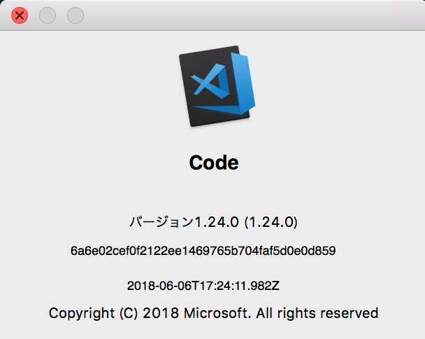
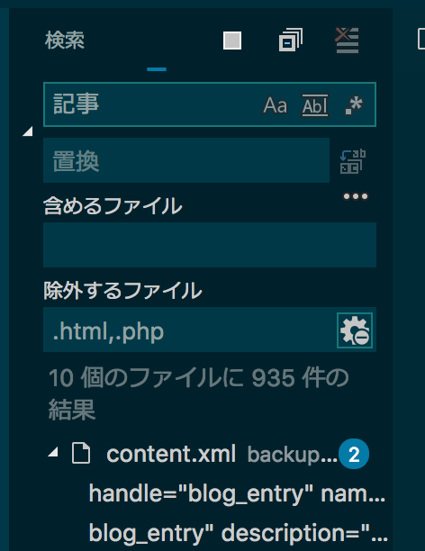
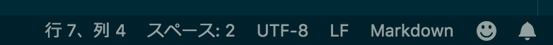
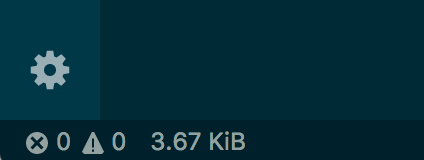
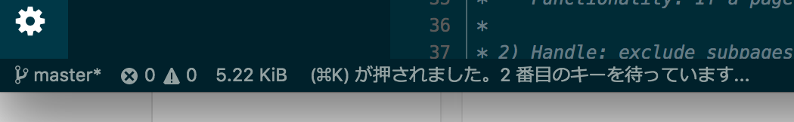

## Visual Studio Codeってなんぞ？
Visual Studio Code（以下、VS Code）は、マイクロソフトによって開発されているソースコードエディタで、高機能なのにもかかわらず、無料で使用できます。VS Codeは[Electron](https://electronjs.org/)というプラットホームで作られてます。他にも同様のプラットホームで作られた高機能エディターの中にはAtomなどがあります。

VS Code は以下からDLできます。

[Visual Studio Code DL](https://www.microsoft.com/ja-jp/dev/products/code-vs.aspx)



サクラエディタやテラパッドなどのテキストエディタはディレクトリ単位でファイルを管理できなかったように記憶してますが、VS Code ではファイルをツリー構造で管理できます。VS Code ではこの**ディレクトリで管理することをワークスペース**と呼びます。

### とにかく軽い
VS Code は他の口コミでもよく見かけますが超軽量です。実は私も、つい最近までAtomを使っていたのですが、キャッシュはたまるし重くなって仕事にならないのでVS Codeに乗り換えました。人間もエディタも軽い方がGOOD!

### インテリセンスが素晴らしい
さすがのマイクロソフトが作ったテキストエディタ。C#書く人・Visual Studioを使ったことがある方ならわかると思いますが、マイクロソフト製品はとにか補完・文字の候補を出してくれるアレが優れてます。

VS Code も例外なくいい感じにやってくれます。

### 最初から日本語
無料の高機能テキストエディタって言語のデフォルトが英語であることが多いので、人によっては敷居が高いですよね？ところがどっこい、VS Code は日本語化するために拡張機能入れたりなど、初期設定があまりないのでコーダ初心者にはオススメです。

### その他諸々
最近は拡張機能が充実し、前までなかったミニマップなども使えるようになりました。<br>
今回は割愛してますが、デバッグ機能は各言語のコーダの方から賞賛されてます。

どんな言語を書くかによりますが、軽さやシェア率でいけば、使わない理由はないと太鼓判を押さざるを得無いです。

## VS Code で最低覚えて使いたい機能
VS Code 使い始めてこれだけは覚えておけばすぐにコーディング開始できる機能をご紹介します。

### アクティビティバー
左側にあるアイコン群をアクティビティバーと呼びます。最低使えたらいいものだけピックアップしておきます。
#### エクスプローラー


こいつでファイルやディレクトリの管理ができます。<br>
名前がエクスプローラーというのがマイクロソフトの製品っぽい。左のファイルマークのアイコンです。開いているエディタとワークスペースと二段で管理できます。開いているエディタは開きすぎて訳が分からなくなったタブを整理するのに役立ちます。右側のバツを押すと全て閉じることができます。<br>
ワークスペース名をマウスオーバーするとアイコンが現れます。横のアイコンをクリックするだけで新規ファイルや、新規フォルダを作成できます。

左から、1.新規ファイル、2.新規フォルダ、3.多分再読み込み、4.開いているフォルダを全て閉じる（地味に便利）

#### 検索


ファイル類を簡単に検索できます。検索は大文字/小文字の区別、正規表現まで可能。置換の右横のアイコンをクリックすると、該当するものを「**全て置換**」することができます。しかも置換もできます。3点ドットのメニューを押すとさらに細かい検索設定が可能で、含めるファイル/除外するファイル（拡張子単位で）も設定可能です。



以下の画像左上の「検索」の横にある右側のアイコンも便利です。左は更新中なので死角になってますが、再読み込み可能です。真ん中は開きっぱなしのフォルダを閉じます。ざっくり見れて便利。右は検索結果をクリアします。

#### 拡張機能


VS Code ではいろんな拡張機能をインストール可能です。インストール、アンインストール、アップデート等、ここで管理します。オススメの拡張機能は後述する便利な拡張機能にまとめてます。

### メニューバー
上部にあるメニューバーを慣れないうちは多用するかと思います。

よく使うのは「**ファイル > 最近使用した項目を開く**」です。
一日にいくつかの案件を抱えてる時、個人的に未だに重宝します。

それ以外は「ファイル」、「Code」、「表示」の中のメニューをしっかり頭に入れておくと良いです。「移動」などの残りの機能はヘビーユーズするのでできるだけメニューに頼らず、できるだけショートカットを覚えておくと○。

### ステータスバー
VS Codeの下のバーをステータスバーといいます。ここに便利な機能が集約されてます。

左側はGit(バージョン管理ツール)のステータスなので今回は割愛し、右側の使ってほしい機能のみご紹介します。



右下、左から主な機能をご紹介。
#### 行＆列
現在地が分かります。ここをクリックすると行番号を指定して移動できます。

#### スペース
タブの設定スペースの数を指定できます。

#### エンコードの設定
エンコードの指定ができます。基本UTF8です。ここをクリックするとエンコードを指定して再度開くか、保存したりできます。

#### 改行コードの指定
基本LFです。今回は割愛するので気になる人はググって。

#### 言語モードの指定
PHP CSS等使いたい言語にモードを変えることができます。メリットととして言語ごとにシンタックスハイライトがオンになりコーディングのチェックしやすくなります。個人的には拡張子が違っても、言語モードを変えたいこともあるので結構活用してます。

## インストール後すぐにやっておいたほうがいいこと
どちらかというと、初心者のHTMLやCSSを書くコーダ向けですがまとめておきます。

PHPやJSを書く方へのカスタマイズは後日別途まとめますね！

### 配色テーマの変更
テキストエディタは長い時間使ってると、目が疲れるのでできるだけ目に優しい配色テーマに変えておくといいです。
基本光を発するディスプレイは黒い方が目への負担が少なく、疲れを軽減できます。

Code > 基本設定 > 配色テーマ

私は黒め、青よりが落ち着くのでSolarized Darkを使ってます。
### ユーサー設定を編集
快適なコーディング環境にするために最低限やっておいたことをご紹介します。

Code > 基本 >基本設定（ショートカット：Cmd + ,）でユーザー設定を変更しておきます。

```
// 1.エディターで空白文字を表示するかどうかを制御
"editor.renderWhitespace
": true,
// 2.拡張機能のおすすめがウザイ時
"extensions.ignoreRecommendations": true,
// 3.ファイルが開かれていないときのヒントがウザイ時
"workbench.tips.enabled": false,
// 4.タブサイズをスフトタブでスペース2個に
"editor.tabSize": 2,
// 5.エディターで次の行に折り返される文字数を制御
"editor.wrappingColumn": 80,
// 6.ウィンドウの端で改行する
"editor.wordWrap": "on",
// 7.折りたたみ機能を使用しない
"editor.folding": false,
// 8.起動時に前回開いていたワークスペースを開く
"window.restoreWindows":
"one",
// 9.Emmetをタブで発動
"emmet.triggerExpansionOnTab": true,
// Emmetを使用しないファイル形式をセット
"emmet.excludeLanguages": [
  "markdown",
  "json
"],
```
それぞれ解説します。

空白文字を表示するだけでコーディングのミスが減らすことができますのでやっておきましょう。
1. 最初はいいですがしばらくしたらウザくなるので停止しちゃいましょう。
2. こういったヒント系もなれたらウザいので止めちゃいましょう。
3. タブはソフトタブ2コで統一して可読性をあげておきましょう。地味な機能ですが「空白文字を表示」と併せて使うとコーディングのミスを減らすことができます。
4. 折り返す文字数を制御します。一行が長すぎるテキストを含むコードは頭に入らない。
5. 結構折りたたみ機能も割とウザい。
6. 起動時に事前に使っていたワークスペースは地味に便利。
7. タブでEmmetを使えるようにする。コードを打ち込んで放置した後はタブで発動しないので設定しておくとマスト。
8. 事前まで使っていたワークスペースをVS Code起動時に開く設定にしておくだけですが仕事の効率が上がります。
9. markdownやjson形式のファイルでEmmetが発動されてもウザいので除外。他にもあればここに追記。
多分このくらいやっておけば十分快適に過ごせると思いますが、もっとカスタマイズしたい人はこちらを参考に。

[Visual Studio Code の64bit版がリリースされたので設定情報を紹介](https://qiita.com/rcanai/items/cf14a10bd6e425522320)

## 便利な拡張機能
VS Code はレコメンド機能さえ止めてなければ、ワークスペースのファイルの拡張子などを元にオススメの拡張機能をレコメンドしてくれます。

検索窓にキーワードを入れるだけで簡単に拡張機能が探せます。

* Beautify … コード整形してくれます（ショートカット：Mac/Shift + Option + F | Win Shift + alt + F）。コードが汚いとミスに気付きにくいので初心者はこまめに整えることをオススメします。
* puglint … pugでコーディングする人はオススメです。うちは入れてます。
* File Peekt … ファイルパスからファイルの中身をファイルの中身を参照できます。
* filesize … インストールすると現在開いているファイルのサイズがステータスバー左側に表示されファイルサイズを確認できます。地味ですがあるとすこぶる便利。

ショートカットの配慮も優しいVS Code。慣れないうちは以下のPDFを見ながらコーディングするのもオススメです。ちなみにこのPDFを開くショートカット(Cmd + K > Cmd + R)も用意されています。

[keyboard-shortcuts-macos.pdf](https://code.visualstudio.com/shortcuts/keyboard-shortcuts-macos.pdf)

しかも、ショートカットが不十分だったらステータスバーに以下のようなヘルプメッセージが表示されます。なんて優しい。。。バファリンか！



エディタ上で行うコピー、ペースト、カット、前に戻る等は共通しているので説明を割愛します。

ショートカットは追加中です。

ファイルやワークスペースを操作

| Windows| Mac| 概要|
| -|- |-|
|Ctrl + N|Cmd + N|新しいファイルを開く|
|Ctrl + Shift + Enter|Cmd + Shift + N|新しいウィンドウを開く|
|Ctrl + ,|Cmd + ,|設定を開く|
|Ctrl + W|Cmd + W|エディターを閉じる|
|Ctrl + Shift + W|Cmd + K >  F|フォルダを閉じる|
|Ctrl + Q|Cmd + Q|VS Code を閉じる|


選択系
| Windows| Mac| 概要|
| -|- |-|
| Ctrl + Enter| Cmd　+ Enter| カーソル行の下に空行を挿入|
| Ctrl + Shift + Enter| Cmd + Shift + Enter| カーソル行の上に空行を挿入|
| Ctrl + C|  Cmd + C| 非選択状態で使用すると行コピーになる|
|  Ctrl + X| Cmd + X| 非選択状態で使用すると行切り取りになる|
| | Cmd + Shift + K| カーソル行削除|
| Alt + ↑/↓| Option + ↑/↓| | カーソル行を上/下に移動（複数行OK）|
| Alt + Shift + ↑/↓| Option + Shift + ↑/↓| カーソル行を上/下にコピー（複数行OK）|
## これだけは作っておきたいコードスニペット(作成中)
後日記述します。もう少し待ってね。

## まとめ
突っ込んで機能を調べてみると想像以上に便利でした。便利なツールを使いこなせば、時短に役立ちます。ぜひ、軽量なVS Code で快適なコーディングライフをお過ごしください^ - ^。
