## この記事のゴール：VS CodeをインストールしてHTML、CSSなどを超快適に書けるようにセッティングするまで

VS Codeの基本操作方法とフロント系のコードを快適に書くためのセッティング方法を初学者向けにまとめました。

本文中に登場するショートカットは主にMac中心に紹介してますが、記事最後に[Windowsも含めた一覧](#%E3%81%8A%E3%81%BE%E3%81%91%E3%83%BBvs-code%E3%82%B7%E3%83%A7%E3%83%BC%E3%83%88%E3%82%AB%E3%83%83%E3%83%88%E4%B8%80%E8%A6%A7)を用意しましたのでそちらを参考にしてください。

<br>先にお伝えしておくと、*めちゃめちゃ記事が長くなりました*。。。

テクニカルな部分は「初心者コーダーに贈る！超軽量高機能エディターVS Code入門2」へ記載しました。Gitやスニペット、ターミナルなどに知りたい方はこちらをご覧ください。

<card id="/blogs/entry280/"></card>

## Visual Studio Code とは？

Visual Studio Code（以下、VS Code）は、2015年にMicrosoftによって開発されたソースコードエディターです。


Windowsはもちろん、Mac、Linaxでも使えます。

高機能にもかかわらず無料で使用できます。VS Codeは[Electron](https://electronjs.org/)というプラットホームで作られてます。他にも同様のプラットホームで作られた高機能エディターの中にはAtomなどがあります。

VS Codeは以下からダウンロードできます。

[Visual Studio Code DL](https://code.visualstudio.com/)

余談ですが、昔はサクラエディター、テラパッドや秀丸というというテキストエディターがありましたが、シンタックスハイライトでタグが色分けされるくらいで、現在みたいにインテリセンス（自動補完機能）なんてありません。当時はいちいちググるのも面倒だし、タグやプロパティをほぼ覚えてました。

いやー、いい時代になった。

##VS Codeの個人的推しポイント

初心者から手練れ（経験豊富な人）まで、私のオススメする4つの推しポイントをご紹介します。

1. _インテリセンスが素晴らしい_<br>さすがMicrosoftの作ったテキストエディター。Visual Studioを使ったことがある方ならわかると思いますが、Microsoft製品はとにか補完・文字の候補を出してくれるアレ（自動補完機能）が大変優れてます。うろ覚えでもじゃんじゃんコード書けます。
2. _拡張機能が豊富_<br>拡張機能豊富です！私はブログの下書きもVS Codeを使っているのですが、テキスト公正くんで不自然な日本語を取り除くようにしています。
3. _付属ターミナルが便利_<br>独自のUIの付属ターミナルがあるので、いちいちiTermなどのターミナルを起動する必要がありません。
4. _Git 連携がカンタン_<br>近年コーダーはバージョン管理必須ですよね？コマンドを使うにせよ、SourseTreeを使うにせよ、他のアプリを起動するのは面倒です。切り替えることなくコミットできます。

この先はVS Codeをダウンロード、インストールして読み進めてみてください！

Macの方はアプリケーションフォルダーにぶち込んでインストール終了です。Windowsの方はインストールウィザードにしたがって進めればOKです！

### 英語が苦手な方へ。まずは日本語パッケージをインストール

英語が苦手な方はまずは日本語パッケージをインストールしましょう。

左側バーの4つめの四角いアイコンをクリック（もしくはショートカットCmd+Shif+x）で**拡張機能**を開きます。

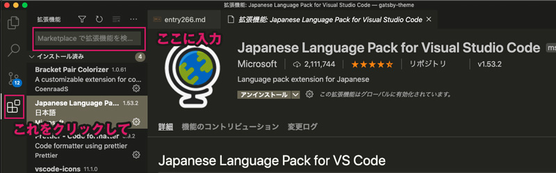

検索バーに「Jap」ぐらい入力したら「Japanese Language Pack for Visual Studio Code」が表示されるので、インストール。

完了したら、右下に表示される「Restart Now」をクリック・VS Codeを再起動します。

##VS Codeのざっくりとした歩き方

日本語化が無事できたところで、VS Codeのカンタンな使い方を説明します。


<small>※ VS Codeの見取り図</small>

ミニマップとタブ、エディターの説明は割愛します。

### アクティビティバーとサイドバー

VS Code左手にある以下のメニューをアクテビティバーと呼びます。*4 つの主な機能*があります。<br>
各メニューをクリックするとサイドバーが開きますが、画面が狭くなり使いにくくな事もあります。そんな時は「Cmd+B」で必要に応じて開閉しましょう。


#### _1.エクスプローラー_（Cmd+Shift+E）

ファイルやディレクトリを管理ができます。その中には開いているエディター、ワークスペース（名）、タイムライン、NPMスクリプト、アウトラインの5つの機能があります。使わない機能は**紛らわしいので非表示にしておくこと**をオススメします。

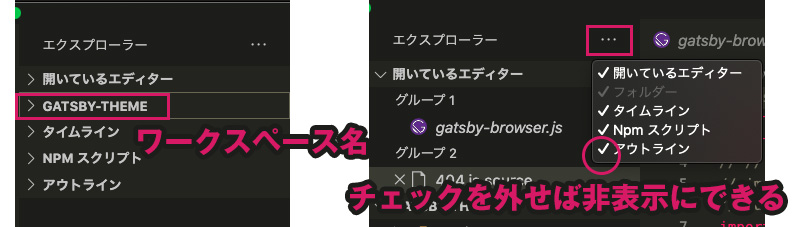

#### _2.検索と置換_（Cmd+Shift+F）

ファイル類をまとめて検索したり置換できます。

検索・置換に関しては、こちらにより詳しく書いてあります。


<card id="/blogs/entry336/"></card>

#### _3.ソース管理_（Ctrl+Shift+G）

Gitでソースのバージョン管理ができます。詳しい使い方は「初心者コーダーに贈る！超軽量高機能エディターVS Code入門2」へ記載します。

#### _4.拡張機能_（Cmd+Shift+X）

拡張機能ここから探してインストールできます。ソートしたりカテゴリで絞り込んで探す事もできます。

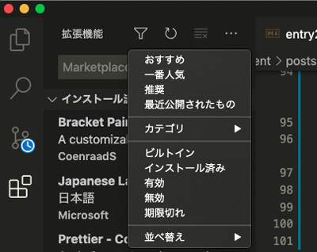

アンインストール、アップデート等も管理できます。初学者コーダーオススメの拡張機能は後述する便利な拡張機能にまとめます。

### メニューバー

上部にあるのがメニューバーです。慣れないうちは多用するかと思います。ショートカットを覚えたら使わなくなります。

### ステータスバー

下のバーはステータスバーです。左側はGitに関するものなので、右のみ説明します。

- _行＆列_<br>現在の行と列がわかります。クリックすると行番号を指定して移動できます。<br>文字を選択すると、現在選択している文字数もここに表示されます。
- _スペース_<br>タブの設定スペースの数を指定できます。
- _エンコードの設定_<br>エンコードの指定ができます。基本UTF8です。ここをクリックするとエンコードを指定して再度開くか、保存したりできます。
- _改行コードの指定_<br>デフォルトはLFです。<br> LF(↓)･･･UNIX系。Linux 。<br> CR+LF(↵)･･･Microsoft Windows。
* _言語モードの指定_<br>PHP、CSS、等使いたい言語にモードを変えることができます。メリットととして言語ごとにシンタックスハイライトがオンになりミスなどチェックしやすくなります。個人的には拡張子が違っても、言語モードを変えてチェックしたいこともあるので結構活用してます。

## 設定から配色テーマを変更しておく


一日中コードを見るのでツールの配色テーマは大切です。アクティビティーバー右下歯車マークから変更しておきましょう。

デフォルトはDark+です。あらかじめ用意されているテーマ以外もインストールすれば利用可能です。

##VS Codeの設定を変更しながらコードを書いてみよう

ではそろそろ、VS Codeの設定を変更しながらコードを書いてみましょう。

### 最初の一歩・ファイルで開くかワークスペースで開く

基本的にWeb制作をする際はディレクトリー（フォルダー）単位で管理します。

VS Codeでは*ワークスペース*といって、指定したディレクトリー以下のファイルやフォルダーをまとめて開くことができます。

適当なフォルダーをディスクトップに作っておきましょう。

ショートカット「Cmd+O」でワークスペースやファイルをひらけます。


Macの場合は開きたいフォルダーやファイルをDockのVS Codeのアイコンにドラック&ドロップしても開くことができます（WindowsはディスクトップのVS Codeアイコン上にドラック&ドロップ）。

### フォルダーやファイルを追加してコーディングしてみる

「Cmd+Shift+E」でエクスプローラーを開けます。

新しいファイルを追加するショートカット「Cmd+N」です。

上部メニューの「ファイル」>「新規ファイル」やエクスプローラーのワークスペースのファイル+アイコンをクリックしてからも追加可能です。

ファイルをワークスペースに追加します。「Cmd+S」でファイル名index.htmlと保存するだけです。

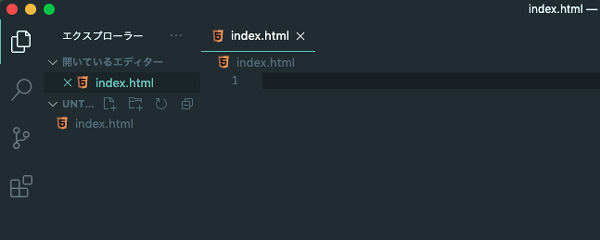

### コーディング補助機能Emmetでコーディングしてみる

コーディングしましょう。近年のコーディングではEmmetというコーディング補助機能を使うのが一般的です。

> Emmet とは？
> コード(スニペット)とショートカットを組み合わせて、効率的に HTML や CSS のマークアップ手助けしてくれるすごいツール

VS Codeの初期機能にEmmetというHTMLやCSSのコードの入力を補完してくれるプラグインが搭載されています。

Emmetにはチートシートが用意されているので慣れないうちは参考にしてください。

[Emmet チートシート](https://docs.emmet.io/cheat-sheet/)

<br>*!*を入力した後、タブキーをおすだけでhtmlの骨組みとなるコードがエディター上に展開されます。

展開されたコードはこんな感じです。`html`タグのlang属性がen（英語）になっています。
```html
<!DOCTYPE html>
<html lang="en">
  <head>
    <meta charset="UTF-8" />
    <meta http-equiv="X-UA-Compatible" content="IE=edge" />
    <meta name="viewport" content="width=device-width, initial-scale=1.0" />
    <title>Document</title>
  </head>
  <body>
  </body>
</html>
```


### よりコーディングしやすいように設定を変える

コーディングはコーディング規約といってルールに沿って書いておくとミスも発見しやすいし、他の人も管理しやすくなります。

最初からキレイに書くクセをつけておくといいです。エディター側でも規約に添えるように設定しておきます。

今回はGoogleのHTMLのコーディング規約を参考にします。

[Google HTML/CSS Style Guide](https://google.github.io/styleguide/htmlcssguide.html)

HTML、CSSのインデントはソフトタブ（スペース2コ）です。

```html
<!-- スペース4コ NG -->
<p>
    <strong><a href="#">リンク</a></strong>
</p>

<!-- ハードタブ NG -->
<p>
	<strong><a href="#">リンク</a></strong>
</p>

<!-- スペース2コ OK -->
<p>
  <strong><a href="#">リンク</a></strong>
</p>
```

<br>インデントを変えるためには左アクティビティバー下の歯車マークより設定を開きます。ショートカット「Cmd+,」でもひらけます。`Editor:Tab size`を*2*に設定します。


この設定は*setting.json*というファイルに集約されていて、ファイルに直接設定を書き込むことでも変更可能です。

設定の右上にファイルマークをクリックすると、開くことができます。

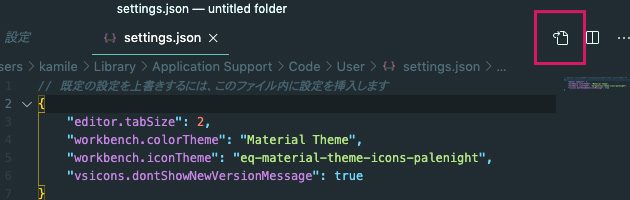

現在こんな感じになっていると思います。

```json
// 既定の設定を上書きするには、このファイル内に設定を挿入します
{
  "editor.tabSize": 2,
  "workbench.colorTheme": "Material Theme" //ここはテーマによって違う
}
```

<br>先ほどのように一個づつ設定を変えていってもいいのですが結構設定が多いので、コードで一気に追加します。

<small>*終わりの,(カンマ)*に気をつけてね！</small>
```json
// 既定の設定を上書きするには、このファイル内に設定を挿入します
{
  // タブサイズをスペースに
  "editor.tabSize": 2,
  // 配色テーマ
  "workbench.colorTheme": "Material Theme",
  // カーソルを見やすくする
  "editor.cursorBlinking": "smooth",
  "editor.cursorSmoothCaretAnimation": true,
  "editor.cursorStyle": "block",
  // 半角スペースを常に表示
  "editor.renderWhitespace": "all",
  // 起動時に前回開いていたワークスペースを開く
  "window.restoreWindows": "one",
  //インデントにさらにガイドライン追加
  "editor.renderIndentGuides": true,
  // ファイルの保存時に最終行以降をトリミング
  "files.trimTrailingWhitespace": true,
  // 未保存のタブを分かりやすくする
  "workbench.editor.highlightModifiedTabs": true,
  // Emmetを使用しないファイル形式
  "emmet.excludeLanguages": ["json"],
  "emmet.variables": {
    // Emmet で展開される HTML の言語を変更
    "lang": "ja"
  },
  // Emmetで終了タグにコメント追記
  "emmet.preferences": {
    "filter.commentAfter": "\n<!-- /[#ID][.CLASS] -->"
  }
}
```
ざっくりとこんな機能追加しました。

* カーソルを見やすくする
* 半角スペースを常に表示
* 起動時に前回開いていたワークスペースを開く
* インデントにさらにガイドライン追加
* ファイルの保存時に最終行以降をトリミング
* 未保存のタブを分かりやすくする
* Emmetを使用しないファイル形式
* Emmetで展開されるHTMLの言語を変更
* Emmetで終了タグにコメント追記

設定したら、さっきのファイルの中身を消してもう一度Emmetでコードを書いてみましょう。

!+タブキーで展開し、`body` のなかに以下のようにコードを書いて展開してみましょう！

```html
.parent>ul.child>li*3{test$}|c
```

`|c`を最後につけるとコメントが追加されます。

展開されたHTMLはこちらです。

```html
<!DOCTYPE html>
<html lang="ja">
  <head>
    <meta charset="UTF-8" />
    <meta http-equiv="X-UA-Compatible" content="IE=edge" />
    <meta name="viewport" content="width=device-width, initial-scale=1.0" />
    <title>Document</title>
  </head>
  <body>
    <div class="parent">
      <ul class="child">
        <li>test1</li>
        <li>test2</li>
        <li>test3</li>
      </ul>
      <!-- /.child -->
    </div>
    <!-- /.parent -->
  </body>
</html>
```

スペースが`・`で表示されるのでインデントの狂いにも気づきやすくなります。


### CSSファイルを追加してみる

cssファイルをhtmlファイル側から追加してみましょう！

先ほどのようにワークスペースに直接追加してもいいのですが、コードから追加してみます。

`title`タグの下に`link:css`と入力しタブ展開します。

```html
link:css
```

linkタグが追加されます。

```html
<!DOCTYPE html>
<html lang="ja">
  <head>
    <meta charset="UTF-8" />
    <meta http-equiv="X-UA-Compatible" content="IE=edge" />
    <meta name="viewport" content="width=device-width, initial-scale=1.0" />
    <title>Document</title>
    <link rel="stylesheet" href="style.css" />
  </head>
  <!-- 省略 -->
</html>
```


`href`の値、`style.css`をcmdを押しながらクリックすると「ファイルを開くことができません」と表示されます。ファイルの作成を押すと、style.cssが追加されます。

適当にCSSを書いてみましょう。

*c#333+タブ*でコードが展開されます。

```css
body {
  color: #333;
}
```

##VS Codeを拡張しよう
VS Codeがさらに使いやすくなるよう、拡張機能をインストールしましょう。

### Prettier Formatterをインストールしよう
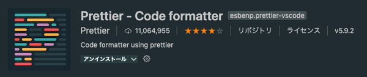

フォーマットが効くよう*Prettier Formatter* をインストールします。

「Shift+Cmd+X」で拡張機能を開きます。

これでどんなにぐちゃぐちゃなコードを書いても大丈夫です！！

ただ、何でもかんでもフォーマットされると超うざいです。。。。なのでsetting.jsonにHTML、CSS、JavaScript限定にして以下のように設定しておくことをオススメします。

```json
// フォーマット
"editor.formatOnSave": false,
"[html]": {
  // ファイル保存時に自動でフォーマット
  "editor.defaultFormatter": "esbenp.prettier-vscode",
  "editor.formatOnSave": true
},
"[javascript]": {
  // ファイル保存時に自動でフォーマット
  "editor.defaultFormatter": "esbenp.prettier-vscode",
  "editor.formatOnSave": true
},
"[css]": {
  // ファイル保存時に自動でフォーマット
  "editor.defaultFormatter": "esbenp.prettier-vscode",
  "editor.formatOnSave": true
}
```

### コーディング初心者なら絶対入れとけ！オススメ拡張機能のご紹介

さらに効率よくコードを書きたい！必要に応じていくつかの拡張機能もインストールしましょう！

できるだけHTML、CSSのコーディングが快適かつウキウキコーディングできるプラグインを厳選してみました。

<small>※ プラグイン名前でカンタンに探せます！</small>


- _Community Material Theme_<br>VS Codeに使えるテーマです。デフォルトより遥かにオサレ。インストールと同時にファイルのアイコン類も変えられるようになります。環境がいいと気分がアガります<br>
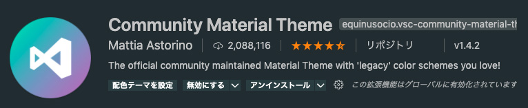<br>

- _Bracket Pair Colorizer_<br>ペアの{}（波括弧）を色付けして見分けやすくしてくれる拡張機能です。JavaScriptやCSS（とくにSCSS）の{}（波括弧）の入子って地獄。ペアの色が違うだけで助かります。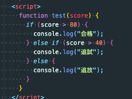<br>
- _Live Server_<br>VS Codeで簡易ローカルサーバーを起動できます。ボタンで一発インストールするだけでライブリロード（ファイルを更新するたびにブラウザーも更新）使えます。作業効率がアップするので駆け出しさんにもオススメです!<br><br>
- _Auto Rename Tag_<br>ペアになっているHTML/XMLタグの名前を自動的に変更できます。後からタグを書き直したいなんてシチュエーション日常茶飯事。だから入れて置いて損はなし。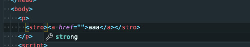<br>
- _Path Intellisense_<br>ワークスペース内のパスを補完してくれる超便利な拡張機能です。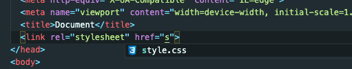<br>
- _HTML CSS Support_<br>HTMLに対するCSSのサポート。class属性の補完、ID属性の補完、css、scssファイルの検索をしてくれます。)<br>
- _CSS Peek_<br>HTMLのidやclassへ定義ジャンプしたり、HTMLファイル上でCSSスタイルを確認できます。<br>
- _htmltagwrap_<br>よくあるのが、やっぱりここにもう一個親タグが欲しい！ってケース。タグで挟みたい箇所を選択して*Option+W*で`p`タグが挿入されるので、書き換えます。。<br>
- _zenkaku_<br>見つけたら排除！！全角スペースほどコーディングで邪悪なものはないです。地味だけど長年お世話になってる拡張機能<br>

- _テキスト公正くん_<br>ブログ書く人にオススメ。

## まとめ・VS Codeを使いこなしてコーディング上手になろう！
VS Codeが生まれたのは2015年。当時は私の周りは皆Sublime Text使っていて、VS Code自体はまだ注目されていませんでした。ところがいつの間にかめちゃめちゃ使い勝手がよくなり、世界でシェアNo.1の高機能エディターとなりました。

Gitとの連携もカンタンで無料ってめちゃめちゃいいです！

「初心者コーダーに贈る！超軽量高機能エディターVS Code入門2」にはスニペットの作り方とGit連携について綴る予定です。しばしぽ待ちください！

これからHTMLなどのコーダーを目指す方はとりあえず、ショートカットと死ぬほどEmmet覚ると幸せになれそうです！

2020年から現在に至るまで世界中がコロナ禍です。日本もたくさんの失業者がいると聞きます。それでもなんとか勉強してWeb制作の仕事に就こうとして勉強している方たちをTwitter上でたくさん目にします。

私は業界10年。エンジニア講師していましたし、少しでも駆け出しエンジニアのお力になれればと思いこの記事をまとめました。よろしければ参考にしてください。

めっちゃ長くなってしまいましたが最後までお読みいただきありがとうございました！！

## おまけ・VS Codeショートカット一覧

現在ショートカット早見表を追加中です。

必須ショートカットは星*★*、オススメョートカットはハート*❤︎*がついています！

一覧はPDFでも配布されてます！

- [Windows ショートカット一覧](https://code.visualstudio.com/shortcuts/keyboard-shortcuts-windows.pdf)
- [Mac ショートカット一覧](https://code.visualstudio.com/shortcuts/keyboard-shortcuts-macos.pdf)

<div class="box">
<h4>ショートカットを死ぬ気で覚えて！</h4>
<p>この記事は先ほども言ったように今頑張っている駆け出しエンジニアに向けた記事です。エンジニア講師の経験上、勉強始めたばかりの方に多く見られるのはショートカットが使えない場合が多いです。ショートカットを使えるだけで、<em>一作業0.2 ~ 0.3秒づつくらい短縮</em>できます。<br>たかがコンマ数秒と思うかもしれませんが積み重なると大きいんですよ！！作業の速さはコーダーにとっての価値になります。</p>
</div>

### 一般

| Windows       | Mac         | 概要                                                  |
| ------------- | ----------- | ----------------------------------------------------- |
| Ctrl+Shift+P  | Cmd+Shift+P | _★_ コマンドパレットを開く                            |
| Ctrl+P        | Cmd+P       | _★ ❤︎_ クイックオープン（ファイルなどを探すのに便利） |
| Ctrl+Shift+W  | Cmd+Shift+W | *★*ウィンドウやワークスペースを閉じる                 |
| Ctrl+Shift+N  | Cmd+Shift+N | *★*新しいウィンドウを開く                             |
| Ctrl+K Ctrl+S | Cmd+K Cmd+S | キーボードショートカットを開く                        |

*キーボードショートカット*からショートカットを当てと変更ができます。よく使う機能でショートカットが当たってないものは当てておきましょう。


### ファイル操作系

| Windows       | Mac          | 概要                                                                                           |
| ------------- | ------------ | ---------------------------------------------------------------------------------------------- |
| Ctrl+O        | Cmd+O        | _★_ 既存のワークスペースやファイルを開く                                                       |
| Ctrl+N        | Cmd+N        | _★_ 新しいファイルを開く                                                                       |
| Ctrl+S        | Cmd+S        | _★_ ファイルを保存                                                                             |
| Ctrl+Shift+S  | Cmd+Shift+S  | _★_ 別名でファイルを保存                                                                       |
| Ctrl+K S      | Cmd+Option+S | _★_ すべてのファイルを保存                                                                     |
| Ctrl+W        | Cmd+W        | _★_ 現在のエディターを閉じる（開いているエディターがなくなったらワークスペースも閉じられます） |
| Ctrl+K Ctrl+W | Cmd+K Cmd+W  | _★_ すべて閉じる                                                                               |
| Ctrl+Q        | Cmd+Q        | _★_VS Code終了                                                                               |

### エディター操作系

行単位の操作と開いているファイルをタブ切り替えでかなり作業が早くなります。

| Windows           | Mac                             | 概要                           |
| ----------------- | ------------------------------- | ------------------------------ |
| Ctrl+X            | Cmd+X                           | _★_ カット                     |
| Ctrl+C            | Cmd+C                           | _★_ コピー                     |
| Alt+ ↑ / ↓        | Option+↓ / Option+↑             | _★_ 行の移動                   |
| Shift+Alt + ↓ / ↑ | Shift+Option+↓ / Shift+Option+↑ | _★_ 行のコピー                 |
| Ctrl+Shift+K      | Shift+Cmd+K                     | _★_ 行の削除                   |
| Ctrl+Enter        | Cmd+Enter                       | _★_ 空の行を下に追加           |
| Ctrl+Shift+Enter  | Shift+Cmd+Enter                 | 空の行を上に追加               |
| Ctrl+Shift+\      | Shift+Cmd+\                     | カッコ（()[]など）へ移動       |
| Ctrl+] / [        | Cmd+] / Cmd+[                   | _★_ インデント追加・削除       |
| Home / End        |                                 | 先頭・最後へ移動               |
| Ctrl+Home         | Cmd+↑                           | _❤︎_ ファイルの先頭へ移動      |
| Ctrl+End          | Cmd+↓                           | _❤︎_ ファイルの最後へ移動      |
| Ctrl+↑ / ↓        | ⌃PgUp / ⌃PgDn                   | _❤︎_ 上下の行の入れ替え        |
| Alt+PgUp / PgDn   | Cmd+PgUp /Cmd+PgDn              | ページの入れ替え               |
| Ctrl+Shift+[      | Option+Cmd+[                    | _★ ❤︎_ 次のタブのファイルへ移動 |
| Ctrl+Shift+]      | Option+Cmd+]                    | _★ ❤︎_ 前のタブのファイルへ移動 |
| Ctrl+K Ctrl+C     | Cmd+K Cmd+C                     | 行にコメント追加               |
| Ctrl+K Ctrl+U     | Cmd+K Cmd+U                     | 行のコメント削除               |
| Ctrl+/            | Cmd+/                           | _★_ コメントの追加と削除       |
| Shift+Alt+A       | Shift+Option+A                  | 空のコメント追加               |
| Alt+Z             | Option+Z                        | 文字の折り返しのオンオフ       |

### マルチカーソル系
マルチカーソルは高機能エディターの醍醐味です。

| Windows           | Mac                             | 概要                           |
| ----------------- | ------------------------------- | ------------------------------ |
| Alt+Click         | Option+X                           | _★_ カーソル追加             |
|Ctrl+Alt+↑|Option+Cmd+↑ | _★_ カーソルを下へ追加|
|Ctrl+Alt+↓|Option+Cmd+↓ | _★_ カーソルを上へ追加|
|Ctrl+U|Cmd+U | 最後に追加したカーソルを削除|
|Shift+Alt+I|Option+Ctrl+I | 選択した行の最後の行にカーソルを追加|
|Ctrl+L|Cmd+L|現在の行を選択 |
|Ctrl+Shift+L|Shift+Cmd+L| 一致するすべての出現箇所を選択|
|Ctrl+F2|Cmd+F2| すべての出現箇所を変更|
|Shift+Alt+→ / ←|Ctrl+Shift+Cmd+→ / ← |選択範囲を拡大/縮小|
|Shift+Alt+Drag|Shift+Option+Drag| _★ ❤︎_ ドラッグしながら矩形選択|
|Ctrl+Shift+Alt+↑ / ↓ / ← / →|Shift+Option+Cmd+↑ / ↓ / ← / →| _★ ❤︎_ 十字キーを使っての矩形選択|
|Ctrl+Shift+ Alt+PgUp|Shift+Option+ Cmd+PgUp|ページの上へ矩形選択|
|Ctrl+Shift+ Alt+PgDn|Shift+Option+ Cmd+PgDn|ページの下へ矩形選択|

よくやるのは十字キーを使っての矩形選択 >Cmd+←/→などで行の先頭や最後にカーソルを移動させ、まとめてタグを書き換えます。

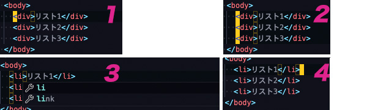

### 選択や置換系
Cmd+Dは超便利で使いまくっています。

| Windows           | Mac                             | 概要                           |
| ----------------- | ------------------------------- | ------------------------------ |
|Ctrl+F         |Cmd+F                           | _★_ エディター内での検索             |
|Ctrl+H         |Option+Cmd+F                           | _★_ エディター内での置換      |
|Alt+Enter         |Option+Enter              | _★_ 候補をすべて選択             |
|Ctrol+D         |Cmd+D              | _★ ❤︎_ 現在選択中の文字列と同じ次に出てくる文字列を選択    |
|Ctrl+U         |Cmd+U              | 文字選択のUndo（選択前に1つ戻ります）    |
|Ctrl+K Ctrl+D         |Cmd+K Cmd+U              | 文字選択をスキップ    |
|Alt+C          |Option+C              | 大文字小文字を区別する    |
|Alt+R          |Option+R              | 単語で検索    |
|Alt+W          |Option+W              | 正規表現を使用する    |
