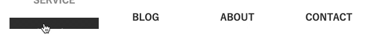
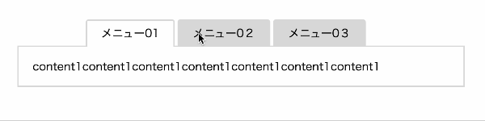

## カスタムデータ（data）属性とは？

「カスタム属性」「データ属性」「data属性」と呼ばれている、HTMLタグの中に追加できる属性の一種です。

`data-**` といった形で**のところは自分で好きに名前がつけられるカスタムな属性です。

```html
<button data-toggle="true"></button>
```

複数の単語をつなげたい場合はハイフンでつなげます。（例：data-gin-neko）

現在ではすべてのブラウザで使えます。

### カスタムデータ（data）属性はどんなシーンで活用できる？
JSでの操作も昔は特定のclassを活用してDOM操作していました。

元々はスタイルを当てるために使うclassですが、JSでのDOM操作に利用するためclassが複雑になったりするのを避けるためにHTML5でカスタムデータ（data）属性が導入されました。

1. カスタムデータ（data）属性からスタイルを指定
1. CSSのみで疑似要素や擬似クラスを使って操作
1. カスタムデータ（data）属性の名前や値を取得、操作する

## HTML＆CSSでカスタムデータ（data）属性を活用する方法
ではカスタムデータ（data）属性を早速HTMLとCSSで操作します。

### スタイルを指定する
カスタムデータ（data）属性でスタイルを指定することができます。

```html:title=HTML
<ul>
  <li data-tab-menu="menu1">MENU1</li>
  <li data-tab-menu="menu2">MENU2</li>
  <li data-tab-menu="menu3">MENU3</li>
</ul>
```
カスタムデータ（data）属性も*属性*なので`［］`（ブラケット）で囲みます。
```css:title=CSS
[data-tab-menu] {
  font-size: 20px;
}
```
以下のようにするとあるカスタムデータ（data）属性の特定の値だけ指定できます。
```css:title=CSS
[data-tab-menu=menu1] {
  color: #ff0033;
}
```
### ツールチップを実装する
ツールチップとはマウスオーバーでヒントとか出てくるアレです。


JSでゴニョゴニョして実装せずにカスタムデータ(data)属性とCSSの擬似クラス＆疑似要素の設定のみで実装可能です。

```html:title=HTML
<p data-hint="CSS関数のattr()と疑似要素を使います。">ツールチップをCSSだけで実装するには？</p>
```
疑似要素`before`で`attr()`を使って文を出力し、`after`で吹き出しを作ります。<br>
要素`p`を`hover`したらTooltipが出現します。
```css:title=CSS
[data-hint] {
  position: relative;
}
[data-hint]:hover {
  cursor: pointer;
}
[data-hint]:hover::before {
  font-size: 14px;
  padding: 5px 16px;
  border: 1px solid #aaa;
  box-shadow: 0 1px 2px #ddd;
  border-radius: 4px;
  position: absolute;
  left: 0;
  bottom: 0;
  transform: translateY(calc(100% + 5px));
  content: attr(data-hint);
}
[data-hint]:hover::after {
  position: absolute;
  content: "";
  display: block;
  bottom: -5px;
  left: 20px;
  border-bottom: 5px solid #aaa;
  border-left: 5px solid transparent;
  border-right: 5px solid transparent;
}
```
[Tooltip | Codepen](https://codepen.io/camille-cebu/pen/BaYZyYX)
### マウスオーバーアニメーション
前述の「カスタムデータ（data）属性でツールチップを実装する」の応用編です。



マウスオーバーで文字を入れ替えるなど、[グロナビ アニメ・コードスニペット上級編](http://localhost:8000/blogs/entry449/#%E3%82%B0%E3%83%AD%E3%83%8A%E3%83%93-%E3%82%A2%E3%83%8B%E3%83%A1%E3%82%B3%E3%83%BC%E3%83%89%E3%82%B9%E3%83%8B%E3%83%9A%E3%83%83%E3%83%88%E4%B8%8A%E7%B4%9A%E7%B7%A8)で紹介しています。

以下記事より参考にしてみてください。

<card id="/blogs/entry449/"></card>

## JavaScriptやjQueryでカスタムデータ（data）属性を操作する
まずはJavaScriptやjQueryからのカスタムデータ（data）属性の取得方法のご紹介です。

カスタムデータ（data）属性がなぜ導入されたかを踏まえて使っていきましょう。

<div class="box">JSでのDOM操作に利用するためclassが複雑になったりするのを避けるためにHTML5でカスタムデータ（data）属性が導入されました。</div>

### カスタムデータ（data）属性の操作方法
まずはカスタムデータ（data）属性の値の取得を含めた操作方法のご紹介です。

```HTML:title=HTML
<p data-attr="hoge">カスタムデータ（data）属性</p>
```

#### 値を取得
まずはJavaScriptでの値の取得方法です。`dataset`、`getAttribute`で取得できます。

```js:title=JavaScript
const el = document.querySelector('[data-attr]');
console.log(el.dataset.attr)//hoge
console.log(el.dataset['attr'])//hoge
console.log(el.getAttribute('data-attr'))//hoge
```
datasetで取得するときはカスタムデータ（data）属性の接頭辞`data-`を省きます。

jQueryにも`data`、`attr`という似たようなメソッドがあります。<br>
使い方も一緒です。

```js:title=jQuery
console.log($('[data-attr]').data('attr'))
console.log($('[data-attr]').attr('data-attr'))
```

#### カスタムデータ（data）属性はケバブケースをJSではキャメルケースに変換して使う
カスタムデータ（data）属性は冒頭で述べたようにHTML側で接頭辞`data-`以降を以下のようにケバブケース（ハイフンでつなぐ）で指定することができます。
```HTML:title=HTML
<p data-attr-huga="hoge">カスタムデータ（data）属性</p>
```
`dataset`と`data`の場合以下のように取得可能です。
```js:title=JavaScript
const el = document.querySelector('[data-attr-huga]');
console.log(el.dataset.attrHuga)//hoge
```
```js:title=jQuery
console.log($('[data-attr-huga]').data('attrHuga'))//hoge
```
### 値を変更する(サンプルコード：メニューのトグルボタン)
メニューのトグルボタンを例にとって値の変更方法をご紹介します。


```HTML:title=HTML
<button data-toggle></button>
```
```CSS:title=CSS
[data-toggle] {
  border: 1px solid #000;
  background: #000;
  width: 60px;
  height: 60px;
  display: flex;
  flex-direction: column;
  justify-content: space-between;
  align-items: center;
  padding: 15px;
}
[data-toggle]::before, [data-toggle]::after {
  content: "";
  width: 30px;
  height: 2px;
  display: block;
  background: #fff;
  transition: 0.3s;
}
[data-toggle]::before {
  box-shadow: 0 14px 0 #fff;
}

[data-toggle=open]::after {
  transform: translate(0, -13px) rotate(-45deg);
}
[data-toggle=open]::before {
  transform: translate(0, 13px) rotate(45deg);
  box-shadow: none;
}
```

JavaScriptでは`dataset`、`setAttribute`で値を変更します。

```js:title=JavaScript/setAttribute
const toggleBtn = document.querySelector('[data-toggle]');
toggleBtn.addEventListener('click',()=>{
  const btnState = toggleBtn.getAttribute('data-toggle') === "" ? "open" : ""
  toggleBtn.setAttribute('data-toggle',btnState)
});
```
```js:title=JavaScript/dataset
const toggleBtn = document.querySelector('[data-toggle]');
toggleBtn.addEventListener('click',()=>{
  toggleBtn.dataset.toggle = (toggleBtn.dataset.toggle === "" ? "open" : "")
});
```

jQueryでの実装方法のご紹介です。
```js:title=jQuery
$('[data-toggle]').on('click',function(){
  $(this).attr('data-toggle',  $(this).attr('data-toggle') === "" ? "open" : "")
})
```
[Toggle menu / customdata-attribute | Codepen](https://codepen.io/camille-cebu/pen/YzeQXXb)

<div class="box"><h4>jQueryのdata()メソッドのイケてないところ</h4><p>data()は<strong>jQuery上のキャッシュを書き換えるのみ</strong>で、DOM上のdata属性は変更されません。つまり、DOM操作をしたい場合はattr()しか使えません。</p></div>

<br><br>ハンバーガーメニューのサンプルコードはこちらを参考にしてください。
<card id="/blogs/entry496/"></card>

### 値を変更する(サンプルコード：タブメニュー)
カスタムデータ（data）属性を使ったタブメニューの実装方法のご紹介です。

メニューとコンテンツで同じ値を持ったタブを表示させます。



```html:title=HTML
<ul class="tab-menu">
  <li data-tab="1" data-active="true">メニュー01</li>
  <li data-tab="2" data-active>メニュー0２</li>
  <li data-tab="3" data-active>メニュー0３</li>
</ul>
<div class="tab-contents">
  <section data-tab-content="1" data-active="true">
    content1content1content1content1content1content1content1
  </section>
  <section data-tab-content="2" data-active>
    content2content2content2 content2 content2content2content2content2content2content2
  </section>
  <section data-tab-content="3" data-active>
 content3content3content3content３content3content3content3 content3content3content3
  </section>
</div>
```
```CSS:title=CSS
.tab-menu {
  display: flex;
  justify-content: center;
  gap: 4px;
  max-width: 600px;
}
[data-tab] {
  padding: 10px 20px;
  border-top-right-radius: 4px;
  border-top-left-radius: 4px;
  background: #fff;
  border: 2px solid #ddd;
  background: #ddd;
}
[data-active="true"] {
  background: #fff;
  z-index: 2;
  position: relative;
  border-bottom: #fff;
}
.tab-contents {
  margin-top: -2px;
  position: relative;
  border: 2px solid #ddd;
  background: #fff;
  padding: 20px;
  max-width: 600px;
}
[data-tab-content]:not([data-active="true"]) {
  display: none;
}
```
```js:title=JavaScript
const tabItems = document.querySelectorAll('[data-tab]');
const tabContents = document.querySelectorAll('[data-tab-content]');

tabItems.forEach((item)=>{
  item.addEventListener('click', ()=>{
    const num = item.dataset.tab;
    tabItems.forEach((item,index)=>{
      const tabContent = tabContents[index];
      item.dataset.active = item.dataset.tab === num ? true : "" ;
      tabContent.dataset.active = tabContent.dataset.tabContent === num ? true : "" ;
    })
  })
})
```
```js:title=jQuery
$('[data-tab]').each(function(index){
  $(this).on('click',function(){
    const num = $(this).attr('data-tab')
    $('[data-tab]').each(function(index){
      const tabContent = $('[data-tab-content]').eq(index);
      $(this).attr("data-active", $(this).attr('data-tab') === num ? true : "")
      tabContent.attr("data-active", tabContent.attr('data-tab-content') === num ? true : "")
    })
  })
})
```
[Tab menu | Codepen](https://codepen.io/camille-cebu/pen/zYRzvxV)

### カスタムデータの削除
カスタムデータそのものを削除する方法です。

```js:title=JavaScript
removeAttribute('data-id')
```
```js:title=jQuery
removeAttr('data-id')
```

## その他の活用法
その他カスタムデータ（data）属性を活用する方法です。

* AJAXである特定のIDのデータを削除、登録
* タグマネージャーのクリック要素の登録として活用

タグマネージャーのクリック要素の登録に関しては今度記事としてまとめようと思います。

## まとめ。クラスとカスタムデータ（data）属性をうまく使い分けて保守性の高いコードを書こう
カスタムデータ（data）属性を使うとJSのDOM操作以外でもかなり便利なことはおわかりいただけたと思います。

現場側としてはカスタムデータをフルに活かせば、クラスのバッティングも起こらないしかなり整理されたコードになり保守性が高まることが一番嬉しいです。

この記事は2年以上前に書きましたが、改めて復習も兼ねて利用方法をまとめてみました。

当時はIEのせいで使い勝手が悪かったですが、今は気にせず思う存分使えるのでいい時代になりました。

この記事が皆さんのコーディングライフの一助となれば幸いです。

最後までお読みいただいきありがとうございました。

### おまけ。属性取得方法
DOM操作で便利な値取得方法をまとめます。
```js:title=JavaScript
elm.src //ソース
elm.height //高さ
elm.width //幅
elm.alt //代替テキスト
elm.value //フォームなどの値
```
```js:title=jQuery
elm.attr('src') //ソース
elm.attr('height') //高さ
elm.attr('width') //幅
elm.attr('alt') //代替テキスト
elm.value()//フォームなどの値
```

