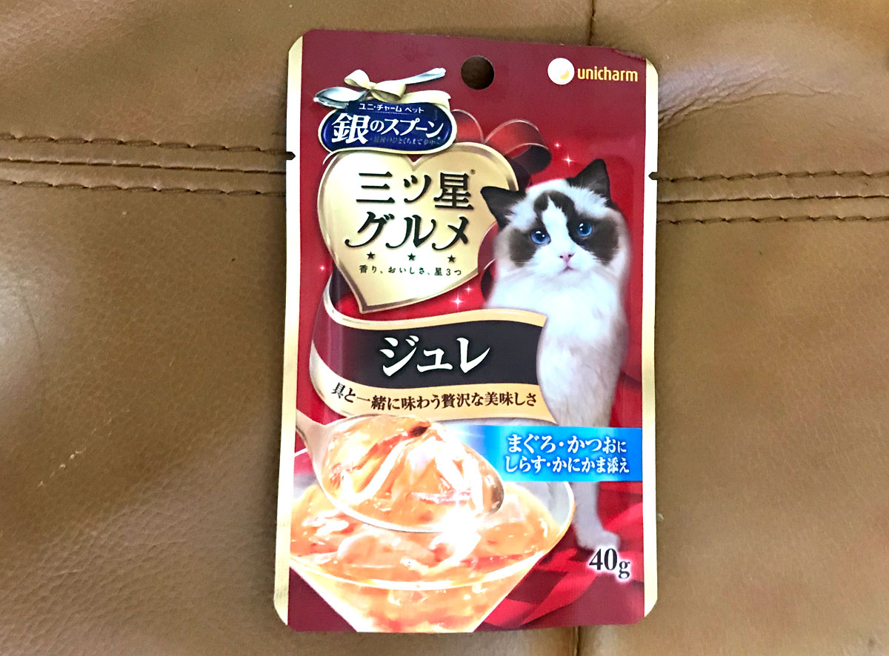
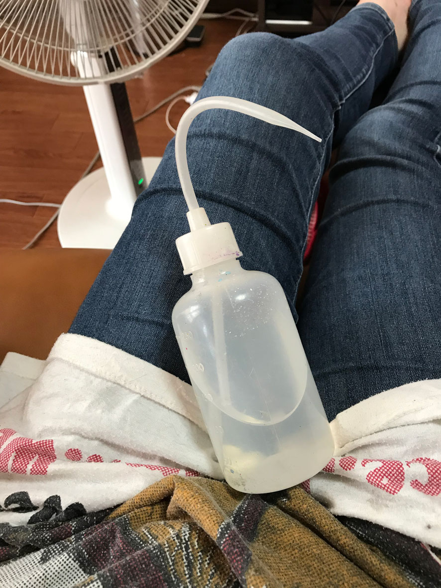
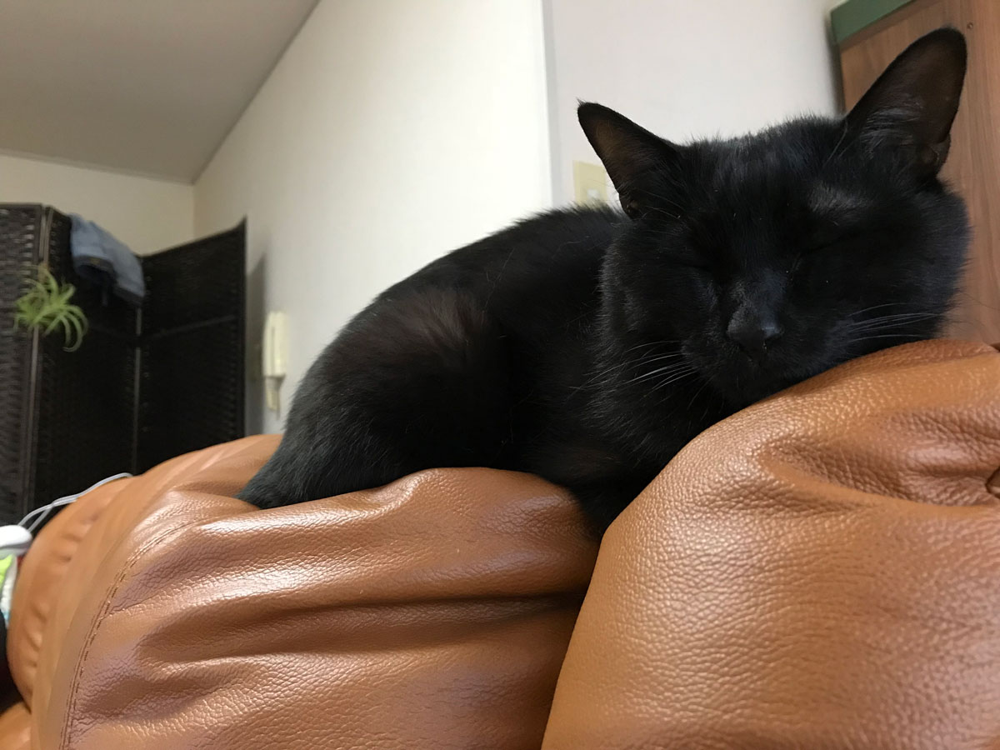

## いつもの晩酌、トイレに行った隙に事件は起こった
うちのネコ：チョコボ（5歳くらいのオス）は保護ネコです。野良ネコ時代の意地汚さは健在で、好きあらば人間様の食べ物を狙ってきます。 
私は基本毎日晩酌しています。その日もいつものように晩酌していました。ほろ酔いで油断してトイレに行った隙にチョコボはテーブルに残したカレー風味のサラダチキンの袋をなめてしまいました。 
すぐに取り上げましたが、奴はしめしめといった顔をしていました。
## 翌日、飼い猫チョコボの容体が急変
明け方、チョコボが激しく嘔吐（えず）く音で目を醒ましました。最初はいつものように毛玉を吐いてるだけだと思っていました。 
しばらくすると落ち着いたので、いつものように餌を与えました。半分ぐらい食べたところで、食べるのをやめてしまいました。 
うちのネコは食べるのが生きがいらしく、とにかく意地汚くて食いしん坊。なので異変は感じていました。
少し経つと、さらにゲーゲー吐き始めました。

食べたものを全て吐ききってもさらに吐き続けました。どんどん顔がゲッソリし、最後は肩で息をする始末。心配ではあったけどネコを家に残して会社に行きました。 
仕事中も気になって仕事が手につきませんでした。今までみたことのない体調の変化だったので「帰ったら、チョコボが死んでいたらどうしよう」ということが頭をよぎって離れません。
事情を説明して、早退することにしました。

帰宅したら、相も変わらず弱りきった姿のチョコボ。苦しそうに肩で息をしています。いつもは元気に走り回っているのですが、微動だにしません。 
もうこれは病院に連れて行くしかない！チョコボを移動用のゲージに入れて、タクシーを呼んで動物病院に連れて行くことにしました。

## 初めての動物病院
それまで目立った病気をしたことがなかったチョコボ。
移動中もゲージから不安そうな表情かつか細い声でニャーニャー鳴いていました。
病院に着くと、体重を計り、体温を測り、血液検査。

熱が少しあり、脱水症状。しかも肝臓の数値が悪かったので症状からおそらく食中毒とのこと。思い当たる節は昨日のカレー味のチキンサラダしかないので多分それだろうという話になりました。
原材料に香辛料と味付けに玉ねぎが使われています。玉ねぎはネコにとっては毒です。場合によっては死に至るそう。おそろしー。皆さんも気をつけてください。

その後、肝臓の数値を戻す（らしい）注射と脱水を緩和する点滴もどきの注射を受けました。
ネコを本格的に点滴させようと思ったら一日預けなければいけないそうです。その代わり点滴もどきを打てば、肩甲骨の間に水分をため、毛細血管から水分をじんわり吸収させていけるそうです。おかげさまで日帰りできました。

ちなみに、肩甲骨の皮膚を引っ張ってすぐに戻らない時は脱水が進んでいるとのことです。

先生は至って冷静で、「大丈夫、大丈夫」という調子。拾い食いからの中毒はよくある事案なんだと思いました。

治療費は**約1万2000円**でした（涙）。

* 初診料
* 血液検査
* 点滴
* 注射
* その他諸々

まあ、命には変えられないので、…勉強代です。
## 病院での処置後のケア
処置後も油断大敵です！動物病院での処置後、私がやったネコへのケアをご紹介します。獣医さんのアドバイスも含みます。

### エサはウェット系に切り替える
ドライフードに比べ、ウェット系のエサは匂いが強く食欲を駆り立てるそうです。しかも**水分約80%以上含む**ので、脱水ネコにはもってこいです。

ちなみにうちで、与えたのはこれ。水分の含有量は90%以上。チョコボにとってはお盆や正月、クリスマスにしか食べることが許されないご馳走。通常はドライフードの上にかけて食べさせています。

この時ばかりはさすがに弱りきっていてエサ箱から食べてくれませんでした。仕方ないので手のひらに置いて口に運んでやりました。少しずつですが食べてくれるようになりました。私の体温で温まったのが良かったようです。

[銀のスプーン 三ツ星グルメ ジュレ まぐろ・かつおにしらす・かにかま添え 35g×16袋【まとめ買い】](https://www.amazon.co.jp/gp/product/B07Y4CMNVX/ref=as_li_tl?ie=UTF8&camp=247&creative=1211&creativeASIN=B07Y4CMNVX&linkCode=as2&tag=ginnekoatelie-22&linkId=4614eb20f29476b63e2cc32d08f1c754)

ちなみにうちで、与えたのはこれ。水分の含有量は90%以上。チョコボにとってはお盆や正月、クリスマスにしか食べることが許されないご馳走。通常はドライフードの上にかけて食べさせています。

この時ばかりはさすがに弱りきっていてエサ箱から食べてくれませんでした。仕方ないので手のひらに置いて口に運んでやりました。少しずつですが食べてくれるようになりました。私の体温で温まったのが良かったようです。

ネットで情報を調べると軽くレンジでチンして人肌程度に温めてやるのもよいそうです。匂いも強くなり、食べてくれる確率が上がるそうです。

### 経口補水液をスポイドなどで与える
獣医さんからは経口補水液を水分補給のために与えていいとのことでした。

もちろん水飲み用の容器に経口補水液を入れたところで飲んでくれないのはわかっていました。 
うちにたまたま、ネイリスト時代エアブラシ洗浄に使っていたボトルにノズルがついている容器があったので利用することにしました。

これに経口補水液を入れて少しずつ口に含ませていきました。
普通のご家庭にはないと思うのでスポイドとかでも大丈夫だと思います。

水分補給には電解質がいいのですが、間違ってもポカリスエットなどを与えないでください。ネコは腎臓が弱い動物です。ポカリスエットには塩分が含まれていますので、腎臓に負担がかかります。
[経口補水液 パウダー 粉末 10包入×2個（計20包） エブリサポート 無果汁 日本薬剤](https://www.amazon.co.jp/gp/product/B07RXR3SN3/ref=as_li_tl?ie=UTF8&camp=247&creative=1211&creativeASIN=B07RXR3SN3&linkCode=as2&tag=ginnekoatelie-22&linkId=f96246d1a9631243cc25aa255aeffa29)
赤ちゃん用のポカリスエットならOKと他のブログで見ましたが、念のためどんなものを飲ませたらいいか獣医さんによく相談してください。

### 回復しなければ、再度病院へ
うちの子の場合3日程度したら食欲も戻りました。

今ではすっかり、意地汚い元どおりのチョコボで、好きあらば盗み食いを目論んでます。

どのネコちゃんも同じように回復するとは限りません。なので2、3日経っても回復の傾向が見られない場合は迷わず病院へ連れて行くことをオススメします。

## まとめ
ネコの食中毒防止にはネコが食べたくなるようなものを届くところに放置しないのが一番です。

それでもうっかりすることはあります。もし、そんな時は早めに動物病院に連れて行き、処置後のケアを十分してあげてください。 
ネコも大切な家族。大切にしてあげてください。

最後までお読みくださり、ありがとうございました。
