コーディング初心者に贈るVS Code完全マニュアル第2弾！

第1弾で快適にコーディングできるところまでセッティングしたので、さらに便利に使えるようにスニペット、ターミナルやGit連携などのご紹介をします。

<p><small>この記事は最新2021年のVS Codeに合わせて大幅にリライトしました。</small></p>

<prof></prof>

この記事のゴールはVS Codeをさらに使いこなすためにスニペットを作ったりGit連携できるようになることです。

VS Codeをダウンロードし、**ある程度設定できていることが前提条件** です。


第1弾では快適にコーディングできるところまでセッティングしました。

<card id="/blogs/entry266/"></card>


SCSSの設定などは3弾に記載してますので、必要に応じて読み進めてください！

<card id="/blogs/entry440/"></card>


### VS Codeの見取り図
機能が多く迷子になりやすいので、わからなくなったらこちらを参考に。


#### アクティビティ バー
ツールの中でもっとも使うメニューです。


## VS Codeのスニペット

> #### スニペットとは
> VS Codeのスニペットとは、よく使うコード一式をショートカットやキーに登録しておく機能です。言語ごとに登録できます。
コード書いてると、「これ何回書いたっけ？」ってことあると思います。

### スニペット設定用ファイルを追加方法
HTMLのスニペットを作ります。

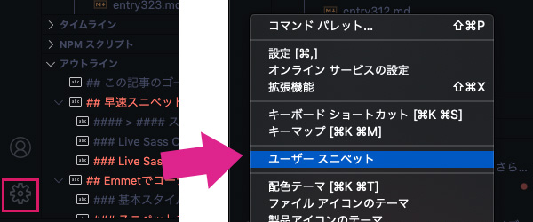

アクティビティーバーの下側・歯車マークをクリック>ユーザースニペット（ショートカットは当たってません）をクリックします。

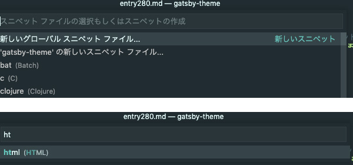

htmlとバーに入力すると、HTMLと入力するとhtml用にhtml.jsonというスニペット用のファイルができます。

### スニペット設定用ファイルの削除方法

タブを右クリック（Option+Cmd+R）し「ファインダーで表示します」を選ぶと、ファイルの置かれている場所がわかります。

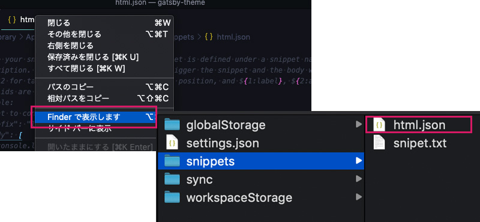

不要になったらここから削除します。

### スニペットの書き方

コメントアウトされているPrint to console〜から閉じカッコまでをコピーしてスニペットを作っていきます。

```js
{
  // Place your snippets for html here. Each snippet is defined under a snippet name and has a prefix, body and
  // description. The prefix is what is used to trigger the snippet and the body will be expanded and inserted. Possible variables are:
  // $1, $2 for tab stops, $0 for the final cursor position, and ${1:label}, ${2:another} for placeholders. Placeholders with the
  // same ids are connected.
  // Example:
  // "Print to console": {
  //   "prefix": "log",
  //   "body": [
  //     "console.log('$1');",
  //     "$2"
  //   ],
  //   "description": "Log output to console"
  // }
}

//↓↓スニペットの雛形
{
  "スニペット名": {
    "prefix": "キー",
    "body": [
      "コード内容"
    ],
    "description": "スニペットの説明"
  }
}
```

<br>デフォルトで用意されている*html:5*で展開するHTMLのコードはこちら。
```html
<!DOCTYPE html>
<html lang="ja">
<head>
  <meta charset="UTF-8">
  <meta http-equiv="X-UA-Compatible" content="IE=edge">
  <meta name="viewport" content="width=device-width, initial-scale=1.0">
  <title>Document</title>
</head>
<body>

</body>
</html>
```

<br>個人的にはhead内に最低必要なコードは含めておきたいです。足りないコードはこちら4つ。
```html
<!-- 電話番号の自動リンク化を無効 -->
<meta name="format-detection" content="telephone=no">
<!-- ページの説明 -->
<meta name="description" content="説明が入ります">
<!-- スタイルシート -->
<link rel="stylesheet" href="style.css">
<!-- JS -->
<script src="script.js" defer></script
```
<br>

* *電話番号の自動リンク化を無効* iOSのSafariには、文書内の電話番号を検出して自動的にリンクする機能が備わっているのですが、電話番号以外の番号も誤認識されてしまうことがありやっかいです。最初から無効化しておきます。
* *ページの説明* サイト公開に最低限必要。
* *スタイルシート* 絶対何かしら読み込むので用意しておきます。ファイル名はあとで変更すれば良いです。]
* *JavaScriptファイル* ドロワーメニューなど何かしらJSは書くはずなのでファイルをもう書いておきます。

コードが横へ爆長になった場合は、「Option+Z」でコードの折り返しをセットすると◎。

コードは以下。

```js
{
  // HTMLのためのスニペット
  "html5": {
    "prefix": "html:temp",
    "body": [
      "<!DOCTYPE html>",
      "<html lang=\"ja\">",
      "  <head>",
      "    <meta charset=\"UTF-8\">",
      "    <meta http-equiv=\"X-UA-Compatible\" content=\"IE=edge,chrome=1\">",
      "    <meta name=\"viewport\" content=\"width=device-width,initial-scale=1\">",
      "    <meta name=\"format-detection\" content=\"telephone=no\">",
      "    <title>${1:タイトル}</title>",
      "    <meta name=\"description\" content=\"${2:説明}\">\n",
      "    <!-- style -->",
      "    <link rel=\"stylesheet\" href=\"${3:style.css}\">",
      "    <!-- js -->",
      "    <script src=\"script.js\" defer></script>",
      "  </head>",
      "  <body>",
      "    $4",
      "  </body>",
      "</html>"
    ],
    "description": "ベースHTMLのスニペット"
  }
}
```
<br>`${1:タイトル}`のように書いておくと、デフォルトの文字を入れつつタブでカーソル移動しながらカンタンに書き換えられます。

数字は移動したい順番です。

`html:temp`で展開可能です。候補も出ますし、どんなコードが展開されるかもわかります。

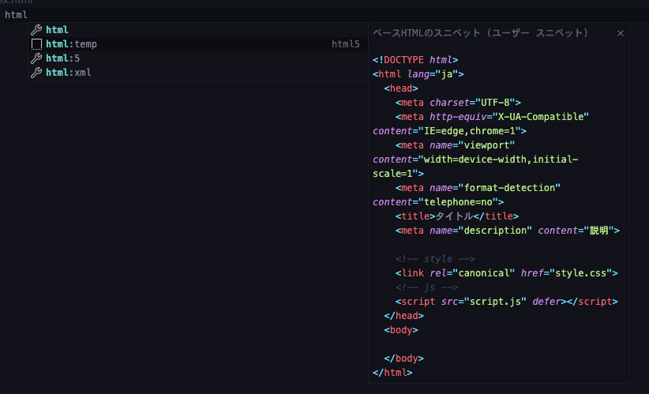


## VS CodeでGitと連携する！
せっかくなのでGitと連携してコードを管理（バージョン管理）しましょう。

Gitでググったらおそらく、コマンドがわんさか出てきて初学者にとっては地獄。。。

そんなGit操作をVS Code備え付けのGUI（グラフィカル・ユーザー・インターフェイス）で使えるなんて超幸せです！<br><br>

さておき**バージョン管理とはすなわち*躾（しつけ）*！**<br><br>

初学者だろうが有無を言わずに使いましょう！

GitHubとVS Codeをサインインしておきます。私はVS Codeを普段GitHubと連携しています。<br>
アクティブバーの人マークをクリックし、サインインして同期を選び、GitHubを選びます。

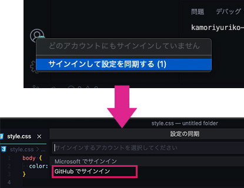

### GitHubでリポジトリを作り、クローンする

GitHubで先にリポジトリを作っておきます（readme.mdを追加しないで作ってください）。

新しくVS Codeを開きクローンするを選びます。

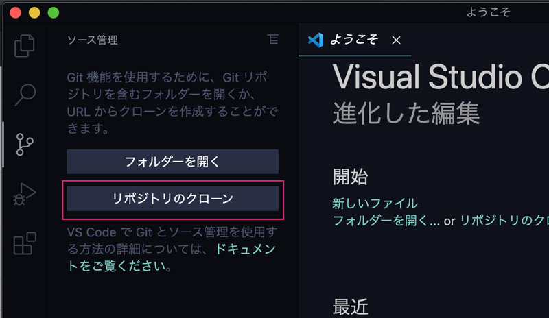

リポジトリを選び、クローンする場所を選びます。

クローンが終わると改めて「VS Codeを開きますか？」と聞かれるでそちらを開いておきます。

### readme.md ファイルを追加してファーストコミット


ディレクトリーにreadme.mdという名前のファイルを追加します。適当に文字を打ち込み、ソース管理（ショートカットCtrl+Shift+G）を開きます。

ちょっと小さいですがアイコンにそって説明します。

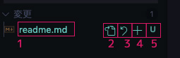

1. ファイル名です。クリックすると変更前・変更後を比較できます。<br>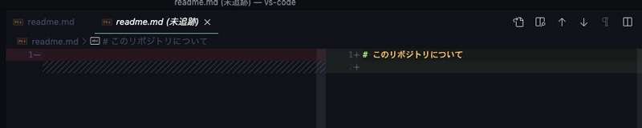
2. 単純にファイルを開けます。
3. 変更を破棄できます
4. 変更をステージ（コミット対象）に移せます。
5. 状態。U（新規）/M（変更）/D（削除）/C（コンフリクト）です。クリックするとファイル名同様変更前・変更後を比較できます。赤くなってる場合はエラーがあるかコンフリクトしているので注意です。

ここでは4のプラスボタンをクリックしてステージングします。

「ステージされている変更」が出現し、ファイルがそちらに移動します。もしステージングを取り消したい場合はー（マイナス）ボタンを押して下に移動します。

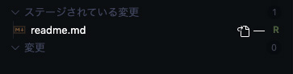

ファイルの量が増えてくると面倒です。変更したファイルの変更は「ソース管理」「ステージされている変更」の横にある横ボタンからまとめて操作できます。

サイドバー右上のメニュー(・・・)から「コミット」>「ステージング済みをコミット」を選択します。するとコミットのメッセージを求められるので「Initial Commit」と入力しておきましょう。

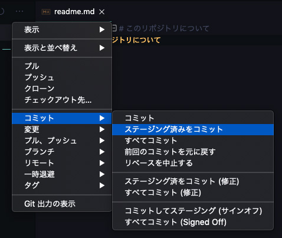

コミット履歴はエクスプローラーのタイムラインから確認できます。

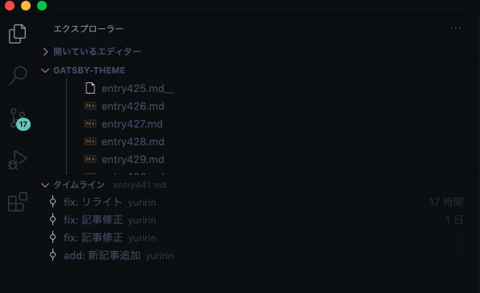

*結構頻繁に行き来する*ので、エクスプローラー（Shift+Cmd+E）とソース管理（Ctrl+Shift+G）のショートカットは覚えたほうがいいです。

### プッシュ
リモートにプッシュします。

サイドバー右上のメニュー(・・・)から「プル、プッシュ」>「プッシュ」を選択。

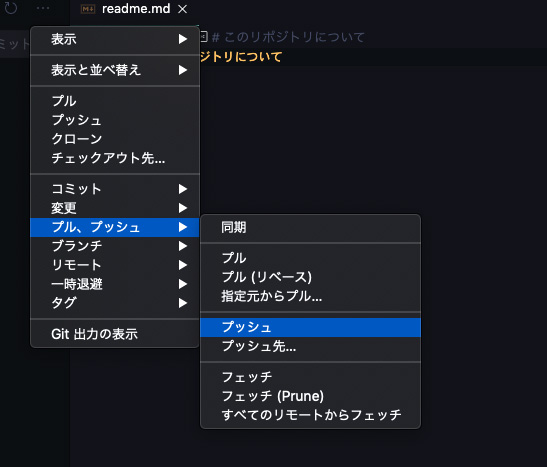

GitHubのリポジトリでちゃんとプッシュされているか、確認しましょう。

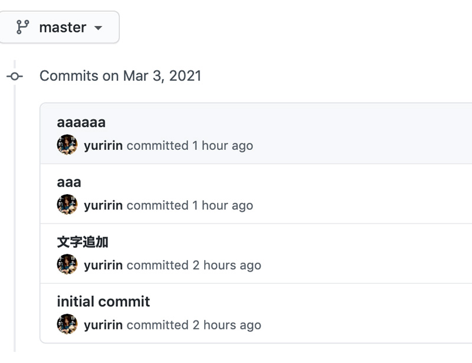

<div class="box">
  <h4>余談・Macのキーチェーンで保存されていたパスワードが厄介でプッシュできない現象に陥った。。。</h4>
  ちなみに私のMacに2つのGitHubのパスワードがキーチェーンに保存されていました。<br>
  パスワードを聞かれたら、現在削除されたアカウントが優先されプッシュできない状況にお陥りました。<br>
  もう使ってないのでキーチェーンから削除して一件落着。みなさんも気をつけましょう。
</div>

### ブランチ追加・切り替え
VS Codeはブランチの追加もカンタンです！

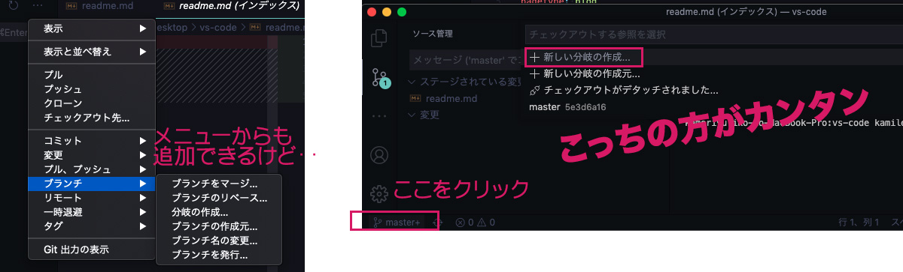

メニューからも追加できますが、下のステータスバーから追加するほうがカンタンです。

切り替えも同様に下のステータスバーをクリックして切り替え可能です。

### マージ
マージはブランチに移動し、サイドバー右上のメニュー(・・・)から「ブランチ」>「ブランチをマージ」を選択。

マージしたいブランチを選択するだけです。

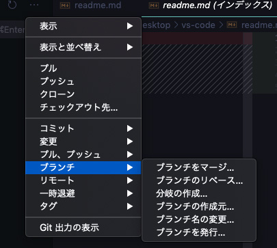

### コンフリクト対応（不完全なので追記します。待ってね）
初学者の最大の難関、コンフリクトについてです！

コードに差異があってうまくマージができなかった時に起こります。

コンフリクトが起きたら黄色い文字で「C」と表示されます。いまだに気分が萎えますね。。。


「現在の方」と「入力欄のすべて」の二通り選べて問題なければすべてソース管理側でいずれかを選ぶことができます。

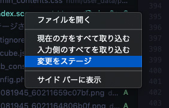

どっちも取り込まないといけない場合は手動で直します。

「C」マークがついたファイルごとに、箇所箇所で修正します。

ファイルには以下のように「現在の変更」と「入力欄の変更」で選べるのでどちらかで修正します。

箇所箇所でさらに違う場合はさらに手動で修正しましょう。

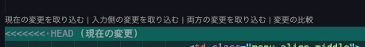

## ターミナルを使おう！（ちょっとハードル上がるよ）
通常ターミナルは別アプリケーションから開きますがVS Codeにも付属でついています。「Ctrl+Shift+@」で表示・非表示可能です。

私は普段、Git操作はターミナルから行っていて、VS CodeのGit機能はブランチ切り替えと作成ぐらいしか使ってません。

GitHubのアカウントを以前2こもっていてコミットで1アカウントの方がhttpsのURLからはできなくなってしまいました。

困ったので片方はssh接続といって鍵認証で接続する方法をとることにしています。

[GitHubでssh接続する手順~公開鍵・秘密鍵の生成から~](https://qiita.com/shizuma/items/2b2f873a0034839e47ce)

### コマンドでクローンする
普通にVS Codeを開いてターミナルを起動し、cdコマンドでディレクトリ移動します。

ディスクトップに移動しておきます。

```
cd Desktop
```
自分の居場所がわからない人は以下コマンドで調べてみましょう。

```
ls -a
```

今いる階層のディレクトリ・ファイルが確認できます。

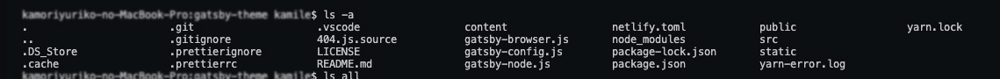

<br>sshの方のURLでgit cloneします。

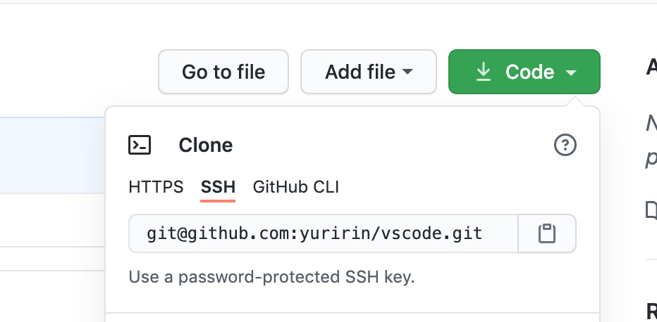

```
git clone git@github.com:yuririn/vscode.git
```

パスフレーズを聞かれるので入力します。

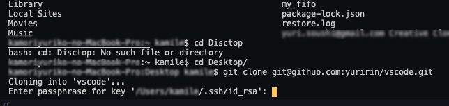

これで問題なければ、クローンできます！！

いくつかgitのコマンドをご紹介しておきます。

### 変更のあったものだけステージング
```
git add .
```

### コミット
```
git commit -m "ここにコメント"
```

### プッシュ

```
git push --set-upstream origin <ブランチ名>
```
2回目以降オプションは不要。
```
push
```

## まとめ：VS Codeをもっともっと快適に使おう！！
今回はスニペットの作り方、Git連携、ターミナルの使い方をご紹介させていただきました。

あくまでVS Codeの使い方にフォーカスしてますので、Gitの細かいコマンドなどは触れていません。

前回同様、クソ長い記事になってしまいましたがぜひ目次を利用して必要な項目だけ見てもらえると幸いです。

最後までお読みいただきありがとうございました。

## おまけ：VS Codeお悩み別使い方

第1弾ではショートカット一覧を掲載したのでシチュエーションやお悩み別の使い方を掲載しておきます。

### サイドバーが邪魔
Cmd+Bでサイドバーを閉じます。開きたい時は同じくCmd+B。

### 開いているファイルが多すぎて邪魔

ショートカットCmd+K+Cmd+Wですべて閉じて、開きたいファイルだけクイックオープン（Cmd+P）からファイル名を入力して開きます。

### ファイル名は分かっているけど、ファイルとディレクトリが膨大でエクスプローラーから探すのは辛い

クイックオープンを使いましょう。「Cmd+P」でワークスペース内のファイルを素早く探すことができます。

ファイル名を入力するだけです。

### headerのここ書き換えたいんだけど、どこやっけ？
タグの位置は分かってるけどコードが長くてカオス。

そんな時はエクスプローラーの中のアウトラインからHTMLやCSSのツリー構造から移動するのが早いかも！

エクスプローラーの中のアウトラインを使うと*HTML、CSS、SCSSのアウトライン（構造）が一目瞭然の機能*です。クラスやIdも一緒に記載されているので場所を判別しやすいです。

### 現在開いているファイルの任意の行にところに移動したい
ミニマップか、クイックオープンを使います。

* クイックオープン：Cmd+Pと入力後、:行数
* ミニマップ：大体ここくらいかなって位置を選んで移動

### エラーの場所を探したい

* ミニマップ:現在のファイルのエラーを修正したい。マップ上に赤い線が入るのでファイル上どのくらいエラーを吐いてるのかもわかる（たまに気分も萎える）。
* アウトライン:現在のファイルのエラーを教えてくれる。エラー個所に素早く移動できる。
* 問題：全体のエラーを教えてくれる。エラー個所に素早く移動できる。

エラーをチェックする時は問題を開いておくと○。ショートカット「Cmd+Shift+M」です。
