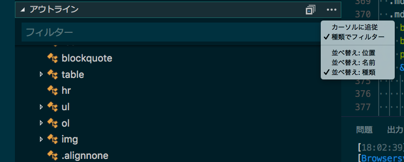
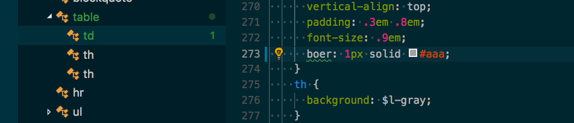
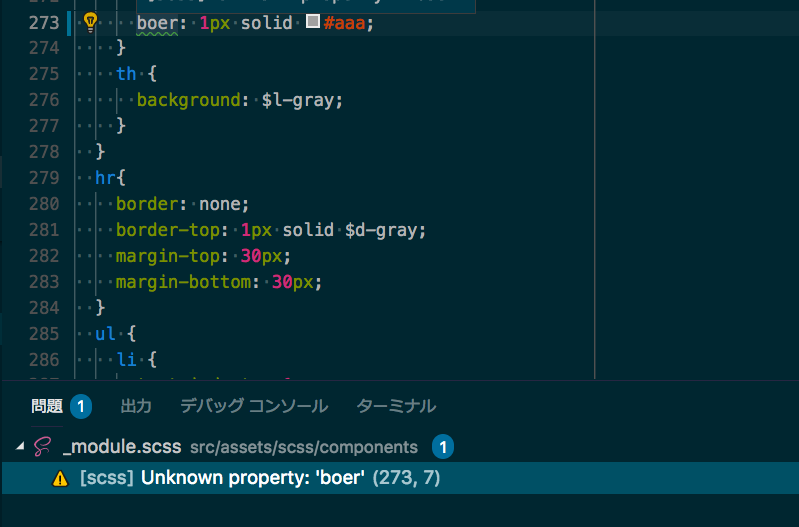

## まずは VS Code をダウンロード
Macで話を進めていきます。ショートカットが多少違うかも知れませんがご了承ください。

VS Code は以下からダウンロードします。

[VS Code](https://www.microsoft.com/ja-jp/dev/products/code-vs.aspx)

拡張機能を入れて日本語化します。最近アップデートしました。1.25.1になったら日本語化が必要みたいです。でもまたそのうちなくなるかも。

[Japanese Language Pack for Visual Studio Code](https://marketplace.visualstudio.com/items?itemName=MS-CEINTL.vscode-language-pack-ja)

ローカライズしたら、再起動しましょう。


## ユーザー設定
cmd + ,（カンマ）でユーザー設定を開きます。Json形式で記述して行きます。

```

"editor.formatOnPaste": true,
// ペースト時に自動でフォーマット
"editor.formatOnSave": true,
// ファイル保存時に自動でフォーマット
"editor.formatOnType": true,
// 入力した行を自動でフォーマット
"editor.minimap.renderCharacters": false,
// ミニマップの表示文字をブロックに変更
"editor.minimap.showSlider": "always",
// 表示領域をミニマップで常にハイライト
"editor.multiCursorModifier": "ctrlCmd",
// マウスでの複数選択時の修飾キーを変更
"editor.renderControlCharacters": true,
// 制御文字を表示
"editor.renderWhitespace": "all",
// 半角スペースを常に表示
"editor.snippetSuggestions": "top",
// Emmet などのスニペット候補を優先して表示
"editor.tabSize": 2,
// タブのサイズ変更
"editor.wordWrap": "on",
// エディターの幅で折り返し
"editor.wrappingColumn": 80,
//エディターで次の行に折り返される文字数を制御
"emmet.showSuggestionsAsSnippets": true,
// Emmet の候補を表示"emmet.triggerExpansionOnTab": true,
// TAB キーで Emmet を展開できるようにする
"emmet.variables": {
      // Emmet で展開される HTML の言語を変更
    "lang": "ja"
},
"explorer.confirmDelete": false,
// ファイル削除時の確認を表示しない
"files.insertFinalNewline": true,
// ファイルの保存時に末尾を改行
"files.trimFinalNewlines": true,
// ファイルの保存時に最終行以降をトリミング
"files.trimTrailingWhitespace": true,
// ファイルの保存時に行末の空白をトリミング
"html.format.contentUnformatted": "pre, code, textarea, title, h1, h2, h3, h4, h5, h6, p",
// タグ内の記述はフォーマットしない
"html.format.extraLiners": "",
// head, body, /html タグの前に改行を入れない
"html.format.unformatted": null,
// フレージング・コンテンツ（旧インライン要素のようなタグ）はフォーマットしない
"html.format.wrapLineLength": 0,
// 行の文字数制限を無くし自動で改行させない
"window.title": "${activeEditorMedium}${separator}${rootName}",
// ウインドウ上部に表示する文字列の設定
"workbench.editor.labelFormat": "short",
// タブに表示する文字列の設定
"workbench.editor.tabSizing": "shrink",
// タブの表示設定"workbench.startupEditor": "none",
// Welcome Page を表示しない
"editor.rulers": [  50,  100],
"auto-close-tag.SublimeText3Mode": true,
// </で閉じタグ追加"editor.folding": false,
//折りたたみ機能を使用しない
```

## インストールしておきたい拡張機能
楽しくミスを減らしてコーディングできる拡張機能をご紹介します。

|拡張機能名|説明|
|-|-|
|vscode-icons|ファイル類にアイコンを表示します。アイコンが表示できる仕組みは拡張子やファイル名から判断しているようです。pugファイルが並ぶとわんこのパグだらけになって超カワイイです。<br>インストールしたら左下歯車マークをクリックしてファイルアイコンのテーマをvscode-iconに変更しましょう。|
|filesize|各ファイルサイズが分かって何気に便利です。フォルダ単位でだとなおいい気はしますが、難しいですね。。|
|Path Intellisense|パスのインテリセンスを有効になります。|
|Trailing Spaces|前後の余分な空白を見つけてくれます。|
|zenkaku|全角スペースがハイライトします。うっかり全角のせいで動かないこともあるので、コーダー初心者には必須です。|
|Live Server|gulpいらずでBrowserSyncできます。ちょっと確認したいとき、いちいち環境作るのも面倒なのでとても便利です。ポート番号をプロジェクトごとに変えておくと、いくつかのプロジェクトを同時に起動できます。<br>ソースをおくフォルダがごちゃごちゃにならないようにルートディレクトリを作っておくといいです。私の場合開発者ツールでよくデバッグするので、起動ブラウザは主にChromeを使います。|
|Live Server|gulpいらずでBrowserSyncできます。ちょっと確認したいとき、いちいち環境作るのも面倒なのでとても便利です。ポート番号をプロジェクトごとに変えておくと、いくつかのプロジェクトを同時に起動できます。ソースをおくフォルダがごちゃごちゃにならないようにルートディレクトリを作っておくといいです。|
|Live Sass Compiler|SCSSをコンパイルできます。|
### Live Sass Compilerカスタマイズ方法
Live Sass Compilerカスタマイズ方法です。<br>私の場合開発者ツールでよくデバッグするので、起動ブラウザは主にChromeを使います。

```
"liveServer.settings.port": 4500,//ポート番号"
liveServer.settings.root": "/src",//ルートディレクトリ
"liveServer.settings.CustomBrowser" : "chrome",//使用するブラウザ
```

同じLAN内ならPCのIP+port番号で接続可能です。
PCのIPアドレスはMACであればシステム環境 > ネットワークで調べることができます。もちろん設定も変更可能です。

### Live Sass Compilerカスタマイズ方法
圧縮方法やファイルの置き場所等変えたいときはcmd + ,(カンマ)でユーザー設定ファイルを開き以下のように追記します。
プロジェクトごとに変えたいときは.vscode内のsetting.jsonに記述します。
ファイルの圧縮指定をcompressedにするときはミニファイしたファイルとわかりやすいよう.min.cssという感じのファイル名にしてあげるといいと思います。


```
"liveSassCompile.settings.formats": [
    {
        "format": "compressed", //expanded, compact, compressed, nested デフォはexpanded
        "extensionName": ".min.css", //ファイル名
        "savePath": "~/../css/" //ファイル名
    }
]
```

オートプレフィクサーをつけたいときは以下のようにセットします。

```
"liveSassCompile.settings.autoprefix": [
    "> 1%",
    "last 2 versions"
]
```

ブラウザの指定は[こちら](https://github.com/browserslist/browserslist)を参考に。

```
"liveSassCompile.settings.formats": [
    {
        "format": "compressed",//expanded, compact, compressed, nested デフォはexpanded
        "extensionName": ".min.css",//ファイル名
        "savePath": "~/../css/"//ファイル名
    }
]
```

mapを作りたくないときは以下をセットします。

```
"liveSassCompile.settings.generateMap":false
```

mapファイルは中身を見たところでなんてことないので隠しちゃいましょう。、以下のコードを追記して見えないようにセット。


```
"files.exclude": { // エクスプローラーから非表示にするファイル
    "**/*.map": true
}
```
## Emmetでコーディングしてみる
さて、環境は整いました。早速コーディングしてみましょう。
srcディレクトリを作成し、その中に以下のようにディレクトリ、ファイル類をセットしましょう。
```
src/
  ┣ index.html
  ┗ assets/
      ┗ scss/
         ┣ style.scss
         ┗ components/
            ┣ _mixin.scss
            ┣ _base.scss
            ┣ _layout.scss
            ┗ _module.scss

```

SCSSの便利なところはファイルを小分けにして管理できるところです。style.scssにリセットcssのコードを入れてみましょう。<br>
以下ファイルをコピペします。普通にコンパイルするとライセンス関連のコメントが削除されてしまうので、一行目の`/*`を`/*!`に書き換えます。

[http://yui.yahooapis.com/3.18.1/build/cssreset/cssreset-min.css](http://yui.yahooapis.com/3.18.1/build/cssreset/cssreset-min.css)

style.scssに以下のように記述して_base.scssを読み込みます。

```
@import "components/base";
```
次にGo LiveをクリックしてLive Serverを起動しましょう。

VS codeは最初からEmmetが使用できます。Emmetはhtml,CSS,SCSSを短いアルファベットを打つだけでタグなどを展開してくれる便利なものです。

なので、Emmetを覚えるとコーディングがグンと早くなります。

[Emmetチートシート](https://docs.emmet.io/cheat-sheet/)

早速htmlを展開してみます。

`!` を入力した後に tab ボタンを押すだけです。

```
<nav class="l-globalNav">
  <ul class="container">
    <li><a href="/">HOME</a></li>
    <li><a href="/about.html">ABOUT</a></li>
    <li><a href="/information.html">INFORMATION</a></li>
    <li><a href="/contact.html">CONTACT</a></li>
  </ul>
</nav>
```
展開したらtabで移動しながらメニュー名とリンク先を追記していきます。

### 基本スタイルを設定する
_mixin.scssにサイトの基本スタイル設定をしておくと使い回しができます。

```
$font-family:"游ゴシック体",YuGothic,"Yu Gothic","ヒラギノ角ゴ ProN W3","Hiragino Kaku Gothic ProN","メイリオ",Meiryo,Helvetica,sans-serif;//ベースのフォント$font-color: #333;$breakpoint: 768px;$font-size: 1.6rem;$line-height: 1.8;
```

### スニペットを作成してみる
メディアクエリのスニペットを作っておくと便利です。

左下歯車マークをクリックし、ユーザースニペット > scss.jsonを編集します。

今回は可読性や管理の便利さを優先して、設定ごとにメディアクエリをのスニペットを作ります。

SCSSファイルでpcと入力したら、スニペットを呼び出すことができます。

$はエスケープが必要なので\\（バックスラッシュ2こ）を頭につけます。

bodyの中が出力されるスニペットです。,で改行が入ります。
```
"pc mq": {
  "prefix": "pc",
  "body": [
    "@media only screen and (min-width:\\\\$breakpoint) {",
  　" $1",
  　"}//pc",
  ],　
　"description": "PC MediaQuery"
}
```

gulpで環境を作ればmediaqueryをモジュールでまとめることができますが、今回は初心者コーダー向けということで割愛します。
### _base.scss内に基本のスタイルを追加してみる
基本のスタイルを_base.scss内に書いておきます。

游ゴシック体はIEで何故か表示がズレるバグがあるので、メイリオに読み替えてあげると安心です。

```
html{
  font-size: 62.5%;
  font-family: $font-family;
  color: $font-color;
}
body{
  font-size: $font-size;
  line-height: $line-height;
  -webkit-text-size-adjust: 100%;
}
//IEハック
 11_:-ms-fullscreen, :root html {
  font-family: "メイリオ", Meiryo, Helvetica, sans-serif\\9;
}
```

### Webフォントを追加する
GoogleのWebフォントを追加してみましょう。

head内にスタイルシートを読み込みます。

```
<link rel="stylesheet" href="https://fonts.googleapis.com/css?family=Oswald:700">
```

再利用できるようにmixinを作ります。_mixin.scssに追記しましょう。

```
@mixin font-oswald{
  font-family: 'Oswald', sans-serif;  letter-spacing: .2em;
}
```

### _module.scssに使いまわせるスタイルを設定する
使いまわせる、.containerというクラスを作ります。

```
.container{
  padding-left: 15px;
  padding-right: 15px;
  max-width: 1030px;
  margin-left: auto;
  margin-right: auto;

  @media only screen and (min-width:$breakpoint) {
    padding-left: 30px;    padding-right: 30px;
  }//pc
}
```

## ヘッダーをスタイリングをする
_layout.scssに以下のコードを追加しましょう。

```
.l-header{
  background: $font-color;

  &_logo{
    text-align: center;
    @include font-oswald;//Webフォントを呼び出す
    font-size: 2.6rem;
    color: #ffffff;
    padding-top: 15px;
    padding-bottom: 15px;
  }

  @media only screen and (min-width:$breakpoint) {
    adding-top: 30px;
    padding-bottom: 30px;

    &_logo{
      font-size: 3rem;
    }
  }//pc
}
//.l-header
```

## グローバルナビゲーションをスタイリングをする

```
.l-globalNav{
  box-shadow: 0 2px 2px rgba(0,0,0,.2);

  a{
    font-size: 1.8rem;
    text-align: center;
    display: block;
    color: $font-color;
    text-decoration: none;
    @include font-oswald;
    padding: 15px;
  }

  @media only screen and (min-width:$breakpoint) {
    ul{
      display: flex;
      justify-content: space-between;
    }

    li{
      flex: 1;
    }

    a{
      transition: .3s;

      &:hover{
        color: #b50202;
      }
    }
  }//pc
}//.l-globalNav
```

## アウトラインを活用しよう
アウトラインとは**HTML、CSS、SCSSのアウトライン（構造）が一目瞭然の機能**です。

こちらはエクスプローラー（ファイル類）メニューでSCSSファイルを選択した状態です。下の方にアウトラインというメニューがあるのでクリックすると展開して以下のように構造を表示してくれます。

構造は多いので探すのが大変な場合は右3点ポッチのメニューから並べ替えたり、フィルタリングして変更かけたいところにジャンプできます。


記述にエラーがあると、以下のような表示になるので、その項目をクリックして修正しに行くこともできます。



## 「問題」をチェックしてエラー回避
「問題」という機能も便利です。アウトラインと同じようにミスがあると、教えてくれます。
クリックすると問題のあるファイルのエラー箇所にジャンプしてくれます。cmd + shift + Mで表示されます。

_module.scss、行237の7こめそんなプロパティないよって教えてくれます。



そのほか、間違えて全角空白が入っていたり、割と気づきにくいSCSSのムダにできてしまったコンパイルも、探し出してくれるので重宝しています。

## まとめ：VS Code の拡張機能だけで時短！
今回はヘッダーとグローバルナヴを簡易的にコーディングしてみました。VS Code でコーディングするためには多少のカスタマイズは必要と思いますが敷居は低いと思います。SCSS、Emmet、Live Server を使えば初心者の方でもかなり手早くコーディングできると思います。ぜひ、お試しあれ。
