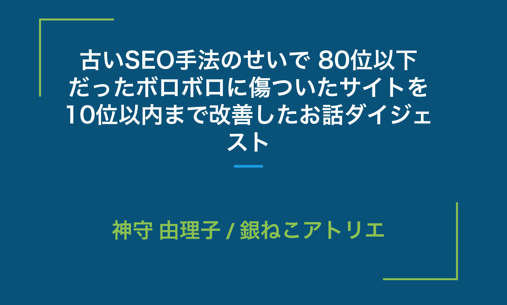

## Web Touch Meeting（ウェブタッチミーチング） とは？
通称 WTM / ウェブタッチミーティングは、Web周りの知識をみんなでシェアしようと iai の藤本さんが始めたIT系勉強会です。
Webの触り部分を勉強するということで、
最初は**Webお触り会議**という衝撃的な名前でした。

おさわり。。。

一昨年、100回をめどに一旦区切りをつけました。

[Web Touch Meeting（ウェブタッチミーチング）](http://www.webtouchmeeting.com/)

## 約束、如法さんのオープニングアクト
ハイパーメディアトランスレーターのNyoho氏によるオープニングアクトから始まりました^_^ 
私は残念なことに間に合いませんでしたが、きっとみんなが釘付けになったに違いない。

[オープニングアクト](https://www.youtube.com/watch?v=jg4rGiYqOks&fbclid=IwAR1aamp3UrMOIF5w4no3yAyc_BXuevBhpJvacEApewjqoLgKKoTT4NRaGhY)

ショートカットぶち早い！

## せっかく参加するので、LTさせていただきました
せっかく参加するのでSEOについてLTさせてもらいました。
去年、**古いSEO手法のせいで80位まで落ちてえらいこっちゃになっているサイトを10位まで蘇らせたお話**を、駆け足でさせていただきました。

毎回のことながらLTなのに自己紹介の前置きが長いと言われます。

まったく気にしてませんけどね。

所属する会社に言われるわけでもなく、私が喋りたいことを喋り倒させていただきました。思いの外ご好評いただき恐悦至極でございます。

**被リンク、絶対買っちゃダメ**

スライドはこちらでーす。

[古いSEO手法のせいで 80位以下 だったボロボロに傷ついたサイトを 10位以内まで改善したお話ダイジェスト](https://docs.google.com/presentation/d/1KSNcIhEt68LKyP2nrcxOGFMyWlsuyhC9hjJzV9ZTQzA/edit?usp=sharing)

ちなみにアンケートの結果、面白かったLTでは3位、興味深かったLTでは1位でした。

うぇーい！私大人気じゃ！

## Adobe XDのセッション
XDはベータ版からうれげに使っていたアプリケーションで最近 XD の使いすぎで、イラレのショートカットも忘れております。

如法さんの動画見なきゃー！笑

[オープニングアクト](https://www.youtube.com/watch?v=jg4rGiYqOks&fbclid=IwAR1aamp3UrMOIF5w4no3yAyc_BXuevBhpJvacEApewjqoLgKKoTT4NRaGhY)

私は指示書も、ワイヤーもXDで作ります。 
なんならワードやエクセルで作るべき資料も XD です。 
デザインカンプが XD で来たときは手放しで喜んでます。うぇーい。

### Adobe XD超入門！XDを導入すべきメリットと基本機能をご紹介』株式会社MIRAI マスベサチさん
基本的な操作や使い方をご紹介いただきました。デモを挟みながら、ホント分かり易かったです！

フォトショのカンプは重いんじゃ。ホントやになります。 
ディレクターも XD 、デザイナーも XD で良いと思います。 
なんなら PTA や学校の配り物も XD で作れば良いと思います！ 
これで XD ユーザーが増えると良いな。

### 『UI/UXデザインを変えるAdobe XDの誕生から今後の進化まで』アドビ システムズ 株式会社 轟啓介さん
**軽い（早い）は正義！**

サイトも、ソフトも、人間も軽いに越したことはありません！
進化の速さとかどんどん便利になって私もアップデートが楽しみです。
私個人としては趣味で一個プラグイン作ってみたいと思います。
轟さんのセッション仕込みも多くてとても楽しかったです。

### XD ユーザーグループ、広島でも作るよ！
懇親会で酔った勢い笑？でユーザーグループ作ろうやって話になりました。
私はエンジニアだし、デザインのことは若いもんにまかせようと思います。

最初の勉強会がいつ開かれるか、楽しみですね！
わーい、わーい。

## さいごに、藤本さんへのお願い
1年経って思いましたが、WTMはやっぱり**広島のIT・Web業界発展発展のために必要**です。

いろんなジャンルの人と出会えるし、私もWTMで何人もの人に出会い、お世話になりました。

余談ですが、今回も8年ぶりくらいに会う職業訓練校で一緒だった人に会えました。
まだ、web 業界で働くことを諦めず、また勉強しているとのことでした。
漠然としてますが、この勉強会に参加している人は、みんなある意味同じ方向向いてるなって思います。

ということでせめて、年4でいいので、WTM続けてください！
お願いしまーす！
