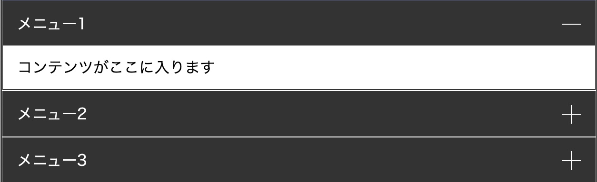
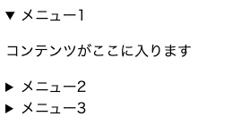

## CSSだけで実装する理由
メリットはJSのDOM操作よりCSSアニメーションの方が軽いということです。


一方デメリットとしてははCSSが複雑かつコードが長くなり初学者は混乱しやすいです。

「details&summaryを使う方法」「label&inputを使う方法」「JSも使って実装する方法」の3種類を紹介しますが、すべて一長一短あります。

|種類|メリット|デメリット|
|-|-|-|
|*details&summary*|WAI-ARIAなどのアクセシビリティへの配慮が不要|IE未対応。safariのバグあり|
|*label&input*|手軽でJS不要。ブラウザをあまり考慮する必要がない（IEすら動く）|アクセシビリティに関して不適切|
|*JS*|WAI-ARIAなどの記述や値の動的変更が可能。ブラウザをあまり考慮する必要がない|学習コストが上がる。少し挙動が重くなる可能性あり|


## detailsとsummaryタグを使う方法（2021-01-05追記）
`details`と`summary`タグ（詳細折りたたみ要素）を使えば、アニメーションの滑らかさにはかけますが、CSSすら使わずにアコーディオンを実装できます。

セマンティック（タグに意味を持たせる）コーディングという観点からもこちらのタグを使うのが良さそうですが問題もあります。

<msg txt="Safariはバグだらけ対応が大変。複雑なアニメーションは避けたほうがよさそう。"></msg>

* detailsタグ内ではtransformのanimationやtransition系はちゃんと発動しない。animationは最初の1回だけしか動かなかった。
* flexが効かない

こんなアイコンつけたかったけど諦めました。



```html:title=HTML
<details>
  <summary>メニュー1</summary>
  <div>
    <p>コンテンツがここに入ります</p>
  </div>
 </details>
 <details>
   <summary>メニュー2</summary>
  <div>
    <p>コンテンツがここに入ります</p>
  </div>
 </details>
 <details>
   <summary>メニュー3</summary>
  <div>
    <p>コンテンツがここに入ります</p>
  </div>
</details>
```

`details`タグ内の`summary`以降のコンテンツは開閉対象になってしまうので、アコーディオンしたいコンテンツごとに`detail`タグでラップする必要があります。


最初から開いておきたい場合は`open`属性を付与します。

```html:title=HTML
<details open>
  <summary>メニュー3</summary>
  <p>コンテンツがここに入ります</p>
</details>
```
デフォルトの~~ダサい~~アイコンを消したい時は、summaryのCSSを以下のようにセットしておきます。
```scss:title=SCSS
summary {
  list-style: none;
}

summary {::-webkit-details-marker {
  display: none;
}
```


実際にアニメーションを入れます。今回はheightを指定して入れてみました。

`diplay:flex`も効かないので縦方向は`line-height`で真ん中に持ってきてます。

```scss:title=CSS
* {
  box-sizing: border-box;
}

details {
  transition: 0.5s;
  height: 51px;
  margin-bottom: 1px;
  border: 1px solid #333;
  overflow: hidden;
}
details:last-child {
  margin-bottom: 0;
}
details[open] {
  height: 100px;
}
details summary {
  height: 50px;
  line-height: 50px;
  align-items: center;
  list-style: none;
  padding: 0 15px;
  background: #333;
  color: #fff;
  position: relative;
}
details summary::-webkit-details-marker {
  display: none;
}
details div {
  padding: 0 15px;
}
details div p {
  height: 50px;
  line-height: 50px;
}
```
[デモ：detailsとsummaryタグを使う方法](https://codepen.io/camile/pen/vYejpvw)

<div class="box">
<h4>detailsとsummaryの実用はもうちょい先かも</h4>
<p>セマンティックの観点からよさそうと思ったのですがSafariのバグが想像以上に多くて、複雑なデザインで使いたい時は他のタグを使ったほうがよさそうです。</p>
</div>

## labelとinputタグを使う旧方法（IEでも動きます）
セマンティックの観点からは非推奨ですが、手軽さで言えば一番いいかもしれません。

まずは開閉ボタンを実装しましょう！<br>
タグにオンオフ（`:checked`）の状態があるタグ・チェックボックスもしくはラジオボタンを利用します。

開閉ボタンの状態が`checked`の場合はメニューが開き、それ以外は閉じている状態を作ります。

チェックボックス、ラジオボタンは自己終了タグなので中に文字列などのコンテンツを持つことができませんので、label要素を使います。

**inputのid属性とlabelのfor属性の値が同じ**であればlabelをクリックするだけで対である**チェックボックス、ラジオボタンのcheckedの状態を操作できます**。

チェックボックス、ラジオボタン`はdisplay: none`で隠しちゃいます。


この時点ではスライドアップとダウンのアニメーションの実装はまだしません。

### パターン1、開閉させるトリガーをチェックボックスに持たせる
ポイントはチェックボックスの状態によって（checkedかそうじゃないか）、次の次のタグである要素の状態が変わるように操作します。

`input[type=checkbox]:checked + label + div { display: block; }`


すべてのコードは以下のような感じです。
```html:title=HTML
<input type="checkbox" id="menu1">
<label for="menu1">メニュー1</label>
<div>
  <p>コンテンツがここに入ります</p>
</div>
<input type="checkbox" id="menu2">
<label for="menu2">メニュー2</label>
<div>
    <p>コンテンツがここに入ります</p>
</div>
<input type="checkbox" id="menu3">
<label for="menu3">メニュー3</label>
<div>
  <p>コンテンツがここに入ります</p>
</div>
```

```css:title=CSS
input[type=checkbox] {
  display: none;
}

label {
  display: block;
  padding: 15px;
  background: #333;
  color: #fff;
  border-top: 1px solid #fff;
}

div {
  border: 1px solid #333;
  border-top: none;
  display: none;
  box-sizing: border-box;
}

p {
 margin: 0;
 padding: 15px;
}

input[type=checkbox]:checked + label + div {
  display: block;
}
```
[デモ：開閉させるトリガーをチェックボックスに持たせる](https://codepen.io/camile/pen/rNLKQeb)

### パターン2、開閉させるトリガーをラジオボタンに持たせる
アコーディオンにname属性を利用すれば、1つのメニューが開いてる時は他のメニューを強制的に閉じさせる実装もできます。


```css:title=HTML
<input type="radio" name="accordion" id="menu1">
<label for="menu1">メニュー1</label>
<div>
  <p>コンテンツがここに入ります</p>
</div>
<input type="radio" name="accordion" id="menu2">
<label for="menu2">メニュー2</label>
<div>
  <p>コンテンツがここに入ります</p>
</div>
<input type="radio" name="accordion" id="menu3">
<label for="menu3">メニュー3</label>
<div>
  <p>コンテンツがここに入ります</p>
</div>
```

```css:title=CSS
body {
  margin: 50px auto;
  width: 800px;
}

input[type=radio] {
  display: none;
}

label {
  display: block;
  padding: 15px;
  background: #333;
  color: #fff;
  border-top: 1px solid #fff;
  border-bottom: 0;
}

div {
  border: 1px solid #333;
  border-top: none;
  display: none;
}

p {
  margin: 0;
  padding: 15px;
}

input[type=radio]:checked + label + div {
  display: block;
}
```

[デモ：開閉させるトリガーをラジオボタンに持たせる](https://codepen.io/camile/pen/eYzKQga)

### スライドアップ&ダウンのCSSアニメーションの実装
アニメーションの実装にはプロパティ`transition`を使います。デフォルトの状態のセレクターにのみ設定しておけばOKです。
今回は、イージングなどはデフォルトのままで秒数のみ設定しました。

アニメーションさせるのは「高さ」なので、プロパティは`height`もしくは`max-height`を使います。

#### パターン1、アコーディオンするアイテムの高さが決まっている場合
アイテムの高さが決まっているときはプロパティ`height`を使いましょう。
この場合は自然で滑らかなアコーディオンが実装できます。


閉じた状態の時は高さを0にし、はみ出した部分は`overflow:hidden`で調整します。アニメーションはおよそ500ミリ秒。私はコードを少しでも短くするために単位をs（秒）にして0省略.（ピリオド）で記述することが多いです。

`transition: .5s;`

こんなこともチリツモです。

```css:title=閉じた状態のCSS
div {
  overflow: hidden;
  height: 0;
  transition: .5s;
}
```
```css:title=開いた状態のCSS
input[type=checkbox]:checked + label + div {
  display: block;
  height: 50px;
}
```

すべてコードをかくとこんな感じになります。

```html:title=HTML
<input type="checkbox" id="menu1">
<label for="menu1">メニュー1</label>
<div>
  <p>コンテンツがここに入ります</p>
</div>
<input type="checkbox" id="menu2">
<label for="menu2">メニュー2</label>
<div>
  <p>コンテンツがここに入ります</p>
</div>
<input type="checkbox" id="menu3">
<label for="menu3">メニュー3</label>
<div>
  <p>コンテンツがここに入ります</p>
</div>
```

```css:title=CSS
input[type=checkbox] {
  display: none;
}

label {
  display: block;
  padding: 15px;
  background: #333;
  color: #fff;
  border-top: 1px solid #fff;
}

div {
  border: 1px solid #333;
  border-top: none;
  box-sizing: border-box;
  overflow: hidden;
  max-height: 0;
  transition: 2s;
}

p {
  margin: 0;
  padding: 15px;
}

input[type=checkbox]:checked + label + div {
  display: block;
  max-height: 100vh;
}
```

[デモ：アコーディオンするアイテムの高さが決まっている場合](https://codepen.io/camile/pen/eYzKQeq)

#### パターン2、アコーディオンするアイテムの高さが決まっていない場合
アイテム内のコンテンツが多い時はディバイスによってもになりますが、高さがまちまちになります。

`height: 0` に対して`height: auto`でアニメーションを設定しようとした場合、スライドする範囲をブラウザ側で計算できないためアニメーションはしません。

なので、こんな場合は`max-height`を使います。

原理はパターン1と変わりませんので説明は割愛します。

残念な点が一つあります。
GIFアニメの通りスライドアップするとき変な間ができて不自然になること。

コンテンツが収まる高さが不明でも最大値は設定しておかないとアニメーションしません。

なので`max-height`の最大値を`100vh`や`9999px`などの絶対にコンテンツが収まるサイズに設定しておく必要があるからです。


```html:title=HTML
<input type="checkbox" id="menu1">
<label for="menu1">メニュー1</label>
<div>
  <p>コンテンツがここに入ります</p>
</div>
<input type="checkbox" id="menu2">
<label for="menu2">メニュー2</label>
<div>
  <p>コンテンツがここに入りますコンテンツがここに入りますコンテンツがここに入りますコンテンツがここに入りますコンテンツがここに入りますコンテンツがここに入りますコンテンツがここに入ります</p>
</div>
<input type="checkbox" id="menu3">
<label for="menu3">メニュー3</label>
<div>
  <p>コンテンツがここに入りますコンテンツがここに入りますコンテンツがここに入りますコンテンツがここに入りますコンテンツがここに入りますコンテンツがここに入りますコンテンツがここに入りますコンテンツがここに入りますコンテンツがここに入りますコンテンツがここに入ります</p>
</div>
```

```css:title=CSS
body {
  width: 800px;
  margin: 50px auto;
}

input[type=checkbox] {
  display: none;
}

label {
  display: block;
  padding: 15px;
  background: #333;
  color: #fff;
  border-top: 1px solid #fff;
}

div {
  border: 1px solid #333;
  border-top: none;
  box-sizing: border-box;
  overflow: hidden;
  max-height: 0;
  transition: 2s;
}

p {
  margin: 0;
  padding: 15px;
}

input[type=checkbox]:checked + label + div {
  display: block;
  max-height: 100vh;
}
```
[デモ：アコーディオンするアイテムの高さが決まっている場合](https://codepen.io/camile/pen/JjKZeZK)

## JavaScriptも利用してアクセシビリティも考慮しつつリッチにアコーディオンメニューを実装（2021-01-05編集）
今のところ、個人的にはJSとCSSを組み合わせるのが一番いい気がします。**WAI-ARIA**対応もしてアクセシビリティもいい感じです。

**開閉のトリガーはJSに委ねて、アニメーションはCSSに任せるのが良い**と思っています。

そして自然なスライドアップとダウンをさせるためには要素の`height`の取得が不可欠です。

初期状態では要素は開いた状態にしておき、開閉する要素の高さを`js`で0にしておきます。

クリックしたらインラインスタイルで`height`を追加し、アニメーションする仕組みになっています。


```html:title=HTML
<dl class="accordion">
  <dt class="accordion__menu js-toggle-btn" aria-expanded="false" role="button" aria-controls="content1">メニュー1</dt>
  <dd class="accordion__item" aria-hidden="true" id="content1"><p>ここにテキストが入りますここにテキストが入りますここにテキストが入りますここにテキストが入りますここにテキストが入りますここにテキストが入ります</p></dd>
  <dt class="accordion__menu js-toggle-btn" aria-expanded="false" role="button" aria-controls="content2">メニュー2</dt>
  <dd class="accordion__item" aria-hidden="true" id="content2"><p>ここにテキストが入りますここにテキストが入りますここにテキストが入りますここにテキストが入りますここにテキストが入りますここにテキストが入ります
    ここにテキストが入りますここにテキストが入りますここにテキストが入りますここにテキストが入りますここにテキストが入りますここにテキストが入ります</p></dd>
</dl>
```

```css:title=CSS
body {
  width: 800px;
  margin: 50px auto;
}

.accordion__item {
  padding-left: 0;
  margin-left: 0;
  border: 1px solid #333;
  border-top: none;
}

p {
  padding: 15px;
  margin: 0;
}

.accordion__menu {
  border-top: 1px solid #fff;
  padding: 15px;
  background: #333;
  color: #fff;
}

.accordion.active .accordion__item {
  height: 0;
  overflow: hidden;
  transition: .5s;
}

.accordion.active dd {
  height: 0;
  overflow: hidden;
  transition: .5s;
}
```
```js:title=JavaScript
// アコーディオンボタンのみ取得
const toggleBtns = document.querySelectorAll('.js-toggle-btn');
//heightを格納する配列
let height = [];
// ループ処理
toggleBtns.forEach((btn,i) => {
  // ボタンの次の開閉する要素
  const item = document.getElementById(btn.getAttribute('aria-controls'));
  height = [...height, item.clientHeight]
  // aria-expanded=falseだったら高さ0
  if(btn.getAttribute('aria-expanded') === "false"){
    item.setAttribute('style','height:0')
  } else {
    // 要素の高さ取得
    item.setAttribute('style',`height:${item.clientHeight}px`)
  }

  // クリックでアニメーション
  btn.addEventListener('click',()=>{
    if(btn.getAttribute('aria-expanded') === "false"){
      btn.ariaExpanded = "true"
      btn.ariaHidden = "false"
      item.setAttribute('style',`height:${height[i]}px`)
    } else {
      btn.ariaExpanded = "false"
      btn.ariaHidden = "true"
      item.setAttribute('style','height:0')
    }
  })
})

//リサイズ対応
let vw = window.innerWidth;
window.addEventListener('resize', () => {
  // Window幅が変わらなければ処理しない
  if (vw === window.innerWidth) {
    return;
  }
  //heightを格納していた配列を空に
  height = []
  //heightをセット直す
  toggleBtns.forEach((btn) => {
    const item = document.getElementById(btn.getAttribute('aria-controls'));
    const currentCss = item.getAttribute('style')
    //いったんスタイルを外しアニメーションを切る
    item.setAttribute('style',`transition:none`)
    //高さを格納し直す
    height = [...height, item.clientHeight]
    //スタイルを元に戻す
    item.setAttribute('style',(currentCss === 'height:0' ? currentCss : `height:${item.clientHeight}px`))
  })
})
```
[デモ：JavaScriptも利用してアクセシビリティも考慮しつつリッチにアコーディオンメニューを実装](https://codepen.io/camile/pen/abZjJoZ)

WAI-ARIAの取得はもちろん`setAttribute`でも記述できます。

```js
btn.ariaExpanded = "true"
↓↓↓
item.setAttribute('aria-expanded',"true")
```

このコードではアコーディオンメニューが複数ページにあってもお互い干渉し合うことなく動きます。

リサイズ対応してあるのでレスポンシブでも使えます。

## 今回使用した、CSS・JSのプロパティなど
今回使用したHTML・CSS・JSのプロパティなどを紹介します。

### HTML:role（WAI-ARIA）
アクセシビリティに関する属性です。`role="button"` を追加すると、要素はスクリーンリーダーにボタンコントロールとして表示されます。

```
role="button"
```

### HTML:ariaなんちゃら（WAI-ARIA）

aria-**にはプロパティ（Property）とステート（State）状態があり、状態によって変化するものをステート（State）と呼びます。通常、ステート（State）の変更はJavaScriptで制御します。

```html
<button type="button" aria-expanded="false" aria-controls="section1">開く</button>
<section id="section1" aria-hidden="true">
  コンテンツ
</section>
```
`aria-expanded`を**開閉コンテンツに付与するのは間違い**だそう。親タグか、トグルボタンに付与しましょう。

### CSS:「隣接セレクター」+（プラス）で隣合う要素に対してスタイルを指定
+（プラス）を使って、ある要素の次の要素のスタイルを設定できます。<br>
擬似要素（hover、checked）と合わせるとカンタンにアニメーションの実装ができるのでオススメ。

* **selectorA + selectorB**
* **selectorA:checked + selectorB**

### CSS:「兄弟セレクター」~（チルダ）で同列の要素に対してスタイルを指定
意外とよく使うのが ~ （チルダ）である要素と同列に並んだ特定の要素にスタイルを指定したい時に使います。

* **selectorA ~ selectorB**


### JS:前後要素の取得
便利です。よく使います。

* **nextElementSibling**　次にあるノードを取得
* **previousElementSibling**　前のノードを取得


### JS:forEach
今回は2引数利用して、取得したアイテムと、インデックスを取得し、変数menuHeightに配列として格納しました。

* **要素.forEach((item, index) => { ここに処理 })**

### JS:...（スプレッド構文）
配列を展開できます。
```js
let fruit = ['りんご','みかん','キャベツ']
fruit = [...fruit, 'おなす']
console.log(fruit)
['りんご', 'みかん', 'キャベツ', 'おなす']
```

## まとめ・CSSでアニメーションを軽量化してアコーディオンを増やそう！
いかがでしたか？

アコーディオンメニューはjQueryに頼らなくても、CSS3だけやJSを利用して軽量に作ることができます。

簡単なコードならライブラリに頼らないほうが軽量化できていい時もありますし、ライブラリに頼らず自ら書くことでCSSやJSの理解度も高まります。

正解はないので、まずは自由に実装してみてはいかがでしょうか？

この記事がみなさんのコーディングライフの一助となれば幸いです。<br>
最後までお読みいただきありがとうございました。
