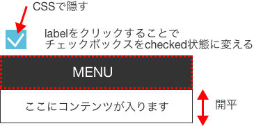
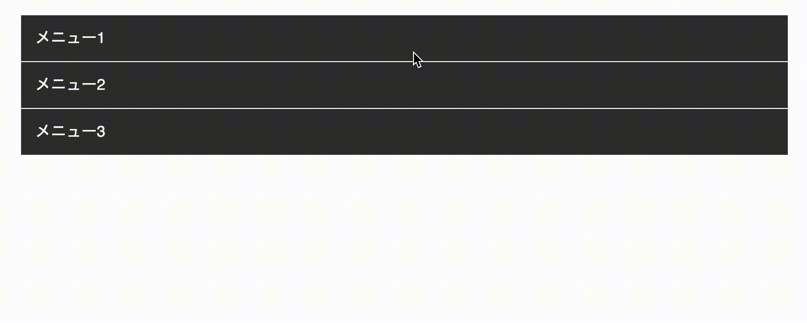
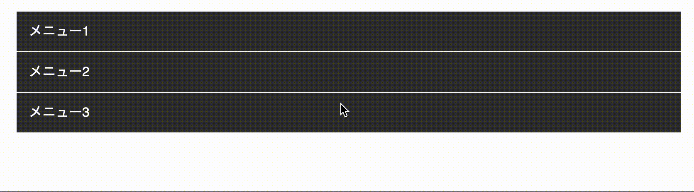
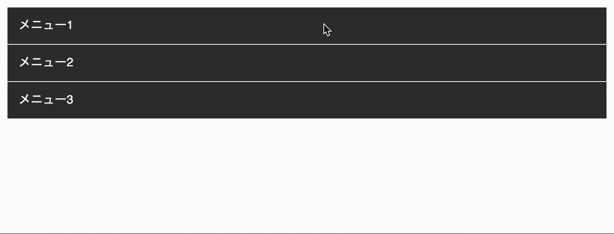
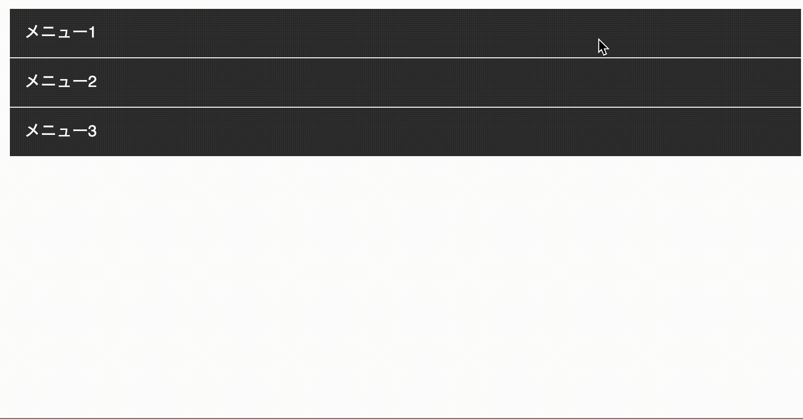

## CSS3アニメーションのみでアコーディオンメニューを実装
メリットはJSのDOM操作よりCSSアニメーションの方が軽いということです。


一方デメリットとしてははCSSが複雑かつコードが長くなり初学者は混乱しやすいです。

### クリックで開閉させる仕組みをCSSのみで実装する
まずは開閉ボタンを実装しましょう！<br>
タグにオンオフ（`:checked`）の状態があるタグ・チェックボックスもしくはラジオボタンを利用します。

開閉ボタンの状態が`checked`の場合はメニューが開き、それ以外は閉じている状態を作ります。

チェックボックス、ラジオボタンは自己終了タグなので中に文字列などのコンテンツを持つことができませんので、label要素を使います。

**inputのid属性とlabelのfor属性の値が同じ**であればlabelをクリックするだけで対である**チェックボックス、ラジオボタンのcheckedの状態を操作できます**。

チェックボックス、ラジオボタン`はdisplay: none`で隠しちゃいます。




この時点ではスライドアップとダウンのアニメーションの実装はまだしません。

#### パターン1、開閉させるトリガーをチェックボックスに持たせる
ポイントはチェックボックスの状態によって（checkedかそうじゃないか）、次の次のタグである要素の状態が変わるように操作します。

`input[type=checkbox]:checked + label + div { display: block; }`



すべてのコードは以下のような感じです。
```html
<!-- HTML -->
<input type="checkbox" id="menu1">
<label for="menu1">メニュー1</label>
<div>
 <p>コンテンツがここに入ります</p>
</div>
<input type="checkbox" id="menu2">
<label for="menu2">メニュー2</label>
<div>
  <p>コンテンツがここに入ります</p>
</div>
<input type="checkbox" id="menu3">
<label for="menu3">メニュー3</label>
<div>
  <p>コンテンツがここに入ります</p>
</div>
```

```css
// CSS
input[type=checkbox] {
  display: none;
}

label {
  display: block;
  padding: 15px;
  background: #333;
  color: #fff;
  border-top: 1px solid #fff;
}

div {
  border: 1px solid #333;
  border-top: none;
  display: none;
  box-sizing: border-box;
}

p {
 margin: 0;
 padding: 15px;
}

input[type=checkbox]:checked + label + div {
  display: block;
}
```
[デモ：開閉させるトリガーをチェックボックスに持たせる](https://codepen.io/camile/pen/rNLKQeb)

#### パターン2、開閉させるトリガーをラジオボタンに持たせる
アコーディオンにname属性を利用すれば、1つのメニューが開いてる時は他のメニューを強制的に閉じさせる実装もできます。



```html
<!-- HTML -->
<input type="radio" name="accordion" id="menu1">
<label for="menu1">メニュー1</label>
<div>
  <p>コンテンツがここに入ります</p>
</div>
<input type="radio" name="accordion" id="menu2">
<label for="menu2">メニュー2</label>
<div>
  <p>コンテンツがここに入ります</p>
</div>
<input type="radio" name="accordion" id="menu3">
<label for="menu3">メニュー3</label>
<div>
  <p>コンテンツがここに入ります</p>
</div>
```

```css
// CSS
body {
  margin: 50px auto;
  width: 800px;
}

input[type=radio] {
  display: none;
}

label {
  display: block;
  padding: 15px;
  background: #333;
  color: #fff;
  border-top: 1px solid #fff;
  border-bottom: 0;
}

div {
  border: 1px solid #333;
  border-top: none;
  display: none;
}

p {
  margin: 0;
  padding: 15px;
}

input[type=radio]:checked + label + div {
  display: block;
}
```

[デモ：開閉させるトリガーをラジオボタンに持たせる](https://codepen.io/camile/pen/eYzKQga)

### スライドアップ&ダウンのCSSアニメーションの実装
アニメーションの実装にはプロパティ`transition`を使います。デフォルトの状態のセレクターにのみ設定しておけばOKです。
今回は、イージングなどはデフォルトのままで秒数のみ設定しました。

アニメーションさせるのは「高さ」なので、プロパティは`height`もしくは`max-height`を使います。

#### パターン1、アコーディオンするアイテムの高さが決まっている場合
アイテムの高さが決まっているときはプロパティ`height`を使いましょう。
この場合は自然で滑らかなアコーディオンが実装できます。


閉じた状態の時は高さを0にし、はみ出した部分は`overflow:hidden`で調整します。アニメーションはおよそ500ミリ秒。私はコードを少しでも短くするために単位をs（秒）にして0省略.（ピリオド）で記述することが多いです。

`transition: .5s;`

こんなこともチリツモです。

**閉じた状態**

```css
div {
  overflow: hidden;
  height: 0;
  transition: .5s;
}
```
**開いた状態**
```css
input[type=checkbox]:checked + label + div {
  display: block;
  height: 50px;
}
```

すべてコードをかくとこんな感じになります。

```html
<!-- HTML -->
<input type="checkbox" id="menu1">
<label for="menu1">メニュー1</label>
<div>
  <p>コンテンツがここに入ります</p>
</div>
<input type="checkbox" id="menu2">
<label for="menu2">メニュー2</label>
<div>
  <p>コンテンツがここに入ります</p>
</div>
<input type="checkbox" id="menu3">
<label for="menu3">メニュー3</label>
<div>
  <p>コンテンツがここに入ります</p>
</div>
```

```css
// CSS
input[type=checkbox] {
  display: none;
}

label {
  display: block;
  padding: 15px;
  background: #333;
  color: #fff;
  border-top: 1px solid #fff;
}

div {
  border: 1px solid #333;
  border-top: none;
  box-sizing: border-box;
  overflow: hidden;
  max-height: 0;
  transition: 2s;
}

p {
  margin: 0;
  padding: 15px;
}

input[type=checkbox]:checked + label + div {
  display: block;
  max-height: 100vh;
}
```

[デモ：アコーディオンするアイテムの高さが決まっている場合](https://codepen.io/camile/pen/eYzKQeq)

#### パターン2、アコーディオンするアイテムの高さが決まっていない場合
アイテム内のコンテンツが多い時はディバイスによってもになりますが、高さがまちまちになります。

`height: 0` に対して`height: auto`でアニメーションを設定しようとした場合、スライドする範囲をブラウザ側で計算できないためアニメーションはしません。

なので、こんな場合は`max-height`を使います。

原理はパターン1と変わりませんので説明は割愛します。

残念な点が一つあります。
GIFアニメの通りスライドアップするとき変な間ができて不自然になること。

コンテンツが収まる高さが不明でも最大値は設定しておかないとアニメーションしません。

なので`max-height`の最大値を`100vh`や`9999px`などの絶対にコンテンツが収まるサイズに設定しておく必要があるからです。



```html
<input type="checkbox" id="menu1">
<label for="menu1">メニュー1</label>
<div>
  <p>コンテンツがここに入ります</p>
</div>
<input type="checkbox" id="menu2">
<label for="menu2">メニュー2</label>
<div>
  <p>コンテンツがここに入りますコンテンツがここに入りますコンテンツがここに入りますコンテンツがここに入りますコンテンツがここに入りますコンテンツがここに入りますコンテンツがここに入ります</p>
</div>
<input type="checkbox" id="menu3">
<label for="menu3">メニュー3</label>
<div>
  <p>コンテンツがここに入りますコンテンツがここに入りますコンテンツがここに入りますコンテンツがここに入りますコンテンツがここに入りますコンテンツがここに入りますコンテンツがここに入りますコンテンツがここに入りますコンテンツがここに入りますコンテンツがここに入ります</p>
</div>
```

```css
// CSS
body {
  width: 800px;
  margin: 50px auto;
}

input[type=checkbox] {
  display: none;
}

label {
  display: block;
  padding: 15px;
  background: #333;
  color: #fff;
  border-top: 1px solid #fff;
}

div {
  border: 1px solid #333;
  border-top: none;
  box-sizing: border-box;
  overflow: hidden;
  max-height: 0;
  transition: 2s;
}

p {
  margin: 0;
  padding: 15px;
}

input[type=checkbox]:checked + label + div {
  display: block;
  max-height: 100vh;
}
```
[デモ：アコーディオンするアイテムの高さが決まっている場合](https://codepen.io/camile/pen/JjKZeZK)

## JavaScriptも利用して不自然なタグを使わずカクツキなくリッチにアコーディオンメニューを実装
個人的には、**無理やりチェックボックスやラジオボタンで実装するのはキライ**です。タグの意味を考えると適切ではないからです。

**開閉のトリガーはJSに委ねて、アニメーションはCSSに任せるのが良い**かと。

そして自然なスライドアップとダウンをさせるためには要素の`height`の取得が不可欠です。

初期状態では要素は開いた状態にしておき、`height`を取得したらクラスactiveを付与し、開閉する要素の高さを0にしておきます。

メニューをクリックした時だけインラインスタイルで`height`を追加し、アニメーションする仕組みになっています。


**HTML**
```html
<dl class="accordion">
  <dt class="accordion__menu">メニュー1</dt>
  <dd class="accordion__item"><p>ここにテキストが入りますここにテキストが入りますここにテキストが入りますここにテキストが入りますここにテキストが入りますここにテキストが入ります</p></dd>
  <dt class="accordion__menu">メニュー2</dt>
  <dd class="accordion__item"><p>ここにテキストが入りますここにテキストが入りますここにテキストが入りますここにテキストが入りますここにテキストが入りますここにテキストが入ります
ここにテキストが入りますここにテキストが入りますここにテキストが入りますここにテキストが入りますここにテキストが入りますここにテキストが入ります</p></dd>
  <dt class="accordion__menu">メニュー3</dt>
  <dd class="accordion__item"><p>ここにテキストが入りますここにテキストが入りますここにテキストが入りますここにテキストが入りますここにテキストが入りますここにテキストが入ります</p></dd>
</dl>
```
**CSS**
```css
body {
  width: 800px;
  margin: 50px auto;
}

.accordion__item {
  padding-left: 0;
  margin-left: 0;
  border: 1px solid #333;
  border-top: none;
}

p {
  padding: 15px;
  margin: 0;
}

.accordion__menu {
  border-top: 1px solid #fff;
  padding: 15px;
  background: #333;
  color: #fff;
}

.accordion.active .accordion__item {
  height: 0;
  overflow: hidden;
  transition: .5s;
}

.accordion.active dd {
  height: 0;
  overflow: hidden;
  transition: .5s;
}
```
**JS**
```js
// アコーディオン取得
const accordions = document.querySelectorAll('.accordion');
// 高さの配列格納用
let menuHeight = [];

// それぞれのアコーディオンの処理
accordions.forEach((accordion, i) => {
  let menus = accordion.querySelectorAll('.accordion__menu');
  menuHeight[i] = [];

  //各メニュー
  menus.forEach((menu, j) => {
    // 開閉用の要素の取得
    let item = menu.nextElementSibling;
    // 高さ取得
    menuHeight[i].push(item.clientHeight);

    menu.addEventListener('click', ()=>{
      //スタイル属性があったら削除
      //なければ閉じている状態なのでheight付与
      item.getAttribute('style') ? item.removeAttribute('style') : item.setAttribute('style', `height: ${menuHeight[i][j]}px`)
    })
  })

  //アコーディオンの開閉する要素のheightを0にするクラスを親要素に付与
  accordion.classList.add('active');
})
```
[デモ：JavaScriptも利用して不自然なタグを使わずカクツキなくリッチにアコーディオンメニューを実装](https://codepen.io/camile/pen/abZjJoZ)

このコードではすべてのaccordionクラスを持つアコーディオンが取得できるようになっています。

なのでアコーディオンメニューが複数ページにあってもお互い干渉し合うことなく動きます。

## 今回使用した、CSS・JSのプロパティなど
今回使用したCSS・JSのプロパティなどを紹介します。

### CSS:「隣接セレクター」+（プラス）で隣合う要素に対してスタイルを指定
+（プラス）を使って、ある要素の次の要素のスタイルを設定できます。<br>
擬似要素（hover、checked）と合わせるとカンタンにアニメーションの実装ができるのでオススメ。

* **selectorA + selectorB**
* **selectorA:checked + selectorB**

### CSS:「兄弟セレクター」~（チルダ）で同列の要素に対してスタイルを指定
意外とよく使うのが ~ （チルダ）である要素と同列に並んだ特定の要素にスタイルを指定したい時に使います。

* **selectorA ~ selectorB**


### JS:前後要素の取得
便利です。よく使います。

* **nextElementSibling**　次にあるノードを取得
* **previousElementSibling**　前のノードを取得


### JS:forEach
今回は2引数利用して、取得したアイテムと、インデックスを取得し、変数menuHeightに配列として格納しました。

* **要素.forEach((item, index) => { ここに処理 })**


## まとめ・CSSでアニメーションを軽量化してメニューパターンを増やそう！
いかがでしたか？

アコーディオンメニューはjQueryに頼らなくても、CSS3だけやJSを利用して軽量に作ることができます。

簡単なコードならライブラリに頼らないほうが軽量化できていい時もありますし、ライブラリに頼らず自ら書くことでCSSやJSの理解度も高まります。

正解はないので、まずは自由に実装してみては？

この記事がみなさんのコーディングライフの一助となれば幸いです。<br>
最後までお読みいただきありがとうございました。
