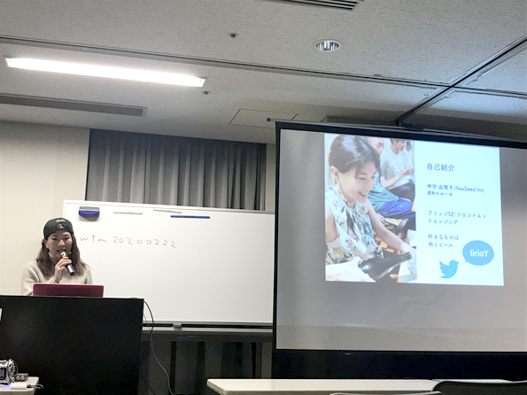

## ウェブタッチミーティングってそもそもなんぞ？
ウェブ周りの知識を企業・立場関係なく横つながりからナレッジシェアできたらいいな、ということで藤本さんが始めたIT勉強会です。

もうかれこれ10年くらい経つんじゃないかな？我々も年取るわけだ笑

余談ですが、昔はウェブおさわり会という卑猥な名前でした。いつのまにやらまともな名前に変わったそうです。

私も何度か登壇させていただいた思い入れのある勉強会です。

## 「イカしたポートフォリオを作ったらヘッドハントされてオフショアしにセブ島まで行った話」をしました

* [スライド](https://www.slideshare.net/yurikamimori/ss-229109957)
* [動画](https://www.youtube.com/watch?v=ZVFGrlw3viw&feature=youtu.be)
* [当日のTwitterまとめ](https://togetter.com/li/1472200)
* [ウェブタッチミーティング公式サイト](http://www.webtouchmeeting.com/meeting/105web-touch-meeting.html)

ちなみにセッションでは説明が薄かったところを補足します。

### そもそも、オフショアとは？
最近よく耳にする、「オフショア」。

英単語「offshore」の読みをカタカナ表記した言葉で「海外」を意味します。岸を表す「shore」と離れることを示す「off」からなる単語で、本来は「沖合」で、国外、つまり「海外」のことをいうようになったそう。

ビジネスでの「オフショア」は新興国や途上国のことが多いです。先進国の企業が人件費などのコストを抑えるために海外へ拠点を置くようになりました。

フィリピンは公用語が英語。世界規模でみてもその他の国に比べ、「国民全体レベルで流暢な英語を話せる」ことが強み。私が住むセブ島にもその強みを活かすべく、たくさんのコールセンターがあります。

言語の壁を超えて、コミュニケーションがスムーズに取れることは大きな強みです。

ITに力を入れているのか名前もそのまんま、ITパークというエリアもセブ島には存在ます。

私はセブシティーに住んでいますが、近隣に日系のみならず欧米・アジアのたくさんのオフショア開発会社が存在します。

悲しくもフィリピンという国は約300年植民地でした。そのためスペイン、アメリカなどの文化が入り混じっています。私は東南アジアの他国に比べて全体的にとても順応性の高い国民と感じています。そのため、オフショアとしてマッチしやすいのも特徴だと思っています。

### 一般的なフィリピンの物価とか賃金とか
ビールは60ペソ(約120円)くらい。フィリピン人の平均月給は2万円くらいです。格差は激しいと思います。

医療費も日本に比べると安いので、保険に入っている人は少ないです。銀行口座も開設している人少なめ。贅沢しなきゃ月8万以内で暮らせるんじゃないでしょうか？

### ポートフォリオを作ったきっかけ
去年職業訓練校で先生してたとき、生徒さんが卒業制作の際ちょっと手持ち無沙汰になり、自分用のポートフォリオを作りました。やったことないことを生徒に言えないじゃないですか？

さらにwantedlyに掲載してみたんです。

そうしたらなぜか、私がまっ先にヘッドハントされました。

### ポートフォリオをとにかく作れ！
この業界に入りたけりゃ、転職したければとにかくポートフォリオ作ってほしい。

技術力、人間性のアピール、すべてを詰め込むことができる、履歴書なんかよりよっぽど強力なツールです。

反応が悪ければ、作り直せばいい。

とにかく、最初は完成させることを目標にしてほしい。

そして、PDCAを回して改良すればいい。就活始めたときに作り始めるようじゃ遅いですよ。

作ろうとしてるけどまだアクションしてない人。今すぐ取りかかってください。
### 美容業界からIT業界へ行った理由
美容業界からなぜIT業界へ転職したのか？よく聞かれます。

約10年前美容業界にいました。元々はブライダルや地元のテレビ局のメイク、ネイル、ネイリスト講師をやってました。

ネイルエキスポ2003年トータルルックコンテストで4位に入賞したこともあります。

わりとキャリアは築いていた方と思います。でも、問題がありました。子育てと仕事の両立です。うちの子は喘息とアトピーを持っていて、急な喘息の発作を起こすことがありました。ブライダルメイクやスタジオメイクなんてどう考えても穴を開けられない仕事です。

ある日子供の喘息が悪化して入院したことがありました。変わりがいないからスーツを着て、病院から出勤したとき心が苦しかったのを今でも忘れません。その時、誰かが代わりをできる仕事をしようと決意し転職しました。

#### キャリアが死に決断した
その後、化粧品メーカーに勤めました。日々数字を追う仕事で、技術職とは程遠い仕事でした。毎日エクセルで数字を集計したり、販促用のチラシを作ったりしてました。私の美容の知識やスキルは想像以上に活かされず、このままでは私のキャリアが死んでしまうと、焦燥感ばかり募ってました。

どうせキャリアが死んだなら新しいことをしたい。幸いにも毎日パソコンを触ってたおかげで、パソコンを使う仕事に興味を持っていたので、ウェブクリエーターになるべく、職業訓練校に行く決意をしました。
### そもそも、エンジニアになるつもりはなかった
元々美容関係の仕事の関係で色彩も勉強してたのでデザイナーになりたかったです。

もう、私より優れたデザイナーはたくさんいたし同じフィールドでは戦えないと思ったのは本音です。

そしてやってみたら意外と向いていたんですよね。食わず嫌いは、自分の可能性を狭めます。とにかくやってダメなら諦めればいい。

#### 職業訓練校では3倍勉強した
朝予習、授業、夜復習。明けても暮れても勉強した記憶があります。単純に3倍以上は勉強しました。なぜそんなに勉強したかって？職業訓練校での職業講話がきっかけでした。

講話した方は私たちと同じ職業訓練校出身。にもかかわらず、しっかりキャリアを築いていました。

キャリアを築くために戦略を建てて行動してました。たった4か月で何をしたのかを教えてくれました。周りの職業訓練生と同じスタートラインに立っているようだとダメ。普通のことをしてたら現役の人に勝てない。

この道で生きていくと決めたので、正直にその人の真似をしてみました。

それでも、スタート地点に立った時はマイナスからのスタートです。転職して新しいこと始めるなら覚悟して欲しいです。
### 卒業してすぐスマフォアプリ選手権にチャレンジした
卒業してすぐ、人に誘われてマイクロソフト主催のスマフォアプリ選手権にエントリーしました。

どうやったら勝てるかを考えた結果、月に30個アプリを作ると決めました。

最初は役割分担で、素材だけ作ってましたが次第にUI、プログラムまでせざるを得なくなり、結果29個の申請を通すことができなんとか優勝できました。

ここで学んだのは、自分のやることに線を引かなければ、自分のやれることの幅が広がるということでした。
### エンジニアになるためにどんな勉強をしていたか
私がこの業界に入ってやったこと。

すでにあるイケてるサイトを模写コーディングしました。

勉強会に参加しまくりました。分かんないことは人に聞きまくりました。

井上大輔さん著のレスポンシブデザインの本を3回はやりました。勉強したことは可能な限りブログや勉強会でアウトプットしてました。

ブログはアウトプットにもってこいのツールです。

間違っていることを恐れないこと。バカ丁寧に書く。アウトプットすればするほど自分の中にも落とし込めます。

特にイベントでの登壇はアウトプットだけではなく自分を売り込むチャンスです。

そして、今でも変わらずにやってることがあります。1案件に1チャレンジを必ず課す。

具体的には新しい技術にチャレンジするとか。

**ちょっとだけキツイチャレンジ**を繰り返すと必ずスキルは上がります。

## 地方のIT業界は？帰省して気づいたこと
広島のIT業界も捨てたもんじゃないです。リテラシーも高くて、向上心も高い。

これはやはり何年もかけて広島で毎月IT勉強会を開いてくれた藤本さんのおかげもあります。

IT業界の開発技術の進化スピードは息切れするくらいキツイんです。

だからこそ地方エンジニアは知識や情報に飢えてます。都心ほど勉強会が盛んではありません。

誰かとナレッジシェアしたい。自分のやってることが正しいかベストなのかも不安なんです。

だからこそ、そういった場を提供してもらえるのは心の底から感謝です。

セブ島でも同じようなことができれば、現地の私のようなエンジニアが嬉しいだろうなと思いました。

## 一年離れたあとに見た日本の印象
とにかく街はきれい。道路硬いから長時間歩くと膝にくるww

気軽に乗れるバイタクなどあるわけもなく移動に時間がかかる。とにかく全てが高い笑

飯はサイコーに旨い。ただ塩分多めなのかむくむ。全てがオンタイム。

ありがたいことが多いと同時に、ルールが整備され過ぎて家族や仕事のしがらみがガチガチで生きづらい人も多いなぁ、と感じました。

**どんな生き方を選択するかは自分次第**ということを忘れてはいけないですね。

## サイコーの仲間が帰りを待っていてくれた
正直、**ウェブタッチミーティングへ登壇するために帰った**と言っても過言ではありません。

コロナショックでイベント開催も危ぶまれましたか、アルコール消毒やマスクを常備して開催してくださったイベント運営サイドの方々には心の底から感謝してます。

参加者は減りましたが、84名もの来場がありました。

みんな相変わらず暖かく迎え入れてくれました。ごはんも随分奢ってもらいましたし笑

私が日本にいたとき、広島のIT業界にどの程度貢献できたかは分かりません。

ただ、セブ島に滞在しつつ地元へできることはたくさんあるはずなので何かできることを始めるフェーズなのかもしれませんね。

## おまけ、息子が会いに来た
約束してなかったですが、息子が会いに来ました笑

息子氏、大学辞めてセブ島で約半年語学学校インターンやってました。

最初は照れくさいのか話しかけようとしなかったですが、最後はベラベラセブ島でのことなどを話してくれました。

とくに日本の教育への思うところ。みんな同じ方向に向かせたがったり、親や大人の言うことに疑問を抱くところは「さすが親子」と思います。

日本の教育は前を向くか後ろを向くか。つまり、レールからはみ出しにくい仕組みなんだと感じます。

息子曰く、360度向けるようになりたいとのこと。まあ、頑張れ。

セブ島で骨のあるやつと出会って考えが変わったんだなぁと。

大学や高校だけでは絶対に得られない出会いがあったんだとしみじみ感じ、大学は辞めてしまったけどセブ島に連れて行って良かったと思います。
## さいごに
今回の帰省は好きな人に会う旅でした。

たかだか一週間でしたが、自分を俯瞰して見つめ直すこともできました。

そして、みんなから「いかに大切にされいてるか」も気付くことができました。

91歳のおばあちゃんにも会えました。死に目に会うよりは、生きているときに会いたかったので良かったです。

お金も名誉も持って死ねない。これからも私らしく、誰にも媚びす、友だちの助言には素直に耳を傾けて生きていきます。

最後までお読みいただきありがとうございました。
