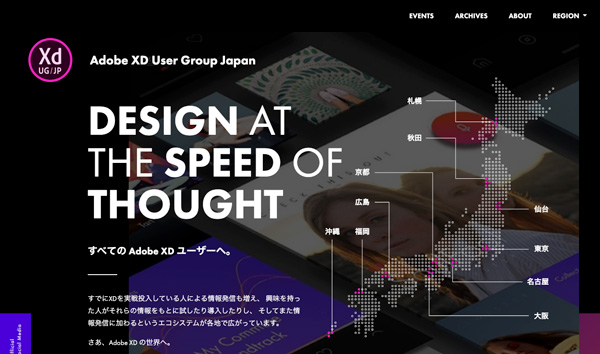
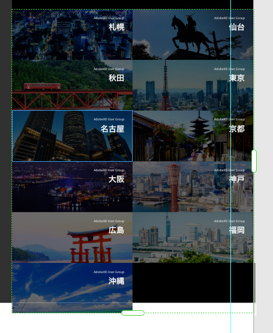
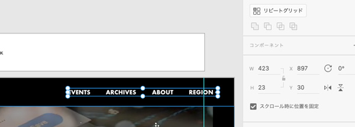
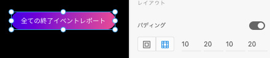
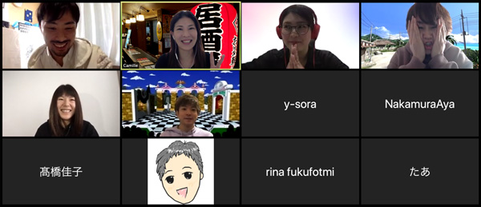

セブシティーがロックダウンされて毎日超寂しい今日この頃。

地元広島でXDのオンライン勉強会開催するって言うもんだから参加することにしました。

<prof></prof>

## Adobe XDとはなんぞ？
XDはUIデザインやプロトタイプの作成、リアルタイム共同編集などの強力な機能が多数あるツールです。
私は会社ではクライアントやフィリピン人エンジニアとのやりとり、プライベートではイベント登壇用のプレゼン資料を作るために使っています。

↓↓↓今回のイベントはこれ↓↓↓ 
[見るだけもOK！共同編集もしゃもしゃ会！](https://xdug-hiroshima.connpass.com/event/171441/)

↓↓↓当日の様子を公式スタッフのやんこちゃんが書いてます↓↓↓ 
[zoomzoom! XDUG広島 vol.6　もしゃもしゃ会｜noex design](https://note.com/yancosan/n/nffa73342eb15)

アートボードを並べてみんなで各々模写します。

写生大会みたいで、とても楽しかったです。

## 実際のもしゃもしゃ会でやったこととか機能とか
ワタクシ、一応フロントエンドエンジニアの端くれなので開発者ツールでバンバンコードを解析しながら作っていきました。時間が限られてるので、ざっくり作って後から調整する作戦でした。テキトーですが、最後まで作りきりました。

よろしければご覧ください。

↓↓↓模写したユーザーグループサイト↓↓↓ 
[https://xdug.jp/](https://xdug.jp/)

↓↓↓模写結果↓↓↓ 
[https://xd.adobe.com/view/bb865e2a-98f0-4507-4589-524c7bae03ce-cdb7/](https://xd.adobe.com/view/bb865e2a-98f0-4507-4589-524c7bae03ce-cdb7/)

ちなみに今回XDを使うために必ず使って欲しい、もしくは使った機能をご紹介しておきます。

### コンポーネント機能を使い倒せ
今回は共同編集ということでマスベさんの作ったコンポーネントを拝借させていただきました。

コンポーネントというパーツを部品扱いする概念があるのですが、ちょっと前にXDにも導入されました。

Sass(SCSS)とか使う人であれば、いくつかの**CSS設計の手法**をご存知だと思います。

CSSを長年書いている人ならわかると思うんですが、ページが増えてコードが長くなればなるほどカオスになっていきます。

それを避けるために考えられたのが**SMACSSやFLOCSSとかCSS設計**などの手法です。

ざっくりいうと色違いや種類違い、部品のさらなる部品といったように各パーツをしっかり整理してコーディングする方法です。導入するとCSSが破綻しにくくなります。

エンジニアからすれば、UI設計の段階で導入されることは非常にありがたいですし格段にコーディングしやすくなります。

コンポーネント機能を使って見出しやボタンなどのベースを作っておけば、色違いや形違いなど用途ごとにアレンジできます。

ボタン、見出し、チェックボックスなど同じ機能や属性を持ったものはできるだけコンポーネント化しておいてもらえるとコーディングする時もハッピーです。

基本中の基本ですが、コンポーネントのように複雑じゃない、色やフォントも登録できます。

こういった下準備をしておくと統一感も出ますし、後日色調整が入った時にデザイナー自身が幸せになれますね。
### 初心者であればあるほどガイドやグリッドに頼ろう！！
美しいものって意外と理論的に作られています。

私は元メイクさんでした。色気もク○もない言い方をすると、メイクさんという仕事は顔を設計し、陰影などを利用して可能な限り美しい比率に近づけることです。

そんな経験も踏まえて、Webデザインを初めた人に言いたいのは、**美しく作ろうと思うならば自分の感性はまずいったんドブに捨ててください**。  

そして、グリッド（12gridシステム）やガイドラインを利用してください。
### 繰り返し処理の鉄板リピートグリッド
今さら説明するまでもありませんが、以下のような同じデザインだけどコンテンツ違いの場合は鉄板でリピートグリッドを使います。

今回、面倒だったのはココ涙。端数だったので上に図形を重ねてごまかしました涙

リピートグリッドのこんな感じで中途半端になった時の対処法があれば知りたいです。

### グローバルナブなどをクロール時に固定して実装した時の挙動を確認
XDにはプレビュー機能があり、私はこんな実装してーってエンジニアやクライアントに確認して欲しい時よくこの機能を活用します。

Webサイトは紙媒体と違って動きがあるもの。

リンクを共有する手もあるんですが、動きなどの繊細さがイマイチなので私はよく録画して見てもらうことが多いです。

実装するフロント側のエンジニアにもこんな感じで実装して欲しいから必ずプレビューを見るように伝えておくと○。

### 模写では開発者ツールでwebサイトの幅をカンバスサイズと同じサイズにしておくと良いみたい
今回各参加者に1366pxのカンプを用意されていました。

可能な限り、同じように作るためには開発者ツールを使ってWebサイトを1366px幅に設定しておきました。

このサイトはもうひとまわり大きなカンバスサイズでもよかったかもしれませんね。
### パディングの設定がメチャ便利
コンポーネント機能に引き続き、XDに余白処理が実装されたのはフロント側の人間としては歓喜歓喜歓喜です。

今年の2月ぐらいに実装されたみたいですね。サイコー。

文字数が変わっても余白は同じように保ってくれるのでボタンとかのパーツの見た目がいい感じでできそうです。

より、正確にコーディングできますね。

### 知らなかった！SVGコードをコピペするだけで配置できる
私はサイトを最終的にコーディングすることを想定してカンプを作るので、アイコン類はベクター画像が嬉しいです。
模写側のサイトを見ると、いくつかの画像データはSVGでできていたので一度SVGデータとして保存して配置しました。

今回、即興ですが、デモさせてもらいました^ ^

今日みんなで作業していて発見できたのですが、、、、やっぱりXDやってくれますね。SVGのコードを開発者ツールからコピーして、XD上でペーストするだけで配置できるじゃないですか。
マジビビりました。

データとしてはSVGの方が軽いですが、XD上での描画でメモリを食います。今回みたいに複数アートボードを並べて、共同作業する際は多用を避けた方がいいかもですね。まあ、そんなこと実務ですることはまずありませんがww

## とりあえず、XD勉強会のまとめ
XDってツールはアジャイル開発で月一アップデートしていて頻繁に機能が追加されます。置いてけぼりなんてしょっ中です涙。

私実はプロトタイプだった頃から使ってるんですが、その時から比べたらバケモノ級に成長しちゃっててマジでビビります。
と、いうことでこのツールの勉強会は定期的に参加しないと便利な機能を見逃しちゃいそうです。

共同編集なんて、以前に比べたら相当使い勝手が良くなっていました。

いまだにフォトショやイラレのデザインカンプがきますが、みなさん早くXDに移行して欲しいものです。
さておき、今回インプットもたくさんできてよかったです。

楽しかった！また次回も参加します。 
最後までお読みいただきありがとうございました。
