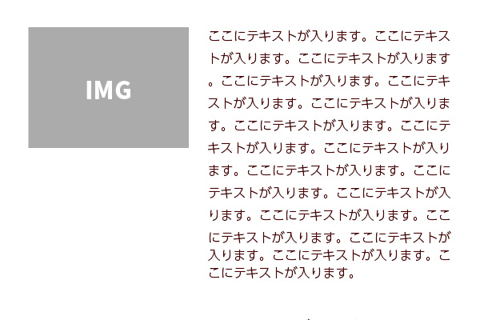
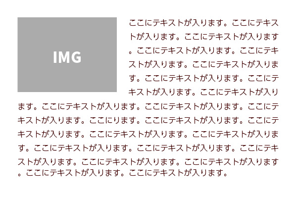
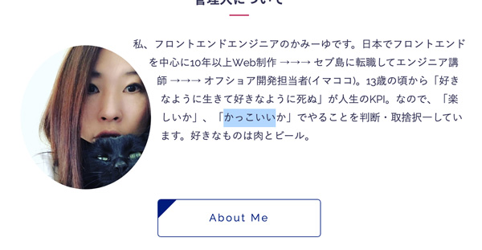
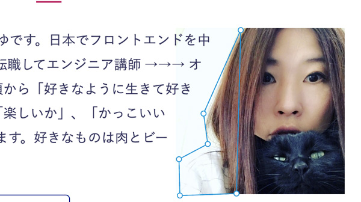

最近 float 使ってますか？ 一昔前の横並びのカラムレイアウトの鉄板は float と クリアフィックス でした。 今は grid や flex の登場でめっちゃ毛嫌いされている float の使い道と四角以外の図形へのオサレな回り込みをしてみましょう。


## 挿絵とテキスト / 読みものとして適した配置を実現できるプロパティ、float
よく以下のようなレイアウトを見かけますが、私は読みものとしてこんな感じのレイアウトは正直好かんです。



もともと、`float` は画像などへの回り込みをするために作られたプロパティです。カラムレイアウトを作るためにできたものではないです。<br>
デザインが多様化し、テーブルレイアウトからカラムレイアウトで利用するようになり、`flex`、`grid`の登場もあり急に悪者扱いされるようになりました。

雑誌なんかでよく見かけるのは以下みたいなレイアウトが多いはずです。それを実現するのが `float` です。


余談ですが、私の頭の中では `float` は**FFの魔法でいうレビテトに近い**です。多分。
今はスマフォで画像とテキストの縦積みレイアウトが圧倒的に組むことが多いですが、PCになった時、エリアを有効活用するためこんなレイアウトが必要不可欠なのではないでしょうか？

本来の `float` の使い方を知らない世代のデザイナーさん、ぜひこのレイアウトでデザインカンプを作って欲しいです。

### CSSプロパティfloatの本質を理解する
`float` はオブジェクトを擬似的に浮かして回り込ませます。必ずと言っていいほど、解除処理とセットで使います。<br>
`float` させると、要素のコンテナーと回り込ませたい要素は重なっています。コンテンツだけが回り込ませたい要素にぶつかって折り返しているイメージです。

なので余白を設定したいときは回り込ませたい要素の方に設定してください。`float`の概念がわかってなくてよくここら辺で転ぶ人、多いですねw

### floatとshape-outsideで複雑な図形に対してハイレベルな回り込みを実現する
丸や複雑な図形への回り込みを実現する、`shape-outside` というプロパティを使うとさらにかっこいい実装ができるそう。
現在IE以外はすべてカバーしています。

[shape-outside | Can I use](http://caniuse.com/#search=shape-outside)

基本図形

* nset() …… 内側にオフセットした長方形
* circle() …… 円
* ellipse() …… 楕円
* polygon() …… 多角形

ということで早速使ってみましょう！！
### 円形に対して回り込ませる
図形の形を縁に設定してみます。

```css
.c-profile__img {
  border-radius: 50%;
  display: block;
  margin: 15px;
  float: left;
  shape-outside: circle();
  width: 200px;
}
```
余白も含めてこんな感じで回り込みます。


### 楕円に回り込ませる
`shape-outside: circle()` を `shape-outside: ellipse()` に変えるだけです。


### 画像を直接設定することも可能
以下みたいに直接画像を読み込んでも良いそう。

```css
shape-outside: url(images/test.png);
```

### 複雑な図形に回り込み処理をする
せっかくなら複雑な形にも回り込みさせたいですよね？とはいえ計算が面倒なので、ここは思い切ってGUIツールでパスの頂点を調整することをオススメします。<br>
**CSS Shapes Editor** というChromeに拡張機能があるらしいのですが私はうまくできなかったのでFirefoxのデフォのshape編集機能を利用してパスを作成しました。

[CSS シェイプのパスを編集する](https://developer.mozilla.org/ja/docs/Tools/Page_Inspector/How_to/Edit_CSS_shapes)

開発者ツールで適当に3つ以上値を追加して、プロパティを追加したら、パス編集ツールが出るのでそちらをクリック。



複雑な図形では `shaape-margin` で余白を調整するのが良いみたいです。

IEに対応したい場合は**polyfillで対応**しましょう。
[https://github.com/adobe-webplatform/css-shapes-polyfill](https://github.com/adobe-webplatform/css-shapes-polyfill)
## まとめ・CSSはより複雑な表現が可能となった
CSSの進化でより複雑な実装が可能になりましたね。<br>
みなさん、どうか`float`のことを嫌いにならないでください。

最後までお読みいただきありがとうございました。

<prof></prof>
