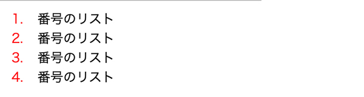
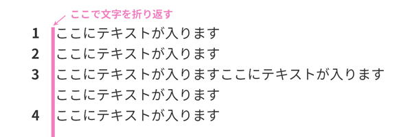
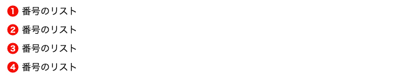
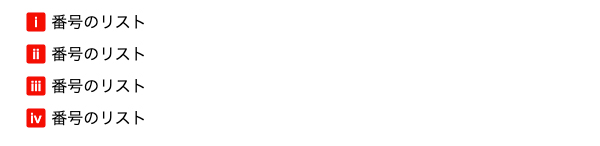
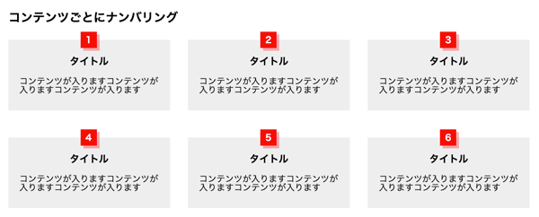
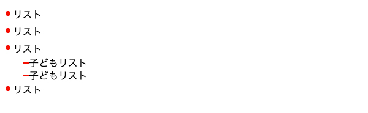
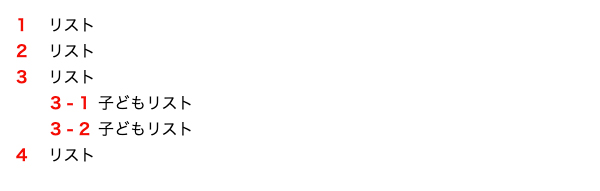

## CSSカウンターとは？
CSSカウンターは CSS2／CSS2.1 ですでにあったナンバリング用のモジュールです。使い方はいたって単純。
基本は親要素で初期化し、特定の要素を数えて、その値を擬似要素なんかを使っ（content）出力といったようなものです。
そのほか、めちゃめちゃマニアックな使い方もできます。興味がある人はどうぞ。

[CSS Counter Styles Level 3](https://triple-underscore.github.io/css-counter-styles-ja.html)
## カウンター関数基本の使い方
最初に必ずプロパティ counter-reset で値を初期化しましょう。
コンピュータは 0 基準で始まるので、既定値は 0。
以下のようにカウンターの名前は任意でセットします。ちなみに none, inherit, initial は使用できません。

```
counter-reset: num;
```
## ナンバリングしたい対象の要素を選ぶ
section、li ごとなどなど対象の要素など、プロパティ `counter-increment` で増加ないしは減少させたい対象にセットします。

`counter-reset: 0` スタートですが、`counter-increment`した時点で1増加します。

なので最初に出力される数値は1となります。

たとえば、こんな感じでCSSを設定すると `main` 内に `h2` が登場するたび、擬似要素（::before）へナンバリングされた数値が出力されるようになります。

```

main {
  counter-reset: section;
}
h2::before {
  counter-increment: section;
  content: counter(section);
}
```
## いくつかベーシックなサンプルをご紹介
### 超基本的なオーダーリスト
基本のオーダーリストだとこんな感じでタイリングできます。


方法はいくつかあるのですが`text-indent`を利用したナンバー以降の文字を字下げする方法をご紹介します。
ナンバー以降の文字が長くなってもこんな感じで折り返すことができます。箇条書き（`ul`）でも使えます。



HTML
```
<ol>
  <li>番号のリスト</li>
  <li>番号のリスト</li>
  <li>番号のリスト</li>
  <li>番号のリスト</li>
</ol>
```
CSS
```
ol {
  counter-reset: num;
  margin: 15px;
}
ol li {
  padding-left: 2em; /* 2文字分くらい */
  text-indent: -2em;
  counter-increment: num;
  margin-bottom: .5em;
}
ol li::before {
  color: red;
  display: inline-block;
  width: 2em; /* text-indent分の幅を確保 */
  text-indent: 0; /* 初期化 */
  content: counter(num) '.';
}
```

### 丸で囲って装飾する
丸で装飾したものも作ることもできます。

コードは基本と一緒で `ol` にクラスcircleを付与しただけです。

出力するナンバーは同じサイズで作ってプロパティ `transform: scale(倍率)` を使って縮小して調整するといい感じになります。

CSS


```
ol.circle li {
  padding-left: 1.5em; /* 1.5文字分くらい */
  text-indent: -1.5em;
  counter-increment: num;
  margin-bottom: .5em;
}
ol.circle li::before {
  width: 1.5rem;
  line-height: 1.5;
  text-indent: 0;
  text-align: center;
  display: inline-block;
  height: 1.5rem;
  margin-right: .2em;
  background: red;
  color: #fff;
  border-radius: 50%;
  content: counter(num);
  transform: scale(.8);
}
```
### 数字形式の表示方法の変更する
入る数字の形式を変更することもできます!!!<br>
指定方法は数字形式を第二引数に入れるだけです。

```
counter(num, 表示する形式)
```

指定できる数字形式は以下のように割と豊富。

|値|詳細|
|-|-|
|decimal|数字（初期値）|
|decimal-leading-zero|0つき数字（例：01、02、03）|
|lower-roman|ローマ数字（小文字）（例：ⅰ、ⅱ、ⅲ）|
|upper-roman|ローマ数字（大文字）（例：Ⅰ、Ⅱ、Ⅲ）|
|lower-alpha|アルファベット（小文字）（例：a、b、c）|
|upper-alpha|アルファベット（大文字）（例：A、B、C）|
|cjk-ideographic|漢数字（例：一、二、三）|
|hiragana|ひらがな（例：あ、い、う）|
|katakana|カタカナ（例：ア、イ、ウ）|
|hiragana-iroha|いろは順（例：い、ろ、は）|
|katakana-iroha|イロハ順（例：イ、ロ、ハ）|



```
ol.lower-roman li {
  padding-left: 1.5em; /* １.５文字分くらい */
  text-indent: -1.5em;
  counter-increment: num;
  margin-bottom: .5em;
}
ol.lower-roman li::before {
  width: 1.5rem;
  line-height: 1.5;
  text-indent: 0;
  text-align: center;
  display: inline-block;
  height: 1.5rem;
  margin-right: .2em;
  background: red;
  color: #fff;
  border-radius: 3px;
  content: counter(num, lower-roman);
  font-weight: bold;
  transform: scale(.8);
}
```

### コンテンツごとに出力する
コンテンツごとにもナンバーを付与することも可能です。



ナンバーを出力する位置を `position: absolute;` で調整し `box-shadow` で装飾したらそれなりに仕上がります。

こういうレパートリーがあるとデザインないときに即興で作れて良いです。

HTML
```
<class="card">
  <section>
    <h3>タイトル</h3>
    <p>コンテンツが入りますコンテンツが入りますコンテンツが入ります</p>
  </section>
  <section>
    <h3>タイトル</h3>
    <p>コンテンツが入りますコンテンツが入りますコンテンツが入ります</p>
  </section>
  <section>
   <h3>タイトル</h3>
   <p>コンテンツが入りますコンテンツが入りますコンテンツが入ります</p>
 </section>
 <section>
   <h3>タイトル</h3>
   <p>コンテンツが入りますコンテンツが入りますコンテンツが入ります</p>
 </section>
 <section>
   <h3>タイトル</h3>
   <p>コンテンツが入りますコンテンツが入りますコンテンツが入ります</p>
 </section>
 <section>
   <h3>タイトル</h3>
   <p>コンテンツが入りますコンテンツが入りますコンテンツが入ります</p>
  </section>
</section>
```

CSS

```

.card {
  counter-reset: num;
  display: flex;
  flex-wrap: wrap;
  width: 960px;
  justify-content: space-between;
}
.card h2{
  width: 100%;
  margin-bottom: 30px;
}
.card section {
  box-sizing: border-box;
  position: relative;
  counter-increment: num;
  padding: 30px 20px;
  margin: 0;
  width: 31%;
  background: #eee;
  margin-bottom: 50px;
}
.card section::before {
  position: absolute;
  left: 50%;
  top: -15px;
  content: counter(num);
  height: 30px;
  margin-left: -16px;
  text-align: center;
  line-height: 30px;
  font-weight: bold;
  color: #fff;
  width: 30px;
  background: red;
  box-shadow: 5px 5px 0 rgba(255, 0, 0, .3);
}
.card section h3{
  text-align: center;
  font-weight: bold;
  margin-bottom: 20px;
  font-size: 18px;
}
```

## ナンバーを入れ子にする
counters関数を使うとさらに複雑にナンバーを入れ子にできます。

その前に、リストの入れ子の書き方を知らない人が多いので、**リストの入れ子の正しい記述方法とCSSの子セレクターの指定の仕方**についてもご紹介しておきます。

### 子セレクターの指定の仕方
ある要素の直下の要素を指定したいときは以下のように要素と要素の間に > 書きます。

通常以下の子要素、孫要素と下の下まで指定できるのに対して、特定できて便利です。

[CSSの子セレクターの指定の仕方について](http://www.htmq.com/csskihon/005.shtml)
```
/* 子セレクタの指定 */
ul > li {
  margin: 50px;　/* スタイルが直下の li にしか効かない */
}
/* 孫セレクタの指定 */
ul li {
  margin: 50px;
}
```
### リストの入れ子の正しい書き方
`li` タグの中に改めて `ul` ないしは `ol` を書いて `li` タグを足します。
```

<ul>
  <li>リスト</li>
  <li>リスト</li>
  <li>リスト</li>
  <li>リスト
    <ul>
      <li>子リスト</li>
      <li>子リスト</li>
      <li>子リスト</li>
      <li>子リスト
        <ul>
          <li>孫リスト</li>
        <ul>
      </li>
    <ul>
  </li>
</ul>
```
#### 複雑な入れ子を正しく装飾する
このように書いた場合、`ul > li > ul > li` というように入れ子が複雑になっていき要素をちゃんと厳密に指定しないとスタイリングが破綻します。

親のリストと子どものリストのデザインをしっかり分けたいけどいちいちクラス分けするのもめんどくさいです。なので、子セレクターを利用して指定していくのをオススメします。



HTML

```
<ul class="has-child">
  <li>リスト</li>
  <li>リスト</li>
  <li>リスト
    <ul>
      <li>子どもリスト</li>
      <li>子どもリスト</li>
    </ul>
  </li>
  <li>リスト</li>
</ul>
```

CSS
```
ul.has-child > li {
  text-indent: -1em;
  margin-left: 1em;
  margin-bottom: 10px;
}
ul.has-child > li::before {
  text-indent: 0;
  content: '';
  width: 1em;
  height: 1em;
  display: inline-block;
  background: red;
  border-radius: 50%;
  transform: scale(.5);
}
ul.has-child > li > ul {
  padding-left: 1em;
  margin-top: 7px;
  margin-bottom: -5px;
}
ul.has-child > li > ul > li{
  margin-left: 1em;
  margin-bottom: 5px;
}
ul.has-child > li > ul > li::before{
  content: '';
  width: 10px;
  background: red;
  height: 2px;
  display: inline-block;
  vertical-align: 5px;
}
```
### 子リストも合わせてナンバー出力する
今度は入れ子のリストの文頭にナンバーをつけてみましょう。
子リストには親要素のナンバーも合わせて付与します。

そうすることで、親の何番目の子の何番目なのかがわかりやすくなります。

以下のように、親要素子要素もろともすべてに`counter-reset`をセットするのがポイントです。
```
ol.ol-has-child, ol.ol-has-child ol {
  counter-reset: cnt;/* 親要素から子要素全てにcounter-resetをセットする*/
}
```
あとは以下の通り全体のliタグに、`counter-increment` と `counters` 関数をセットするだけ。
これで `ol` の `ol-has-child` というクラスを持つ親要素の全 `li` タグに自動でナンバー出力を設定できます。

2個目の引数は親要素のナンバーと子要素のナンバーをつなぐコネクターとなります。

なので子要素は**1 - 2**みたいな出力になります。

```
ol.ol-has-child li::before {
  counter-increment: cnt;
  content: counters(cnt, " - ") ;
}
```


HTML
```
<ol class="ol-has-child">
  <li>リスト</li>
  <li>リスト</li>
  <li>リスト
    <ol>
      <li>子どもリスト</li>
      <li>子どもリスト</li>
    </ol>
  </li>
  <li>リスト</li>
</ol>
```
CSS
```
ol.ol-has-child, ol.ol-has-child ol {
  counter-reset: cnt;/* 親要素から子要素全てにcounter-resetをセットする*/
}
ol.ol-has-child > li {
  text-indent: -1.5em;
  margin-left: 1.5em;
  margin-bottom: 10px;
}
ol.ol-has-child li::before {
  counter-increment: cnt;
  content: counters(cnt, " - ") ;
  color: red;
  font-weight: bold;
}
ol.ol-has-child > li::before {
  text-indent: 0;
  width: 2em;
  display: inline-block;
}
ol.ol-has-child > li > ol {
  margin: 10px;
}
ol.ol-has-child > li > ol > li{
  text-indent: -3em;
  margin-left: 3em;
  margin-bottom: 10px;
}
ol.ol-has-child > li > ol > li::before{
  width: 3em;
  display: inline-block;
  text-indent: 0;
}
```
counters関数も通常のcounter関数同様、引数に表示形式を指定できます。
```
counters(名前, コネクター, 表示形式) ;
```
## まとめ
いちいち数字を入力するのは面倒！<br>
このブログでいうと最初の目次にもCSSカウンターを利用してます。
是非、CSSの自動ナンバリング活用してみてください。

最後までお読みいただきありがとうございました。

* [CSS カウンターの使用](https://developer.mozilla.org/ja/docs/Web/Guide/CSS/Counters)
* [コードサンプル](https://codepen.io/camillenexseed/pen/BaooeMN)
