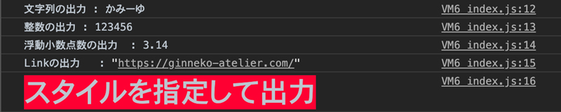
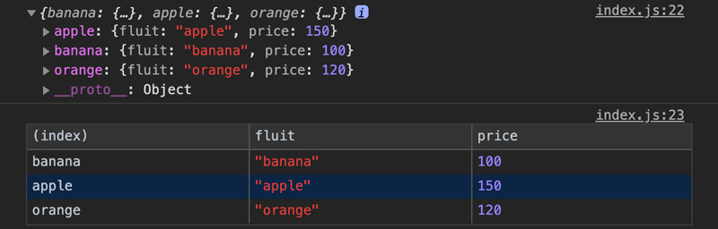
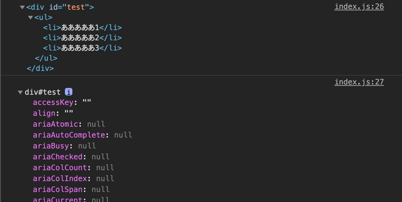
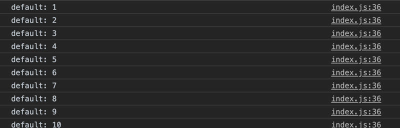
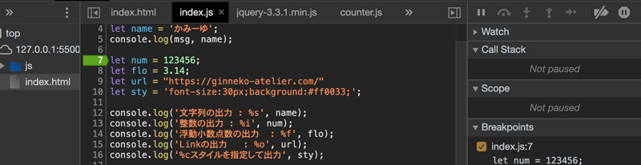
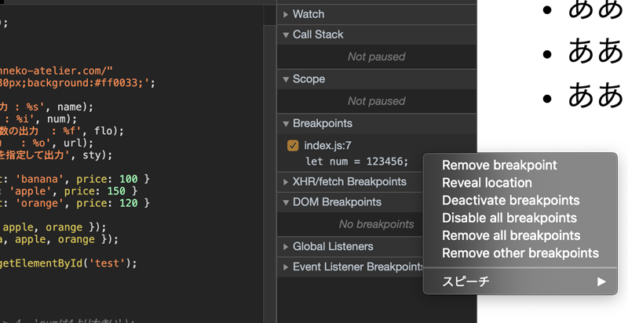
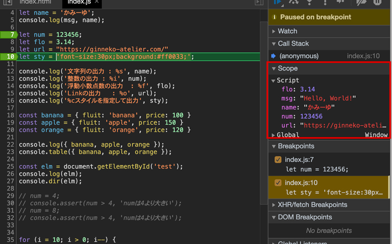
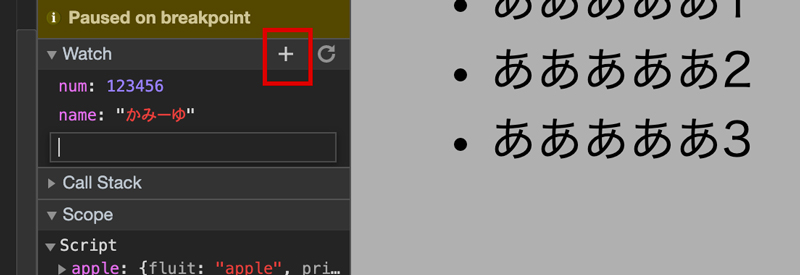

## JSのデバッグのコマンド console.log()とは？
ブラウザの機能・開発者ツール上、どんな結果が出ているかを確認するのに便利な関数が `console.log()` です。昔は、`alert()`を使って結果を出力していましたが、今はこちらを使うのが一般的です。今回は Google Chrome の開発者ツールとセットでご紹介します。

### まずは、コードを書き基本の出力
以下のようにコードを書きます。

HTML
```
<!DOCTYPE html>
<html lang="ja">
<head>
  <meta charset="UTF-8">
  <meta name="viewport" content="width=device-width, initial-scale=1.0">
  <title>Document</title>
  <script src="js/index.js" defer></script>
</head>
<body>
</body>
</html>
```
JS
```
const msg = "Hello, World!"
console.log(msg)
```


### まとめて出力
カンマ区切りで書くとまとめて出力可能です。

JS
```
const name = 'かみーゆ';
console.log(msg, name);
```
### 型ごとに出力
こんな書き方もできます。

JS
```
const num = 123456;
const flo = 3.14;
const url = "{https://ginneko-atelier.com}/";
const style = 'font-size:30px;background:#ff0033;';console.log('文字列の出力 : %s', name);
console.log('整数の出力 : %i', num);
console.log('浮動小数点数の出力 : %f', flo);
console.log('Linkの出力 : %o', url);
console.log('%cスタイルを指定して出力', style);

```
| 値 | 出力の型 |
|-------- | -------- |
|%s|文字列|
|%d or %i|整数|
|%f|浮動小数点数|
|%o|オブジェクト|
|%c|スタイル|
|%j|JSON|



### console.teble() まとめて表として出力
```
const banana = { fluit: 'banana', price: 100 };
const apple = { fluit: 'apple', price: 150 };
const orange = { fluit: 'orange', price: 120 };console.log({ banana, apple, orange });
```
`console.teble()` を使うと変数を表にまとめて表示できるので違いがとてもわかりやすい。
```
console.table({ banana, apple, orange });
```


### 要素のDOMを詳しく調べるときはconsole.dir()
DOMの構造を調べたいときは `console.dir()` を使うと便利です。

HTML
```

<div id="test">
  <ul>
    <li>あああああ1</li>
    <li>あああああ2</li>
    <li>あああああ3</li>
  </ul>
</div>
```
JS
```
const elm = document.getElementById('test');
console.log(elm);
console.dir(elm);
```

### console.count()で処理の回数を出力
何回繰り返しているかが分かります。
処理回数をカウントできます。
JS
```
for (i = 10; i > 0; i--) {
  console.count();
}
```


## 上級者向け：Chromeの開発者ツールを使いこなす
出力結果までは確認できるようになりました。

開発者ツールでconsole.logなしでデバッグみようと思います。

### ブレークポイントを使う
ブレークポイントを設置したら、プログラムの実行中に任意の行で処理を止めることができます。

開発者ツールから Source のタブを開き、停止したい位置をクリックします。

すると右側のBreakpointsに指定した7行目がブレークポイントとして登録されます。



ブレークポイントは複数設置でき、同タブの中で右クリックすることにより個々もしくはまとめて削除も可能です。



### スコープ内の変数の確認
scopeを確認すると、現在使用している変数名と値を一気に確認できます。
ブレークポイントを切り替えたら値が変わります。



watchを使って特定の変数を追いかける
Watchに変数名を登録しておくと、ブレークポイントごとに処理の変化などを確認できます。

## まとめ
今回は大まかなデバッグの仕方についてまとめました。

もっとマニアックな使い方があるのですが、入門編ということでここまでにしておきます。<br>
記事が増えてきたら、もう少し踏み込んだJSのデバッグ方法をまとめようと思います。

最後までお読みいただきありがとうございました。

### 参考リンク
* [https://qiita.com/nakajmg/items/0a27c6642268243c8eef](https://qiita.com/nakajmg/items/0a27c6642268243c8eef)
* [https://qiita.com/mtoyopet/items/7274761af5424cee342a](https://qiita.com/mtoyopet/items/7274761af5424cee342a)
* [https://ics.media/entry/190517/](https://ics.media/entry/190517/)
