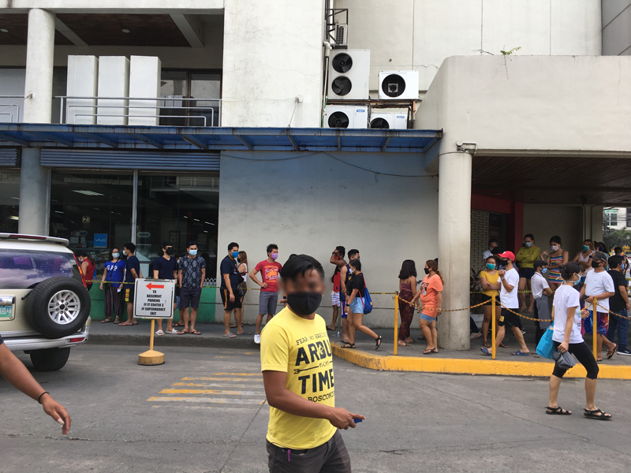
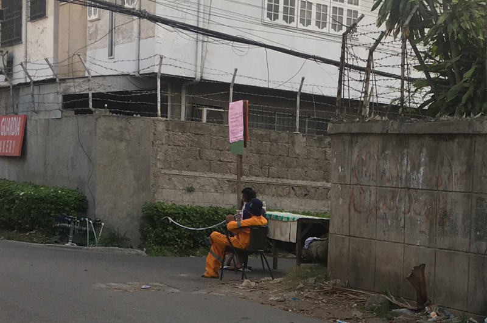
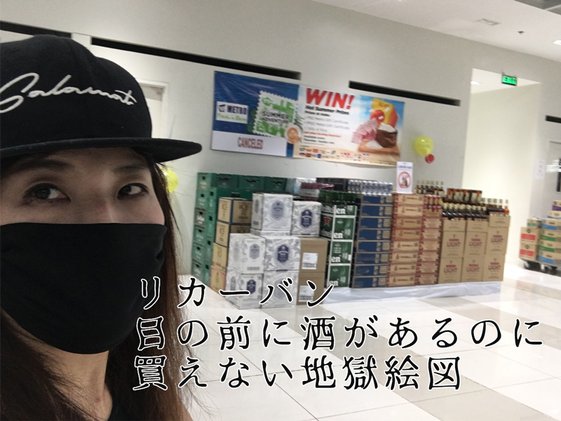
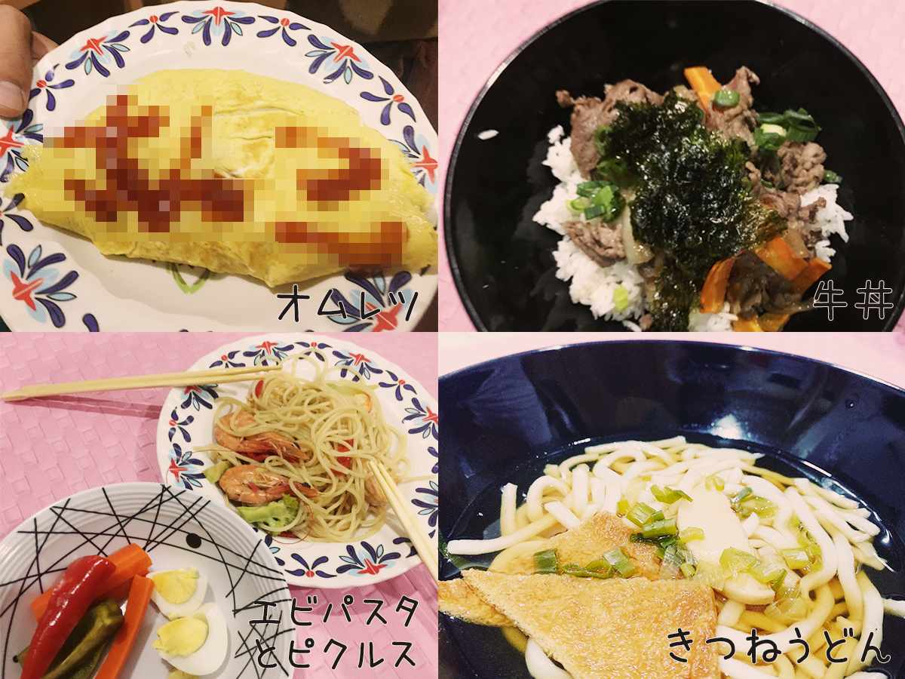
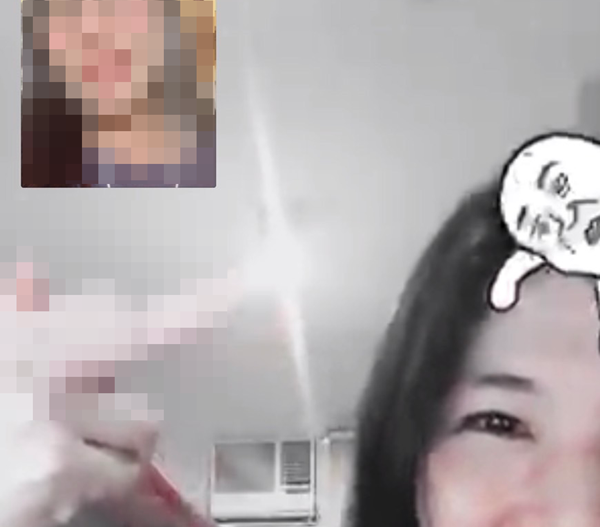

## ロックダウン：きっかけはコロナウィルスの蔓延
中国武漢から広がったコロナウィルス。大半は軽症で終わるけど、一部重症化し運が悪ければ死に至ります。その致死率0.66%で、インフルエンザの致死率が1%未満。人類とインフルエンザの戦いはコロナウィルスより長い分、抗インフルエンザ薬も開発され、体力年齢に問題なければ脅威ではありません。
人類はコロナという未知の病原体と戦う事になりました。

個人的にはヨーロッパの全人口の約3分の1を死滅させた[ペスト](https://ja.wikipedia.org/wiki/%E3%83%9A%E3%82%B9%E3%83%88%E8%8F%8C)以来の脅威ではないか？！とも思っています。

### ロックダウンの前触れ：セブシティ3月中~下旬、外出規制がかかる
セブシティーでは8時以降の外食が禁止となりました。飲食店も営業時間を短縮。飲食店でのお酒の販売も禁止。楽しみだった飲み歩きもできなくなりました。

### 3月28日：ついにセブシティロックダウン
3月28日正午、ついにロックダウンが施行されました。ロックダウンの正式名は「**Enhanced Community Quarantine（ECQ）**」です。 
4月28日正午までと言われていましたが**5月15日まで延長**されるとのこと。

4月27日私は食料の備蓄のためスーパーに行きましたが、この通りの行列。ネズミの国のアトラクションかと思いました。

## 日本とは違う！ECQで厄介なこと
フィリピンの規制は日本に比べたら相当厳しい。何がどう厄介かご紹介します。

### 外出制限・外出パスが必要になる
バランガイ（日本で言う町内会）内だけ外出可能なバランガイパスがないと外出できなくなりました。
ロックダウン（ECQ）直後、なぜか謎の在住証明書っぽいものをもらいそれを持って外に出ればいいと言われました。

しかし、実はまったく効力のないことが判明。後日きちんとバランガイパスがもらえました。

外国人だからかもしれませんが、中には未だ手配してもらえない人もいます。

町のいたるところに検問が敷かれてます。場所によっては軍隊もいてかなり物々しい状況。

少し遠出する場合は、パスだけでなく身分証明書（パスポートなど）を提示を求められる場合があります。

### 酒の販売禁止

完全にお酒は販売禁止です。私のこの国での唯一の楽しみがお酒を飲むこと。お酒ぐらい売ってくれてもいいじゃないって言いたいですよね？

人が集まったところでお酒を飲むのがフィリピン人。孤食が進む日本と違って**ソロ呑み**なんて考えられないのでしょう。お酒の販売すら、国民性が許してもらえないようです。

###
ランドリーショップが使えなくなる
フィリピンは洗濯機を持ってないお家が多いです。なので、いつも私もランドリーショップを利用しています。
ECQともにいつも使っていたランドリーショップが休業し使えなくなりました。新しいところに変えましたが、規制がさらに厳しくなり、目の前にあるのにエリアが違うので、使えなくなりました。さらに別のところに変えましたが、そこも使えなくなりそうです。

**NO パンツ、NO LIFE**。

### 頼みの綱・デリバリーで頼めるお店がごくわずか
基本外出は禁止なので、主な食事は自炊かデリバリー。軟禁生活ではご飯を食べるくらいしか楽しみがないです。

私の環境下では冷蔵庫も小さいかつ・食材を手に入れるのが困難なため、自炊は1日1回が限界です。

フィリピンでは便利なご飯のデリバリーサービスがあります。GrabとFood Pandaです。私はGrab愛用者でしたが、お店がどんどん閉まって利用できなくなりました。

フィリピン人の愛するファストフード・Jollibeeすら頼めなくなりました。

コンドミニアムにも食堂が付いているのですが、私はフィリピンの味の濃いかつ脂ギッシュな食事があまり合わないです。そのためフィリピンに来た時、結構痩せました。

食事って精神衛生上、結構大事です。

### 空港閉鎖：帰国できなくなる
ロックダウン（ECQ）により、たくさんの外国人がセブ島に足止めされました。

セブ島の空港はラプラプ島にあります。現在、空港は閉鎖されている上に、ロックダウン（ECQ）により市の行き来が容易にできなくなりました。チケットが取れたとしても、飛行機が飛ばなかったというケースもありました。現在、チャーター機は飛んでいますが通常チケットに比べたらとても高額。チケットが確実に取れるわけでもないですし、必ず飛ぶとは限らないようです。

私が一番悲しいのは、英語・IT留学でこちらに来ている人が帰れなくなっていることです。中には人生を変えようと、お金を無理して工面してきている生徒さんもいます。

チャーター機で帰ろうと思えば帰れるのでしょうが、通常のチケットに比べたら高額です。とても心苦しい限りです。

ただフィリピンや日本双方の情勢は刻々と変わり、そんな中なんとかセブ島に閉じ込められてしまった日本人を1人でも帰国させるためにチャーター機を準備するなど努力している人たちがいるのは十分理解しています。だからこそなおのこと歯がゆいです。

## ロックダウン（ECQ）だからこそ良かったこともある！
ECQとはいえ悪いことばかりではない！！ECQだから、得ること・気づけることがありました。

### 接点の少ない同僚と仲良くなれた
私は会社の寮に入っているので、別部署の同僚ととても仲良くなれました。
1人じゃ寂しいので一緒にお昼や夜ご飯を食べたり、内緒だけど特殊ルートで買い込んだお酒を一緒に飲んだりしました。

一緒にYouTubeを見たり、、、遅れてきた青春を謳歌してます。

### 料理が楽しめる
私料理が大好きで、昔からストレス発散はもっぱら大鍋料理を作ることでした。無心に玉ねぎとかみじん切りしている時が楽しいです。

ただおいしいだけではダメです。ただおいしいだけのモノを食べていたら、確実に太ります。

私は料理を作るときは、栄養バランスも考えます。脂質、タンパク質、糖質、ビタミンなど、健康オタクではありませんが、それなりに栄養バランスを考慮しています。ちなみに、私の栄養の知識は**高校生の時の家庭科から得た**ものです。

今更ですが、**両親が払ってくれた高校の授業料を1mmもムダにしてない**と我ながら感心です。

料理はセンス！出汁を使えば、香りも楽しめます。本当は盛り付けも大切にしたい。ただお腹を満たすだけだなら動物と一緒。食事は五感で楽しみたい！！！

料理が楽しすぎて、ちょっと熱くなってしまいました。

さておき、料理って手順も大切だし、プログラミングに似てます。プログラマーに料理やらせたら絶対うまいと思います。

さておき、今まで忙しすぎて料理したいっていう発想にはなりませんでしたが改めて作るととても楽しいです！

同じ寮に食べ盛りの若者が多くて作りがいがあります。

### インプット・アウトプットする時間が捻出できた！！！
これクリエーターとしてマジ大事！勉強する時間ができた。今までできなかったので嬉しい！

アウトプットはもっぱらブログでしているのですが更新頻度が増えました。このブログサイト「銀ねこアトリエ」は去年の夏・沖縄出張中にコツコツリニューアルを準備しました。

そしてやっと今年1月くらいに勢いで公開。ところが、結構致命的な実装漏れや設定ミスが多く機能していませんでした。。。やっと記事をまともにアップする時間が取れるようになり、なんとかWebサイトとして機能できるレベルまで修正できました。

今月・来月はJS、CSSを中心にインプットしたことをまとめていこうと思います！

### 日本の友達とたくさん話ができた
自宅に閉じ込められると夜暇です。なので地元の友達とオンライン飲み会とかできました！

若者が使いがちな、LINEのビデオ電話のとてもしょうもない機能も勉強のために使ってみました。会話がまったく成立してないのに楽しかったです。

### 家族と話しできた
普段忙しい、時間帯が合わなくて家族と話しできてませんでしたが時間が捻出でき、たくさん話しができました。

私実は4人兄弟。日本にいた頃は、盆と正月は潰れるまで家族で酒を飲むのが恒例行事でした。もちろん、朝から迎え酒です。

いつか日本に帰ったらお父ちゃん、お母ちゃん、ねーちゃん（独身）、息子で死ぬほど酒を飲みたい。息子が参戦できるようになったのは嬉しいですね。両親が健在なうちに実現したいです！！

### 自分を見つめ直す時間ができた
あと、規制されることで夜など時間に余裕ができました。
今まで忙しすぎて見えてなかったことが見えてきました。ときに人は、立ち止まるのも大切ですね。

## さいごに・こんな状況だから何ができる人間になるかを考える
私は、場所が変わろうがパソコンがあってネットさえつながれば仕事ができる人間です。ロックダウンで自宅軟禁になりましたが、現在もバリバリ働いて相変わらず納期に追われてます。

ただ、もし私が以前のようにメイクさんで現在の状況に陥っていたら、完全に職を失い路頭に迷っていました。自分が10年前に思い切って職種を変えたことは正しかったと思っています。

今回、フィリピンでも大量解雇などで失業者が増えたことと思います。人と直接合わないと成立しない仕事をしている人にとってはとても危機的状況だと思っています。おそらく、日本でもたくさんの会社が倒産すると思います。たくさんの失業者、そして悲しいですが最悪自殺者も増えると予想します。

コロナをきっかけに働き方や生活が世界規模で大きく変わっていく。変化に順応できることが生き残る術と痛感しています。

この先、世界が完全に以前のように戻るとは正直思っていません。人類は今から学び、第二、第三のコロナが発症した時に生き残らなければならないので。

オンラインでできることだってたくさんあります。悲観せず、この状況下でできることを探すしかないと考えています。

最後までお読みいただきありがとうございました。
