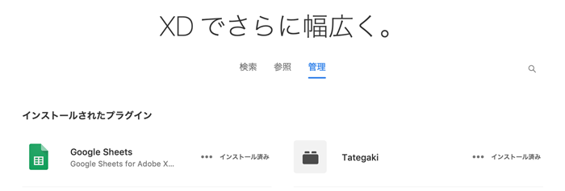
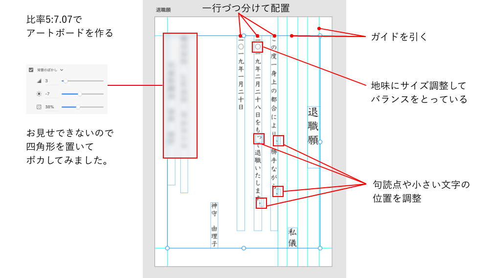
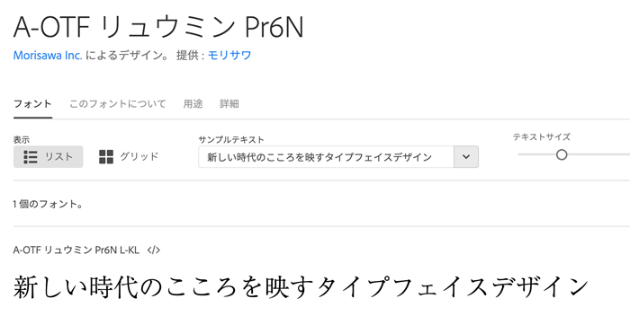
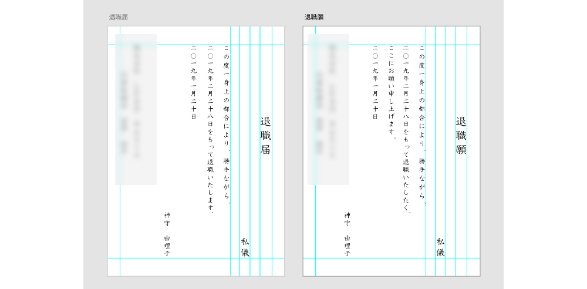
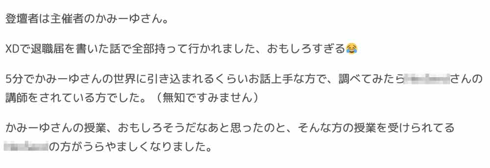

みなさん、仕事は楽しいですか？

私はロックダウンのせいで不眠症ですがまあ楽しく仕事できていると思います。

2019年、セブ島でXD勉強会を開催させいただき、僭越ながら私もLTでXDの使い道を紹介させていただきました。最終的に退職届を作った話まで披露して大変ご好評いただきました。

もう1年半前の話ですし、せっかくなので差し障りない程度に経緯を話しておこうかと思います。

<prof></prof>

<toc id="/blogs/entry368/"></toc>

## まずは、辞めようと思った経緯から
会社を退職する経緯からお話しします。この説明抜きでは「XDで退職届を作った話」を語れませんので。
### その1：信頼し背中を預けられると思っていたヤツが辞める
私が職業訓練校の講師をしていた時、見つけて引き抜いたヤツがいました。

仕事に愚直かつ、とても信頼の置ける人間でした。そういう姿勢に惚れたので引き抜きました。

こいつしか私の背中を預けることはできないと言っても過言ではなかったです。  

ところがある日、彼は辞職を余儀なくされました。とても残念でした。

### その2：海外で実力を試したかった
こう見えてもエンジニアの端くれで、やっぱり英語圏の優れたエンジニアと働いてみたい、実力を試したいという欲求があります。実は私の密かな夢でした。

「実力を試したい」という部分に関しては正直年齢的には厳しいので、半ば諦めてました。

転職が決まり、業務自体はエンジニア講師でのオファーでした。

私のモットーで**価値をずらして理想に近いことをする**という考えがあります。なので、海外で働けることは大きな一歩でした。

### その3：口減らしされそうになる
実はシニアエンジニアの私、一番お金がかかります。事業買取に巻き込まれ、*心の底から好きで入った会社ではなく*、お給料ぐらいは保証して欲しかったのですが、影で外部パートナーの話が持ち上がっているのを小耳に挟みました。

私はすでに内定が決まっていたのもあり、退職の意思を伝えようと決断していました。

## どうせ作るならサイコーにイケてる退職届作ってやろう
用意した退職届にサインさせられるのなんてまっぴらごめんでした。

そして、どうせならWord（Microsoftさん、ごめんちゃい）で作成されたダサい書式なんて使いたくないので、長年お世話になっている大好きなAdobeのツールを使って作成することにしました。

**退職届を作成するために選んだツールはXD**です。  

**日本中探してもXDで退職届を作ったのは私だけと自負**しています。

### XDを選んだ深い？ワケ
実は私、広島のXDUG（ユーザーグループ）の立上げ人です。私のセブ島行きが決まってたので、地元の仲間に押し付けて出て行きました。

まあ、要はXDが大好きなんですよ。なのでXDを使って退職届を作ったらどうなるかやってみたかっただけなんです。

3つの課題がありました。

### 課題その1：縦書きをどうするか？
XDはそもそもプロトタイプツールで文書を作るためのツールではないので縦書きが存在しません。どうしたものかと考えて使ったのが「**縦書きプラグイン**」です。

このプラグイン、ただ改行を入れて縦書きを実現しているだけなので句読点の位置が微妙。

なので、別にテキストボックスを配置して句読点の位置を調整しました。

字詰できないのが結構苦痛で、めちゃ大変でした。 
実際のアートボードはこんな感じです。

### 課題その2：イケてるフォントを使いたい
最近サイトを見ると游明朝とかよく見るけど、どうせならサイコーにイケてる明朝体で作りたいと思ったので、友達のデザイナーにどの明朝体が一体イケてるか相談しました。

そこで「**モリサワ A-OTF リュウミン**」を使うことに。

[モリサワ A-OTF リュウミン | Adobe Font](https://fonts.adobe.com/fonts/a-otf-ryumin-pr6n)

### 課題その3：出すタイミングをどうするか？
4月からセブ島勤務が決まっていたので、逆算して辞めるタイミングを考えて1月末には提出することにしました。

勉強会では「**勇気が必要**」と言いましたが、未来を決めていた私にとっては実は大した問題ではありませんでした。

### 退職届を作った感想
備えあれば憂いなし！退職願と退職届の2つを用意したせいもあり、想像以上に時間と手間がかかりました。

最後はPDF出力して印刷すればオッケーです。
これで終わりではありません。きちんと自分の名前の下に押印するのを忘れないでください。

WordやGoogleドキュメントを使えばこんな苦労する必要もなく、数分で作成できていることも分かってます。

**それでもXDを使いたかったAdobeへの製品愛**だけご理解いただければ幸いです。

## 晴れて退職しました！
晴れて無事、会社を退職することができました。

外部パートナーの話が出る前に迷わず「退職届」の方を提出させていただきました。

ちなみに余談ですが、退職届は一度出すと取り消せないのが特徴です。  

もちろん前の会社では仲間と苦楽を共にした、いい思い出もたくさんあります。

ランチタイムに「ジョハリの窓」をやったり、どんな女がモテるか探るため「マトリクス図」を作ったり、業後に「カープの試合」を見に行ったり。

たくさんのキツイ案件がこなせたのもやっぱり仲間のおかげかなーと今更ながら思い返します。

一応稼ぎ頭でしたし、フロントエンドエンジニアとしてとてもやる気は感じていました。

そしてテクニカルディレクターとして、みんなに何があっても最後の砦になると心に決めて仕事していました。

フリーランスだった私が仲間と仕事する楽しさや、Web制作でチーム力の重要性を学ぶことができとても感謝しています。

## 2019年12月セブ島でXDの勉強会を開き、このネタぶっこんだらやっぱりウケましたw
昨年セブ島のオフショア会社Vananazさんと日本のXDUGの協力の下、XDのオンライン勉強会を開かせていただきました。

当日は私もLTを一本持たせていただき、エンジニアなりのXDの使い道などをご紹介させていただいた中、この退職届を作った話もぶっこませていただきました。

* [XDUG](https://xdug.jp/)
* [広島XDUG](https://xdug.jp/hiroshima/)
* [当日のTwitterまとめの様子はこちら](https://twitter.com/hashtag/XDCebu?src=hashtag_click&f=live)

↓↓当日のスライドはこちら↓↓

* [こんなところで使えるのXD活用法｜20191208 XD勉強会 in セブ島 | Slide Share](https://www2.slideshare.net/yurikamimori/xd20191208-xd-in)

広島の友達たちは相変わらずゆるゆるで途中もぐもぐタイムとか挟みつつ、豪華にも湯口さんやたーさんなどにもご登壇いただき、とてもご協力感謝します。

### 嬉しいコメントも！！
当日参加されていた方が私のLTの様子をブログに書いてくださってました。

「おもしろすぎる」。ありがとうございますww

## まとめ
退職というと結構ネガティブなイメージですが、転職って新しい出会いがあったりしてワクワクします。

会社を辞めてなければ、今の会社でものすごい奴らにも出会えてなかったですし。セブ島はロックダウンさえなければ出会いの宝庫です。

最後までお読みいただきありがとうございました。

## おまけ・XD退職届のDLはこちらから
せっかくなのでXDの退職届と退職願のテンプレートを作りました！GitHubからダウンロード可能です。ご利用の際は*捺印*と*勇気*をお忘れなく。

<a class="p-btn--detail" href="https://github.com/yuririn/resignation-xd" target="_blank" rel="noopener">データダウンロード</a>

