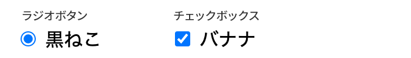
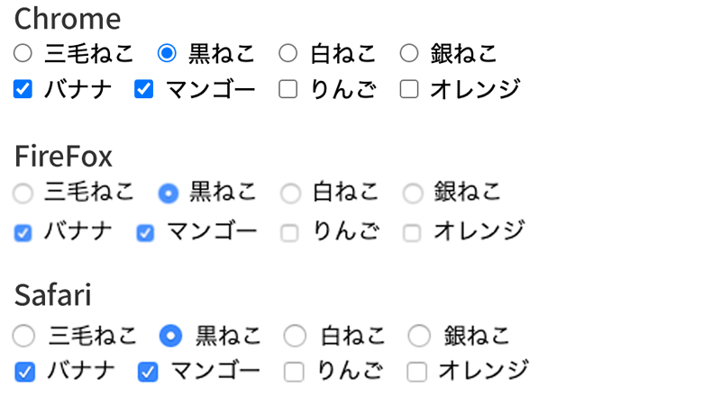
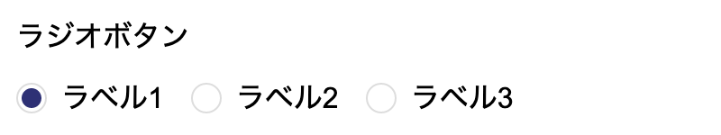
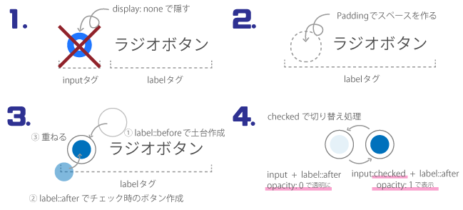
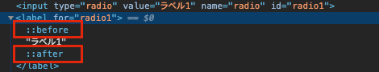
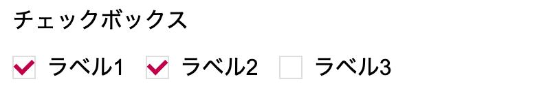
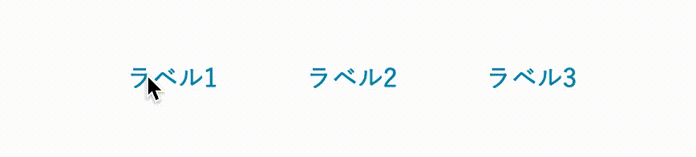
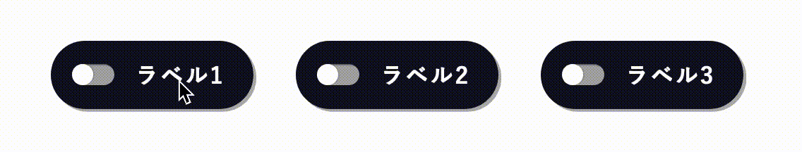
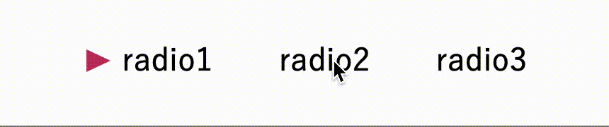

CSSでラジオボタン・チェックボックスの見た目を変える方法を詳しく解説しました。

HTML/CSSを勉強中の方、趣味などでウェブサイトを運用したり少し知識のある方に向けた記事です。

ラジオボタン・チェックボックスのカスタマイズ方法が理解できたらオリジナルを作れるようになります。

*とにかくすぐ使いたい！* という人は目次を参考にスニペット（コードサンプル）をコピペして使ってください。

WordPressのフォーム用プラグイン、MW WP FormとContact Form 7に対応したコードのおまけ付き。

<prof></prof>

<toc id="/blogs/entry370/"></toc>


## ラジオボタン・チェックボックスはそのままだとまったく可愛くない！
カスタマイズする理由から。

1つめ。ズバリ「見た目がよくなるから」です。HTMLのタグはCSS未使用の場合、各ブラウザに用意されているスタイルが適応されています。ラジオボタン、チェックボックスも同様です。<br>
プレーンな状態で使うと次の通り青色で質素。このままだとウェブサイトのデザインによっては合わないし、カスタマイズした方がいいのは言うまでもありませんね。



2つめ。「各ブラウザごとに用意されているラジオボタン・チェックボックスなどのスタイルが違うから」です。<br>
各ブラウザごとのラジオボタンやチェックボックスを比べてみてます（私のマシンがMacなのでIE、Edgeは確認していません）。<br>
比較すると本当にわずかですが細かい違いがわかります。ディスクトップだとIEやEdge、モバイルでもっと違うと思います。



カスタマイズするメリットは見た目もよくなり、誰がどのブラウザで見てもデザインがブレないことです。

デメリットとしてはいつもよりコードをたくさん書く必要があります。<br>
まあ、大した量ではないので大丈夫です。

## アクセシビリティを考慮してラジオボタン・チェックボックスをコーディングしよう（HTML）
通常のラジオボタン・チェックボックスの書き方です。<br>
ラジオボタン・チェックボックスのボタンは直径10px程度で小さく、とくにスマフォでのタップ操作がかなり厳しいです。**Googleの推奨するボタンサイズが縦横44px以上** 。なので私は文字をクリック（もしくはタップ）したときにチェックできるよう、必ずlabelタグとセットで使います。

labelの使ったコーディング方法は2通りあります。

### labelタグとinputタグを分ける方法
inputタグとlabelタグを紐づけるとlabelタグをタップしただけでチェックできるようになります。
inputタグにid属性、labelタグにfor属性を追加します。両方同じ値にします。

```html
<input type="radio" value="malticolor" name="cat" >三毛ねこ</label>
```
### labelタグの中に入れてしまう方法
inputタグをlabelタグの中に入れてしまいます。属性を追加しなくていいので楽チンです。

```html
<label><input type="radio" value="malticolor" name="cat">三毛ねこ</label>
```

## 基本のラジオボタン・チェックボックスをCSSでカスタマイズ
### ラジオボタンをカスタマイズ
labelタグとinputを分ける書き方でスタイリングしてみます。


手順としては4ステップ。

1. inputタグを隠す（display: none）
2. labelタグ内にボタンを置くスペースを作る
3. 擬似要素before、afterを使ってラジオボタンの各パーツを作る
4. 擬似クラスを使ってチェックが入った時にスタイルを変える



<small>※ 今回はCSS設計などは無視します。</small>

`display`を`none`に指定しますのでinputタグそのものは操作できなくなりますが、labelタグをクリックorタップすればそれに紐づいたinputタグもチェックが入った状態にできます。<br>
inputタグとlabelタグは隣接しているので隣接セレクターが利用できます。チェックが入った状態のinputタグのすぐ次の要素へスタイリングができます。<br>
擬似要素・beforeの上に重ねたafterの`opacity`を0にして隠しておき、チェックがついたら1にすることで表示します。

ボタン用のbefore&afterは高さと幅を持った要素を作るためには`dispplay`を`block`か`inline-block`あたりに設定しておくのを忘れずに。

```html:title=HTML
<p class="radio-btns">
  <input type="radio" value="ラベル1" name="radio" id="radio1"><label for="radio1">ラベル1</label>
  <input type="radio" value="ラベル2" name="radio" id="radio2"><label for="radio2">ラベル2</label>
  <input type="radio" value="ラベル3" name="radio" id="radio3"><label for="radio3">ラベル3</label>
</p>
```
```css:title=CSS
label ~ label {
  margin-left: 15px;
}

input[type=radio] {
  margin-right: 8px;
}

/* ラジオボタン */
.radio-btns input[type=radio] {
  display: none;
}

.radio-btns label {
  position: relative;
  padding-left: 25px;
}

.radio-btns input[type=radio] + label::before {
  position: absolute;
  content: '';
  display: block;
  width: 15px;
  height: 15px;
  border-radius: 50%;
  background: #fff;
  border: 1px solid #ddd;
  left: 0;
  top: 0;
}

.radio-btns input[type=radio] + label::after {
  position: absolute;
  content: '';
  display: block;
  width: 11px;
  height: 11px;
  border-radius: 50%;
  background: #2e3175;
  left: 3px;
  top: 3px;
  opacity: 0;
  transition: .3s;
}

.radio-btns input[type=radio]:checked + label::after {
 opacity: 1;
}
```

ポイントは「**擬似要素**」「**擬似クラス**」「**隣接セレクター**」です。

#### 擬似要素
擬似要素を使うと要素内に擬似的に要素を作ることができます。擬似要素の中にbeforeとafterがあります。beforeは要素内の最初、afterは最後に要素を追加できます。
contentプロパティがセットで、値に文字なども追加できます。ちなみに擬似要素を指定するときは::（コロン2つ）を使用します。



```css
element::before {
  content: 'こんにちは';
}
```
inputタグや、brタグのように中にコンテンツを内包できないタグには擬似要素が追加できないことを念頭に置いておきましょう。

#### 擬似クラス
擬似クラスを使うとそのタグの特定の状態を指定できます。この場合だとラジオボタンに「チェックが入った状態」のcheckedを使います。擬似クラスを指定するときは:（コロン1つ）を使います。

```css
element:checked
```
#### 隣接セレクター
となり合った要素の指定方法です。要素同士を ＋（プラス）で繋ぎます。

```css
element + element
```
### チェックボックスも同じHTMLの構成でスタイリング

上に重ねる擬似要素afterを利用してチェックマークを作ります。
今回は特別な素材を用意せず、borderとtransform（変形）のrotate（回転）を利用してCSSのみで作ります。


```css
display: block;
width: 6px;
height: 10px;
transform: rotate(45deg); /*四角を45度傾ける*/
border-right: 3px solid #c2004a;
border-bottom: 3px solid #c2004a;
```
```html:title=HTML
<p class="check-btns">
  <input type="checkbox" value="ラベル1" name="check" id="check1"><label for="check1">ラベル1</label><input type="checkbox" value="ラベル2" name="check" id="check2"><label for="check2">ラベル2</label><input type="checkbox" value="ラベル3" name="check" id="check3"><label for="check3">ラベル3</label>
</p>
```
```css:title=CSS
label ~ label {
  margin-left: 15px;
}

input[type=checkbox] {
  margin-right: 8px;
}

/* ベースのチェックボックス */
.check-btns input[type=checkbox] {
  display: none;
}

.check-btns label {
  position: relative;
  padding-left: 25px;
}

.check-btns input[type=checkbox]  + label::before {
  position: absolute;
  content: '';
  display: block;
  width: 15px;
  height: 15px;
  background: #fff;
  border: 1px solid #ddd;
  left: 0;
  top: 0;
}

.check-btns input[type=checkbox]  + label::after {
  position: absolute;
  content: '';
  display: block;
  width: 6px;
  height: 10px;
  transform: rotate(45deg);
  border-right: 3px solid #c2004a;
  border-bottom: 3px solid #c2004a;
  left: 4px;
  top: 0;
  opacity: 0;
  transition: .3s;
}

.check-btns input[type=checkbox]:checked + label::after {
  opacity: 1;
}
```
### labelタグに入れ子にする場合
入れ子にする場合は、文字をspanタグなどのなかに入れます。
擬似要素を作るために必要です。

## ラジオボタン・チェックボックスのスニペット（サンプルコード）
CodePenにいくつかコードを掲載しています。興味ある方はコピペで使ってみてください。

HTMLはこちらを共通で使います。
```html
<!--チェックボックス-->
<p class="check-btns">
  <input type="checkbox" value="ラベル1" name="check" id="check1"><label for="check1">ラベル1</label><input type="checkbox" value="ラベル2" name="check" id="check2"><label for="check2">ラベル2</label><input type="checkbox" value="ラベル3" name="check" id="check3"><label for="check3">ラベル3</label>
</p>
<!--ラジオボタン-->
<p class="radio-btns">
  <input type="radio" value="ラベル1" name="radio" id="radio1"><label for="radio1">ラベル1</label><input type="radio" value="ラベル2" name="radio" id="radio2"><label for="radio2">ラベル2</label><input type="radio" value="ラベル3" name="radio" id="radio3"><label for="radio3">ラベル3</label>
</p>
```
### ズームしながら出現するチェックボックス


```css:title=CSS
label ~ label {
  margin-left: 30px;
}

/* ベースのチェックボックス */
.check-btns input[type=checkbox] {
  display: none;
}

.check-btns label {
  position: relative;
  padding-left: 25px;
}

.check-btns input[type=checkbox]  + label::before {
  position: absolute;
  content: '';
  display: block;
  width: 21px;
  height: 21px;
  background: #ddd;
  left: 0;
  top: -3px;
}

.check-btns input[type=checkbox]  + label::after {
  position: absolute;
  content: '';
  display: block;
  width: 8px;
  height: 12px;
  transform: rotate(45deg) scale(0, 0);
  border-right: 3px solid #c2004a;
  border-bottom: 3px solid #c2004a;
  left: 5px;
  top: -2px;
  transition: .3s;

}

.check-btns input[type=checkbox]:checked + label::after {
    transform: rotate(45deg) scale(1, 1);
}
```

[デモ : ズームしながら出現するチェックボックス CodePen](https://codepen.io/camile/pen/LYGrQJR)

### 波紋が広がるラジオボタン


```css:title=CSS
label ~ label {
  margin-left: 30px;
}/* ベースのラジオボタン */

.radio-btns input[type=radio] {
  display: none;
}

.radio-btns label {
  position: relative;
  padding-left: 25px;
  color: #138eb0;
  z-index: 1;
}

.radio-btns input[type=radio]  + label::before,
.radio-btns input[type=radio]  + label::after {
  position: absolute;
  content: '';
  display: block;
  width: 21px;
  height: 21px;
  border-radius: 50%;
  background: #b1ecfc;
  left: 0;
  top: -3px;
  z-index: -1;
  transform: scale(0, 0);
}

/* 波紋のパート */
.radio-btns input[type=radio]  + label::before {
  background: radial-gradient(transparent, #b1ecfc);/*円形グラデーション*/
}

.radio-btns input[type=radio]:checked + label::before {
  animation: spread-bubble .8s linear;
  animation-iteration-count: 2;
}

.radio-btns input[type=radio]  + label::after {
  background: #49aec9;
  transition: .3s;
  opacity: 0;
}

.radio-btns input[type=radio]:checked + label::after {
  transform: scale(1, 1);
  opacity: 1;
}

/* 波紋のアニメーション */
@keyframes spread-bubble {
  0% {
    opacity: 0;
  }
  50% {
    transform: scale(2, 2);
    opacity: 1;
  }
  100% {
    transform: scale(4, 4);
    opacity: 0;
  }
}

```
[デモ : 波紋が広がるラジオボタン｜CodePen](https://codepen.io/camile/pen/bGEKvVz)

### スマフォやアプリに使えるラジオボタン


```css:title=CSS
label ~ label {
  margin-left: 30px;
}

/* ベースのラジオボタン */
.radio-btns input[type=radio] {
  display: none;
}

.radio-btns label {
  position: relative;
  padding: 15px 20px 15px 60px;
  display: inline-block;
  color: #fff;
  font-weight: bold;
  background: #111122;
  letter-spacing: 0.1em;
  border-radius: 50px;
  box-shadow: 2px 2px 0 rgba(0, 0, 0, .3);
}

.radio-btns input[type=radio]  + label::before,
.radio-btns input[type=radio]  + label::after {
  position: absolute;
  content: '';
  display: block;
  left: 15px;
  top: 50%;
  transform: translateY(-50%);
}

/* 下 */
.radio-btns input[type=radio]  + label::before {
  width: 30px;
  height: 15px;
  border-radius: 30px;
  display: block;
  background: #aaa;
  box-shadow: inset 1px 1px 0 rgba(0, 0, 0, .3);
}

.radio-btns input[type=radio]  + label::after {
  height: 15px;
  width: 15px;
  background: #fff;
  border-radius: 15px;
  box-shadow: 1px 0 0 rgba(0, 0, 0, .1);
  transition: .1s;
}

.radio-btns input[type=radio]:checked + label::after {
  left: 30px;
  box-shadow: -1px 0 0 rgba(0, 0, 0, .1);
  background: #ff3b42;
}

.radio-btns input[type=radio]:checked + label {
  background: #1f1f52;
}
```
[デモ : スマフォやアプリに使えるラジオボタン｜CodePen](https://codepen.io/camile/pen/JjGZLyy)
### スピンしながらチェックが入るラジオボタン

```css:title=CSS
.radio label {
  position: relative;
  padding-left: 25px;
  display: inline-block;
}

.radio label ~ label{
  margin-left: 15px;
}

.radio input[type=radio] {
  display: none;
}

.radio input[type=radio] + span::before {
  content: "";
  display: block;
  left: 0;
  top: 13px;
  position: absolute;
  border-top: 8px solid transparent;
  border-left: 17px solid #c03363;
  border-bottom: 8px solid transparent;
  opacity: 0;
  transition: .3s;
}

.radio input[type=radio]:checked+span::before {
  transform: rotateX(540deg);
  opacity: 1;
}
```
[デモ : スピンしながらチェックが入るラジオボタン｜CodePen](https://codepen.io/camile/pen/QWyBLgr)

## WordPressのフォームのカスタマイズ方法
MW WP FormとContact Form 7でのフォームのカスタマイズ法もご紹介しています。
記事が長くなってしまったので以下にまとめてます。

よろしければ合わせてご一読ください。

<card id="/blogs/entry374/"></card>

## まとめ
ラジオボタン、チェックボックスのカスタマイズって結構勉強になるんです。HTMLの親子関係、CSSの擬似クラス、セレクターの種類なんかも覚えられますしね。なんどもやっているうちに、頭に入ってくるのでオススメです。

セレクトボックスのカスタマイズ方法も追加しました！！こちらも合わせてお読みください。

<card id="/blogs/entry393/"></card>

さらにボタンのCSSスニペットの記事も追加しました！！

<card id="/blogs/entry396/"></card>

みなさんのコーディングライフの一助となれば幸いです。

最後までお読みいただきありがとうございました。
