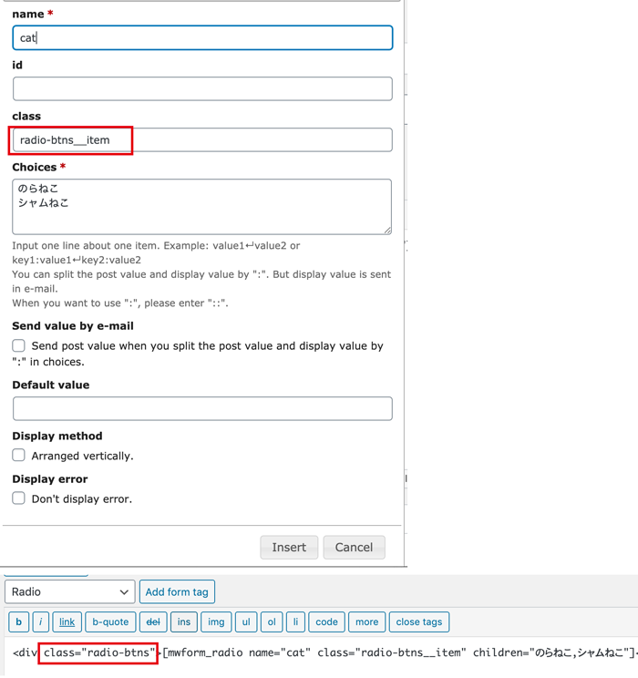
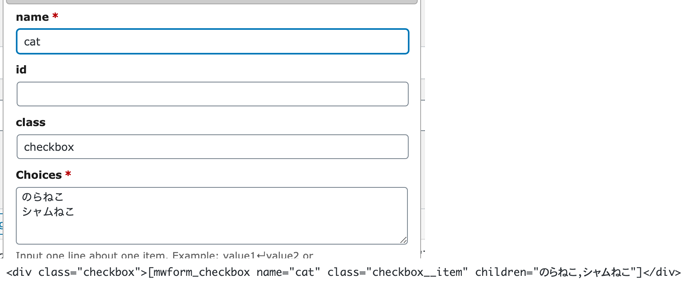
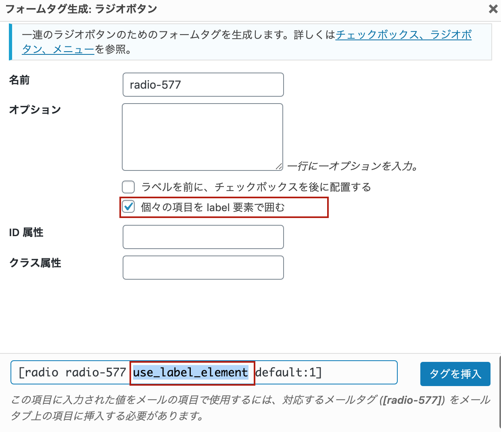
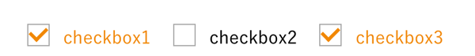

## 普通にラジオボタン・チェックボックスのカスタマイズだけ知りたい
ラジオボタン・チェックボックスのカスタマイズだけが知りたい方はこちらの記事をお読みください。スニペット（サンプルコード）も随時追加中です。

<card id="/blogs/entry370"></card>

## MW WP Form のラジオボタン・チェックボックス
MW WP Form は日本製のとても便利なフォームプラグイン。お問い合わせの内容をDBに保存できたり特にカスタマイズしなくても、最初から機能豊富。よく使います。

[MW WP Formプラグイン詳細](https://ja.wordpress.org/plugins/mw-wp-form/)

このプラグインではあらかじめ用意されたショートタグというものをテキストエディターに貼り付けてフォームのパーツを作って行きます。

### MW WP Form ラジオボタンのカスタマイズ法

#### HTML
ショートタグを設定するとこんな感じでHTMLが出力されます。

```html
<span class="mwform-radio-field  horizontal-item">
  <label>
  <input name="cat" type="radio" value="のらねこ" />
  <span class="mwform-radio-field-text">のらねこ</span>
  </label>
</span>
<input name="__children[cat][]" type="hidden" value="{}" />
  <span class="mwform-radio-field  horizontal-item">
  <label>
  <input class="Form__controll--radio" name="cat" type="radio" value="シャムねこ" />
  <span class="mwform-radio-field-text">シャムねこ</span>
  </label>
</span>
<input name="__children[cat][]" type="hidden" value="{}" />
```
### CSS
デフォルトではこんな感じで設定されてます。

```css
.mw_wp_form .horizontal-item {
  margin-right: 10px;
  display: inline-block;
  margin-bottom: 8px;
}

.mwform-radio-field label {
  font-weight: normal;
  margin-bottom: 0;
}

.mwform-radio-field input {
  margin-right: 5px;
}
```
まずはラジオボタンをこんな感じに変えようと思います。


基本のラジオボタン・チェックボックスのカスタマイズ方法同様、inputタグを`display:none`で消して隣接するspanタグの擬似要素before、afterを追加してカスタマイズします。

`!important`をできるだけ使わずショートタグをタグでラッピングしクラスをつけてスタイリングしていくと良いです。

クラスを付与するためにショートコードを挿入する時に以下のような設定にしておきましょう。



```css
/* ラジオボタンを隠す */
.radio-btns input[type=radio].radio-btns__item{
  display: none;
}

.radio-btns label {
  display: inline-block;
}

/* spanの左側にボタンを配置するスペースを作る */
.radio-btns .radio-btns__item + span {
  padding-left: 2em;
  display: inline-block;
  position: relative;
}

/* 各パーツを作成 */
.radio-btns .radio-btns__item + span::after,
.radio-btns .radio-btns__item + span::before {
  content: '';
  display: block;
  position: absolute;
  border: 1px solid #AAAAAA;
  border-radius: 50%;
  width: 20px;
  height: 20px;
  top: 0;
  left: 0;
}

/* after上書き */
.radio-btns .radio-btns__item + span::after
  opacity: 0;
  width: 14px;
  height: 14px;
  top: 3px;
  left: 3px;
  border: none;
  background: #f18800;
}

/*
  checked状態
  文字のcolorとボタンのopacityを変更
*/
.radio-btns .radio-btns__item:checked + span {
  color: #f18800;
}

.radio-btns .radio-btns__item:checked + span::after {
  opacity: 1;
}
```

### MW WP Form チェックボックス のカスタマイズ法
checkboxの場合、単純にクラス名がmwform-checkbox-fieldに変わるだけです。



仕上がりイメージはこんな感じ。


```css
.checkbox input[type=checkbox].checkbox__item{
  display: none;
}

.checkbox label {
  display: inline-block;
}

/* spanの左側にボタンを配置するスペースを作る */
.checkbox .checkbox__item + span {
  padding-left: 2em;
  display: inline-block;
  position: relative;
}

/* 各パーツを作成 */
.checkbox .checkbox__item + span::after,
.checkbox .checkbox__item + span::before {
  content: '';
  display: block;
  position: absolute;
  border: 1px solid #AAAAAA;
  width: 20px;
  height: 20px;
  top: 0;
  left: 0;
}

/* after上書き */
.checkbox .checkbox__item + span::after {
  opacity: 0;
  width: 10px;
  height: 15px;
  transform: rotate(45deg);
  left: 5px;
  border: none;
  border-right: 3px solid #f18800;
  border-bottom: 3px solid #f18800;
}

/*
  checked状態
  文字のcolorとボタンのopacityを変更
*/
.checkbox .checkbox__item:checked + span {
  color: #f18800;
}

.checkbox .checkbox__item:checked + span::after {
  opacity: 1;
}
```
## Contact Form 7のラジオボタン・チェックボックス
Contact Form 7は私Web制作を始めてすぐにお世話になったプラグインです。<br>
Ajaxによるフォーム送信するところとか、個人的に心が熱くなります。

[Contact Form 7プラグイン詳細](https://ja.wordpress.org/plugins/contact-form-7/)

### Contact Form 7ラジオボタンのカスタマイズ法
まずはどんなHTMLが吐き出されるかを見てみましょう。<br>
かなり深いspanでできた入れ子構造のHTMLが吐き出されます。

スマフォ対応のため、ラベルごとクリックできるようにlabelで要素を囲むにチェックを入れておくことをおススメします。



#### HTML
```html
<span class="wpcf7-form-control-wrap radio-577">
  <span class="wpcf7-form-control wpcf7-radio"><span class="wpcf7-list-item first"><label><input checked="checked" name="radio-577" type="radio" value="radio1" /><span class="wpcf7-list-item-label">radio1</span></label></span>
  <span class="wpcf7-list-item"><label><input name="radio-577" type="radio" value="radio2" /><span class="wpcf7-list-item-label">radio2</span></label></span>
  <span class="wpcf7-list-item last"><label><input name="radio-577" type="radio" value="radio3" /><span class="wpcf7-list-item-label">radio3</span></label></span></span>
</span>
```
#### CSS

```css
.wpcf7-form-control-wrap {
  position: relative;
}
span.wpcf7-list-item {
  display: inline-block;
  margin: 0 0 0 1em;
}
label {
  display: block;
  font-size: 1.6rem;
  font-weight: 400;
  margin: 0 0 0.5rem 0;
}
span.wpcf7-list-item-label::before, span.wpcf7-list-item-label::after {
  content: " ";
}
```


### Contact Form 7 チェックボックスカスタマイズ法
チェックボックスもラジオボタン同様、個々の項目をlabel要素で囲むようにすることをオススメします。

出力されるHTMLはラジオボタンと構造は一緒です。全体のラッパーの名前が違うくらい。相変わらずネスト（入れ子）が深いです。

#### HTML
```html
<span class="wpcf7-form-control-wrap checkbox-648">
  <span class="wpcf7-form-control wpcf7-checkbox">
    <span class="wpcf7-list-item first"></label></input name="checkbox-648[]" type="checkbox" value="checkbox1" /><span class="wpcf7-list-item-label">checkbox1</span></span>
    <span class="wpcf7-list-item"></label></input name="checkbox-648[]" type="checkbox" value="checkbox2" /><span class="wpcf7-list-item-label">checkbox2</span></span>
    <span class="wpcf7-list-item last"></label></input name="checkbox-648[]" type="checkbox" value="checkbox3" /><span class="wpcf7-list-item-label">checkbox3</span></span>
  </span>
</span>
```
#### CSS
```css
.checkbox input[type=checkbox]{
  display: none;
}

.checkbox span.wpcf7-list-item {
 margin-left: 0;
}

.checkbox  span.wpcf7-list-item ~ span.wpcf7-list-item {
  margin-left: 20px;
}

/* spanの左側にボタンを配置するスペースを作る */
.checkbox input[type=checkbox] + .wpcf7-list-item-label {
  padding-left: 2em;
  display: inline-block;
  position: relative;
}

/* 各パーツを作成 */
.checkbox input[type=checkbox] + .wpcf7-list-item-label::after,
.checkbox input[type=checkbox] + .wpcf7-list-item-label::before {
  content: '';
  display: block;
  position: absolute;
  border: 1px solid #AAAAAA;
  width: 20px;
  height: 20px;
  top: 0;
  left: 0;
}

/* after上書き */
.checkbox input[type=checkbox] + .wpcf7-list-item-label::after {
  opacity: 0;
  width: 10px;
  height: 15px;
  transform: rotate(45deg);
  left: 5px;
  border: none;
  border-right: 3px solid #f18800;
  border-bottom: 3px solid #f18800;
}

/*
  checked状態
  文字のcolorとボタンのopacityを変更
*/
.checkbox input[type=checkbox]:checked + .wpcf7-list-item-label {
  color: #f18800;
}
.checkbox input[type=checkbox]:checked + .wpcf7-list-item-label::after {
  opacity: 1;
}
```


## まとめ
WordPressのプラグインもどんなHTMLが出力され、どうCSSが効いているか分ればカスタマイズも問題なくできます。

わからないうちはとりあえずコピペで、分かってきたらコードを徐々に改造してみてください。

最後までお読みいただきありがとうございました。
