## 今すぐWordPressでブログを始めたい人へ
あなたはどんな理由でブログを始めようと思いますか？

* アフェリエイト収入が欲しい
* WordPressやウェブ制作の勉強をしたい
* 有名になりたい
* 日々のログを書きたい


とりあえずブログを始めたいのであれば、まず無料のアメブロみたいなサービスを使うかWordPressのようなソフトを自分でセッティングして使うかの二択。

WordPressを使うメリットとデメリットを知ってどうするか判断しましょ！

### WordPressでブログを書くメリットとデメリットを知る
WordPressでブログをするメリットは利益が生まれた時、ドメインも書いた記事も全て自分のものなので独占できます。

アメブロやはてブはブログを書ける環境をすぐ用意できますが、制約に従う必要があります。


|メリット|デメリット|
|-|-|
|タダ初期費用はサーバー料金のみ	|分で調べて設定しないといけない。サーバーの準備や各種インストールが必要|
|コンテンツはすべて自分の資産になる<br>※「アメブロ」や「はてブ」などのブログサービスはすべて無料で使える代わり自由度はない。禁止事項などの制約もある。|人気な分誰もが知っているのでセキュリティーを怠るとハッカーの標的になる|

### WordPressブログ開設のためにざっくり何をする必要があるか把握する
WordPressでブログを始めるためにすべきことがあります。
以下を2回に分けて解説してます。


* サーバーの準備（ドメインの反映に時間かかるよ）
* **WordPressインストール**（← 前半はここまで）
* WordPressの各種設定をしていこう
* WordPressのブログを書くための準備
* 記事を書いてみよう
* Analytics、search consoleの準備と設置

↓↓↓後半はこちら↓↓↓

<card id="/blogs/entry381/"></card>

ちなみにざっくりとした年間の初期費用です。

| |費用|
|-|-|
|年間| 5,000円 ~ |
|ドメイン取得料金|500円 ~|

サーバー次第ですが**月額1000円以内**で始めることができます！
投資としては悪くないし、やってみる価値はあります。

### ブログを始める前にこれだけはほしい知識やスキル
WordPressでブログをはじめたい人は次最低限の知識やスキルがあると良いです!

* パソコン操作ができる
* 普通にタイピングができる（早くなくてもいい）
* 拡張子が何か理解している
* ディレクトリ/フォルダーのことを理解できる

仕方なく、とはいえ、WordPress設定のためコードを触ることが増えると思います。<br>
タイピングで半角全角をきちんと区別して入力できることは重要！！<br><br>


**何事も練習**!!!


間違えないよう気をつけてタイピングできるようにしましょう！

## サーバーの準備
ウェブサーバーはウェブサイトを公開する為にウェブサイトのデータを置いておく場所です。サーバーにデータを置いておくことでいろんな人にあなたのブログをみてもらうことができます。

### レンタルサーバーを選ぶ
WordPressのブログを公開するためにサーバーをレンタルしましょう！

レンタルサーバーは値段もスペックもピンキリで月額250円から始められるサーバーもあります。<br><br>


今までに有名どころはCPI、さくら、ロリポップ、ヘテムルなどあります。<br>
大手の良いところはメンテナンスが手厚いです。<br>
phpやmySQLのバージョンなど常に最新に対応してくれ安心して使えます。

「こんなにたくさんあってどれ選んだらいいの？」

結論から言います。<br>
**予算が許せばレンタルサーバーの「X SERVER」がオススメ**。

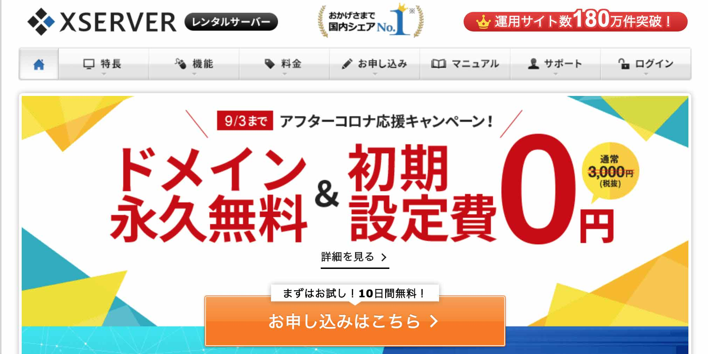

[X SERVER ウェブサイト](https://www.xserver.ne.jp/)

現時点での個人的な感想ですが「X SERVER」はレンタルサーバーの中でも良くウェブサイトの表示スピードにも安定感があります。<br><br>


実はこのブログはさくらレンタルサーバーです。<br><br>


結構昔から運営しているせいもあり、現在割り当てられているサーバーのスペックが古くイマイチ。<br>
表示も遅いから引っ越したくて仕方ありません（他にもCMSなどの理由はありますが）。

<div class="box">
<h4>ウェブサイトの表示スピードとユーザーの関係</h4>
表示スピードが3秒以上かかるとユーザーはストレスを感じて離脱します。
</div>

「X SERVER」は年間12,000円から始められ、**状況に応じてスペックも変えられるのでオススメ**です（2020年8月現在）。

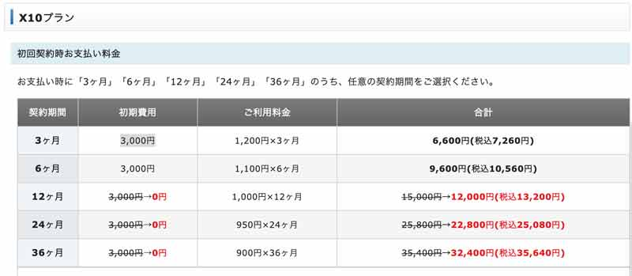

**年間の12,000円の投資は決して高くない！！**<br><br>


不安な方は、まずは10日間のお試しからはじめてみてください。
そして、**私は決して「X SERVER」の回し者ではありませんよ！！**<br><br>


今からブログを始める方にアドバイスがあります。

サーバー会社でドメインを借りないでください。
理由については後ほど説明します。

### ネームサーバー会社を利用してドメインを用意する
ドメインとはサイトのいわば住所です。<br>
**ドメインはサイトの顔となる**ので名前選びには慎重になりましょう。あまり長くないものがオススメです。

ドメインは可能な限り、短いほうがいいです。あとは書きたいブログと意味が紐づくもの。<br>
「お名前.com」や「MooMooドメイン」などのネームサーバー・サービスでドメインを購入しましょう。

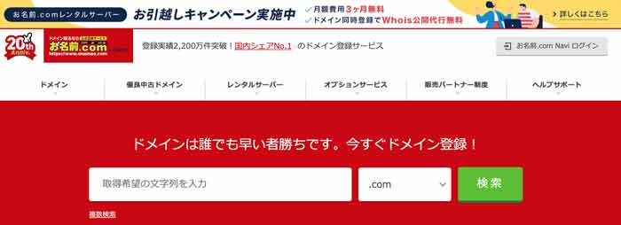

**〜.com**、**〜.info** など、種類は色々ありますが、個人的には信頼の高い**〜.jp**ドメインがオススメです。<br>
ドメインの価格はマチマチで、年間数10円から数万円するものもあります。

ドメインの購入が終わったらサーバーに紐づけます。<br>
今回は「X SERVER」から「お名前.com」へ紐づけをする方法を説明します。

サーバーパネルから「ドメイン設定」をクリックします。


「ドメイン設定追加」から購入したドメインを「ドメイン名」へ入力。<br>
「無料独自SSLを利用する」と「高速化・アクセス数拡張機能~」はチェックしたままでOKです。

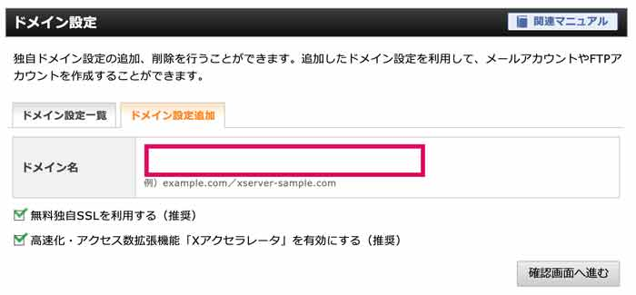

「追加する」ボタンを押したら、X SERVER側の設定は終わりです。

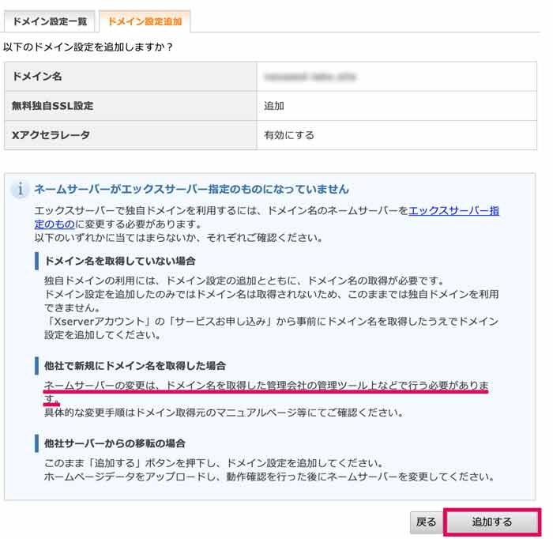

お名前.comでネームサーバーへ紐づけるために、「**ネームサーバーの変更**」をします。

「お名前.com Navi」にログインします。

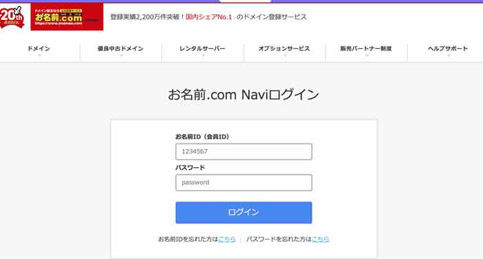

[お名前.com ログイン](https://navi.onamae.com/)


ドメイン一覧から対象のドメインの「ネームサーバー」をクリックします。<br>
写真ではすでに「その他」になってますが、おそらく「初期設定」とかそんな感じに表示されていると思います。

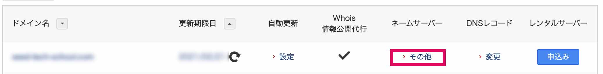

「その他」のタブを開き、ネームサーバー1とネームサーバー2にX SERVERのネームサーバーを入力します。

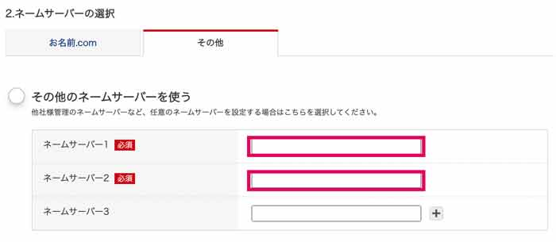

X SERVERのネームサーバーはサーバーパネルの「サーバー情報」から確認できます。<br>
とりあえず必要なのは1と2のみです。

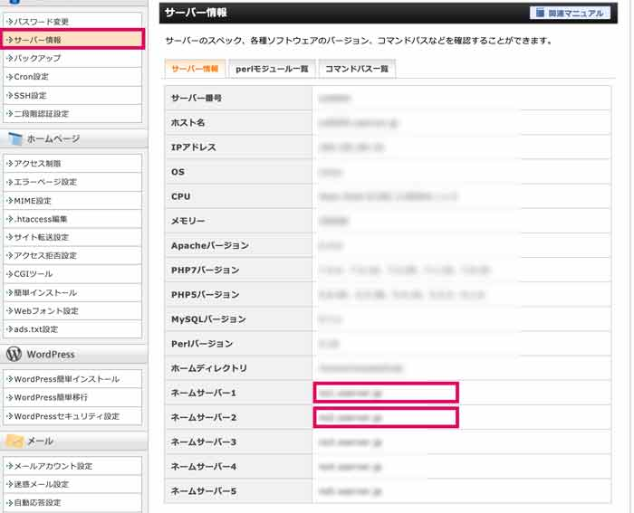

登録できたら「ネームサーバー設定」を確認しましょう。

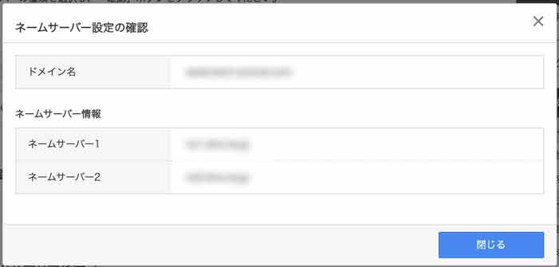

ドメインは最大で数時間から72時間程度で反映します。<br>
はじめての設定で不安かもしれませんが、のんびり待ちましょう。

<div class="box" id="reason"><h4>サーバー会社でドメインを借りない方がいい理由</h4><p>私のようにサーバーを引っ越したくてもレンタルサーバーで借りたドメインを移そうした際（ドメイン移管）にものすごく手間や時間がかかります。</p><p>現在フィリピン在住（ロックダウン）で気軽にカスタマーサポートも利用できないのもあり、ドメインの移管をどうしようかって状態に陥っています。</p><p><br>別件でも大変な目に遭いました。<br>サーバーとCMSが一体化しているWixから別サーバへサイトお引越しの仕事をした際、ドメインの移管すらできませんでした。<br>仕方なく、別ドメインの取得をすることになりました。</p><p><br>ドメインとサーバーは切り離しておかないとあとが大変。</p><p><br><strong>ドメインは非常に重要！！</strong><br>ウェブサイトの顔なので早々に変えることができません。</p><p>&nbsp;</p><p>乗り換えたくてもオンボロになってもそのドメインを使いたい場合は、経費を払って乗り続けないといけない。最悪です。。。。</p><p>レンタルサーバーを運用する会社からすれば顧客を手放したくない。変更しにくくするのは当然と言えば当然です。</p><p>このブログを始めた時は7年くらい前？まだまだ知識も経験も浅かったです。手軽にさっさと調べもせず分からないまま始めてしまったのが運の尽き。</p><p>いまだとても苦労しています。</p></div>

### 事前にSSLの設定を忘れずに
現在ウェブサイトで鍵マークを見かけると思います。

これはSSLといって、サーバーから届くデータを暗号化して送受信しています。

Googleの検索窓などでURLを確認してみると「`http://`」と「`https://`」から始まるものを見かけるはずです。実は後者は暗号化（SSL化）されてないので危険ですし、Googleも推奨していません。

「X SERVER」ではSSLを無料で使えるのもオススメのポイント。ドメインが反映したら真っ先にSSLの設定をしましょう。

X SERVERではドメイン毎にセットできます。

ドメインの「SSL設定」から「CSR情報(SSL証明書申請情報)を入力」にチェックし、各項目を必ず入れておいてください。


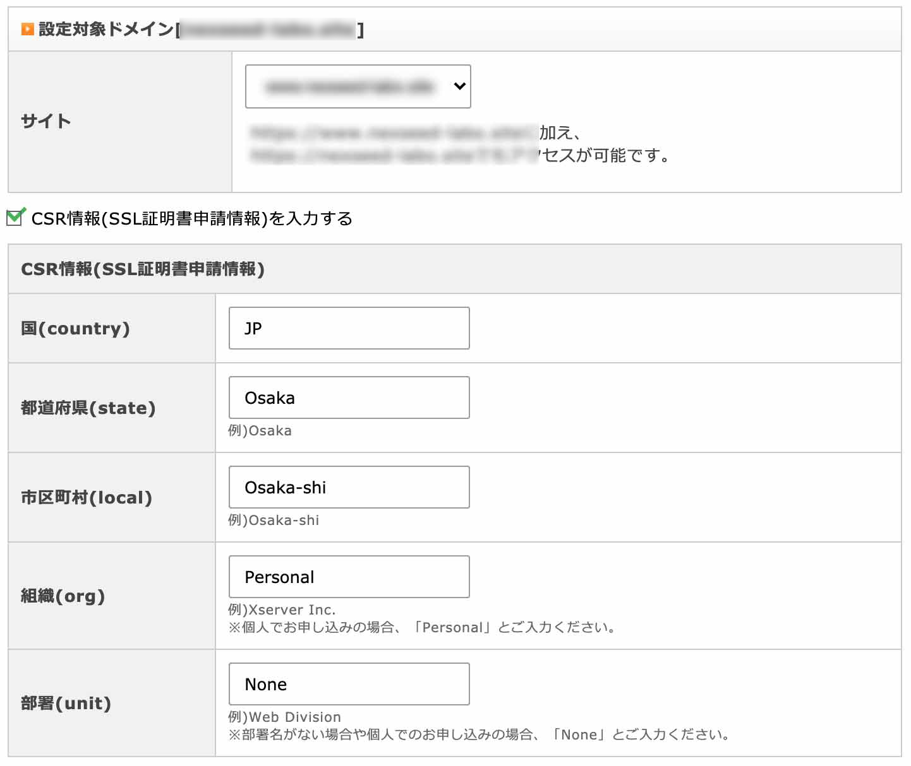

反映まで最大2時間程度かかります。

## WordPressのインストール
ドメインと、SSLが反映したらWordPressをインストールしましょう。

X SERVER管理画面からカンタンにインストールできます。

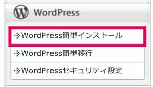

データベース設定などは行いましょう。<br>
以下の設定でドメインと紐づいているディレクトリー直下にインストールされます。

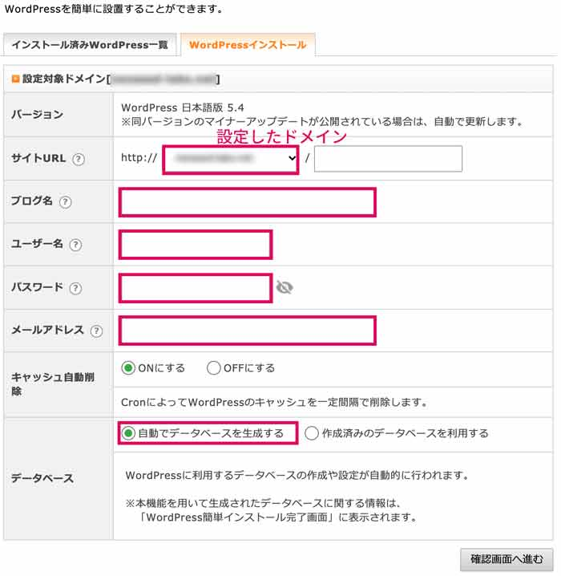


* **ブログ名**・ブログの名前です。後で変更できます。
* **ユーザー名**・ログインに必要。ID。一度設定すると変更が難しい。
* **パスワード**・ログインの際に必要。後でも変更できます。この時は仮でも大丈夫。
* **メールアドレス**・承認周りに使います。きちんと送受信できるアドレスを設定してください。

<div class="box"><h4>ポイント</h4><p>パスワードとIDの設定は慎重に。<br>大変でもパスワードは必ず長いのにしておきましょう。<br>カンタンなパスワードとIDは<strong>ブルートフォースアタックの標的</strong>になります。</p></div>

<div class="box"><h4>ブルートフォースアタックとは？</h4><p>ブルートフォースアタックは「総当たり攻撃」とも呼ばれる、パスワードを破る手法のひとつです。総当たりという言葉からも想像できるように、パスワードに使われていると推測される文字列を1つずつ変えながら片っ端から試していき、正解に当たるまで試し続けます。</p></div>

数秒でインストールできるはずです。


### テーマのインストール
今回はCocoonというテーマを使います。他のテーマに比べて少々インストールが少々面倒ですが無料なのに非常に高機能。プラグインなしでSEO関連の設定もラク！！

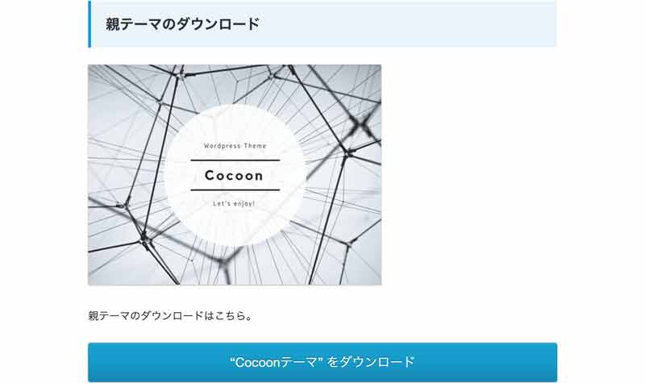

また、cocoonは無料なのにAMP対応しています。すごい！！

必ずPHP7、WordPress5.3以上で使ってください（2020年8月現在）。

以下よりダウンロードします。
[ダウンロード](https://wp-cocoon.com/downloads/)

> **AMPとは？**
>
> AMP は高速かつスムーズに読み込まれ、ユーザー体験を最優先したウェブページをカンタンに作成する方法を提供するオープンソースの HTML フレームワークです。
> [https://amp.dev/ja/](https://amp.dev/ja/)

<div class="box">
  <h4>この記事では数回FTPソフトを使う</h4>
  「セキュリティの設定」・「URL正規化」するために直接FTP上でファイル編集の作業しなければなりません。<br>
  はじめて使う人には敷居が高いかもしれませんが、頑張りましょう。
</div>


#### 管理画面からインストールする場合

左メニューから外観、テーマを選びます。

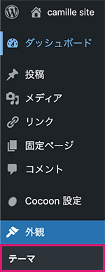

新規追加をクリック。

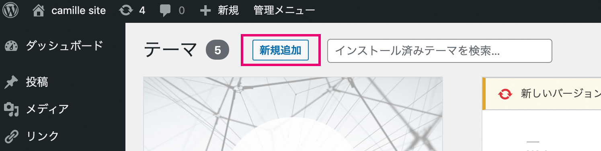

ダウンロードしたCocoonをZipのままアップロードします。

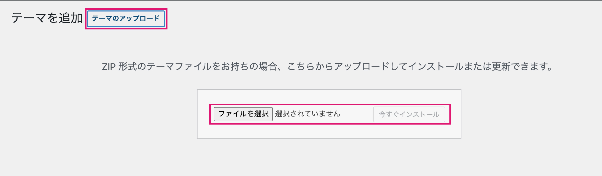

テーマを有効化しましょう。

#### FTPを使ってインストールする場合
もし、管理画面からインストールできない場合、FTPソフトを使います。
今回はFTPソフトとしてFileZillaを使います。インストールしておいてください。

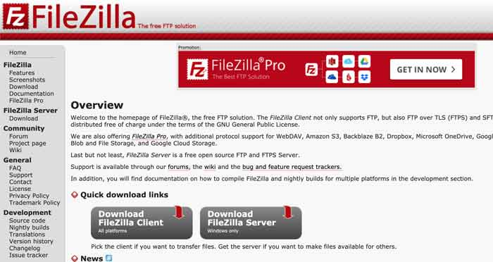

[FileZilla DL](https://filezilla-project.org/)

> **FTPとは？**
>
> FTP(File Transfer Protocol)はサーバーとクライアント間で、ファイルを送受> 信する通信の決まりごとです。
>
>FTPソフトはデータのやりとりをカンタンにするためのソフトです。

「サイトマネージャー」を選択し、「新しいサイト」登録します。

もしくは契約時にメールで届いている以下3つのサーバー情報が必要です。

* ホスト名 : sv**.xserver.jp
* ユーザー : 〇〇〇〇
* パスワード : 〇〇〇〇

サーバー情報はXserverの管理画面からも調べることができます。

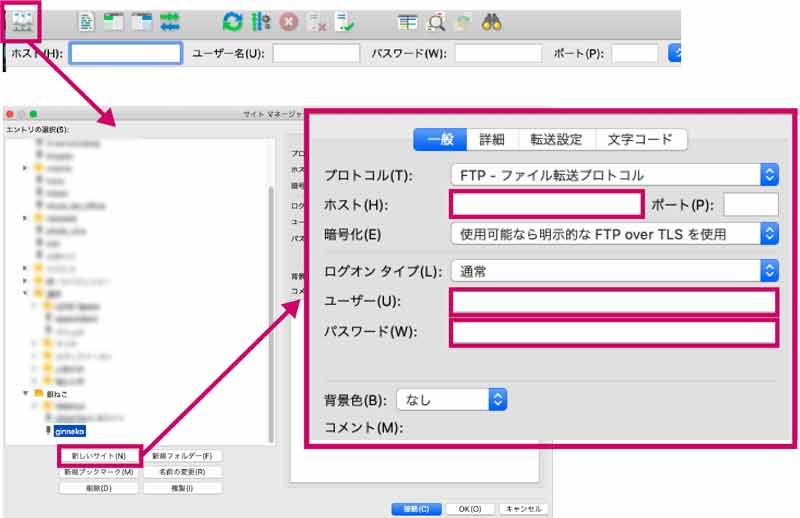

FTPソフトでサーバーに接続できたら、テーマをインストールします。<br>
以下ディレクトリに移動しておきます。

```
ドメイン名ディレクトリ/public_html/wp-content/themes/
```

その後、解凍したCocoonのフォルダーをドラッグ&ドロップでthemes/直下におきます。

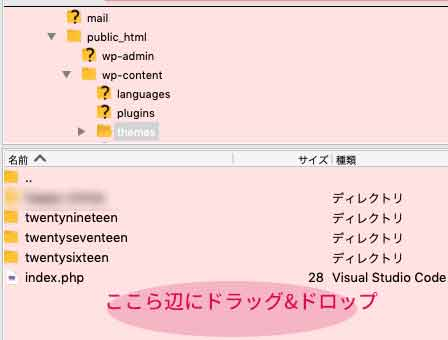

あとはWordPress管理画面からテーマをインストールすればOK!!<br><br>

### 管理画面からWordPressのソースコードを変更できないようにする
**WordPressの怖いところは管理画面からPHPの編集がカンタンにできてしまう**ところです。

つまり管理画面にさえ入ることができ、サイトを好きに書き換えられるわけです。

現にセキュリティゆるゆるのWordPressサイトは格好のカモ。<br><br>


断言します。<br>
**WordPressを管理画面から編集できるままにしておく必要なんてありません**。<br><br>


危険すぎるのですぐに編集できないようにしてしまいましょう。<br><br>


WordPressをインストールした直下に**wp-config.php**というファイルがあります。

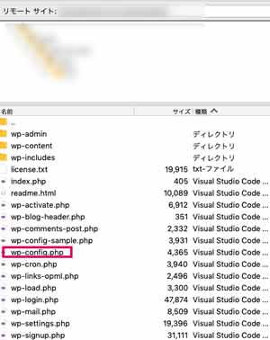

ファイルを選び右クリックで編集を選びます。

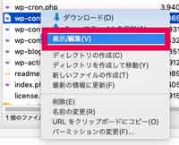

テキストエディターで開けると思うので、以下コードを必ず書き加えてください。

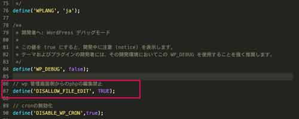

```php
// wp 管理画面側からのphpの編集禁止
define('DISALLOW_FILE_EDIT', TRUE);
```
### .htaccessでのURLの正規化
もうひとつやってほしいことがあります。
`http://ドメイン~`にアクセスされた場合、`https://ドメイン~`（SSL）にリダイレクトする設定です。

ウェブサイトはSSLを設定した後も`http://ドメイン~`にアクセスできます。
すると同じコンテンツが2ページ存在することになってしまいます。


我々からすれば同じページですが検索エンジンからすれば別ページと見なされます。


その後サイトの運用上都合も悪いので、リダイレクト（URLの正規化）をしておきます。

方法は「.htaccess」のファイルにリダイレクト用コードを追加するだけです。


.htaccessがない場合は、先にパーマネントリンクの設定をするとファイルが作成されます。

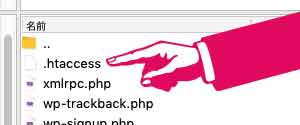

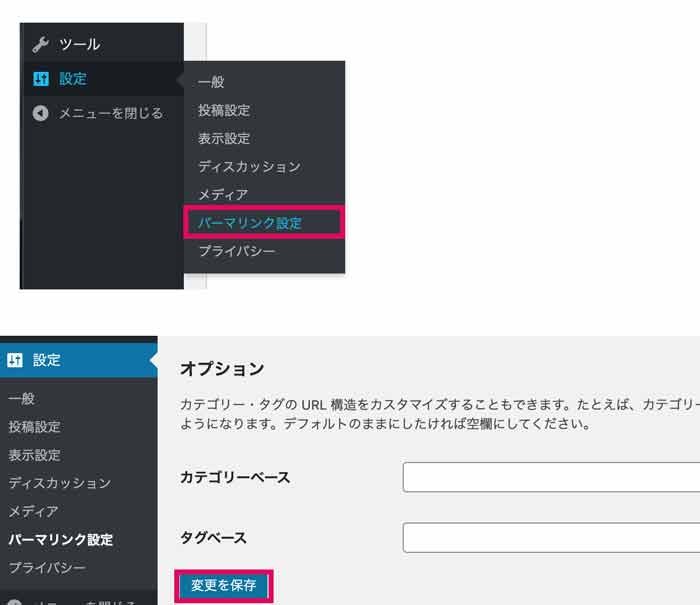

```bash
<IfModule mod_rewrite.c>
# リライト機能をONにする
RewriteEngine on
# httpでアクセスされた場合には、httpsへリダイレクト.
RewriteCond %{HTTPS} !on
RewriteRule ^(.*)$ https://%{HTTP_HOST}%{REQUEST_URI} [R=301,L]
# wwwなしでアクセスされた場合には、www付きにリダイレクト.
RewriteCond %{HTTP_HOST} ^ginneko-atelier\.com [NC]
RewriteRule ^(.*) https://www.ginneko-atelier.com/$1 [R=301,L]
</IfModule>
```
難しかったら、htaccessの設定はすっ飛ばして慣れてきたらやってもらっても大丈夫です。

なんとかWordPressをサーバーにインストールできたのではないでしょうか？

## まとめ、そして後半に続く
次はWordPressのテーマインストールと各種設定、ざっくり記事の書き方。
さらにさらに「Analytics」、「Search Console」の設置方法についてご紹介します。

↓↓↓後半はこちらに公開しました↓↓↓

<card id="/blogs/entry381/"></card>

最後までお読みいただきありがとうございました。
