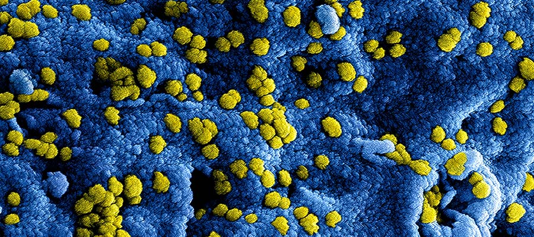

職場の人間関係が辛い方へ。職場の良くも悪くもどんな人で構成されているかで変わります。昔、乳酸菌を取り扱う会社にいました。当時は「腸内環境整える前にマジ社内環境整えよう」よ、と思うくらい劣悪でした。組織って腸内環境に似ているので私のその会社での経験を例えて説明してみました。

今いる組織で苦しい人、悩んでいる人の一助となれば幸いです。
<prof></prof>

<toc id="/blogs/entry382/"></toc>

## 腸内環境について予備知識
私の経験の話の前に腸内環境について予備知識を入れておいて欲しいです。 
興味ない人は飛ばしてもらって結構ですw

腸内には約100兆億個の細菌が住んでおり、1列に並べると地球を2周半できるほどの長さになります。 
しかも細菌たちがお花畑のようなので腸内フローラと呼ばれています。

毎日排泄（はいせつ）する便の内訳ですが**80%が水分**で、**3分の1は食べカス**、**3分の1は腸壁**、**3分の1は腸内細菌で**す。

たくさん便が出たからって昨日の食べすぎた食事がリセットされてるわけではないと思ってください笑

腸内細菌にはざっくり分けて3種類います。

**悪玉菌**、**善玉菌**、**日和見菌**です。

ビフィズス菌や乳酸菌がいわゆる善玉菌で悪玉菌と戦ったり、腸の働きを助けたりします。 
悪玉菌はウェルシュ菌など腸内で毒素を出したりします。

理想は**日和見菌が7割**で、**善玉菌が2割**、**悪玉菌が1割**、といった感じでしょうか？ 
このバランスが崩れると下痢やアレルギーなどの病気になると言われてます。

大多数もいるくせに日和見菌というのは善玉菌が増えると善玉菌の味方になり悪玉菌が増えると悪玉菌の味方をします。  

腸内フローラと組織ってめちゃ似てます。 
腸内フローラに例えながら当時いた会社の環境や経験を説明します。

## 入社当初、3大悪玉菌との遭遇
実は昔、私メイクさん、ネイリストをしていました。専門学校やキャリアスクールで教えたり、賞も取ったこともあります。

それまでのキャリアのおかげで、小さな部署ではありましたが、はじめての大企業の子会社に就職でき、制服を着て会社勤なんてしたことがなく正直ワクワクしていました。

初出社した時、忘れもしない5月8日、とびらを開けた瞬間直感で

「ヤバい！逃げ出さなきゃ！！」

と思ったのを覚えてます。

その動物的直感は1ミリもズレてなかったのはその後思い知ることになります。

### アフター5に支店にヒステリックに電話をかけまくる女
定時の5時以降、支店に電話をする女がいました。

「もう帰ったの！信じられない！」と**ヒステリーに叫びなが**ら。

彼女の仕事は商品の手配をして、日々の売り上げを集計することでした。 
最初はなぜそんなヒステリックに叫ぶのか意味が分かりませんでした。

定時後電話する理由としては 
「私がこんなにおまえたちのために遅くまで頑張ってるのになんでとっとと帰ってるんだ？」 
と周りに主張したかったようです。  

ゆがんだ承認欲求ですね。相当病んでます。

### ゲームするか怒鳴るかしかしない役員
その会社で忘れられないもう1人の悪玉菌ですが、ゲームしてるか怒鳴るしかしない役員がいました。

**売り上げ達成しないと、ひたすら部下に罵声を浴びせるという地獄絵図**。

私はたまたま席が近く、毎日その恫喝（どうかつ）を四六時中聞いてました。 
怒鳴られる社員は決まっていて、不器用でゴマスリが苦手なタイプ。弱い者イジメというか、八当たりにしか見えませんでした。

怒鳴ってる以外は、仕事せずにパソコンで麻雀（マージャン）ゲームばかりしていました。

今でもその強烈な怒鳴り声が耳の奥の方に残っています。

### 自分より優れている人・目立つ人を徹底的に叩き落とすおばちゃん
入社してはじめての飲み会がありました。

当時新入社員でまだ若かったのでみんなが周りに寄ってきて話かけてくれました。 
その日は新しい仲間と会社のビジョンを共有し、たくさん話できて満足し、気分よく帰りました。ところが次日、私がいろんなこと人の悪口を言いふらしているといううわさを聞きました。

そのうわさの出どころがすぐに彼女だと分かりました。

というか、私はまだ会社に関して詳しくないので悪口すら言えないのは周りも分かっていました。 
そして、そんなあからさまなうそをつくような人間がいるとは心の底から信じられませんでした。

のちのち、彼女の人となりを周りの人から聞かされて納得。売り上げが高く、役員から評価されてましたが人一倍嫉妬心が強く、自分より少しでも目立つ人がいれば、とくに**女に対しては徹底的に嫌がらせをする人**とのこと。

女子中学生じゃあるまいし勘弁してって心の底から叫びたかったです。

### 善玉菌、いい人もたくさんいたから続けられた
こんなワンダーな会社に入ったものの、もちろんいい人もたくさんいました。

私の企画を通すために根回ししてくれる上司、売り上げが立たず困ってるときに協力してくれる支店のマネージャー、共感できる同僚など。

彼らがいる間は**キツくても仕事は楽しかった**です。

## 善玉菌激減・ある日突然訪れた大量のクビ切り
その会社は世界的な大企業の子会社でしたが、赤字で膨大な借金がありました。

どうにも負債が膨れて最終手段を取ることになりました。依願退職です。 
退職金を払うので辞めさせ、人件費を浮かせる手段をその会社は取りました。  

恫喝（どうかつ）役員が何人かピックアップし、退職を促すことになりました。  

当時はリーマンショック真っ只中。辞めたところで仕事などすぐ得られる当てはない状況でした。 
みんないつ肩を叩かれるかビクビクしていて、なんとも言えない異様な負のオーラが社内に流れていました。

しかも、優秀な社員までも退職金目当てに辞めてしまいました。

## 人の構成のバランスが大きく崩れた末路
**経営やマネジメントが悪いと善玉菌的な人材は減ります**。

前述した悪玉菌的な人たちは社内に残り、怒鳴り声はより一層大きく聞こえるようになりました。とは言え、社内の多くは日和見菌のような人たちの方が多かったです。

残された人のモチベーションはダダ下がり、ものの見方もネガティブに偏り、売り上げにも影響しました。

組織は本当に腸内フローラのようなもので悪玉菌と善玉菌のバランスが崩れると**日和見菌のような人たちも悪い方向に傾いていく**んです。

結果、どうにも立ち直せなくなったのもあり、他の子会社と合併することで生き延びることとなりました。

## 人のバランスで組織が変わる
ジョブホッパーの私が今までいろんな会社を経験して断言します。**組織はどんな人がいるかのバランスで決まる**と言って過言ではないです。

人のバランスが悪いと人間関係、数字、すべてがうまく回らなくなります。

### 立て直しが無理だと感じたら手遅れになる前に退散した方がいい
私は当時会社にいてキャリアが築けないなど自分にメリットを感じなければ、2年で辞めると心に決めていました。

にもかかわらず、**世界的大企業の子会社という理由**で4年もずるずる勤めてしまいました。

4年間いた結果、私はそれまでメイクさんネイリストとして築いたキャリアを完全に腐らせてしまいました。

大きな組織に属すると社会的に安心感はありますが、腐った環境だとキャリアアップできなかったり、心を病んだり、疑心暗鬼になるだけです。

**トータルで何の得にもならない**です。  

人のバランスの悪い組織は、この依願退職が物語るように、我々のことは守りません。 
どんなに良いと思っていた組織も、人のバランスが崩れたら悪い方に傾きます。  

そんな時は思い切って撤退するのも一つの手。

私は辞めて、それまでに築いたキャリアを捨てててIT業界に転身しました。たくさん勉強して努力しました。

そして、**二度とキャリアを腐らせないために同じことがあればすぐ撤退すると心に決めています**。  

もちろん、人のバランスが変わったら持ち直すこともありますけど。

## まとめ
私の10年前に体験した話を腸内環境に喩えつつ説明してみました。

私の経験ですが、何かのお役に立てれば幸いです。

最後までお読みいただきありがとうございました。
