## 仕事を辞めた3つの理由
会社を辞めた3つの理由からお話しします。

私の経歴を軽く説明しておくと、もともと日本ではウェブ制作会社でフロントエンドエンジニア、その後フィリピン・セブ島では日系ベンチャー企業でプログラマー講師を経てオフショアブリッジSEをしていました。 
ちなみに、セブ島に来た詳しい理由はこちらをお読みください。

<card id="/blogs/entry321/"></card>

<card id="/blogs/entry356/"></card>

### ロックダウンで自分を見つめ直す時間ができ、一生懸命というか・・・磨耗して働くのがイヤになった
2020年世界はコロナウィルスが爆発的に蔓延。 
そのため、セブ島だけでなくフィリピンは半年もの世界最長の幸いロックダウン（街の封鎖）がフィリピン政府によって敷かれました。

強制的ではありますが、自宅勤務を余儀なくされ通勤や人付き合いに費やす時間がなくなり、自分を見つめ直す時間ができました。

ロックダウンが何かわからない方はこちらをご覧ください。

<card id="/blogs/entry365/"></card>

この一年半、*思い返せば何が楽しかったか思い出せないくらい忙しかった*です。

そして私の夢は「年取ったら南の島でのんびりする」だったのに微塵できていないことに気づきました。

若ければいいけど私はもういい歳だし、体力的にもこのまま続けるのは辛すぎる。

仕事に注力するあまり、*自分自身を大切にできてないことにも気が付きました*。 
在職中は、せっかく南の島に来たのに海はたった1回しか行っていません。 
まあ海は実は嫌いなんですけどねww

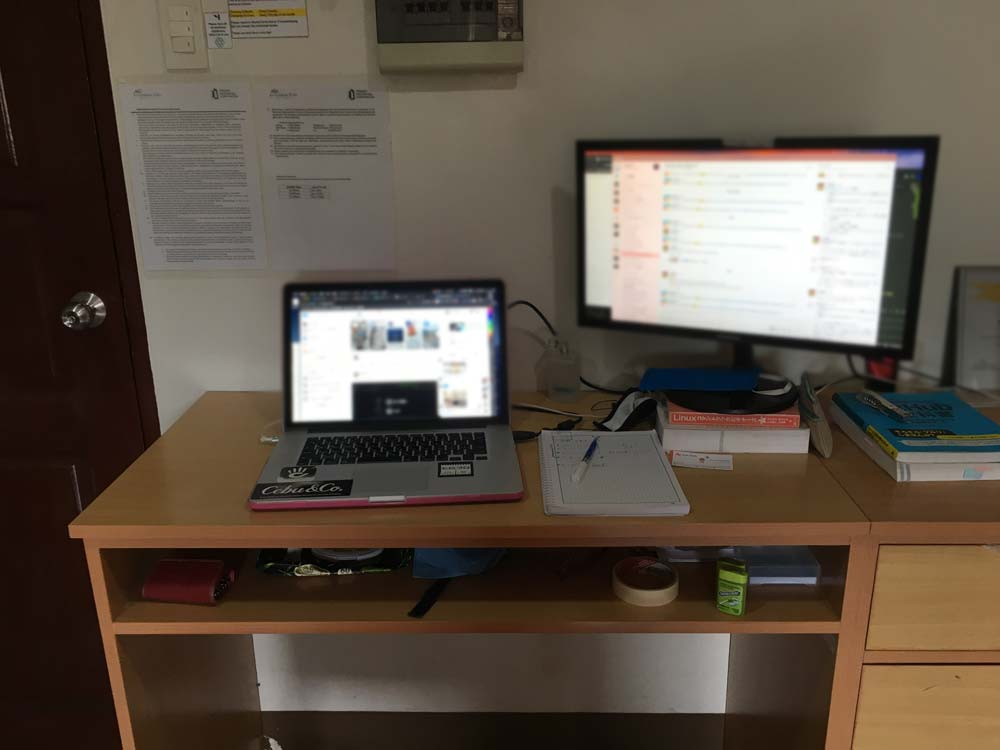

セブ島で外の景色も見ず、毎日モニターとにらめっこ。 
がむしゃらに働いていて、ふと、「この生活がこの先も続いたら私は耐えられるだろうか」と思うようになりました。  

また、自分でこの働き方を選択したのも間違いないと加えておきます。

### 何よりも成果物の質にコミットしたい
IT業界に約10年いる私の持論です。  

「*いい成果物を提供できたら顧客がファンになってくれるので営業する必要はない*」  

今までの私の仕事の仕方は、**良質のプロダクトを作ることにフルコミットする**、です。

この一年半、私の働き方にも問題あったのかもしれませんが、自分のプロダクトの作り方・提供の仕方に納得いかずイライラしていました。 
もっと、もっと、もーーっと、いいものが提供できるはずだって。

多くの制作会社は、数字に追われて営業部隊が無理な仕事を取ってきて、納期に追われて制作部隊が疲弊しています。  

とくに日本の会社！！御社、御社ですよ笑  

満足のいくものを納品して、*クライアントだけでなくそのサービスを使うユーザーも満足したらハッピー*じゃないですか？

良いものを提供できれば*無理な営業などする必要ないから経費も削減*できる。

**無理な営業をしなければストレス・フリー**でさらにみんなハッピー。  

とはいえ今のご時世、**生き延びるために数字を追わずには生きていけません**よね。ちゃんと理解しています。

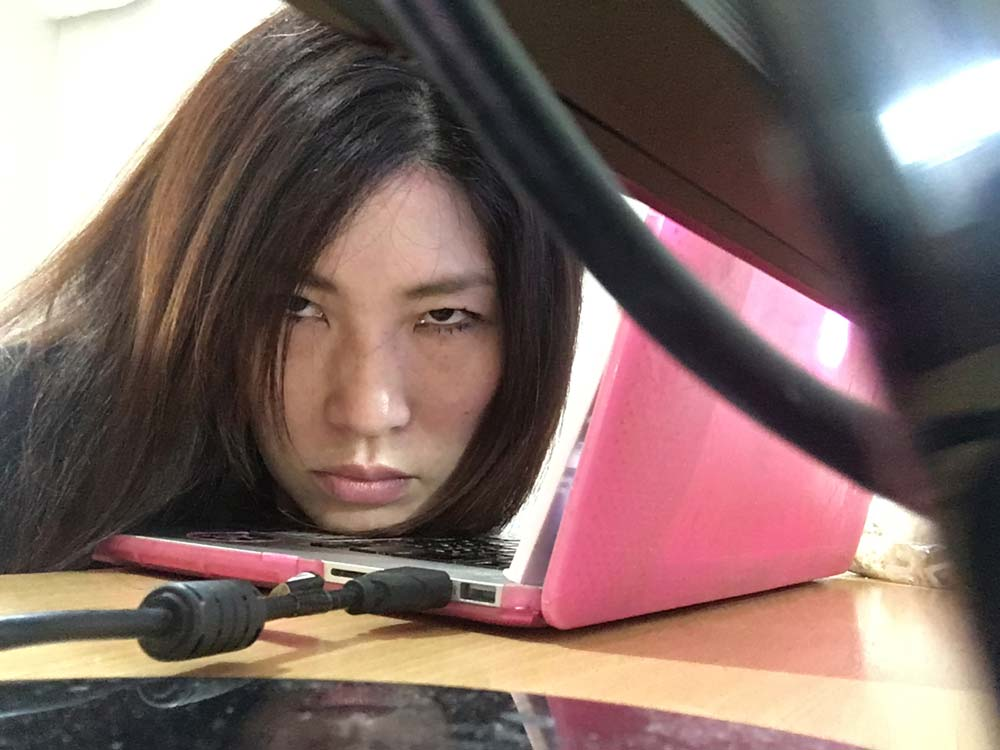

かっていても私は「数字にフォーカスする仕事」は絶対にやりたくない。  

そんな「自分の価値を大切にしたい」と思ったのも1つの理由です。

### 「1日8時間の働く時間が大切」だと豪語していたくせに自分ができていないことに気がついた
1日仕事をする時間って約8時間ですよね？ 
人生の大半は仕事をしてるにもかかわらず、労働する時間が楽しくなかったら人生終わってると思います。  

はっきり言います。ここ最近は忙しすぎて私は人生を楽しめなかったです。

忙しいのが好きな人もいるのであくまで私の意見です。  

私の人生で何か選択するときの基準はいたってシンプル。

やっていることが「おもしろいか」「ダサくないか」に当てはまるか、です。

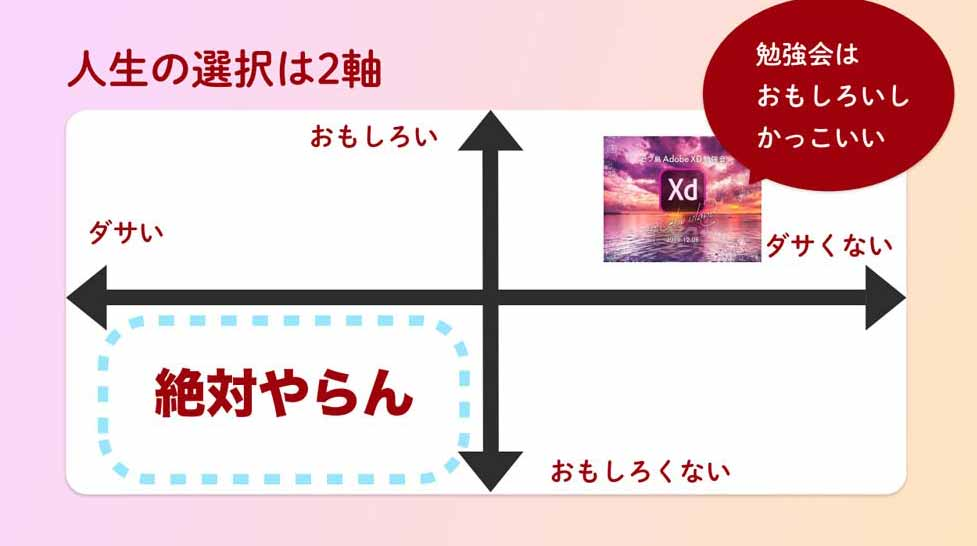

「おもしろいか」「ダサくないか」いずれかから外れたと感じた瞬間に絶対やりません。

いざとなったら何やっても食ってけるし、どうとでもなる。 
ということで、9月30日（正確には10月20日）をもちまして退職いたしました。

## この先、自分らしく人生を楽しむために
今私は何をしてるかと言うと。。。

セブ島にまだいますww 
プラプラしつつ、友達を大切にしつつ、のんびりとセブ島を楽しんでます。

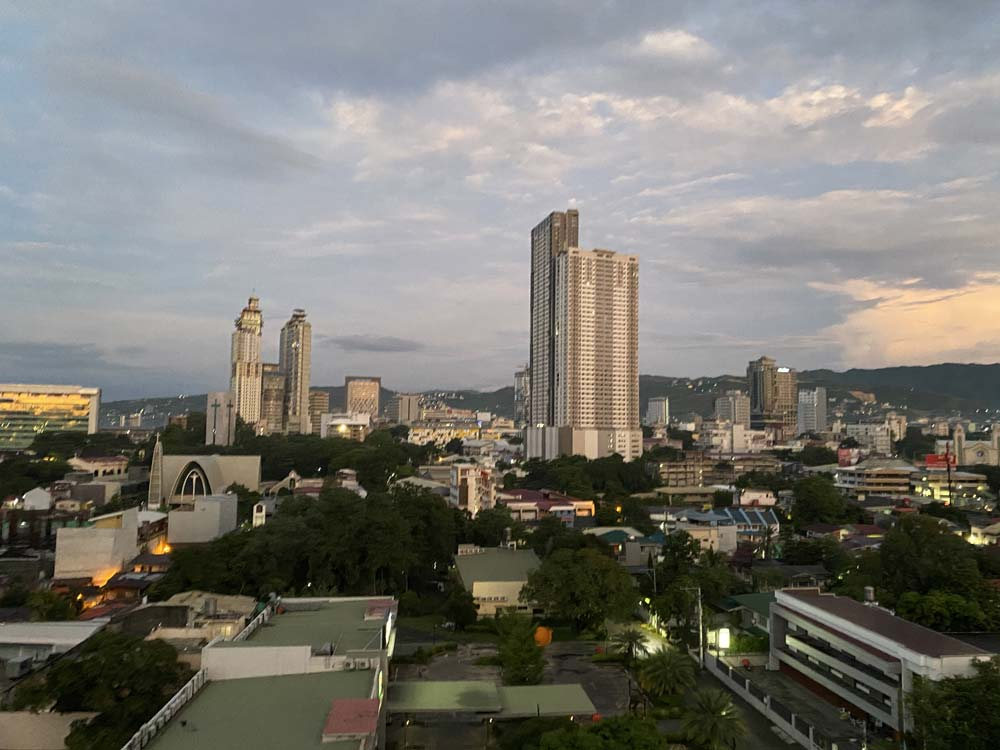

閑静な地域にあるコンドミニアムの最上階に引っ越しました。 
毎朝教会の鐘の音で目を覚まし、体をいたわるためできるだけ自炊しています。

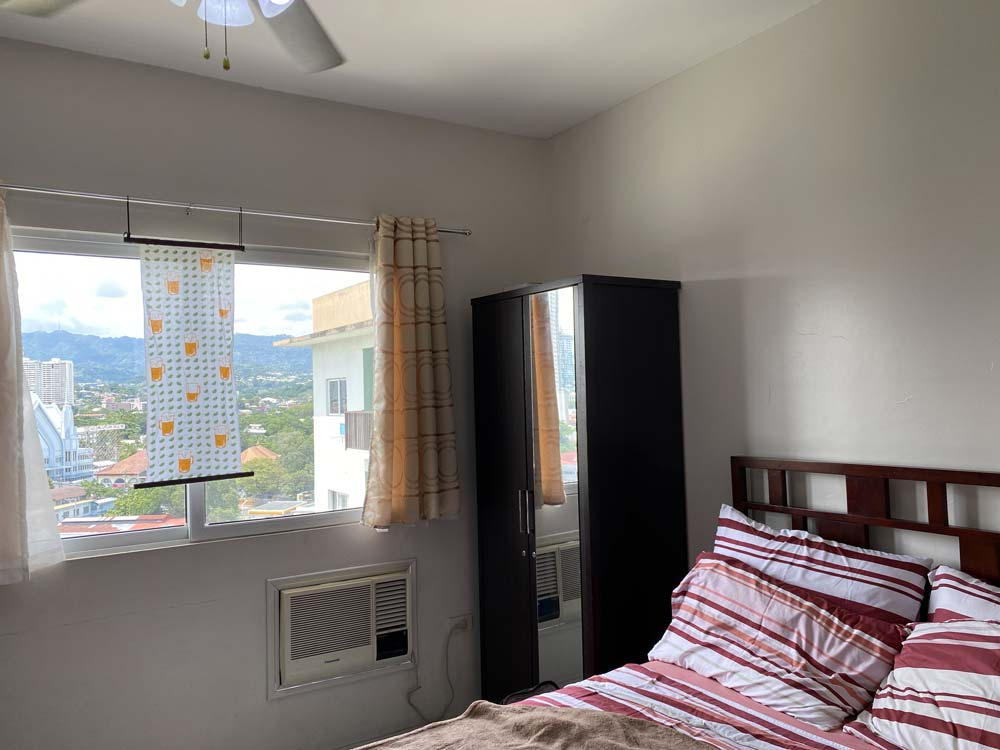

## 退職後3か月は充電期間
ただいまのんびり1か月目です。 
そして、はじめてセブ市内を観光しました！

実は未だセブ島はロックダウン中です。それでも以前より規制が緩くなったおかげで歴史的建造物など目の当たりにしてめちゃくちゃ感動しました！

1年半住んではじめてのプライベートの観光でした笑 
セブ島は実はかの航海時代に活躍したマゼランが果てた地です。みなさん知ってました？ 
（写真：マゼラン・クロス）

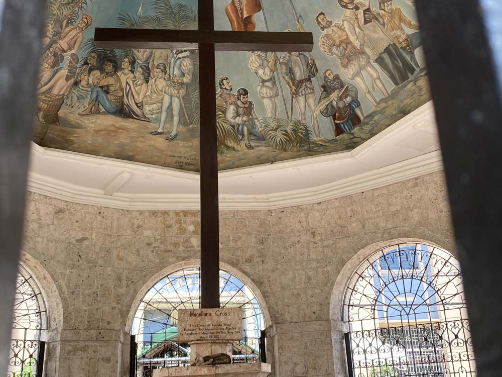

サント・ニーニョ教会からカーボンマーケットへも行きました。 
ウズラの卵が1コたった2ペソ（約4円）。買い物しながらマーケットにいる地元の人と交流も楽しみました。

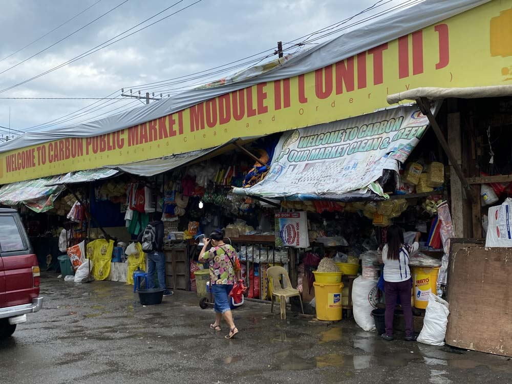

### 「英語が話せないのが恥ずかしかった」ので勉強始めました
私セブ島に来た当初、まったく英語が話せませんでした笑 
ブランクはあるものの、実は大学は英文科（中退）で英検二級も持ってます。 
日本人にあるあるですがスピーキングとリスニング能力が皆無に等しかったです。

セブ島に来た当初「話せなくてもどうでもいいじゃん」って振舞ってましたが、正直に言うとものすごく恥ずかしかったです。  

今年入ってオフショア選任になってからというものの、英語はビジネスにも有利になって話せたほうがいいということに気づきました。

話せないのを話せないまま、**コンプレックスを抱えたまま終わるとせっかくセブ島に来たのに後悔する**だろうと思うようになりました。  

辞めてしばらくは英語の勉強にまじめに取り組むと心に決めました。 
実際どんなことをやってるのかと言うと、以下のようなメニューです。  

* 平日：毎日1時間から2時間文法を中心としたスピーキングとリスニング
* 土曜日：アクティビティやテーマに沿ってプレゼンなど。ライティングも含む

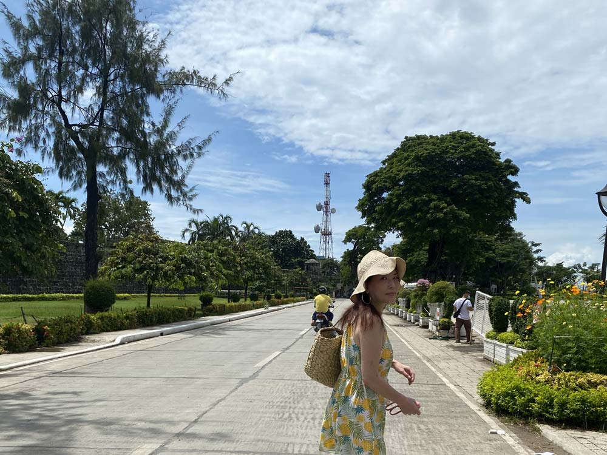

写真は「サン・ペドロ要塞」、三角の要塞です。やっと入場できるようになりました！
この日は「サン・ペドロ要塞」で私の地元広島の歴史的建物についてプレゼンをしました。

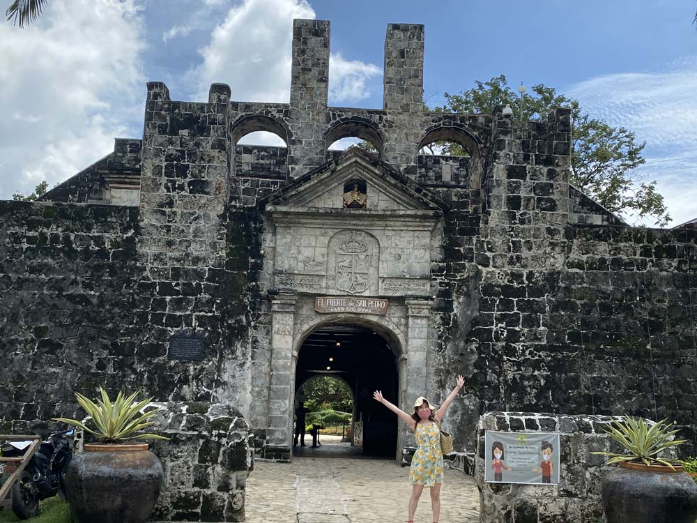

努力次第で潰せるコンプレックスは率先して潰してしまった方がいいですよ。
**コンプレックスは1つでも少ない方が前向きになれる**し人生が楽しくなります。

### プログラミングスキルとナレッジをインプット
プログラミングの辛いところは、技術の進化が早いところですね。 
英語学習以外の時間はこの一年半で置いてけぼりになったプログラミングの技術の知識やスキルのインプットに費やしています。 
具体的には今月はReact中心に勉強しています。

私は、ただ授業を買って勉強するのは向いてないので何かしらプロダクトを作ります。 
このブログも来月には見た目はそのままでリニューアルしたいですね！ 
このサイトが爆速になることを願います。

### 本当に好きな人たちとだけ過ごす
もちろん、英語やプログラミングの勉強するとか言いつつ、まったくストイックに追い込んでないです。

なんせ今は充電期間ですからね！

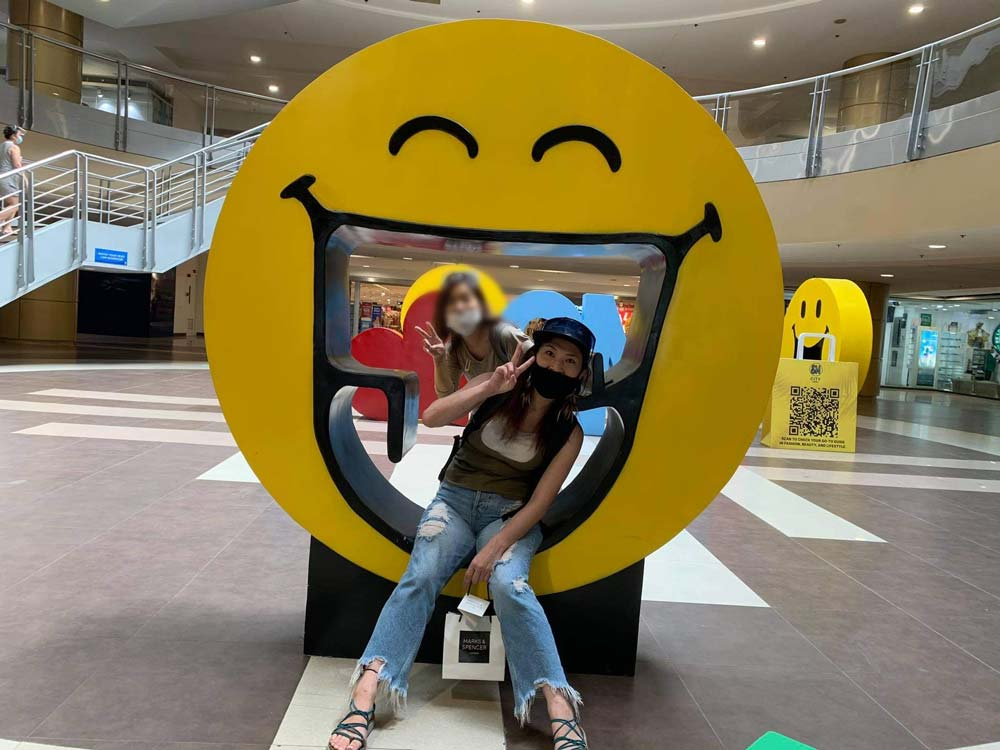

空き時間はお友だちとお茶やご飯して過ごしています。（写真はSMシティモールです）

**好きな人といるだけでその空間・時間がパワースポット**になるんですよ！ 
一緒にいるだけで良いアイデアが生まれたりウキウキします。寿命も延びます、多分。

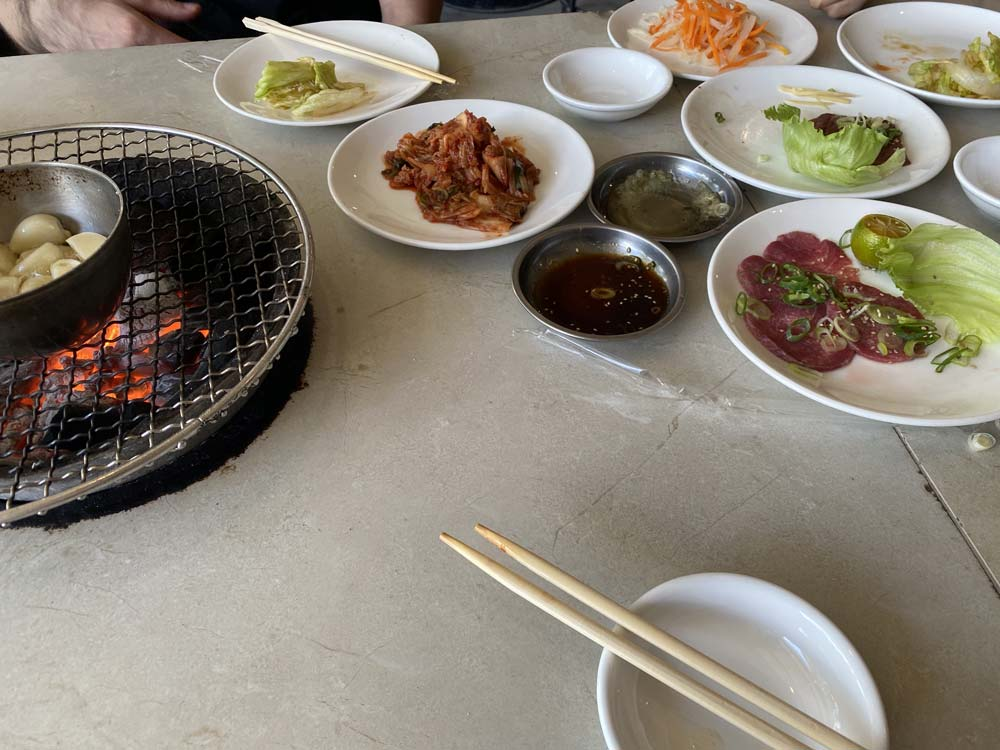

（写真：ドラム缶焼肉粋）

大好きな人たちと過ごす時間が愛おしいと思えるのは、今までの大変な期間があったおかげかもしれません。

## 充電期間後はどうするつもり？
さて2か月後をどうするか、ですね。

だんだんやりたいことが見えてきました。 
私はウェブ制作が好きですし、この先も「死ぬまでウェブ制作するかそれに準ずるものへ関わるんだろうな」て、ぼんやり思ってます。 
そして今もこの先のやろうとしていることも実は根本的に変わってません。

### 好きな仲間と仕事をするのが私のこの島に来た理由です
セブ島まで来る人なんて変なヤツが多いに決まってますからww  

そして、好きなことがしたいなら1人ですればいいんです。  

私にとって**「何をするか」よりも「誰とするか」の方がよっぽど重要**です。  

また、私の好きな仲間の定義があります。

「**一緒に苦楽を乗り越えることができ尊重し合える相手**」です。仕事は時に辛いこともあります。仲良しごっこじゃ続きません。この先は窮地に直面しても*一緒に乗り越えられるような戦友以外とは一緒に仕事しない*と思います笑

年齢・性別関係なくそんな人と長く仕事できるならハッピー。人生の目標1つなので達成させます！

### 老兵は去り、教育に力を注ぎたい
なんだかんだ言っても私もいい歳。 
これからエンジニアとしてもですが、脳も体もどんどん劣化していくばかりです。

この先、「私という人間を活用するためには人材育成がマスト」と考えてます。 
IT人材を育てたい気持ちはセブ島に来る前から今も変わりません。

そして人材を育てたい理由が他にもあります。

まだ広島でフリーランス駆け出しの頃、私はとてもスキルもナリッジもないしょぼいコーダーでした。

なぜかめちゃめちゃ周りに育てられて助けられました。 
多分一生懸命頑張ってる、ガッツがあったと言う理由ですね。

情熱を持って学びたい人にその機会が作りたいです。  

**優秀な若い世代が一人でも増えたら世の中が豊か**になりますしね。

ただ、人材育成って体力がかなり必要で片手間ではできないのも分かってます。 
そして、*教える側は育成期間ある意味その人の人生を背負ってるくらいの気持ちを持つべき*ですね。

師匠たちには恩返しできないので、生半可ではないガチな姿勢で次世代を育成する。 
師匠たちにもらった恩は次世代に送ります。  

ちなみにはっきりバッサリ言っておくと、有料テックスクールみたいなものはやるつもりないです。もっと違う形で、人材育成を実現したいですね。

## まとめ・好きな仲間たちと楽しく働いてお金を稼ぐ！
中途半端ですが現状報告でした！

最終的には大好きな仲間と楽しく仕事するためにお金が必要というのが最近の結論です。 
3か月間充電したら楽しく好きな仲間といかにマネタイズするため、具体的にすることを考えていこうと思います。

最後までお読みいただきありがとうございました。

### 参考
* *サン・トニーニョ教会*：1566年に創建されたフィリピン最古の教会。教会にはマゼランから送られた「小さなキリスト」サント・ニーニョ像が祀られています。キャンドルを灯すのをオススメします。入場料無料。 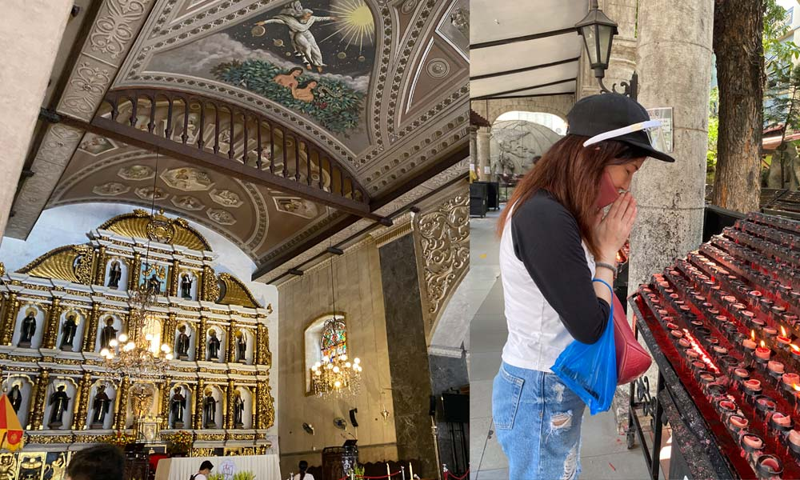 [Map](https://goo.gl/maps/ewdRoZFTAFtLG7sSA)
* *マゼラン・クロス*：サント・ニーニョ教会の入り口にある十字架。今展示されているのはレプリカだとか。フィリピン人は敬虔なクリスチャンで信心深いので本物置いちゃうと奇跡が欲しくて十字架の一部をむしりとっちゃうらしいです。
* *カーボン・マーケット*：コロン（町の名前）にあるセブ島でおそらく最大の市場。コロンはとても治安が悪いので、住み慣れない外国人が1人で出入りするのはオススメしません。この日は季節外れのアボカドが手に入りました。 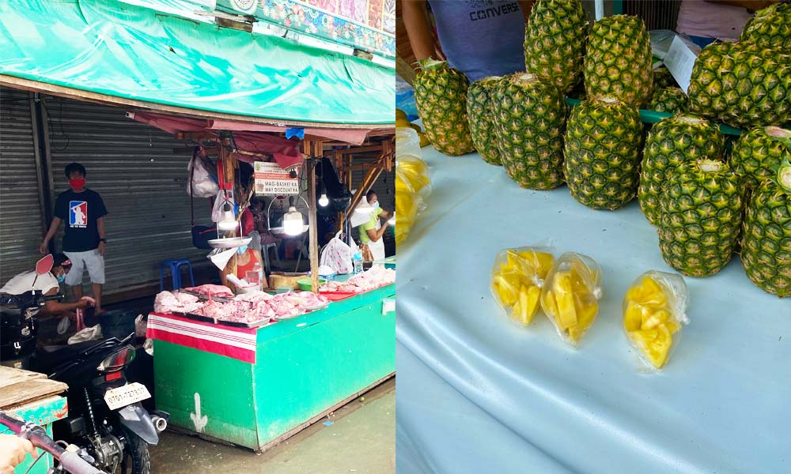 [Map](https://goo.gl/maps/yraHyHt8yfzGWbDd9)
* *ドラム缶焼肉粋*：650ペソで食べ放題。ソフトドリンクも飲み放題メニューあります。
日本では食べられない生レバ刺しが食べられます。タン塩も絶品。私のサンクチュアリで1 ~ 2週間に1回くらい訪れます。人数が多い時などはFacebookページから予約していくことをオススメします。 [Facebook](https://www.facebook.com/drumcanyakinikuiki) [Map](https://goo.gl/maps/a9mCug1VDGWG5csM8)
