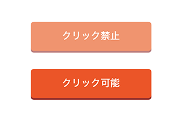
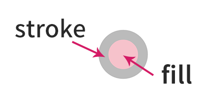
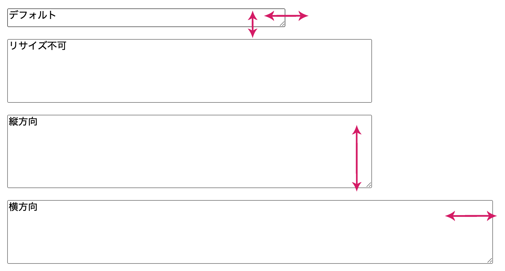
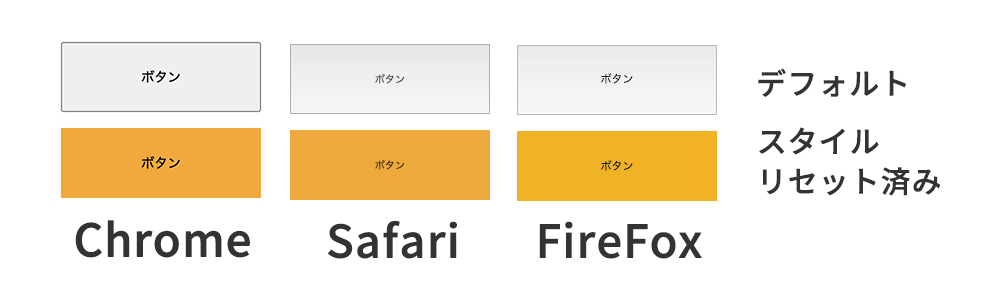
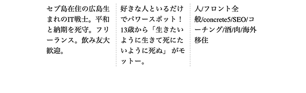
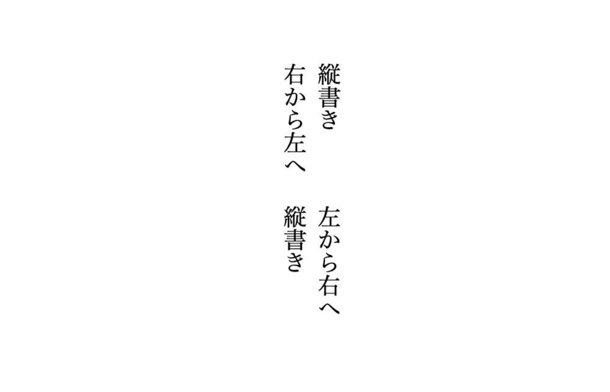

## 1 pointer-events 要素のクリックを禁止したい時に重宝
プロパティ・`pointer-events`は要素のクリックイベントを禁止したい時に使います。

個人的には使用頻度高めです。




### pointer-events の使い方と使いどころ
パーツでいえばページネーションや、COMING SOONにしてリンクが貼れないバナーなどに使うことが多めです。<br>
CMSから吐き出すタグを**自分では書き換えられないけどCSS側でクリックを禁止したい**、などのケースで重宝します。

```
<!-- HTML -->
<a href="#" aria-disabled>クリック禁止</a>
<a href="#">クリック可能</a>

// CSS
a[aria-disabled] {
  pointer-events: none;
}
```

#### pointer-events の値
* **auto**　プロパティが指定されていないときと同様にふるまいます。
* **none**　クリックイベント発火禁止
#### マジ? SVG に使えるの???!
HTML で実験的にSVGでも使えるそうです。<br>
JSと合わせて使ったら面白いギミックが作れそうですね！！

```
<!-- HTML -->
<p class="fill">
  <svg xmlns="http://www.w3.org/2000/svg" viewBox="0 0 100 100">
    <a xlink:href="#">
      <circle cx="50" cy="50" r="40" stroke="orange" stroke-width="5" fill="lightblue"></circle>
    </a>
  </svg>
</p>

<p class="stroke">
  <svg xmlns="http://www.w3.org/2000/svg" viewBox="0 0 100 100">
    <a xlink:href="#">
      <circle cx="50" cy="50" r="40" stroke="orange" stroke-width="5" fill="lightblue"></circle>
    </a>
  </svg>
</p>

// CSS
svg {
  width: 100px;
}

.fill {
  pointer-events: fill;
}

.fill circle{
  fill: pink;
  stroke: #bbb;
  stroke-width: 20px;
}

.stroke {
  pointer-events: stroke;
}

.stroke circle{
  fill: aqua;
  stroke: #bbb;
  stroke-width: 20px;
}
```


* **stroke**　線のところのみ
* **fill**　塗りのところのみ
pointer-events のデモとリファレンス<br>
SVG用の値はさらに用意されています！<br>
こちらをお読みください。

* [pointer-events - CSS: カスケーディングスタイルシート| MDN web docs](https://developer.mozilla.org/ja/docs/Web/CSS/pointer-events)
* [pointer-events SVGのデモ](https://codepen.io/camile/pen/eYzKNWj)

## 2 resize textarea などでおなじみのサイズ調整をどの要素でも可能に
textarea がムダにビヨーンとん伸びてうざいことがありませんか？
それを解消するのが**プロパティ・resize**です。
### resize の使い方と使いどころ

リサイズによってデザインを崩したくない時などオススメです。

よく横に伸びてデザインが崩れるのはやだなーと思うことが多いので、縦方向にのみサイズ調整できるverticalなんは重宝するんじゃないでしょうか？

一応他の要素でも使用可能です。使い所は今のところ思い当たりませんが。。。

```
<!-- HTML -->
<textarea class="none">リサイズ不可</textarea>
<textarea class="virtical">リサイズ不可</textarea>

// CSS
.none {
  resize: none;
}

.horizontal {
  resize: horizontal;
}
```

#### resize の値


* **none**　リサイズ不可。サイズ調整用の右下のつまみがなくなる
* **both**　縦横双方リサイズ可能です。textareaのデフォルト値
* **vertical**　縦方向のみリサイズ可能
* **horizontal**　横方向のみリサイズ可能

#### resize のデモとリファレンス
* [resize - CSS: カスケーディングスタイルシート| MDN web docs](https://developer.mozilla.org/ja/docs/Web/CSS/resize)
* [resize のデモ](https://codepen.io/camile/pen/ZEORGRq)

## 3 appearance フォームパーツのCSSをリセットで重宝
appearanceプロパティはチェックボックスやボタンなどの各フォームパーツの持っているスタイルを真似たり、もしくは打ち消す時に使います。

### appearance の使い方と使いどころ
ボタンのCSSしっかりスタイリングしたつもりでも、iPhoneで見たら角丸グラデになっていて他のブラウザとデザインが違ったってことはありませんか？

フォームパーツはブラウザごとに結構独自のスタイルを持っています。



上記の画像を見てもらってわかる通り、Safari と FireFox のボタン要素には軽いグラデがかかっています。

とりわけ、**ボタンなどのフォームパーツは本当に厄介でCSSのリセットを相当こまめにやらなければいけません**。
そんな時重宝するのが`appearance`プロパティです。

どちらかというと他のフォームパーツのスタイルを真似ることはないと思います。
```
<!-- HTML -->
<p><button>ボタン</button></p>
<p><button class="none">ボタン</button></p>

// CSS
button {
  width: 200px;
  height: 70px;
}

.none {
  appearance: none;
  border: none;
  background: orange;
}
```
#### appearance の値
* **none**　フォーム特有のスタイルを打ち消します
* **auto**　ユーザーエージェントが要素ごとにスタイルを適用します。

フォームパーツは`appearance`だけではデフォルトのスタイルは打ち消しきれないので `border`や`background`も合わせてよく確認してスタイリングしましょう。

#### なぜフォームパーツがデフォルトで複雑なスタイリングになっているか考えたことはありますか？

フォームパーツはブラウザ上で操作するための重要な要素です。<br>
ユーザーが操作しやすいよう、目立たせたり操作に応じたリアクションが起こるように設計されています。<br>
**デフォルトのデザインが気に入らないからという理由で、表面上のスタイリングをするのはユーザーフレンドリーではない**ですよね。<br>
カスタマイズするときは、アクセシビリティを考慮してコーディングしていきましょう。

#### appearance のデモとリファレンス
* [appearance - CSS: カスケーディングスタイルシート| MDN web](https://developer.mozilla.org/ja/docs/Web/CSS/appearance)
* [appearance のデモ](https://codepen.io/camile/pen/rNLKOVE)

## 4 columns 段落・段組みを超カンタンに作れるプロパティ
**プロパティcolumns**は段組みされた要素の段の幅や段数を設定できるプロパティです。



### columns の使い方と使いどころ

均等割の段組を作りたいことありますよね！<br>
段落の数、隙間、また区切るためのボーダーなんかの値も用意されています。<br>
`flex`や`grid`を使わずに実現可能です。

以下のような段組がたった3行で書けます。<br>
columnsには幅と数は設定できてどちらが前でも後ろでもOK。

`column-gap`は列の間の隙間、`column-rule` は間に挟むボーダーなどの装飾をセットできます。

```
<!-- HTML -->
<div class="columns">
  <p>セブ島在住の広島生まれのIT戦士。平和と納期を死守。フリーランス。飲み友大歓迎。</p>
  <p>好きな人といるだけでパワースポット！13歳から「生きたいように生きて死にたいように死ぬ」 がモットー。</p>
  <p>人/フロント全般/concrete5/SEO/コーチング/酒/肉/海外移住</p>
</div>

// CSS
.columns {
  columns: 3 auto;
  column-gap: 10px;
  column-rule: dashed 1px #ccc;
}
```
#### columns の値
幅と数のみです。サンプルの場合は3カラム、サイズはオートです。
* [columns - CSS: カスケーディングスタイルシート| MDN web](https://developer.mozilla.org/ja/docs/Web/CSS/columns)
* [column-gap - CSS: カスケーディングスタイルシート| MDN web](https://developer.mozilla.org/ja/docs/Web/CSS/column-gap)
* [column-rule - CSS: カスケーディングスタイルシート| MDN web](https://developer.mozilla.org/ja/docs/Web/CSS/column-rule)
* [columns のデモ](https://codepen.io/camile/pen/qBNKOJr)

## 5、writing-mode 最近流行り？の縦書きの実装

**プロパティ・writing-mode**はテキストの行のレイアウトを横書きにするか縦書きにするか、ブロックのフロー方向を左向きにするか右向きにするかを設定することができます。



### writing-mode の使い方と使いどころ
昨今かなり紙のデザインのように、かなり自由なレイアウトが流行ってるので`flex`や`grid`などと組み合わせて、かっこいいデザインが作れそうです。

```
<!-- HTML -->
<p class="vertical-rl">縦書き<br>右から左へ</p>
<p class="vertical-lr">縦書き<br>左から右へ</p>

// CSS
body {
  display: flex;
  flex-direction: column;
  justify-content: center;
  align-items: center;
  height: 500px;
}

p {
  margin-bottom: 20px;
}

.vertical-rl {
  writing-mode: vertical-rl;
}

.vertical-lr {
  writing-mode: vertical-lr;
}
```

#### writing-mode の値
* **horizontal-tb**　デフォルト。左から右へ流れる
* **vertical-rl**　上から下へ垂直に流れ、次の垂直の行は、前の行の左に配置される
* **vertical-lr**　コンテンツは上から下へ垂直に流れ、次の垂直の行は、前の行の右に配置される

**text-align: center**文字が縦方向にセンタリング、**text-align: right**で文字が下揃えになるので戸惑うかもしれません。<br>
文字を中央揃えにしたい場合は、**flex**などで調整するのが良さそうです。

クセがあって、FireFox、Edgeで崩れると思います。<br>
高さ（height）を決めてあげるとうまくいくと思います。

* [column-rule - CSS: カスケーディングスタイルシート| MDN web](https://developer.mozilla.org/ja/docs/Web/CSS/writing-mode)
* [writing-modeのデモ](https://codepen.io/camile/pen/NWrzGJm)

## まとめ・定期的に使わないプロパティを開拓してコーディングスキルをアップデートしよう！
たまに情報をキャッチアップしてアップデートしないといつの間にか古い書き方しか知らなくなっちゃいますよね。<br>
たまに使い方を調べておくだけでも、いざ実装に困ったら引き出しが一個増えていて助かることもあります。

以下CSSもわりとマニアックですので参考にしてください。

<card id="/blogs/entry361/"></card>

<card id="/blogs/entry363/"></card>

みなさんのコーディングライフの一助となれば幸いです。

最後までお読みいただきありがとうございました。
