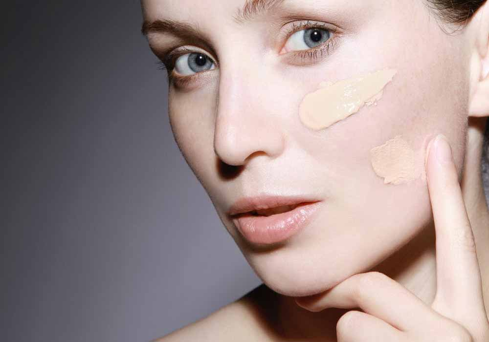
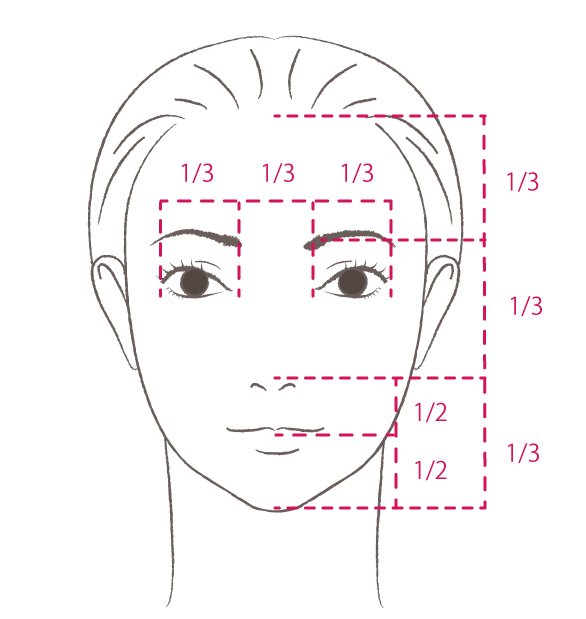
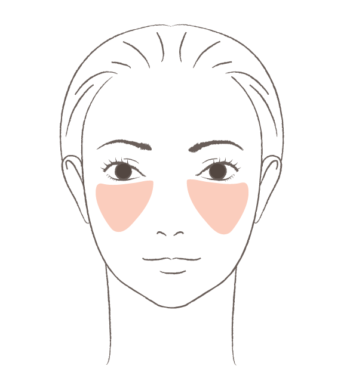
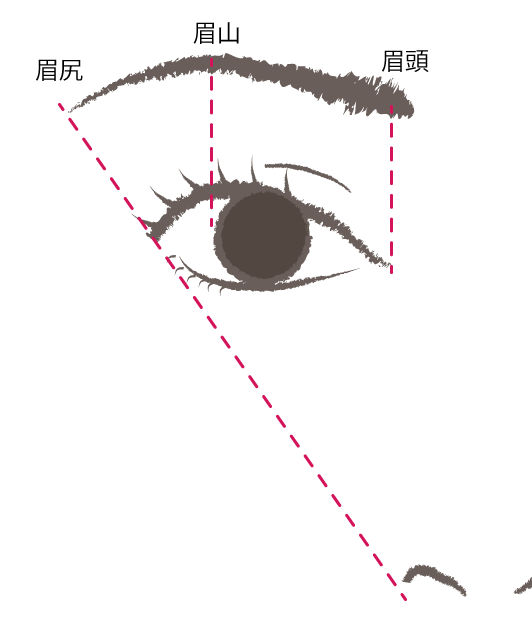
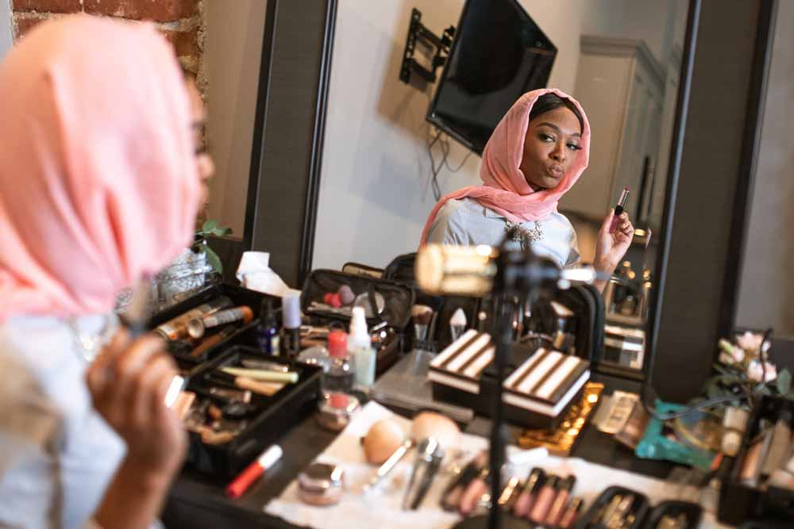

## 美人を作るのはバランス。目と鼻が所定の位置についていればどうにかなる

鼻の高さや目の大きさを気にする人多いですが、各パーツの良し悪しよりバランスの方がよっぽど大切！

人は目と鼻がゴールデンバランスから大きく離れてなければなんとかなります笑

あとはノーズシャドウやアイラインなどを駆使して**小さな錯覚を繰り返して**ゴールデンバランスまで持っていけばどうにかなります笑

### オススメメイク手順
以下は私のオススメのメイクの手順です

* 筋肉が少なくメイクが崩れにくい頬の三角ゾーンを徹底的にカバーして美肌に見せる
* 仮でもいいのでチークで軽く骨格を作る
* 大雑把でいいのでアイライン、マスカラなど目の大きさに影響するアイメイクをする
* 目の大きさを考慮して眉毛を描く
* アイカラーなどの細かいアイメイクを仕上げていく
* リップはラインを意識して仕上げる。グロスだけでもオッケー
* 全体を見ながら仕上げのチークを足す

## それぞれのメイクのコツ、教えます
それではパーツ別のメイクのコツをお教えします！

### ベースメイク・肌をキレイに魅せるズル技。頬の三角ゾーンをカバーして美肌に
人は**頬の以下の三角ゾーンを見て肌の美しさを判断**しています。

だからこの部分をうまくメイクでカバーできさえすれば、例えエラのあたりにニキビ痕があろうがお肌がきれいな人に見えます。 
しかもこの部分嬉しいことに**筋肉が少なくメイクがよれにくい**。ふんだんにファンデやコンシーラーでカバーしても大丈夫です。

オススメはこの**三角ゾーンの部分にパール感のあるアイテムを使う**ことです。 
光の力でシミやシワを飛ばして**むきたまごのようなつるんとしたお肌を偽装**できます。 
逆に**筋肉が多い口周りや、肌の薄い目周りのファンデの量は最小限に抑え**てください。

そしてTゾーンのパールはテカって見えるのでパールの使用は避けましょう。

### チークが小顔を作る。自分に似合うチークをしないとブスになる
チークの基本の基ですが、まず顔が立体的だと認識しましょう。横顔も他人からは見られています。

たまに横から見たら頬の上だけポンとチーク乗っけて「おてもやん」みたいになったやらかした方がいます。

下まぶたから指一本分はチークは入れないようにします。そもそもここはハイライトゾーンです。 
そして、頬の一番高いところが色濃くなるように耳上のあたりまでグラデをかけるとキレイに、品よく仕上がります。 
あと面長な方はアゴにもほんのりチーク入れて小顔にするのもオススメです。 
チークは使い方によっては骨格のデメリットをカバーできるので是非マスターしましょう。

### 自分の肌色を味方につけろ！アイカラーは黄色人種に似合う色を選ぶ
日本人は黄色人種。

個人的にオススメなのがラベンダーとブラウン。あくまで薄い紫、ラベンダーが黄色いお肌を打ち消し過ぎなくてかつ品が出ます。グラデはブラウンが黄色いお肌に馴染んで◎ 
とはいえ日本人でも黄味の強いウォーム系の人ばかりではなく、クール系のピンク寄りのお肌もあるので吟味した方が良いですね。 
補足すると、人は加齢でお肌は黄色が強くなります。 
どんな色が似合うか冷静に観察しておくといいですね。

### ビューラーが苦手なら、マスカラは目尻側から内側に寄せながらつけるとまつ毛が起きる
メイク慣れていない方はビューラーがとにかく苦手。どうしてもビューラーが苦手ならまつ毛を目尻から目頭に向けてつけていきます。そうすると寝ていたまつ毛がビューラー無しでもわりとツンと上に起きます。

あとビューラーとマスカラを駆使過ぎるとまつ毛が傷んでしまうので付けまつ毛を利用するのもおススメです。 
バランスを見て長さや量などをカットして不自然にならないようにして目尻側だけつけて、マスカラで自まつ毛と馴染ませてあげると◎です。

### 眉毛ないと幸薄に見えるから、とにかく描いて
眉毛が生えてない人はとにかく描いて！特に歳をとって眉毛ないと、**幸薄に見える**んです。 
眉の鉄板な描き方は目頭の上に眉山、黒目の外側に眉山、眉尻は小鼻と目尻を結んだ延長線上に置くとキレイに仕上がります。

目の大きさはアイメイクによってかなり変わります。 
メザイクやアイプチを使えばなおのこと目の大きさは変わります。 
アイメイクをある程度終わらせないと目の大きさが決まらないので、眉毛はアイメイクの後に描いていくことをオススメします。 
鏡でバランスを確認しながら、一気にどちらかを仕上げずちょっとずつ交互に描いていくとうまくかけます。

たまに「眉毛犬」みたいになっている人がいます。眉毛だけひとり歩きしちゃうのでご注意を笑

### リップはチークと色味を合わせる
リップは大きく分けて青よりのローズと黄よりのコーラル系があります。 
お肌の色味に合わせるといいのですが、チークとリップの色味を合わせると調和します。

たとえグロスでも、リップラインを意識しましょう。

### メイク中は「普段人と会う距離でどう見えるか」の確認を怠らない
近くばかり見ながら、細かくメイクをしてると、あとから確認するとびっくりとんでもフェイスが出来上がってしまうことがあります。

人のパーソナルスペースは約60センチ。

目頭切開ラインを加えたりや涙袋を作るなどしたいときは特に、少し作っては鏡から60センチ程度離れて不自然じゃないか鏡で確認してください。

### おまけ・想像以上に髪型で騙せる笑
人に好感度を印象付けるためには髪型がメイク以上に大切なこともあります。

エラが張っている、丸顔、顔が長いなど気になるコンプレックスってわりとありますが、髪型であっさりカバーできることもあります。メイクよりも強力なツールになり得ます。
私は数年前からストレートロングヘアです。 
ストレートロングヘアは老若男女に支持される鉄板スタイルだからです。 
かつ私のピンク系の肌がキレイに見えるよう赤系にカラーリングするようにしてます。髪ってわりと顔まわりを占有してるので、色を間違えるとお肌の色もくすんで見えます。 
なのでカラーリングにも気を使っています。

美容院によってはカラーリストもいますのでよく相談するといいですね。

## メイクをして自分をもっと好きになってください
メイクに関する基本の考え方が3つあります。

* お肌を外気や埃、紫外線から守る
* マナー礼儀
* 自尊心を守る。自信をつける

中でも私が大切にしているのが、3つめの「**自尊心を守る。自信をつける**」ことです。誰しも美しく美人に生まれてきたいけどそうはいきません。

どんなコンプレックスを抱えていてもメイクさえすれば今のあなたより美人度は4割も増します。

メイクが上手くなるだけで自分に自信がもてたり、自分を好きになれるのであればどんどんやってほしいですね。

## まとめ・メイクの順番を守ればいい感じに仕上がるはず
いかがでしたか？私がプロのメイクさんだった頃のメイク手順をまとめました。 
女性はメイクや髪型、ファッションで見た目は変わります。たまにズルをしているとか頑なにやりたがらない人もいますがめちゃくちゃ損してますよ。 
メイクは女性の特権です笑楽しんだもん勝ちです！

よろしければみなさんのメイクライフの参考にしてみてください。

そして、最後までお読みいただきありがとうございました。
