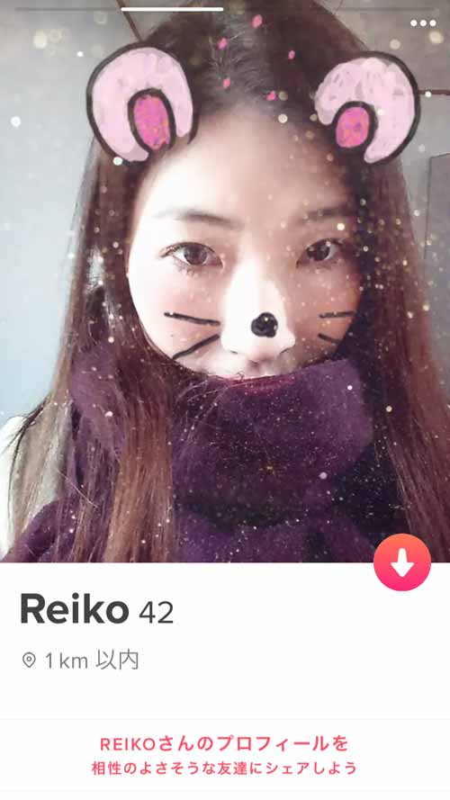
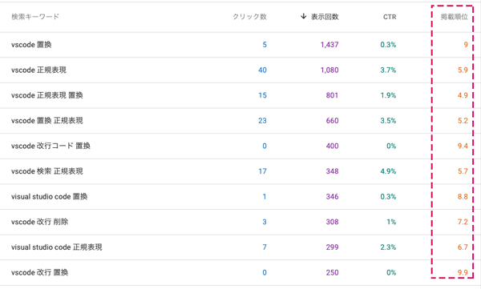
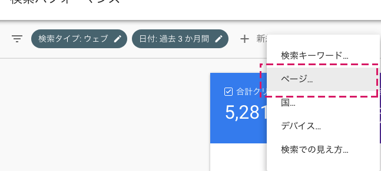
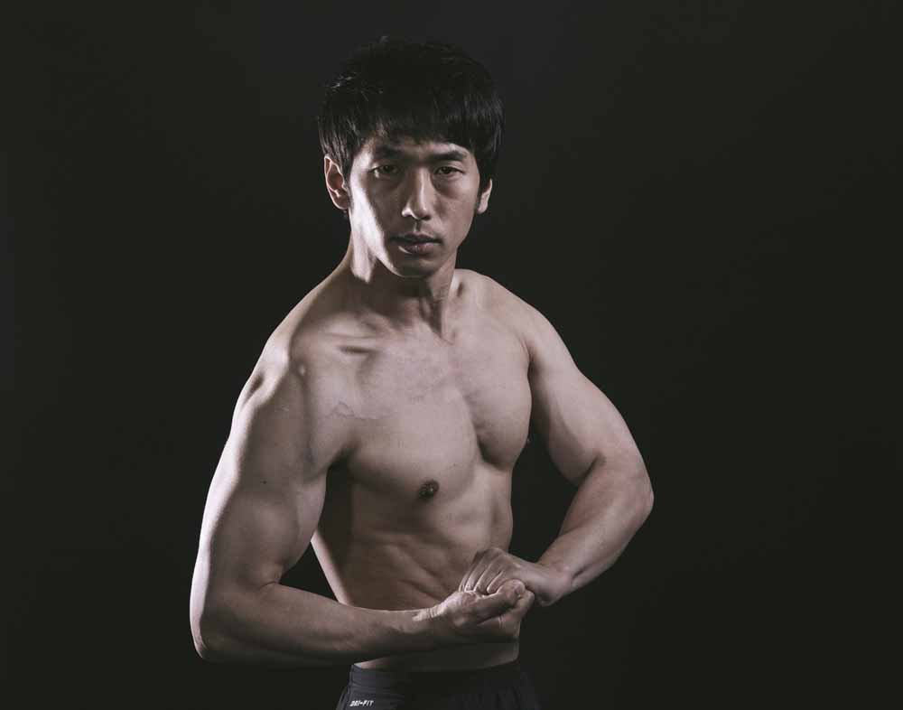
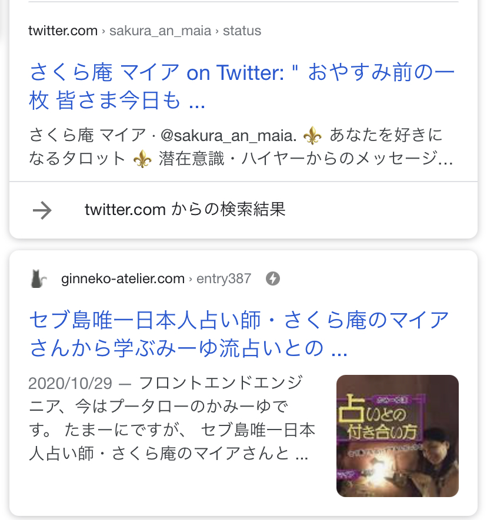
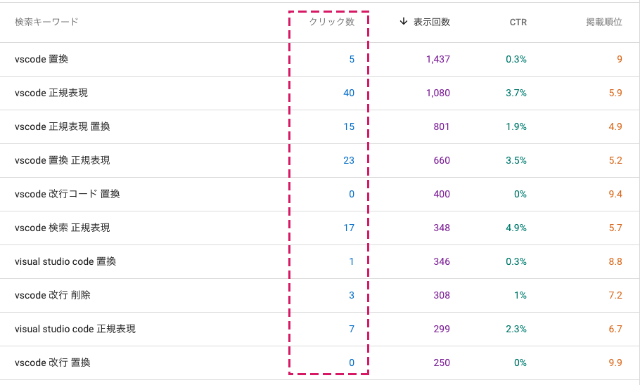

## 「あなたというコンテンツ」をコンバージョン（マッチング）させるまでの過程がSEOにそっくり
コンバージョンとはSEOにおいてその**ウェブサイトのゴール**です。何をゴールとするのかはそのサイトの使用目的によります。
今回のSEOにおいてのゴールはオーガニックサーチ（自然検索）からブログ記事の1PV（ページビュー）を獲得するまで。


マッチングアプリの出会いとSEOのコンバージョンでは共通する大事な過程が4つあります。

露出、ファーストインプレッション、流入されたら冒頭で心を掴む、興味を持ってもらうです。

**各ポイントを順番にクリアさえすればコンバージョンに至れます**。

<table><tbody><tr><th><p>&nbsp;</p></th><th>マッチングアプリ</th><th>SEO</th></tr><tr><th><p>ステップ1<br>露出</p></th><td><p>アプリ内でアカウント・プロフィールなどが露出されているか</p></td><td><p>特定キーワードで10位以内に検索結果が浮上しユーザーの目に触れやすくなっているか</p></td></tr><tr><th><p>ステップ2<br>ファースト・インプレッション</p></th><td><p>プロフ写真で好印象を与えることができるか</p></td><td><p>目を引くディスクリプションやタイトルで検索一覧の中からクリックしてもらえるか</p></td></tr><tr><th><p>ステップ3<br>流入（サイトへ着地）した後</p></th><td><p>プロフィールで付き合いたいか興味を持たせることができるか</p></td><td><p>記事の冒頭で記事が本当に読みたい内容と思わせる工夫ができているか</p></td></tr><tr><th><p>ステップ4<br>コンバージョン（ゴール）</p></th><td><p>興味を持ってもらいマッチング成立</p></td><td><p>最後まで読んでもらう・ファンになってもらう</p></td></tr></tbody></table>

余談ですがこのアイキャッチに使ってる写真は今年ロックダウン中に暇つぶしで登録した「フィリピン出会い系サイトの鉄板Tinder」で使っていたプロフ写真です。

[Tinder](https://ja.wikipedia.org/wiki/Tinder)



2年前の写真ですが。。。。まあ詐欺っちゃ詐欺ですね。

Tinderは私が現在住んでいるフィリピンでメジャーなマッチングアプリです。<br>
ちゃんと当時の実年齢42才、敬愛する実のおかんの名前を借りて登録。<br><br>


退屈で速攻やめてしまいました。

## 未来の彼女もウェブサイトも目に触れなければ気づいてもらえない。とにかく露出させる工夫が必要
SEOでは最初はとにかくウェブサイトに流入してもらう！が大事です。


たどり着いてもらわないことには記事を読んでもらえませんからね。

マッチングアプリでいうところ、ターゲットに自分のプロフィールが表示されることを増やすことです。

### アプリ内で自分のアカウント・プロフィールなどが露出されるように工夫する
まずはアプリの登録したら、プロフィール設定しますよね。

自分は「**こんな人間だ**」というのが伝わり、「**マッチしてほしい女性のニーズ**」にあってるかどうかが大切です。

趣味や職業など事細かに書いて、人となりがわかるような写真もしっかり登録しておくと露出が増えるはずです。

登録したばかりの時はとくに**男性に課金させることをマッチングアプリ側が狙っている**のであなたの露出も意図的に増えると思います。

### SEO・露出させるために特定キーワードで10位以内に浮上させること
とにもかくもSEOでまず大事なのが露出させること。



こちらはサーチコンソールの検索パフォーマンスのデータです。<br>
ページごとにフィルターをかけられます。



まずは順位に着目してください。<br>
オーガニックサーチ（自然流入）で、**狙ったキーワードで最低でも上位10位程度まで持ってくること**が大事です。

人間って面倒くさがる生き物。10位以下だと次のページになってしまうので探される可能性がグンと減ります。

では検索の順位を上げるためにはどうすればいいのでしょうか？<br>
検索を上位にあげるためには、とにかく**キーワードにそった記事を書く**こと。

たとえばSEOの記事を書こうとして、野球の話になってしまったなどだと本末転倒です。

一貫して**キーワードからブレない記事を書く**ことを心がけています。<br><br>


私はちなみに3000文字以上くらいを目安にしています。

## ファースト・インプレッションを高める。露出されるようになったらクリックしてもらうための仕掛けを
検索順位が上位表示されるようになったら、次はクリックしてもらわなければなりません。

どんなファースト・インプレッション（最初の印象）を与えるかが重要です。

### ファースト・インプレッションの決め手はプロフ写真。好印象を与える
詳しく知ってもらうために大事なのは「見た目」です。要は写真です。

イケメンじゃないからといって諦める必要はありません。<br>
笑顔がステキだったりするだけでも全然違います。<br>
意外と自分がイケてると思っている写真でも人から見てそうでもないこともあります。

もし出会いが伸び悩んでる場合は写真を変えてみましょう。

#### オススメしないプロフ写真


* やたら脱いで筋肉自慢
* 過剰に加工した写真
* 清潔感のない風貌
* ナルシストがあふれた写真

良かれと思って掲載した写真は大抵NGです。。自然体が一番ですよ。。。。

### SEO・目を引くディスクリプションやタイトルで検索一覧の中からクリックしてもらう

みなさんもこんな感じでググってますよね？


検索一覧ではタイトルとメタディスクリプションでユーザーはそのページを閲覧するかを判断します。

最近スマホでは設定によりますがアイキャッチも出力されますよね。<br>
出力させるためには、name属性thumbnailを持ったmetaタグをhead内に設置しておく必要があります。

Googleは気まぐれです。出力されないこともあります。出力されたらラッキーくらいに思っておいてください。

```
<meta name="thumbnail" content="{https://ginneko-atelier.com}/application/files/cache/thumbnails/b4a6fa6a438bbd927df69058ca70d301.jpg">
```



このタイトルとディスクリプションが検索キーワードを検索したユーザーに刺さらなければ読んでもらえません。

絶対にやって欲しいのは**タイトルに検索キーワードを含めること**。

ディスクリプションにも含めます。<br><br>


もちろん、そのページを閲覧かどうか決めるのは人。**そのキーワードで検索した人が「何を探し求めてきているか」よく考えて全力で書きます**。




クリック率が低い場合は、**タイトルとディスクリプションに問題がある**のかもしれません。
同様のキーワードで検索されている記事と比べてみるといいかもしれません。

## 流入後、冒頭で興味を持たなければ人は離脱する
やっと流入してもらうことができましたが、まだこれで終わりではありません！

最後まで記事を読んでもらわないといけません。

### そのプロフィールの冒頭であなたに興味を持たせることができるか？

プロフを見ている女性はきっと「この人が自分にとってマッチする人か」と考えているでしょう。

なので冒頭の文章が結構大事です。

また、「プロフ読んでくれてありがとう」とか、**さりげない感謝などがあると好印象**を与えるかもですね。

#### オススメしないプロフィール内容
* 自慢が多め
* キャラを無理やり作っている
* 内容が誇張・もしくはウソ

すべて本当のことを言う必要ないですが、身長が160cmしかないのに170cm的なウソはやめたほうがいいですね。。。。

### SEO・記事の冒頭（ファーストビュー）でその記事が本当にユーザーにとって読みたい内容だと感じてもらえるか
流入した後もやっぱり「見た目」が大事。読みたい記事かを印象づけるのはアイキャッチです。<br>
私も記事のイメージを印象付けるアイキャッチをできるだけ作るように頑張ってます。

その次に記事を読むか否かを判断するのは冒頭の文章です。<br>


私は冒頭の文章で「**読者に寄り添っているか**」に一番気を遣っています。

この記事を読みに来てくれている人はどんな思いでこの記事にたどり着いたのだろうか？

この記事でどんなことを解決してくれるだろうか？<br><br>


あくまで、文章を読むのは人。ロボットではありません。<br><br>


そのキーワードを検索している理由は困っていて解決策を求めているから**。なので**一緒に解決していこうと寄り添うことが読者の信頼につながる**のでないかとも思っています。
## コンバージョンに至るまでは分析し解決策を予測しPDCAを回すしかない
コンバージョンに至るまでのいくつか通過しなければならないポイントがありますが、それぞれでうまくいかないときはちょっとずつやり直しを繰り返しましょう。

たとえば検索順位が上がらない場合は検索エンジンにキーワードがマッチしていない可能性があるのでコンテンツ全体を見直す必要があります。

### マッチングを成立するためには？
まず**は露出を増やす**しかありません。


みんな器用に文章を書けたりいい写真を掲載できるわけではありません。<br>
そして、露出とチャンスを増やすためにはやはりお金の力が最強ですね。<br><br>


**露出数・母数が増えればチャンスは間違いなく増えます**。<br><br>


相手に妥協できない人、チャンスがなかなか来ない人はお金で解決することをオススメします。<br><br>


数をこなしてトライアンドエラーで、プロフィールを充実させてください。

誰にでもチャンスはあります。応援しています！！！！！！

## 最後まで読んでもらう。ファンになってもらうために
せっかく流入してもらってもなかなか滞在してもらうことは難しいです。<br><br>


記事を最後まで読んでもらうためにGoogleアナリティクスで**離脱率、直帰率、滞在時間をチェックして定期的にリライト**しています。

とくに私がリライトの際に意識しているのは以下の項目です。

* 結論から述べているか？
* 自分がどんな人間か伝えられているか（持っているスキル・信用がおける人間かとか）
* 文章を塊ごとに見出しをつけてセクショニングできていて、読みやすいか
* 同じキーワード流入のある他の人の書いた記事を分析し、比較して自分の記事の強みを見出しリライト

ちなみ[に沈黙のWebライティング —Webマーケッター ボーンの激闘—](https://amzn.to/3p7iVtr)はウェブライティングにオススメの1本です。ウェブライティングのノウハウがぎっしり詰まっています。

<p></p>

## まとめ
オーガニックサーチ（自然流入）から1PVを稼ぐまでの流れをマッチングアプリの出会いに例えてみました。

SEOもマッチングアプリでもコンバージョンにいたるために大切なのは、<br>
**この先ファンや好きになってくれる人に対しての思いやり**だったり、**相手の求めてるものに対しての解決方法の提示**だったりなのかなーって思います。<br><br><br>


先々月まで私のサイトは最近までおおよそ平均1700PVでした。<br>
このサイトはそもそも私の備忘録として始めました。<br>
昔は記事更新しなくてもPVたくさんあって高飛車になってたのもあります。

ここ最近はPVはダダ下がりでひどかったです。<br><br>


なんでこんなにPVが落ちたかと言うと。。。<br><br>


仕事が忙しすぎてブログが更新できてなかったのと、古い情報で価値がなくなり改善の必要な記事も放置していたのもあります。

私の記事は基本テックブログなので、情報が古くなりニーズに沿わなくなればいともカンタンにPVは落ちます。<br>
ひどかったのでこの8月くらいまで結構頑張ってました。

<a class="article-link" href="/blogs/entry380">
<section><div class="article-link__img"></div><div class="article-link__main">
<div class="article-link__main__title">ブログ運用を結婚生活に例えてみた</div>
<p class="description">現役フロントエンドエンジニアのかみーゆです。
ブログを始めてしばらくして、伸び悩んでどうしていいかわからない人のために記事を書きました。実体･･･</p>
<p>
<time datetime="2020-08-01">2020.08.01</time>
</p>
</div>
</section>
</a>

仕事辞めるまでまとまった時間が取れず、最近やっと記事をボツボツ更新したりリライトしたりするようになりました。

10月は記事をたった4記事追加しただけですが約1000PVアップしました。
昔に比べたらまだまだですが嬉しかったです。

PVは低くなっちゃったかもしれませんが、誰かが読んでいてくれているということは忘れてはいけませんねですね。

たとえ**1PVでも寄り添える記事を書く原動力**になります。<br><br>


さておき、出会いを求めてる方は良いクリスマスになることを祈っていますYOY！！<br><br>


最後までお読みいただきありがとうございました。
