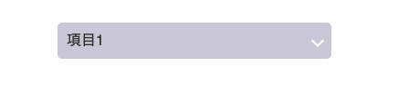

フォームパーツのカスタマイズって難しいですよね？<br>中でもセレクトボックス（select option）をCSSでカスタマイズする時は手を焼きます。

ということで今回はセレクトボックスの書き方、CSSでのカスタマイズ方法をケース別にまとめてみました。<br>スニペットも用意しています（随時追記します）。WordPressの「MW WPフォーム」や「Contact Form 7」のカスタマイズにも応用可能なので参考にしてください。

<prof></prof>

## セレクトボックスってどんな時に使うの？
セレクトボックスとはHTMLのフォームパーツの一種で、ユーザーにたくさんの項目の中から選択させたい時に使います。

私がよく使うのは住所での県などの選択が多めです。


少量であれば、ラジオボタンやチェックボックスで十分だと思います。<br>
ラジオボタンとチェックボックスのカスタマイズについてはこちらをご参照ください。

<card id="/blogs/entry370/"></card>

<ad location="/blogs/entry393/"></ad>

<card id="/blogs/entry374/"></card>

### セレクトボックスの基本のHTMLの書き方
コードとしては以下の通りで選択させたいアイテムはoptionタグに入れ、それをselectタグでラッピングします。

クリックしたら、こんな感じで項目が表示されます。

<figure class="animation"></figure>

```html
<select name="selectbox">
  <option value="項目1">項目1</option>
  <option value="項目2">項目2</option>
  <option value="項目3">項目3</option>
  <option value="項目4">項目4</option>
</select>
```

### ボタンやチェックボックスなどのフォームパーツのスタイリングがむずかしい理由
HTMLのフォームパーツ（お問い合わせフォームなどで使うタグ）は標準で複雑なスタイリングを各ブラウザが用意しています。フォームパーツはサイト上で動的に操作できる要素です。

クリックしたり、キーダウンした際に何かしら操作ができてしまう特別な要素。
なのでブラウザ側は特別な見た目を用意しています。

コーダーはカスタマイズ時にあらかじめ**用意されたたくさんの標準CSSを打ち消しつつスタイリング**しなければなりません。<br>
だからチョー面倒なのです涙。

### 基本のセレクトボックスのカスタマイズ
まずはデフォルトの要素のスタイルを打ち消します。CSSでappearanceプロパティの値をnoneにします。<br>
appearanceプロパティはチェックボックスやボタンなどの各フォームパーツの持っているスタイルを真似たり、もしくは打ち消す時に使います。appearanceについては以下ブログも参考に^ ^。



```css
appearance: none;
```
<ad location="/blogs/entry393/"></ad>

そのほか初期化が最低でも必要なプロパティはこちら5つ。

1. background（背景）
2. border（ボーダー）
3. border-radus（角丸）
4. font-size（文字サイズ）
5. color（文字色）

デザインに応じて上書きしておきましょう！

IE対応では`appearance`に`-ms-expand`という矢印（ドロップダウンメニューを開閉）ボタンが擬似要素にデフォルトでセットされているので`desplay:none`をセットする必要がありましたが、最近の子はIE知らんよね笑。

参考：[::-ms-expand|MDN](https://developer.mozilla.org/ja/docs/Web/CSS/::-ms-expand)
```css
select::-ms-expand {
  display: none;
}
```
また、プルダウン表示されるoptionタグはブラウザや端末（iPhoneとか）に相当依存するのでカスタマイズはむずかしいということをあらかじめ知っておいた方が良いです。

### ラッパーを挟んで作る方法
セレクトボックスといえば右端に矢印マークがあるイメージですよね？<br>
標準CSSでせっかくあった矢印マークはリセットすると打ち消されてしまいます。<br>
スタイリングの際は必ずユーザビリティ・アクセシビリティを考えましょう。

一目見てユーザーがこのタグはなにができるかわかるよう矢印マークを再度追加します。

まずはラッパーを使う方法をご紹介します。

矢印マークの素材が用意できないときに私がよく使う手です。

selectの上にdiv（ラッパー）などでラッピングし、擬似要素を利用してマークを作ります。<br>
正方形の要素を作り上部・右にボーダーをにつけて45度傾けたら完成です。<br>
位置を`position: absolute`で右端に固定します。<br>
縦位置ど真ん中にしたいので`top: 50%`に配置して`translate: 0 -50%`で要素の高さ半分上に上げています。

```css
  right: 10px;
  top: 50%;
  translate: 0 -50%;
  rotate: 45deg;
  /* transform: translateY(-50%) rotate(45deg); 古い記述方法*/
  border-bottom: 2px solid #fff;
```

もうひとつポイントは**z-index**です。

z-indexは要素の重なり順を操作できるプロパティです。

実はabsoluteで位置調整した擬似要素は重なり順が1個上になり、セレクトボックスの上に重なってしまいます。

このままではマークの上をクリックしてもセレクトボックスが反応しないのでセレクトボックスの下にマークを潜り込ませます。<br>
ラッパーには`z-index: 1`を、afterには`z-index: -1`を付与します。

```html:title=HTML
<div class="select">
  <select name="item">
    <option value="項目1">項目1</option>
    <option value="項目2">項目2</option>
    <option value="項目3">項目3</option>
  </select>
</div>
```

```css:title=CSS
/* 基本のセレクトボックスのカスタマイズ */
.select {
  background: #cfcedb;
  height: 40px;
  width: 300px;
  border-radius: 5px;
  position: relative;
  z-index: 1;
}

.select::after {
  position: absolute;
  content: '';
  width: 8px;
  height: 8px;
  right: 10px;
  top: 50%;
  transform: translateY(-50%) rotate(45deg);
  border-bottom: 2px solid #fff;
  border-right: 2px solid #fff;
  z-index: -1;
}

select {
  /* 初期化 */
  appearance: none;
  -moz-appearance: none;
  -webkit-appearance: none;
  background: none;
  border: none;
  color: #333;
  font-size: 16px;
  width: 100%;
  height: 100%;
  padding: 0 10px;
}
```

[ラッパーを挟んで作る方法デモ|Code Pen](https://codepen.io/camile/pen/KKMGJjN)

### 背景画像で矢印マークを仕込むパターン
ラッパーを使うのは面倒！という人は背景画像を利用して作る方法があります。<br>
ぶっちゃけこちらの方がコードはすっきりします。

ポイントは背景の位置です。<br>
右から10pxの位置に固定したい場合は、right 10pxという書き方で指定可能です。<br>
同様に下からの時もbottom 10pxみたいな指定が可能です。

ついでにbackgroundプロパティのショートハンドの書き方のご紹介です。<br>
色 背景画像に指定したい画像のパス リピート 位置 / サイズとなってます。

<ad location="/blogs/entry393/"></ad>

うまく効かないときは**/（スラッシュ）が抜けていることが多い**です。

```css
background: #cfcedb url(./assets/arrow.svg) no-repeat right 10px center / 16px auto;
```
セレクトボックスのコードはこちら
```html:title=HTML
<select name="item">
  <option value="項目1">項目1</option>
  <option value="項目2">項目2</option>
  <option value="項目3">項目3</option>
</select>
```

```css:title=CSS
select {
  /* 初期化 */
  appearance: none;
  -moz-appearance: none;
  -webkit-appearance: none;
  border: none;
  border-radius: 5px;
  color: #333;
  font-size: 16px;
  padding: 0 10px;
  height: 40px;
  width: 300px;
  position: relative;
  background: #cfcedb url(./assets/arrow.svg) no-repeat right 10px center / 16px auto;
}
```
[背景画像で矢印マークを仕込むパターンデモ|Code Pen](https://codepen.io/camile/pen/abZRgpa)

2025年追記。矢印マークなどの[単純なアイコンは clip-path で仕込む方法](https://ginneko-atelier.com/blogs/entry536/#background-clip-%E3%81%A7%E3%82%A2%E3%82%A4%E3%82%B3%E3%83%B3%E4%BD%9C%E6%88%90)もあります。ファイルを読み込むとリクエスト数が増えるので最近私はこの方法を取ることが多いです。

## セレクトボックスのケース別スニペット集
セレクトボックスをコーディングしているときによく「これどうやるんだったっけ？」って思い出せないことがあります。
ケース別でスニペットを作成しましたのでよろしければ参考にしてください。

### ケース1・セレクトボックス上「選択してください」を表示したいけど、その項目を選択肢から外したい
<figure class="animation"></figure>

セレクトボックスにはプレースホルダーがないので、「選択してください」などの文字をoptionタグを使って表示することが多いです。

とはいえ、実際の項目として「選択してください」を選択されても困りますよね？
そんなときは、selected + disabled属性を付与してCSSで隠して解決します！

* **selected**　選択された状態
* **disabled**　操作不能

```html:title=HTML
<select name="item">
  <option selected disabled>選択してください</option>
  <option value="項目1">項目1</option>
  <option value="項目2">項目2</option>
  <option value="項目3">項目3</option>
</select>
```

```css:title=CSS
select {
  /* 初期化 */
  appearance: none;
  -moz-appearance: none;
  -webkit-appearance: none;
  border: none;
  border-radius: 5px;
  color: #333;
  font-size: 16px;
  padding: 0 10px;
  height: 40px;
  width: 300px;
  position: relative;
  background: #cfcedb url(./assets/arrow.svg) no-repeat right 10px center / 16px auto;
}

option[selected][disabled] {
  display: none;
}
```
[セレクトボックス上「選択してください」を表示したいけど、その項目を選択肢から外したいデモ|Code Pen](https://codepen.io/camile/pen/eYzPwEM)

### ケース2・optionタグをグルーピングしたい

セレクトボックスの中の項目が多くてグルーピングしたいことがありますよね？


**optgroup**を使ってまとめることができます。<br>
たくさん項目がある際は、ユーザーの可読性も上がるので親切です。

```html:title=HTML
<select>
  <optgroup label="フルーツ">
    <option value="オレンジ">オレンジ</option>
    <option value="バナナ">バナナ</option>
  </optgroup>
  <optgroup label="野菜">
    <option value="きゅうり">きゅうり</option>
    <option value="白菜">白菜</option>
    <option value="人参">人参</option>
  </optgroup>
</select>
```

[optionタグをグルーピングデモ|Code Pen](https://codepen.io/camile/pen/pobxXdd)<br>
参考:[HTML 要素リファレンス optgroup MDN](https://developer.mozilla.org/ja/docs/Web/HTML/Element/optgroup)

### ケース3・複数の項目を選択したい
複数選択させるためにはselectにmultiple属性を付与すればOKです。<br>
ただしCSSに非常にクセがあって、とてもカスタマイズが難しかったです。。。

<figure class="animation"></figure>

選択した項目にチェックが入るところだけ、CSSで付与しました。<br>
とりあえずチェックが入った時の背景色と文字色の変更が難しい。<br>
力技で、box-shadowを内側に効かせればできましたが、その代わりマークが消えます。。。Safariでは思い通りの見た目にはなりません。

また時間があるときにもうちょい調べて追記します。

```html:title=HTML
<select name="item" multiple>
  <option value="項目1">項目1</option>
  <option value="項目2">項目2</option>
  <option value="項目3">項目3</option>
  <option value="項目4">項目4</option>
  <option value="項目5">項目5</option>
</select>
```

<ad location="/blogs/entry393/"></ad>

```css:title=CSS
select {
  /* 初期化 */
  appearance: none;
  -moz-appearance: none;
  -webkit-appearance: none;
  border: 2px solid #aaa;
  color: #333;
  font-size: 16px;
  width: 300px;
  background: #fff;
  outline: 0;
  position: relative;
  display: block;
}

select[multiple] option {
  color: #333;
  padding: 5px 5px 5px 35px;
  position: relative;
}

select[multiple] option:checked {
  appearance: none;
  -moz-appearance: none;
  -webkit-appearance: none;
  background: url(./assets/check.svg) 10px center / 15px auto no-repeat!important;
}
```

[複数の項目を選択デモ|Code Pen](https://codepen.io/camile/pen/xxOyopm)

参考 [デュアルリストボックスでクリックされたオプションの背景色を変更する](https://python5.com/q/gyscnsql)

<ad location="/blogs/entry393/"></ad>

### チェックボックス（\<input type="checkbox">） で代用する
無理に select/option で複数選択するのは Safari などのブラウザで限界があります。

そもそも使わず UIを似せてcheckbox で作成するのもありです。その方がデザインの幅が広がります。

<figure class="animation"></figure>

```html:title=HTML
<div class="multiple">
  <label><input type="checkbox" value="項目1" name="item">項目1</label>
  <label><input type="checkbox" value="項目2" name="item">項目2</label>
  <label><input type="checkbox" value="項目3" name="item">項目3</label>
  <label><input type="checkbox" value="項目4" name="item">項目4</label>
  <label><input type="checkbox" value="項目5" name="item">項目5</label>
</div>
```
最近は疑似要素 `:has()` が使えるので如何様にもアイデア次第でカスタマイズできます。
```Css:title=CSS
.multiple {
  border: 2px solid #999;
  background: #fff;
  max-height: 1６0px;
  overflow: scroll;
  width: max-content;
}
.multiple input[type="checkbox"]{
  display: none;
}
.multiple label{
  display: flex;
  gap: 8px;
  height: 40px;
  align-items: center;
  padding: 0 12px;
  width: max-content;
  min-width: 200px;
}
.multiple label:has(>input[type="checkbox"]:checked) {
  background: #ccc;
}
.multiple label:has(>input[type="checkbox"])::before {
  opacity: 0;
  background: #ff006d;
  content: '';
  height: 10px;
  width: 12px;
  display: block;
  clip-path: polygon(16% 48%, 0 68%, 34% 100%, 100% 20%, 88% 6%, 34% 64%);
}
.multiple label:has(>input[type="checkbox"]:checked)::before {
  opacity: 1;
}
```
[multiple(checkbox)のデモ|Code Pen](https://codepen.io/camille-cebu/pen/GgKLZQV)

## まとめ
いかがでしたでしょうか？

個人的にはセレクトボックスがフォームパーツの中で**一番クセが強くカスタマイズの難しい要素**だと思っています。

CSSだけでのカスタマイズは大変ですが避けて通れないのでスタイリング頑張りましょう。

ボタンのCSSスニペット集も追加しました！

<card id="/blogs/entry396/"></card>

さらにグローバルメニューのホバーアニメスニペット集追加しました！ぜひ活用して表情豊かなウェブサイトを作ってください！

<card id="/blogs/entry449/"></card>

SEO似効果的なパンくずリストの設置方法についても詳しく解説しています。

<card id="/blogs/entry498/"></card>

そしてコーディングライフの一助となれば幸いです。

最後までお読みいただきありがとうございました。

