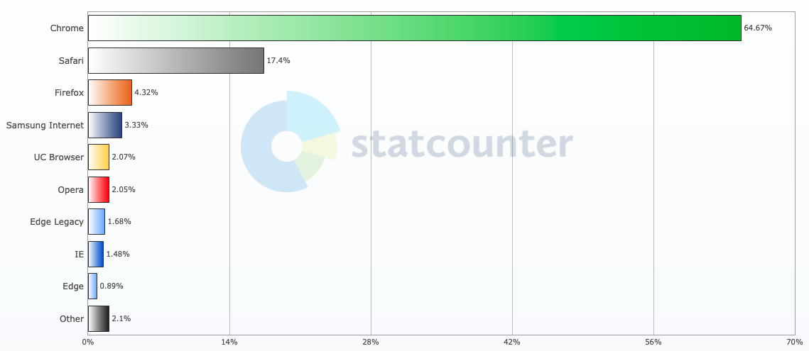
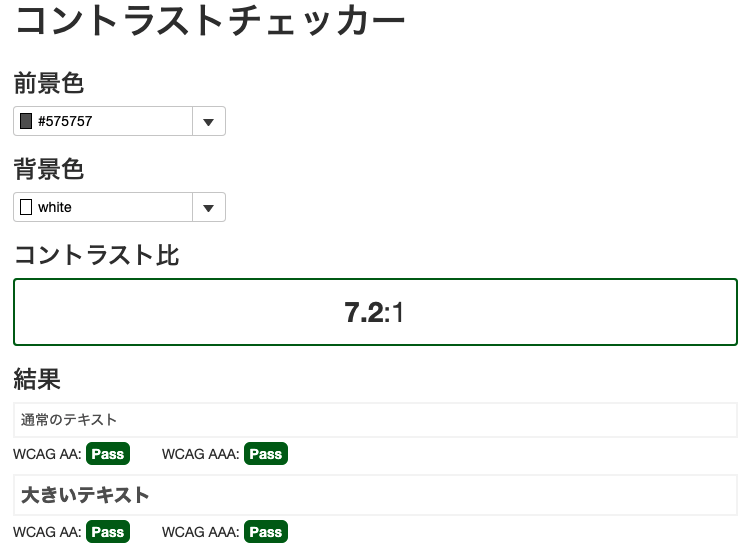
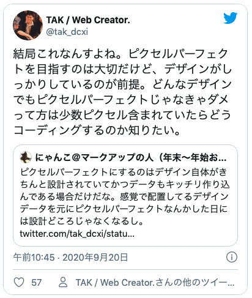

## 1. お願い！カラーモードはRGBで！
カラーモードがCMYK。イラレやフォトショでデザインカンプが上がってきたときよくあります。

紙とウェブでは色の出力モード違いますよ！！必ずRGBで作ってください。。。。

最近はXDの登場のおかげでこの問題はだいぶ減りました。
良い時代になった。

## 2. ちょっと待って。フォントサイズ、考慮してください
フォントが超小さいデザインカンプを受け取ることがあります。 
**Google Chromeでの最小フォントサイズは10px**です。そのほかのブラウザでは1pxまで小さくできるみたいですが、Chromeの世界でのシェア率は64.67%です。

世の中の半数以上が使っているChromeに合わせるのが○ですよね。

[Browser Market Share Worldwide](https://gs.statcounter.com/browser-market-share#monthly-201910-202010-bar)

`CSSでtransform: scale`などでムリやり縮小すれば10px以下の文字サイズにすることはできます。  

が、よく考えてください。

なぜ**小さなサイズが設定できないか**考えたことありますか？  

**ユーザーは情報を得るためウェブサイトに訪問しま**す。

せっかくの**情報が読みづらい**と思いませんか。  

Googleの推奨する**フォントサイズは16px**です。  

ユーザーへの思いやりよりデザイン性を優先してませんか？

ユーザーは**デザインの良し悪しを評価するためにサイトへ訪れているわけではなく情報を閲覧しにきている**のです。  

文字サイズへの配慮、忘れないでください。

## 3. コントラストのつかない色をたくさん使わない
表などのグレーの枠線で使用している色の種類がやたら多い事があります。 
デザインカンプ通りにするか、相談してどちらかに揃えるようにお願いするか頭を悩ませることがあります。

みんながレティーナ（高機能な）ディスプレイで見ているわけじゃないので、そんな大きな違いが出ないこともあります。

安いラップトップPCのモニターで見たら全部同じ色ですよw 
無駄にコードが増えます。

そして、たまに背景に溶け込んでしまいそうなくらい、薄いグレーの文字を見かけます。

**最低コントラスト比は4.5:1**です。

>この達成基準の意図は、(コントラストを強化する支援技術を使用していない) 中度のロービジョンの人がテキストを読めるように、テキストとその背景との間に十分なコントラストを提供することである。 
>WCAG 2.0 解説書コントラスト (最低限):達成基準 1.4.3 を理解する
>
>[WCAG20 コントラスト比について](https://waic.jp/docs/UNDERSTANDING-WCAG20/visual-audio-contrast-contrast.html)

**コントラストのつかないのであれば色数は抑えたほうがいい**です。

オンラインのコントラストチェッカーがあるので調べてみるのもアリですね。

* [コントラストチェッカー](https://demo.grapecity.com/wijmo/demos/Input/InputColor/ContrastChecker)
* [WebAIM: Color Contrast Checker](https://webaim.org/resources/contrastchecker/)

## 4. リンク・ボタンはモバイルでタップするサイズを考慮する
Google曰く、**ボタンの推奨サイズは縦横共に44px以上**です。これはおおよそ成人男性の指でもタップできるサイズです。
やたらめったら小さいと、誤操作にもつながります。 
モバイルデザインでは**指で操作することを一番に配慮**しましょう。

デザインカンプを受けとってコーディングするぞーってなった時に、ボタンサイズが小さいと気分が萎えます。

## 5. PCとスマホはセット。最低この2つを用意してはじめてデザインカンプです
ウェブサイト用のデザインカンプでPCだけでモバイルが用意されていないことがあります。 
「**PCを参考に作ってよー**」ってデザイン支給する人たまにいます。

スマホとPCって訪問するユーザーの属性結構違うし思っておいて欲しいです。 
ユーザビリティ考えるとPCと同じデザイン使い回せないこともあります。

タブレットまでとは言いませんが、せめてスマホのデザインも作ってください。

最近は**ウェブサイトの種類によりますがスマホから流入するケースが多い**んですよ。

本来であればスマホのデザイン優先して作った方がいいです。

個人的にはデザイナーなのに一番見られる箇所になぜ注力しないのかが不思議。

## 6. モバイルのハンバーガーボタン配置したならドロワーメニューもデザインして
モバイルのデザインカンプにハンバーガーボタンはあるのにドロワーメニューがなくて「**テキトーに作ってー**」って言われることがあります。

その時の私の心理状態はこちら。  

「**テキトーってなにw**」  

メニューって実際にあまり開かれることはありませんが、大切な機能であることには間違いないです。

必ずデザインを用意しましょう。

## 7. レスポンシブするものにムダなピクセルパーフェクト求めないで
最近ピクセルパーフェクトで少しTwitterが持ちきりになりましたが、私は**ピクセルパーフェクトどっちでも良い派**です。

デザインがきっちりしっかり設計されていたら喜んでやります。逆のケースだと**ぶっちゃけ地獄**です。
[ピクセルパーフェクトは必要なのか？ HTMLコーダーの考え方まとめ](https://togetter.com/li/1595233)

**再利用できないパーツだらけの無秩序なデザインカンプ**をピクセルパーフェクトにするのはめっちゃ工数かかります。

そして、ウェブサイトはレスポンシブで幅が変わります。

デザイナーがピクセルパーフェクトを求めるあまり、コンテンツが収まりきらない場合もあります。WordPressなどの動的サイトだとレイアウトが崩れることも。。  

ウェブのお作法に沿ってないデザインカンプでもその通りに作ることを強いるデザイナーさんがたまにいます。 
どうしても再現できなくてたくさんのパーツが画像になったこともorz  

せっかくのテキストが画像じゃSEO的にも意味ないし、せっかくコーダーとしてはとても悲しかったです。

## 8. HTML、CSSの性質を知った上でデザインを
ウェブサイトはHTMLやCSSで作るのでそれなりのお作法があります。

HTML5になりタグの数も108個に増えコーディング方法もセマンティック（意味のある）になりました。

構造がしっかりすればウェブサイトとしても解析されやすくなりますし、ユーザーも理解しやすくなります。

HTMLとデザインで作ったパーツが紐づかないとウェブサイトとして破綻すると思うんです。 
そうなると、ウェブデザイナーはやはりHTMLをある程度理解できていることが前提条件となります。そして、CSSにも制約があります。  

**ウェブデザインは感覚だけではできません**。  

紙デザインがシールを好きなようにペタペタ貼って仕上げていくのに比べ、ウェブデザインは積み木に近いと思っています。

しかもウェブデザインは大枠の構造がほぼ一緒です。

HTML構造とCSSの特性を知った上でデザインされたカンプが届くと飛んで喜びます。
## 反省・マサカリを投げずに制作に入る前にガイドラインを決めておく

ちなみにここからは私のこの一年の反省です。

「再現できねーよ！」って言って差し戻す（差し戻せないこともあり。。。）より、先にガイドラインを決めておく。 
そうすれば手戻りが減ってみんなハッピーでしたね。

たとえば、以下のような項目です。

* 基本のフォントサイズ
* 使用する基本の色
* コンテナーのサイズ
* モバイル・PCのデザインカンプのサイズ

「言わなくてもそのくらいわかるでしょう」って思いがちですが、、、**阿吽（あうん）の呼吸なんて存在しません**。

今後、私もマサカリを投げる前に取り決めておこうと思います。 
今までたくさん投げてごめんちゃい。

## まとめ・機能性 を優先してデザインされたウェブサイトがエラい子！
コーダーもデザイナーもディレクターも**お金をいただくクライアントではなく根本はサービスを使うユーザーに向くべき**なんですよね。 
ユーザーが心地よくそのサービスを使えてはじめて良い製作物と言えるのではないでしょうか。

デザインは建物などの設計と同じ！機能的に設計してユーザーに心地よいを届けたいですね！

合理的な思考のデザイナーさんの作ったデザインカンプはコーディングしてて気持ちいいです。

散々デザインに関して要望を書きましたが、私もデザイナーさんに怒られないようフロントエンドエンジニアとして精進します。  

長くなりましたがこの記事がウェブ制作のヒントになれば幸いです。

最後までお読みいただきありがとうございました。
