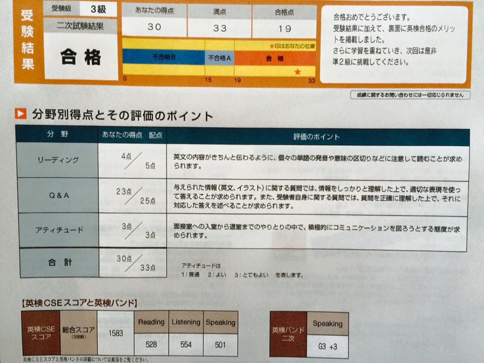

## 結論・英語は話せた方がハッピー。仕事の幅が広がる
フィリピン・セブ島で働いて気づいたことがあります。  

**英語は話せた方が仕事の幅が広がりハッピー。ビジネスチャンスも増える**、です。  

ただし、他の何かしらのスキルがあることが前提条件です。

「**英語が話せるだけの人はいくらでもいる**」からです。

「プログラマー+英語」「マーケター+英語」みたいに何かにかけ合わせてはじめて価値が生まれます。

とくに「**英語が話せるプログラマーは価値がある**」ということに気づきました。

ということで英語の勉強を始めました。

## 海外へ転職。実際海外へ来て英語が話せないのが恥ずかしかった
私はひょんなことから海外・フィリピンセブ島にある日系ベンチャー企業へ転職することとなりました。

<card id="/blogs/entry321/"></card>
<card id="/blogs/entry356/"></card>

転職当初はプログラミングをする方が忙しく、何年も経って英語を勉強していたことすら忘れていました。

どうにかなるだろうと、実際働き始めたら恥ずかしいくらいまったく話せませんでした。

### ホームステイ、英文科、英検2級だった過去は恥ずかしすぎてしばらく隠した
英語を勉強しようと決意したので、私のこれまでの英語人生を振り返ってみました。

#### 人生はじめてのホームステイ
実は私中学の頃、沖縄の米軍基地ですが9日間だけホームステイしたことがあります。
ホームステイしたもののメキシコ人移民で家ではほぼスペイン語でしたが。。。

**Can I have ~**

お店でのオーダーの仕方をここで覚えました。

#### 安易な大学受験
それから高校へ行き、唯一成績がまともだった英語の大学に行きました。 
英文科というものが何か分からず受かる見込みがあるという理由だけで。

実際大学の授業は退屈そのものでした。日本語だろうと英語だろうと**文学に興味ないのになんで選んだのか**。当時の自分を恨みます。。。合わず、辞めてしまいました。親には申し訳ないと思ってます。
#### 子どもに背中を見せたくて英検受験
それから、会社勤めを経験し月日が流れ、子どもを育てることとなりました。  

これからは国際社会。  

息子に勉強して欲しくて自らも英検2級受けました。

こちらは実際の息子の英検2次試験のテスト結果です。なかなか頑張りました！

勉強しろっていうのはカンタンです。 
が、先に背中を見せないと勉強しないだろう。そう思い一緒に英語を再び勉強しました。

私の人生、振り返るとこんな感じでわりと英語を勉強しているんですよね。

でもいざ「会話をする」時に私が今まで勉強してきた英語が使えないこともフィリピン・セブ島に来て気づきました。

 

**点を取るだけの英語学習ほど不毛なものはない**です。

## 沖縄出張中「ゆり（私）には英語が必要」同僚フィリピン人が助けてくれた
2019年、転職してしばらくフィリピンセブ島から沖縄へ3か月ほど出張することになりました。 
セブ島と違って同僚はフィリピン人2人のみとなりました。 
未開の地すぎて頼る人がいませんでした。

同僚フィリピン人は体を壊して熱を出した時には冷えピタを買いに行ってくれたり、逆に彼女たちが体調を崩したら病院に連れて行ったりと、助け合っていました。 
そんなことを繰り返すうち、寮までの帰りはお互いの家族の話などをするようになりました。 
とても長い時間を過ごすことができました。

みんなでエイサー祭りも行きました！

こんな感じで私は英語でのコミュニケーションしなければならなくなり、必要に迫られ、0から少し英語コミュニケーションのスキルが伸びました。

当時、さらに私にはセブ島にも一緒に仕事をしなければならないフィリピン人がいました。 
私の英語はまだまだ拙く、テキストやオンラインでのコミュニケーションは下手くそで毎回泣きそうになってました。

「ゆり（私）には仕事で英語が必要」  

私を見かねた彼女たちはイディオムを中心に私の状況に応じた英語を教えてくれるようになりました。  

* **excruciating situation（耐えがたい状況）**
* **pros and cons（長所と短所）**
* **It's a piece of cake（そんなの朝飯前だ）**

他にもたくさん、たくさん習いましたが書ききれないのでこの辺で^ ^。

突然ですが、みんなでよく食べたソーキそばですw

私に英語を教えることは、ぶっちゃけ彼女たちにとっては仕事外のこと。 
たくさんコミュニケーションして、私の立場を理解して自ら進んで教えてくれたんだって思うと感謝しかなかったです。

沖縄の3か月がなければ私の英語力は絶対伸びなかったと思っています。 
そして話せないから恥ずかしいままで放置していた英語に対して真剣に向き合うようになりました。

## 解決できるコンプレックスを放置したくなかった
人にはいろんなコンプレックスがあると思います。 
身長、容姿や国籍などは自分ではどうしようもないコンプレックスもあります。

私のコンプレックスのひとつは「**英語が話せないこと**」でした。

でもこれ、努力次第で解決しませんか？めっちゃ努力必要ですけど。

**コンプレックスは1つでも少ない方が前向きになれる**と思うんです。

努力したらなくなるならなくしてしまえばいい。

そんなことに気づいたのは今年に入ってからです。 
年齢的にもキツイですがなんとかまとまった時間を作って勉強しようと思いました。

あと、親に対して今でも申し訳ないと思っているのは大学中退。 
せめて英語がまともに話せるようになったら、親孝行になるかなーとも思っています。

## 勉強する時間は自分で確保する
今年2020年9月に私はついにフィリピンにある日系ベンチャー企業を辞めました。

実は結構な決断でした。

私にとって、**辞めることによって自分に対して確保できる時間のメリットの方が大きかった**です。

ついに英語の勉強をできる時間が確保できました。

## オススメの英語勉強法
私の現在の英語の勉強方法は次の通りです。

* オンライン英会話を毎日：1 ~ 2時間
* 週末英語のアクティビティ
* メンターからの指示で作文しそれをプレゼンする
* お気に入りの映画を見る
* 英語ニュースを読む
* 日々積極的に英語でコミュニケーションする
* 英語で独り言
* Web教材で発音練習

学習の上で決めていることは、**できるだけつまらない、不自然なことはしない**。 
必要かつ楽しいことのみにフォーカスして勉強の題材として取り上げるようにしています。

たとえば、現在フィリピンはコロナ禍でロックダウン。なので情報収集のために英語ニュースも読む、みたいな。 
あと、体調が悪い、忙しい時は無理に勉強しません。

そして一番重要なのは勉強していて「こんなんあるんや！ほー！！！」って**新しい学びに対して感動する**こと。 
今どのくらい伸びてるかは知りませんが、昔よりはきっとマシと信じています。

ちなみにすでに英語スキルが高い日本人からオススメの勉強方法なども聞きました。

### すでに英語が得意な日本人のそばにいる
ラッキーなことに、身の回りにオーストラリア留学経験のある元教師がいます。

彼女いわく英語を伸ばす近道は「すでに英語が得意な日本人のそばにいること」だそう。

一緒に居酒屋行くだけで「こんな使い方あるんやー」って勉強になります。

### ヒアリング能力をあげるならお気に入りの英語ドラマや映画を見る
これも彼女曰く、ヒアリングはテレビで十分！とのこと。 
今更苦行もしたくないので、大好きな映画をAmazonで買って繰り返し見ています。

目標は**将来コントができるくらい暗記する**、です！

### 毎日誰かと積極的に英語で話をする
私が現在住んでいるフィリピンは公用語が英語。 
一度外に出ると、日本語通じないので英語でコミュニケーションを取らざるを得ないです。

義務教育受けていた人なら多少訛りはあっても英語を話せます。

たとえば、ランドリーショップで「いつ私は洗濯物を受け取れる？」とか聞かないといけないことがあります。 
こんなカンタンなフレーズでさえ私にはだまだシミュレーションが必要です。 
シュミレーションしておくと安心するんです。

頭でなんども言えるようになるまで練習しながらランドリーショップに足を運びます。

あらかじめ用意していたフレーズが使えるわけではないのでどんなシチュエーションがあるかお家で妄想してロープレしています。 
要は独り言ですけどね。

### オンライン英会話でジョークを言う
私基本毎日オンライン英会話をしています。 
最近、**母国語以外でジョークを言えるのはセンスでホスピタリティ**だと思ってます。

最近オンライン英会話の講師（男性）に名前を間違えられました。 
「私があなたの彼女だったらマジぶちぎれるで！」と笑いながら言ってみました。

勉強中は話すので必死でなかなか思いつきませんが、積極的にジョークを挟むようにしています。

 

### 喋れない自分を認める勇気
上手く喋れないもんは喋れないって認めることも、結構大事だと思ってます。

今はこのくらいしか喋れないけど、いちいち落ち込まない。明日にはもう少しマシになるって開き直ってないとやってけないですw

誰かと比べず昨日の自分と比べて喋れるようになっていればいい。 
**卑下せず、誇張せず等身大の自分を受け入れて学ぶこと**が長く学ぶコツかなーと最近思ってます。

## まとめ・英語は話せた方が断然いい
昔より英語でコミュニケーションが取れるようになって、国籍かかわらず「人となり」が見えるようになりました。

この人は楽しい人、一緒にいて居心地がいい人、など人間関係の幅が広がります。 
好きな人とたくさん付き合えると人生が豊かになりますね！

最初は仕事で必要だったから始めた英語の勉強ですが結論は「始めてよかった」です。

私の英語レベルの目標は「よりスムーズにコミュニケーションが取れる」こと。 
完璧な文法、発音は求めてません。

日本人だって母国語の日本語の文法をまともに使える人もいないですもんねww  

英語を話せることでコミュニケーションの壁がよりなくなり、国籍関係なく好きな人と一緒に仕事できたら幸せだなーって思います。

 

英語を勉強している人の一助となれば幸いです。

最後までお読みいただきありがとうございました。
