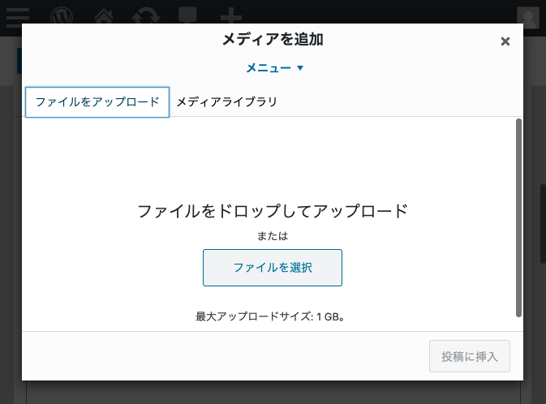

今回はWordPressのプラグインを使わずにカスタムフィールドで画像を登録する方法のご紹介です。

投稿画面から便利にかんたんに複数の画像登録したくて探していたらJavaScript APIが使えることを知りました。<br>メディアを呼び出せるとリッチに画像をカスタムフィールドで登録できる機能を実装できます。
<prof></prof>

## 実例：商品登録などのカスタム投稿にスライドショーを追加するためにカスタムフィールドにメディアを追加
普通の投稿（ブログ記事以外）で投稿の種類を増やせるのがWordPressの便利なところですよね？<br>
今回はお仕事で*商品*という種類の投稿を作って、いくつか画像を登録して投稿ごとに商品のスライドショーを実装しなければなりませんでした。

プラグイン・[カスタムフィールドアドバンス](https://ja.wordpress.org/plugins/advanced-custom-fields/)を利用すればカンタンなんでしょうけど「*テーマをインストールした瞬間から設定なしで使える*」状態を目指したかったので、カスタマイズすることになりました。



私が実際実装した内容に限りなく近い状態での実装方法をご紹介します。

### カスタム投稿を新規で作成

function.phpなどに`create_post_type`という関数を作って、新たにカスタム投稿を追加します。

`add_action()`は特定のアクションに対して指定した関数をフックさせる関数です。

この場合（initなので）プラグインなどの初期化のタイミングに実行されます。

今回はあくまで「カスタムフィールドにメディア（画像登録）を追加する方法」のご紹介なので、詳しい説明は割愛します。

```php:title=functions.php

add_action( 'init', 'create_post_type' );

function create_post_type() {
    $supports = array(
        'title',
        'editor',
        'author',
        'revisions',
    );

    register_post_type(
        'products', // カスタム投稿名
        array(
            'label' => '商品', // 管理画面の左メニューに表示されるテキスト
            'public' => true,
            'show_ui' => true,
            'show_in_menu' => true,
            'capability_type' => 'post',
            'rewrite' => true,
            'query_var' => false,
            'exclude_from_search' => false,
            'show_in_rest' => true,
            'rest_base' => 'products',
            'has_archive' => true, // アーカイブを有効にするか否か
            'menu_position' => 5, // 管理画面上でどこに配置するか今回の場合は「投稿」の下に配置
            'supports' => $supports // 投稿画面でどのmoduleを使うか的な設定
        )
    );
}
```

フックのタイミングは以下を参考にすると良いです。

[プラグイン API/アクションフック一覧](https://wpdocs.osdn.jp/%E3%83%97%E3%83%A9%E3%82%B0%E3%82%A4%E3%83%B3_API/%E3%82%A2%E3%82%AF%E3%82%B7%E3%83%A7%E3%83%B3%E3%83%95%E3%83%83%E3%82%AF%E4%B8%80%E8%A6%A7)

### カスタム投稿の編集画面にメタボックスの追加
`add_meta_box()`関数を使って登録エリアを作ります。

引数はこちらを参考にしてください。

[関数リファレンス/add meta box](https://wpdocs.osdn.jp/%E9%96%A2%E6%95%B0%E3%83%AA%E3%83%95%E3%82%A1%E3%83%AC%E3%83%B3%E3%82%B9/add_meta_box)

```php:title=functions.php
add_action( 'admin_menu', 'add_custom_fields' );

function add_custom_fields() {
    add_meta_box(
        'product_sectionid', //id(必須)
        '商品画像の登録',//title(必須)
        'product_custom_fields',//コールバック(必須)
        'products'//投稿の種類(必須、post、pageなど)
        'advanced',// 編集画面セクションが表示される部分(オプション)
        'default',//優先順位
    );
}
```
`product_custom_fields`関数内に実際登録させる内容コードを書きます。<br>
以下のような感じで出力されるようにします。


**今回は画像名と画像を3つまで登録**できるようにしてみます。

実際のデータはフォームタグをhiddenで仕込んでおき、JSで動的に値を格納できるようにしておきます。

```php:title=functions.php
function product_custom_fields() {
    $product_image_name = array();
    $product_image = arra();

    // 3画像の格納
    for ( $i=0; $i < 3; $i++ ) {
        $product_image_name[] = get_post_meta( $post->ID, 'product-image-name_'.$i, true );
        $product_image[] = get_post_meta( $post->ID, 'product-image_'.$i, true );
    }    //登録画面に出力
?>
    <table class="form-table">
      <?php wp_nonce_field( 'my_action', 'my_nonce' ); ?>
        <?php for ( $i=0; $i < 3; $i++ ):?>
            <tr class="form-field">
                <th scope="row">画像名<?php echo $i+ 1?></th>
                <td><input type="text" name="product-image-name_<?php echo $i?>" value="<?php echo esc_html($product_image_name[$i] ? $product_image_name[$i] : '')?>"></td>
            </tr>
            <tr class="form-field">
                <th scope="row">商品</th>
                <td>
                    <input type="hidden" id="product-image_<?php echo $i; ?>" name="product-image_<?php echo $i; ?>" value="<?php echo $product_image[$i] ? $product_image[$i] : '' ?>">
                    <div id="image-wrapper_<?php echo $i?>">
                    <?php if ( $product_image[$i] ) {
                        $product_thumb = wp_get_attachment_image_src ( $product_image[$i], 'thumbnail' );
                        ?>
                        " width="<?php echo $product_thumb[1]; ?>" height="<?php echo $product_thumb[2]; ?>" class="custom_media_image">
                    <?php } ?>
                    </div>
                    <p><input type="button" class="button button-secondary media_button" name="media_button" value="追加" id="media-button_<?php echo $i?>" />
                    <input type="button" class="button button-secondary media_remove" name="media_remove" value="削除" id="media-remove_<?php echo $i?>"/></p>
                </td>
            </tr>
        <?php endfor;?>
    </table>
<?php
}
```

### JavaScript APIの呼び出し
管理画面でメディアのJavaScript APIを利用してメディアのポップアップを呼び出せるようにします。

`wp_enqueue_media()`が無茶便利でした！

[関数リファレンス/wp enqueue media](https://wpdocs.osdn.jp/%E9%96%A2%E6%95%B0%E3%83%AA%E3%83%95%E3%82%A1%E3%83%AC%E3%83%B3%E3%82%B9/wp_enqueue_media)

```php:title=functions.php
add_action( 'admin_enqueue_scripts', 'add_api' );
function add_api() {
	wp_enqueue_media();
}
```

### JavaScript APIの調整
編集画面にJavaScript APIを使って画像追加、削除ボタンから動的に画像を操作できるよう管理画面のfooter部分にJavaScriptを追加します。

画像が選択されたら、JSで仕込んでおいたimgタグを表示するようにJavaScriptを仕込んでおきます。これでUI（見た目）もそこそこきれい。


```php:title=functions.php
add_action( 'admin_footer', 'add_script' );

function add_script() {
?>
<script>
    jQuery(document).ready(
        function($) {
            let _custom_media = true,
            _orig_send_attachment = wp.media.editor.send.attachment;

            // 画像の登録
            $( '.media_button' ).each(function(index) {
                $(this).on("click", function(){
                    let send_attachment_bkp = wp.media.editor.send.attachment;
                    wp.media.editor.send.attachment = function(props, attachment){
                        if ( _custom_media ) {
                            $('#product-image_'+index).val(attachment.id);
                            $('#image-wrapper_'+index).html('');
                        } else {
                            return _orig_send_attachment.apply( $(this).id, [props, attachment] );
                        }
                    }
                    wp.media.editor.open($(this));
                    return false;
                });
            });

            // 削除
            $( '.media_remove').each(function(index) {
                $(this).on("click", function(){
                    $('#product-image_'+index).val('');
                    $('#image-wrapper_' + index + ' .custom_media_image').remove();
                });
            });
        });
    </script>
<?php }
}
```

### 画像と画像名を保存
画像と画像名を保存できるようにします。

```php:title=functions.php
add_action( 'save_post', 'save_products' );

function save_products( $post_id ) {
	if( isset( $_REQUEST['my_nonce'] )) {
		if(!wp_verify_nonce($_POST['my_nonce'], 'my_action')) {
			return;
		}
		if(defined('DOING_AUTOSAVE') && DOING_AUTOSAVE) {
			return;
		}
		if(!current_user_can('edit_post', $post_id)) {
			return;
		}
		for ( $i=0; $i < 3; $i++ ) {
			if ( isset( $_POST['product-image-name_'.$i] ) ){
				if ( $_POST['product-image-name_'.$i] !== '' ){
					update_post_meta( $post_id, 'product-image-name_'.$i, $_POST['product-image-name_'.$i] );
				} else {
					delete_post_meta($post_id, 'product-image-name_'.$i);
				}
			}
			// 画像の保存
			if( isset( $_POST['product-image_' . $i] ) ) {
				if( $_POST['product-image_' . $i] !== '' ) {
					update_post_meta( $post_id, 'product-image_' . $i, $_POST['product-image_' . $i] );
				} else {
					delete_post_meta( $post_id, 'product-image_'.$i );
				}
			}
		}
	}
}
```

## プラグインなしで実装するメリット
ぶっちゃけWordPressってプラグインの方が安定してますしすべての機能を網羅していて痒いところに手が届きます。しかも無料です。

しかし **「すべての機能」を網羅しているがゆえに不要な機能もたくさん付いています**。<br><br>

私のカスタマイズするメリットは以下のような感じです。

* サイトの軽量化プラグインを減らして不要なJSやCSSを抑え軽くすることができる
* 余計な機能を減らすことでユーザーが迷わない<br><br>


利用するのはお客さん。

ブログなのか、企業サイトなのかなどで何を強化するなどがまったく違ってきますのでニーズに合わせてカスタマイズするのがディベロッパーの使命かと思います^ ^。

## まとめ
こんな感じで、画像がカスタム投稿でもリッチに登録できるようになりました！！

工夫したらカテゴリなどのサムネ登録などでも応用できます。

みなさんのコーディングライフの一助となれば幸いです。<br><br>


最後までお読みいただきありがとうございました。

### 更新履歴
*2021年1月13日追記*<br>
サイトをリロードやプレビューへ切り替えた際にデータが消えるバグを発見し修正しました。

*2022年12月17日追記*<br>
セキュリティー対策のコードを追記しました。
メディアを保存するためのJSの記載のある `add_script` で不具合が見つかったため書き換えました。
