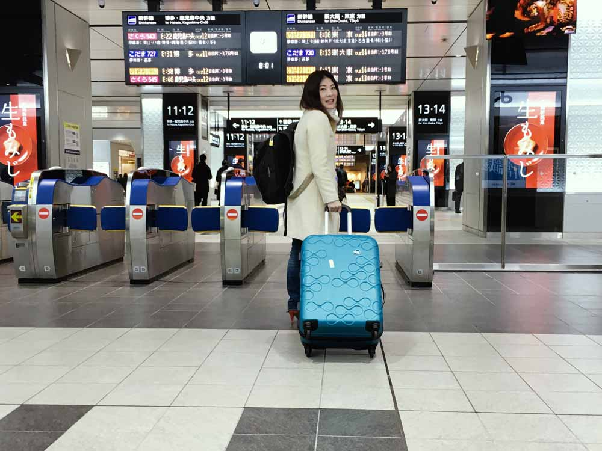
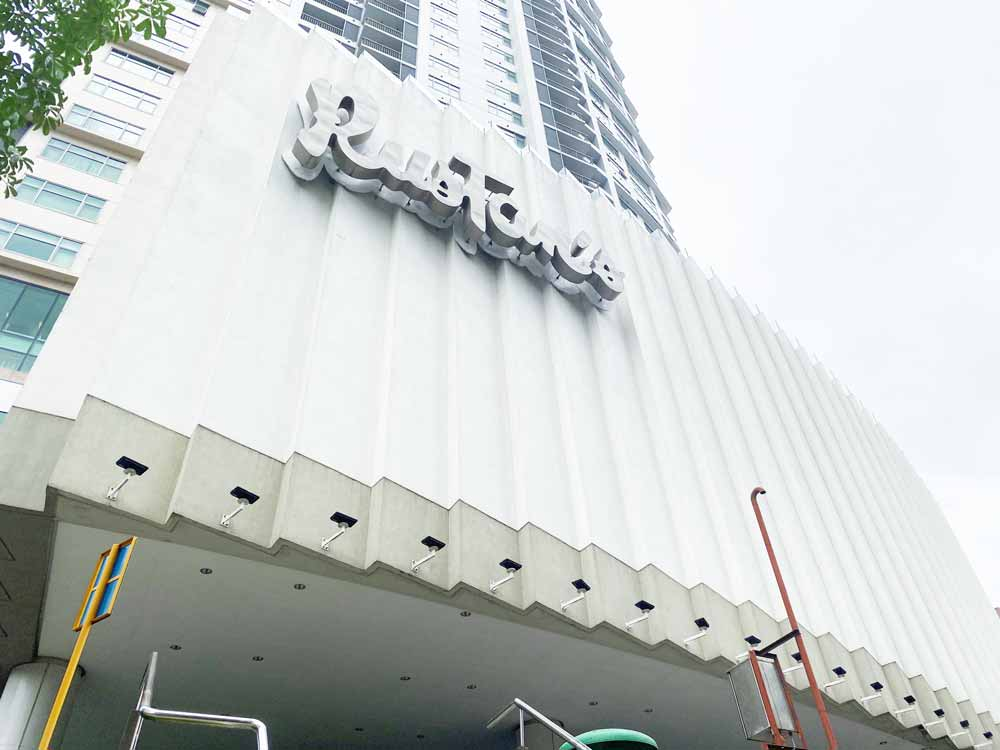
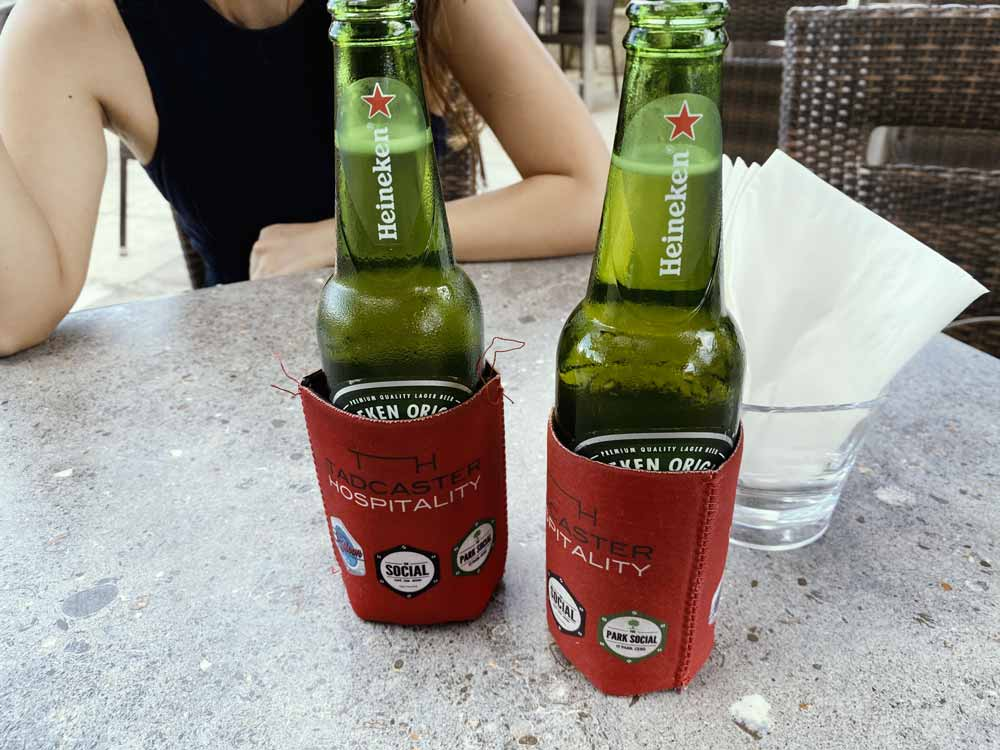
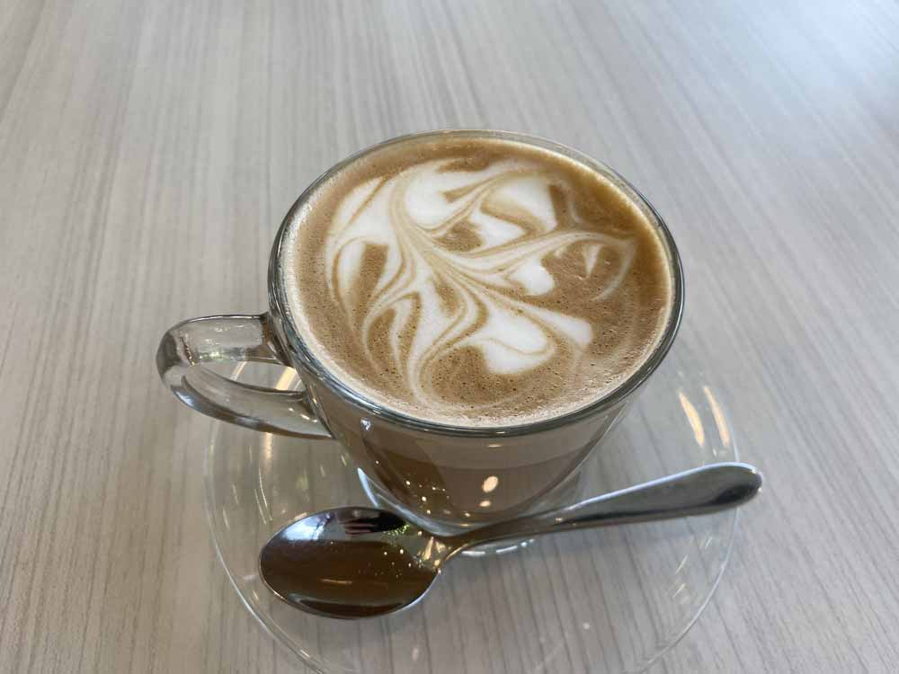
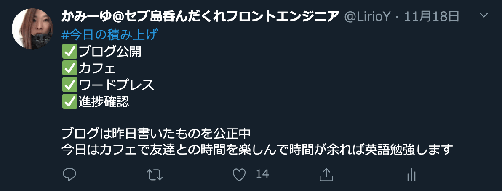

## 現在のキャリアや将来、退職を考え、悩んでいる人へのヒント

この記事はフロントエンドエンジニアかみーゆが退職して充電しつつ、次のステップなどの経過報告です。

現在仕事や会社で悩みを抱えて、苦しいんでる・将来に悩んでいる人へのヒントとなれば幸いです。

本当に人生は自分で選んで変えらるものです。

## セブ島まで就職しにきたのに退職した経緯などをざっくり

**Mac Book Proとスーツケースだけで生きていこう**

そう決めたのは約2年前です。

セブ島の日系企業に転職するため家財を処分し、日本を後にしました。 
残りの余生は教育に費やしたい、オフショアにチャレンジしたいという理由で転職しました。

日々忙しく過ごしていたのですが今年春、フィリピンはコロナウィルスの蔓延で世界最長のロックダウンに直面。 
行動を制限されたおかげで、自分を見つめ直す機会ができました。

かねてからの夢、「**年取ったら南の島でのんびり食べる分だけ働いて生活する**」に、あまりにもかけ離れている現状に気づき、辞めることを決意しました。

1か月前にさらに詳しく辞めた理由などを綴っています。

<card id="/blogs/entry386/"></card>

## セブ島充電生活で変わったこと
仕事辞めて3か月はゆっくりすると決めたものの、ぶっちゃけお金とかあれこれ不安はたくさんあります。

にもかかわらず今、*驚くほど精神的に落ち着いています*。

こんなに穏やかな気持ちなのは久しぶりです。

**充電生活がいかに私を癒してるかひしひし感じています**。

もし日本にいたら、周りの親をはじめとして常識を押し付ける人が「やいやい」言ってたはず。 
焦って再就職しようとしたり、フリーランスの仕事を取るために必死こいていたと思います。

セブ島に残って良かった。心からそう思います。

### まともに生活が営めるようになった
実は1年半セブ島に住んでいて、あまりスーパーに行ったことがありませんでした。 
恥ずかしいことに海外スーパーでの野菜の買い方すらまともに知りませんでした。

最近、いつも通るお店の名前すらも知らなくて、「ここがルスタンスだったのか！」って感動を覚えましたw  

この1年半**まともに生活をしていなかった**んです。  

ぶっちゃけると以前はやり場のないストレスのせいか、深夜までクラブやバーで遊んでました。 
忙しくて時間ないのに睡眠時間を削って、そんなことを繰り返していました。 

自分を痛めつけてますよね。まともじゃなかったと思います。 

 **どうにかマヒさせてでも、ストレスから逃げたかった**んですよ。

 今はまだロックダウン中なこともありますが、すっかり健全な時間に活動しています。 
友だちと出かけたり、ダウンタウンで買い物を楽しんだり、カフェでまったりしたり。

そして、待望の歯医者さんにも行けました！

日本でやってた「日常」をセブ島でできていることにすら感動します！

### 付き合う人が変わった
会社に行かなくなったので付き合う人が変わりました。 
プライベートな友だち以外とは必要ないので会うことはなくなりました。

 **人や人付き合いもエネルギー**です。

 好きな人と過ごしているだけで、良いエネルギーが生まれて、良いアイデアも閃きます。 
メシもコーヒーも酒も、**一緒にいるだけで何割り増しでウマい**。

### 再び 、コーディング・プログラミングが楽しくなった
先週土日にReactとGatsayの勉強をがっつりやりました。 
Reactのお作法など、うろ覚えで、GraphQLなどもはじめて触るし分からなくて悔しくて、廃人レベルまで自分を追い詰めました。

**3、4日ゲロ吐きそうなくらい追い詰めたら死ぬほど楽しかった**です！笑

 実は*今年4月くらいからめちゃめちゃコード書くのが苦痛*でした。

あんなに好きだったのに、めっちゃイヤで仕方なかったんです。

今までそんなこと感じなかったので異常事態。 
「もう私これ以上コード書けないかもしれない」とも思いました。

穏やかになって改めてやってみると、「新しく学ぶことってやっぱり楽しい！」って感じました。

いいか悪いか知らんですが、*本来のかみーゆが復活*しました。

## 今からの「生き方」について

ここからは今からの生き方・「今後の人生の方針」について固めていきます。

この先はさらにマインドにこだわります。

理由は**思考の質が行動の質に影響する**からです。  

人は意識の有無にかかわらず1日5万回もの思考を繰り返し、90%はコントロールできていません。

ストレスや不満が多い環境にあったら、ネガティブに陥り、思考の質が低下します。

思考は感情を生み、どんな行動をするかを決めます。

だから、この先はどんな思考・マインドを持って行動するかにこだわります。

### 起こったことはすべて必然。そこから「何が学べるかを考える」ことを習慣化
ここ数年、嬉しいこともツライことも、ときに不思議なこともありました。

最近よく突然のスコールに見舞われてやむなくカフェに長時間足止めされることがあります。

そんな時は大抵、大好きな人と過ごしている時です。

「友だちともっと話をして、もっと時間を過ごしなさい」て言われてる気がします。  

**この身に起こってることは必然**です。  

たとえツライことでも「そこから学びを得る」ための試練と思うようにしています。

会社、家族、コミュニティの中にいて、やることや責任に押しつぶされそうな人はぜひ、一度「ツライ気持ち」から離れて俯瞰してみてください。

「なんでツライんだろう」よりも「この状況から何が学べるだろう」に考え方を切り替えるだけでも見えている世界が変わってきます。

そこから「何を学べるか」が見えてくることがあります。  

最初は無意識に頭をめぐるネガティブ思考を変えるのはとても難しいです。 
何年も繰り返しているうちに少しづつ変化が出ます。  

ちなみにそんな時に使う、魔法の言葉は「*ちょうどよかった！*」です。

「カフェに雨で足止めされて、ちょうどよかった！友だちともっと話しできる！何か学べることがあるかも。」

できるだけ言葉にするよう心がけています。

### 人生でやれることは思ったより少ない。だから毎日、週、月単位で何をやるかを取捨選択する
私もいい歳。残りの人生も短いです。

*常にやることを今以上に増やさない*ようにします。

もしやることを増やしたいのであれば、**何かほかのタスクと天秤にかけてどちらかをやめます**。

たとえば、最近ほぼ毎日 **#今日の積み上げ** をTwitterでつぶやいています。

*自分を追い詰めるため*と*俯瞰するため*です。

最初は欲張ってたくさんやろうとしていましたが、最近は自分のキャパがわかってきました。

欲張ったところでたくさんのことは1日にできません。  
それよりも質の高いことを1つやったほうが収穫も大きいです。

時間がなく、技術の勉強するのと英語の勉強どっちを取るかというと、今勢いに乗って収穫の大きそうな方をとります。  
1日単位で見たときには偏って見えても、週や月もっというと年間で平均的に学べているということもあります。  

**純度高く学ぶ**。  

前述した「コーディング・プログラミングが楽しくなった」でもお伝えした通り、3、4日ゲロ吐きそうなくらいGatsbyJSを勉強しました。 
入ってくる知識量は多くてキツかったですが効率的に学べた気がします。

### 自分を大切に。自分の気持ちに正直に生きる
以前はやり場のないストレスから、わずかなプライベートな時間を夜遊びに当てていました。

多分その時は、ストレスたまっていたことにも気づいていなかったです。  

マヒしていたから。  

今は何かをやっている最中、違和感を感じたら、自分にいつも尋ねています。  

「それやりたい？」

「楽しい？」  

もし*「No」の返事が返ってきたらするのをやめる*ようにしています。

どうしてもやらないといけないことであれば、やりたくない理由を自分に聞きます。

そんな時は、やりたくない理由に大抵納得できます。

**人生でもっとも長く付き合っているあなたこそ自分を一番よく分かっているはず**です。

なぜ分からないかというと、「自分をきちんと受け止めてない」か「ストレスでマヒしているか」です。。  

自分の心に正直にいると、自分を大切にできます。 
自分を大切にすると、周りの人のことも大切にできるようになります。  

いたってシンプルですが、正直にいるだけでストレスは激減します。

### 本気で背中を預けられる仲間と真剣に戦う
今まで人生を振り返って、仕事をする上で必要なのは何だろうって考えると  
**やっぱ「人」**なんですよね。  

仕事ってみなさん「お金」「やりたいこと」「環境」で選ぶと思います。

大きな会社であれば福利厚生が手厚かったり、小さな会社でもアットホームで安心して仕事できたり、はたまた好きなことをするためにフリーランスの道選んだり。  

環境を作るのは「人」。  

**私にとって一緒に働く仲間ほど重要な要素はない**です。

それに1日8時間も仕事仲間と過ごすって、結婚相手より1日を長く過ごしますよねw

**働く仲間がステキだったらそれだけで人生ハッピー**ですよ！

今まで、仕事の質が仲間によってかなり変わりました。 
こいつサイコーやんって思ったら能力を最大限に発揮できます。

だから良い仲間と仕事をして、安心して背中を預けられる仲間と働く。

そして、ぼちぼちスタートさせています。

## まとめ

セブ島充電生活で得たこと、今からについてのご報告です。

ほぼどんな思考で行動するかというお話になってしまいました。 
でも、**思考の質を上げること**が重要なんです。

充電生活も残り1か月切りました。

休憩しつつですが、焦らず、環境の準備をします。二度と「ストレスでマヒするような環境」に自分や仲間をおきたくないから。

また経過についてはご報告します。

最後までお読みいただいありがとうございました。
