## セブオーシャンパークってどんなところ？
セブオーシャンパークは2019年8月24日にオープンした唯一セブ島の本格的な水族館です。

ロックダウンで運営していませんでしたが、いつの間にか再開したみたいです。

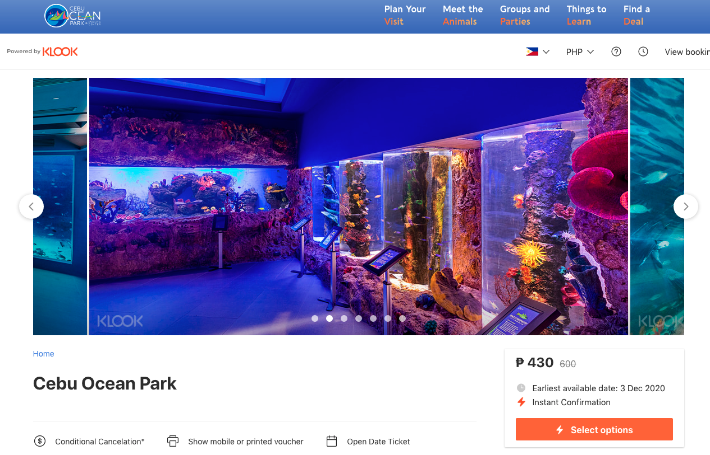

プロモ（ディスカウント）でWeek Dayは600ペソが430ペソ！ 
しかもミネラルウォーター1本もサービスでついてきます。

水族館なのに鳥や爬虫類のような変わった生物も飼育されています。

| | 詳細|
|-|-|
|施設名|Cebu Ocean Park|
|施設詳細|3階建|
|料金|土日祝：800ペソ 平日:600ペソ|
|営業時間|9:00~18:00|
|HP|[https://www.cebuoceanpark.com/](https://www.cebuoceanpark.com/)|
|場所|SMシーサイドモール隣 [Google Map](https://www.google.com/maps/place/%E3%82%BB%E3%83%96%E3%83%BB%E3%82%AA%E3%83%BC%E3%82%B7%E3%83%A3%E3%83%B3%E3%83%BB%E3%83%91%E3%83%BC%E3%82%AF/)|

これはお得！！ 
安くなってるので、喜び勇んで友だち3人で行って参りました。

周りはみーんなフィリピン人でした。

### 今回付き合ってくれた人

* ちーちゃん ... 元同僚。英語が話せる
* マイアさん ... セブ島の日本人占い師。タロットで占ってくれます

マイアさんの記事はこちら。

<card id="/blogs/entry387/"></card>

クリスマス前だし恋の相談なんかある人はぜひどうぞ。

## セブオーシャンパークを回るポイント
日本人が行くなら共通して気をつけたいポイントをお伝えします。

### Jungle Treck（ジャングル・トレック）

入場してチェーンの暖簾（のれん）をくぐると金魚や錦鯉も！？世界中からやってきた淡水魚が展示されています。

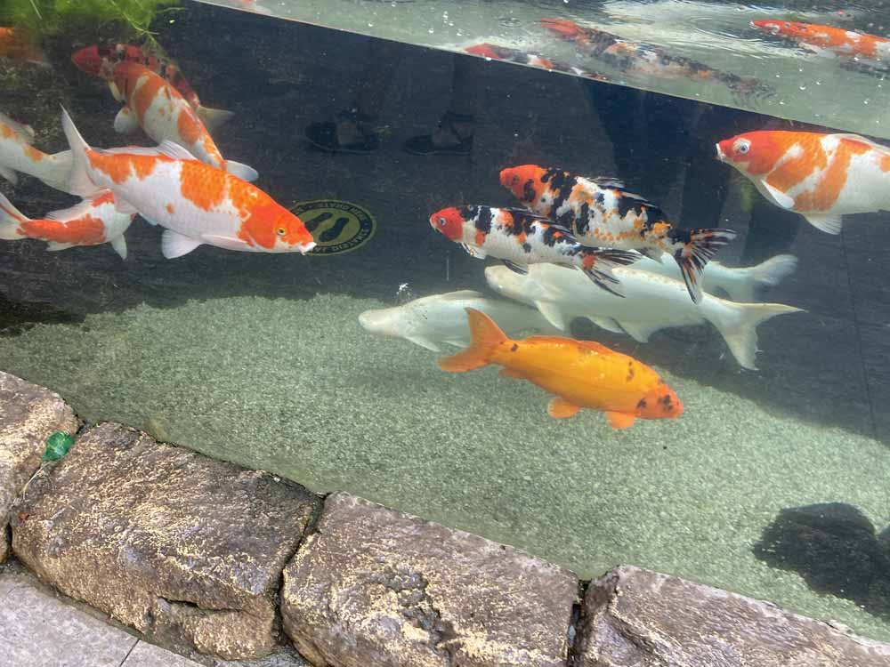

エリア別に水槽を分けられてます。

#### 閲覧注意！古代魚がお魚のお頭食べる瞬間を目撃！

エントランスから少し歩くと、アマゾンの古代遺跡を感じるお魚の水槽がありました。 

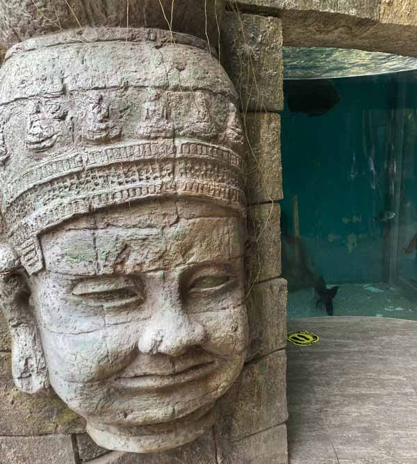

ちょうどエサやりの時間でした。

古代魚？アマゾンの魚が「お魚のお頭（かしら）」を咥えてご満悦な顔でスイスイ泳いでいました。。。

「お頭（かしら）」はお口に収まりきらないほどの結構なサイズでした。

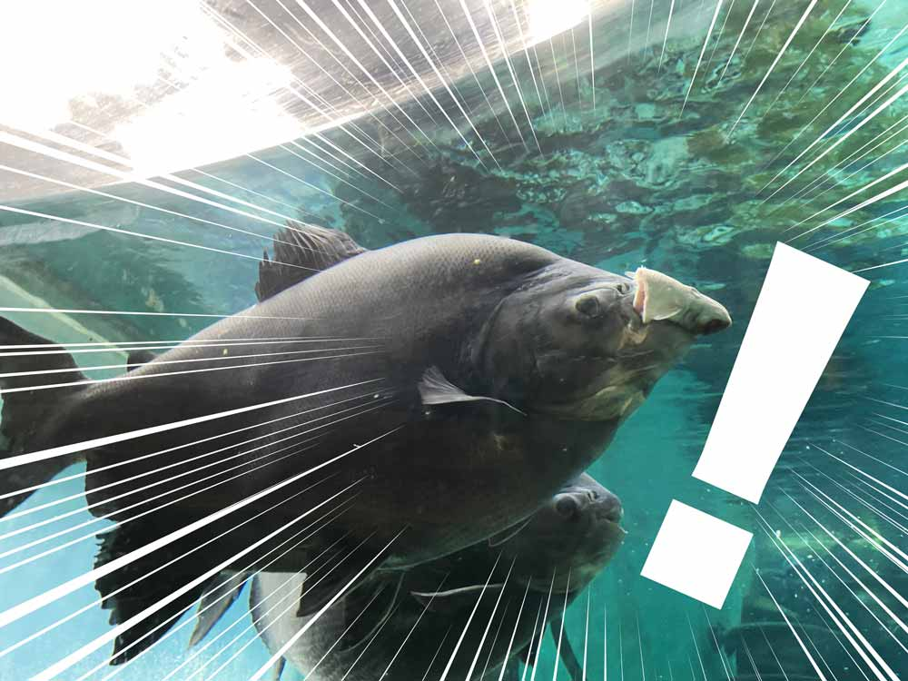

「アマゾンのだしそんなもんか」と思いました。  が、、、  
別の水槽でも金魚が自分と同じぐらいのサイズの魚の切り身をついばんでいるところを見てしまいました。  

諸行無常。  

**生き物は命あってこそがすべて**と悟りました。

#### 鳥フンに注意！水族館なのに頭上には鳥

頭上にはインコがたくさん飛んでいます。 
しかも水槽にもBigな鳥フンが派手にヒットしていました。

このエリアには基本、屋根はありません。

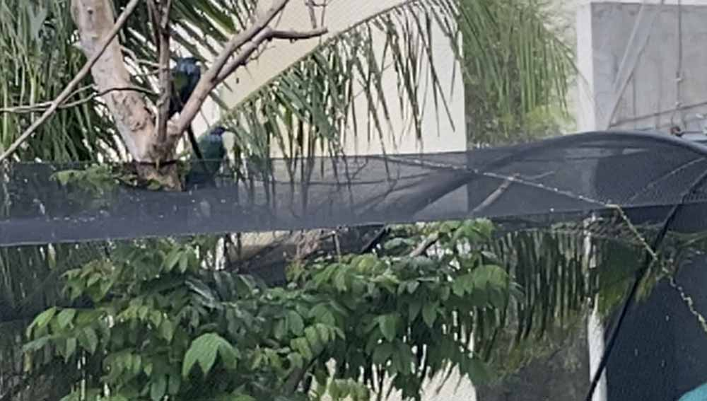

鳥フンのヒットが水槽じゃなく、自分だと思うと。。。

多少のアクシデントは覚悟して進みましょう。

インコの種類は「ゴシキセイガイインコ」というらしいです。

首元がトラ柄でまるで「**大阪のおばちゃん**」のようでした。

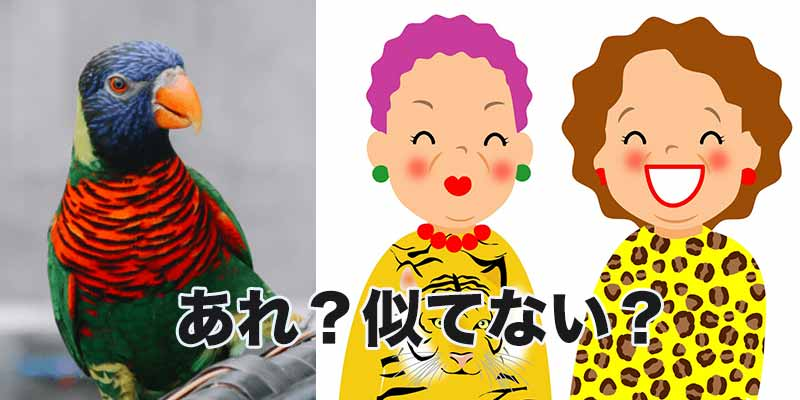

マイアさん曰く、台湾のおばちゃんも似たようなもんだそうです。  

**おばちゃん最強　in the World**。  

インコたちには「Creepy Critters（クリーピー・クリッターズ）」を過ぎて2階に上がるともっと間近で見ることができます。

逃げられないようネットが張ってありますが、日本人からすればもっと珍しい見た目の鳥がネットの外に飛んでいました。

## Creepy Critters（クリーピー・クリッターズ）

ここからは不気味な生物（クリーピー・クリッターズ）の展示です。 爬虫類や昆虫が展示されています。

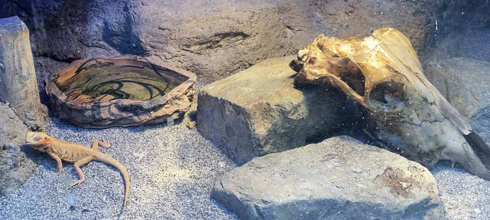

ゴ●ブリにしか見えないCreature（生物）もいました。 
大の昆虫嫌いなので、怖くてとても写真を撮れませんでした。

余談ですがフィリピン・セブ島のゴ●ブリは茶色く、現地の言葉で「オッオッ」って言います。

## Seven Seas（セブン・シーズ）
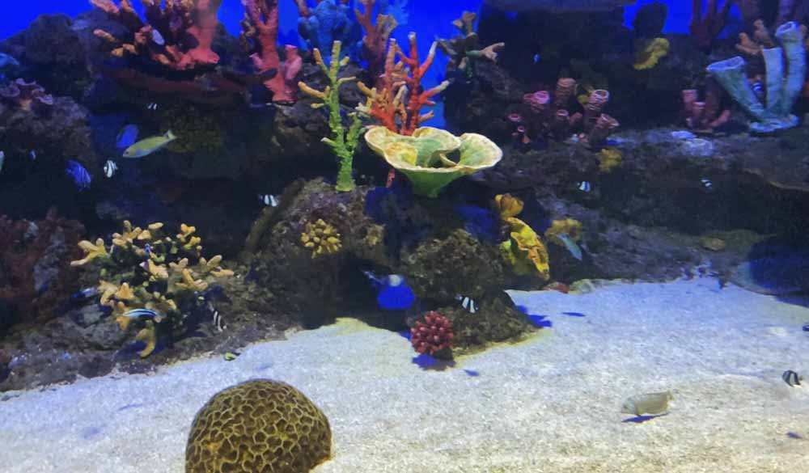

室内の水槽の展示です。 カクレクマノミをはじめとする可愛いお魚を見ることができます。

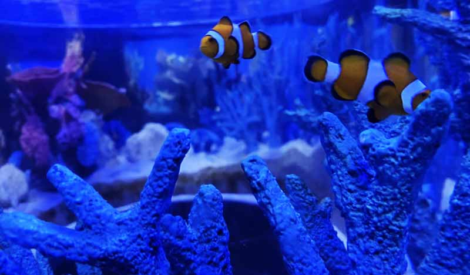

イソギンチャク、チンアナゴ、エビも超可愛かったです！！

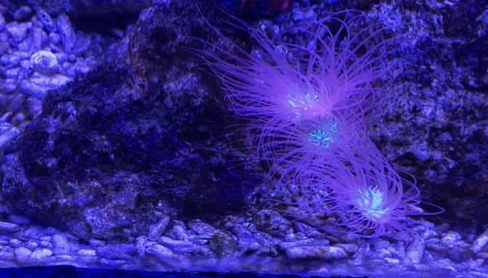

魚のエサが白菜だったことに衝撃も受けました。

### まるで海に入ったかのよう？内側に人が入れるスペースがある水槽あり！けど………
Seven Seas（セブン・シーズ）エリアには水槽の内側に入ったかのようなところもありました！

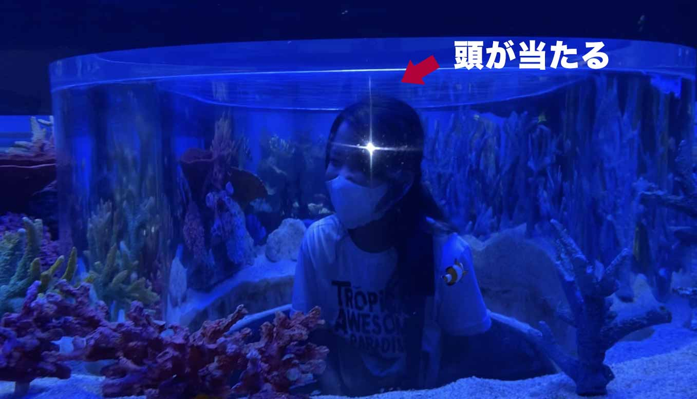

**とにかく狭い**。

身長が高い人は気をつけて、Chabby（わがままボディー）な人は諦めてください。

## 触れる体験コーナー

魚やヒトデなど直接海の生物に触れる体験コーナーもありました！

そして、顔ハメ発見！ 
我々も調子に乗って顔ハメでパシャり。

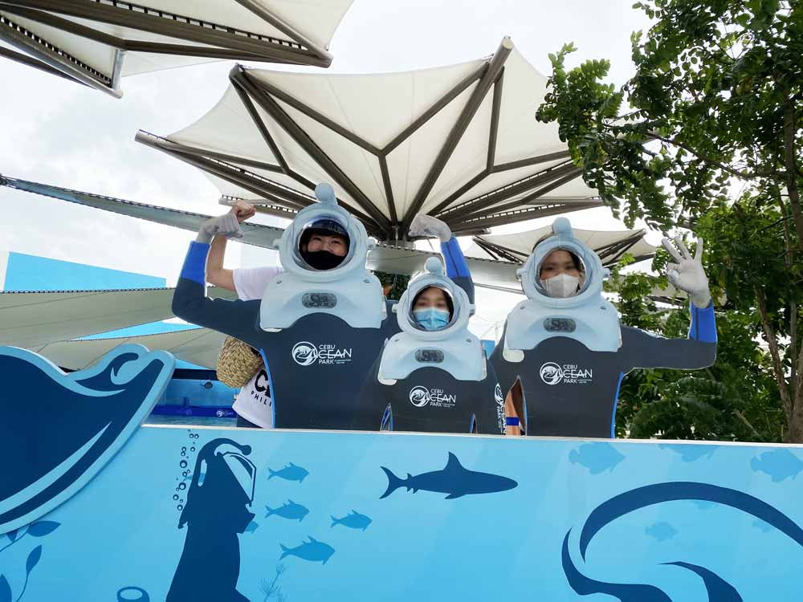

魚をさわる以外に、有料ですがこんなアクティビティも楽しめます！

|内容|追加料金|
|-|-|
|ドクターフィッシュ|100ペソ/20分|
|「シートレック」|1200ペソ|
|クロコダイルケージ」|2000ペソ|
|エイと一緒に泳げるアクテビティ|1000ペソ|

### フィッシュスパ、体験しました！
せっかくなのでフィッシュスパを体験しました。

ドクターフィッシュという魚がいらない角質を食べてくれるとか。

> 全長約10cm。西アジアの河川域に生息する淡水魚で、37℃程度の高い水温でも生息できるためトルコなどの温泉にも生息するが通常は河川や池沼に生息する。水温、水質ともに適応の幅が非常に広く丈夫な魚である。餌を求める時は活発に動き回るが、普段は石などの上や陰でじっとしていることが多い。食性は雑食性。口が吸盤のようになっており石や岩などに付着した藻類を舐めるようにして食べることができるほか、底にいる微生物や昆虫の幼虫などを食べる。
>
>[ドクターフィッシュ| Wikipedia](https://ja.wikipedia.org/wiki/%E3%83%89%E3%82%AF%E3%82%BF%E3%83%BC%E3%83%95%E3%82%A3%E3%83%83%E3%82%B7%E3%83%A5)

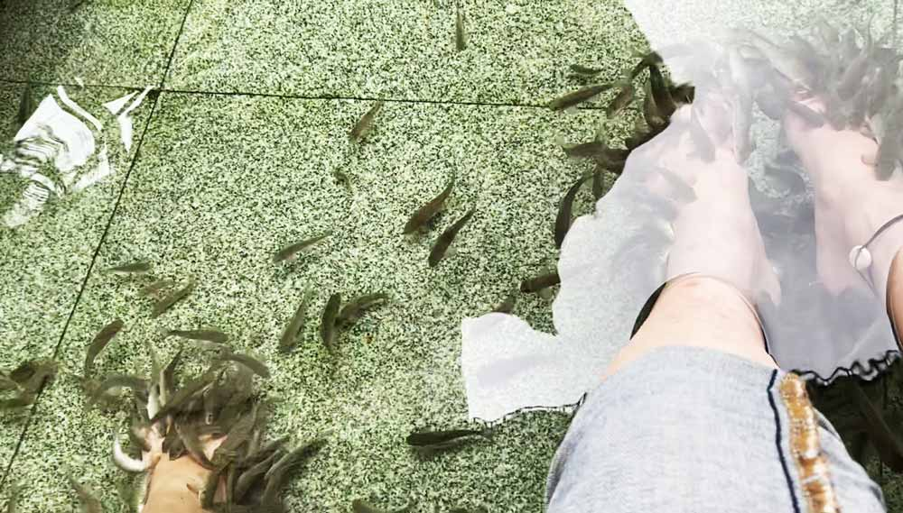

集（たか）られすぎて、**もののけ姫でいうタタリヘビが体から湧き出ているみたい**になってしまいました。 。 

たらふく食べたのでしょう、小さな黒いものがぷかぷか………。 何が浮いていたのかはご想像にお任せします。

結局、制限時間20分を超えても居座り続けバードショーを見逃してしまいました。

## 海中トンネルから360 Acrylic（360アクリリック）

やっと目玉エリアに到着です！

フィッシュスパの隣から再び屋内に入ると、我々3人余裕で丸呑みできるサイズのワニが待ち構えています。 
ワニは80年も生きるそう。

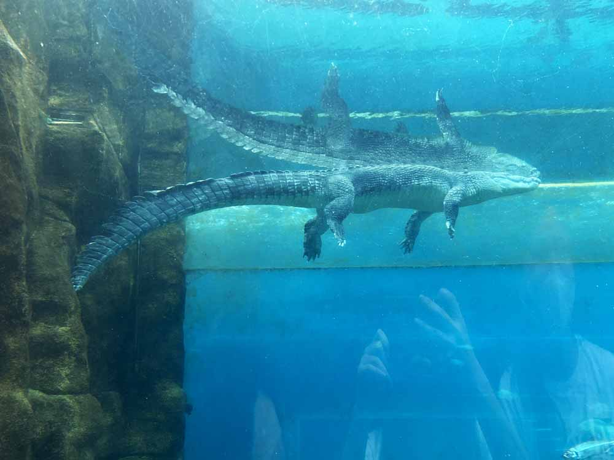

海中トンネルへ。

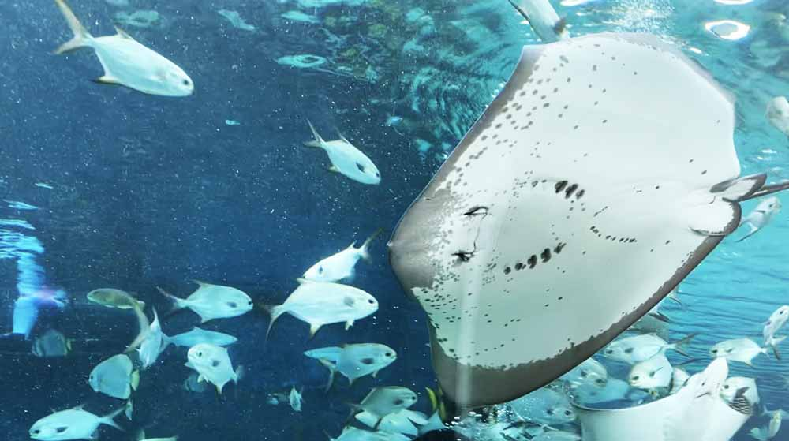

とてもフォトジェニックな写真が撮れます！

フィリピン人はセルフィー大好きなので、良い場所の奪い合いとなります。

### 未確認生物（UMA）??大はしゃぎで写真を撮っている時に事件は起こった
必死で写真を撮っていると、水槽の奥に明らかに魚ではないフォルムの生き物が映り込みました。

**あれ？？！**  

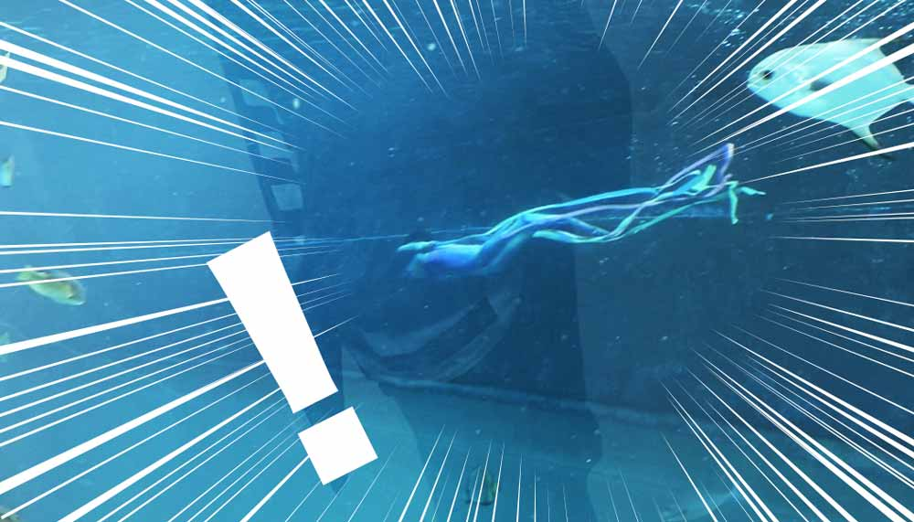  

**あれれ？？！**  

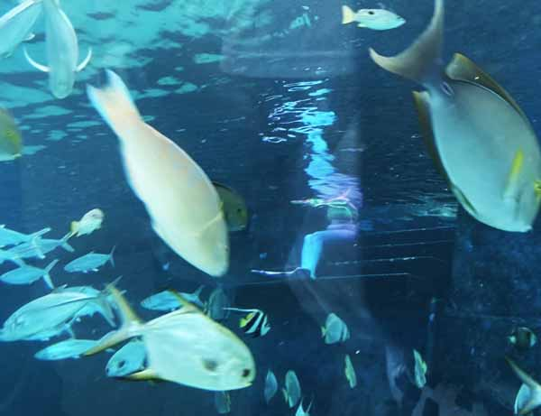  

**水中に人魚の格好をしたおっさん？？？**  

目を疑いました。  

エイやそのほかの生き物がいるにもかかわらず、我々はおっさんか人魚かよく得体の知れない生き物の撮影に夢中でした。

優雅に泳いたと思いきや、足場があるところに尾びれで直立したり。。。動きは人間です。

我々が必死で撮影しているとそのUMA（未確認生物）に手招きされ、  ようやく気づきました。  

**これからショーが始まるんだ**。

### マーメイド（人魚）ショーを見ました！
マーメイドショーを見るために足早に海中トンネルを抜けると階段式の観覧席がありました。

圧巻の海中トンネルで満足していた我々ですが、さらにマーメイド（人魚）ショーがあるなんて感動・サイコー！

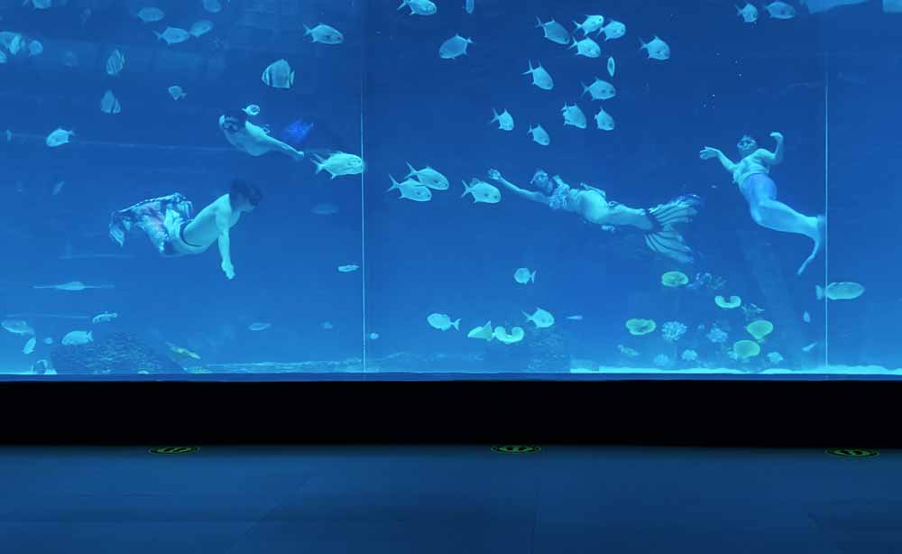

4頭（？）の男女のマーメイドが海中を魚のように泳ぎます。

泳ぎだけでなく、ハート形のバブルを作るなど圧巻でした。  

そして、**近くで見たらおっさんじゃなかった**です。 

笑顔がキュートな女性でした。

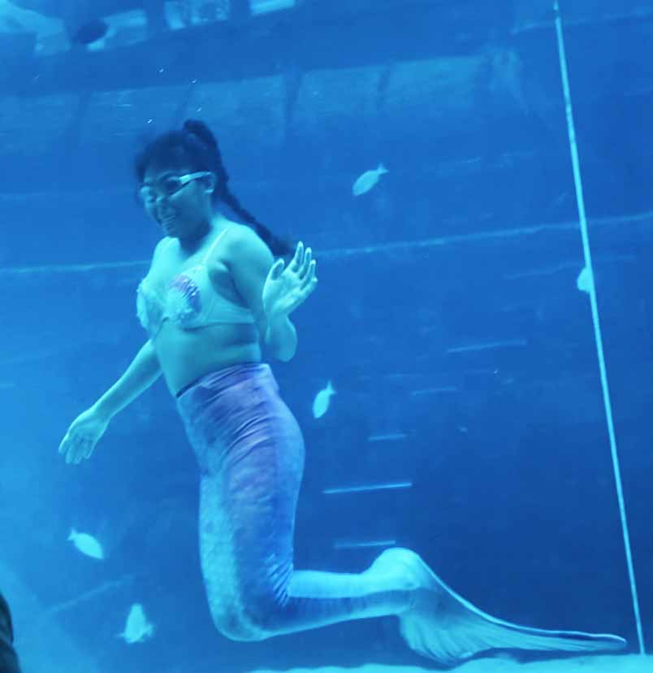

おっさん呼ばわりしてごめんちゃい。

## 腹が減ったので、SMシーサイド・モールにあるミシュラン1つ星を持つ「ティム・ホー・ワン」へ

散々オーシャンパーク内を歩いて腹が減ったので、「香港点心専門店」ティム・ホー・ワンへ行ってきました。

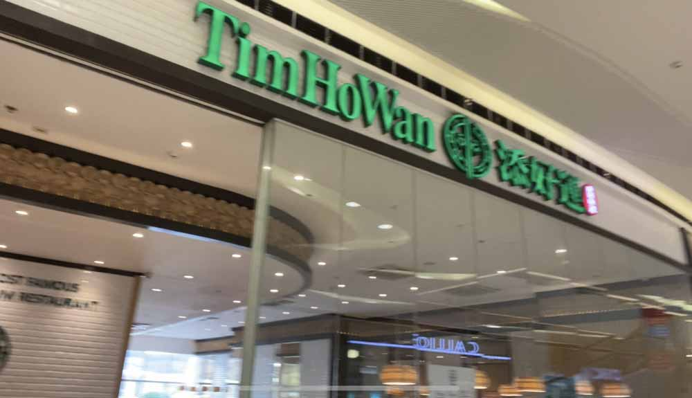

蒸し餃子や焼売、春巻きなどが中心を中心に味わえることができます。

そして、日本でも食べることができるようです！ 
[http://timhowan.jp/](http://timhowan.jp/)

餃子の皮が具材によって違って、柔らかい。しかもエビなど、海鮮素材がプリプリでした！！

タレは全体的に辛めでした。

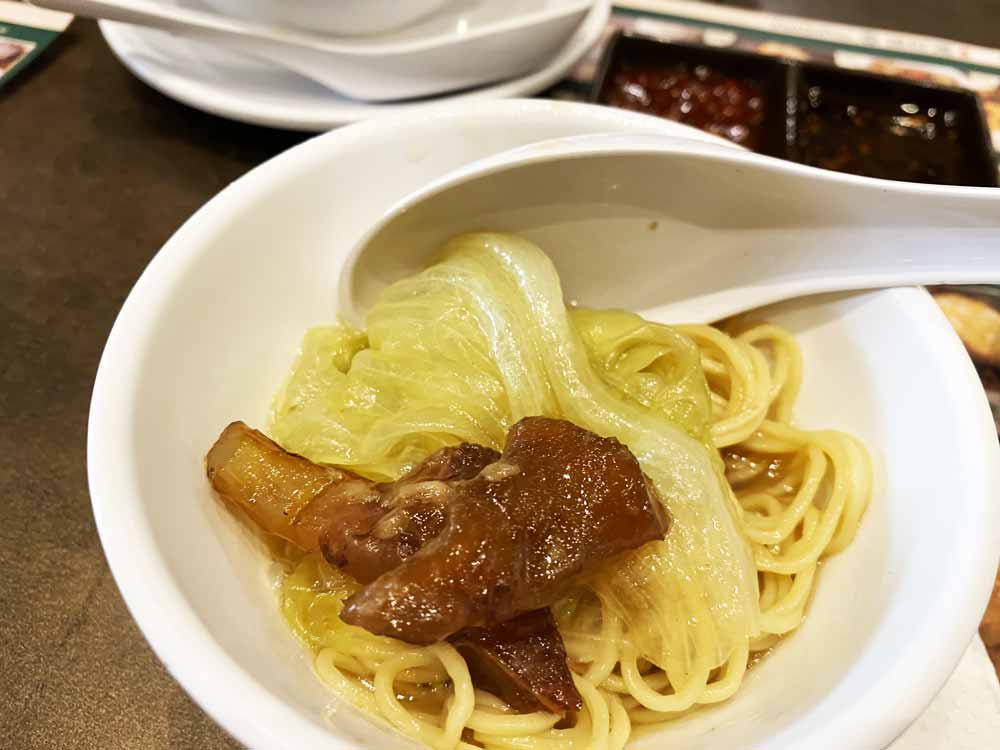

3人でシェアして2000ペソくらいでした。

久々に満足できる中華を食べました！

## まとめ・セブオーシャンパークはおもしろい

現在ロックダウンで行けるところが限られています。

近場で海を感じられる、水族館・セブオーシャンパークに行って息抜きをしてみてはいかがでしょうか？

運が良ければ、マーメイド（人魚）にも会えますよ！

最後までお読みいただきありがとうございました。
