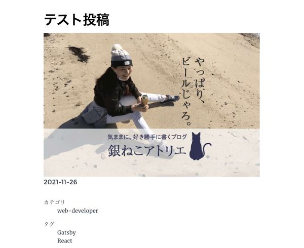

## 今までのGatsbyの記事と注意点
現在ここまで記載しています。<br>
制作するまでを目標にUPしていくので順を追ったらGatsbyサイトが作れると思います。

1. [インストールからNetlifyデプロイまで](/blogs/entry401/)
2. *投稿テンプレにカテゴリやらメインビジュアル（アイキャッチ）追加*（←イマココ）
3. [ブログ記事、カテゴリー、タグ一覧の出力](/blogs/entry408/)
4. [プラグインを利用して目次出力](/blogs/entry410/)
5. [プラグインナシで一覧にページネーション実装](/blogs/entry413/)
6. [個別ページテンプレート作成](/blogs/entry416/)
7. [プラグインHelmetでSEO調整](/blogs/entry418/)
8. [CSSコンポーネントでオリジナルページを作ろう！！](/blogs/entry421/)
9. [関連記事一覧出力](/blogs/entry430/)

<small>※ Gatsbyは2021月12月、v4にバージョンアップしています。随時リライトしています。</small>

### このシリーズではテーマGatsby Starter Blogを改造します
この記事は一番メジャーなテンプレート、 Gatsby Starter Blogを改造しています。同じテーマでないと動かない可能性があります。

### 今回やりたいこと
ブログ記事のmdファイルだけを取得し、投稿ごとにアイキャッチ画像やカテゴリーなどの属性を追加し、テンプレートに表示したい。

さらに、、、
<msg txt="頻繁に投稿するものと、そうでないもののテンプレを分けたい!"></msg>

まずは普段更新する記事用のテンプレを作ります。長いですが、目次を活用しながら読み進めてください。


## 記事と記事中の画像などの格納フォルダーの設定

gatsby-node.jsのコメントから。

> Explicitly define the siteMetadata {} object<br>
> This way those will always be defined even if removed from gatsby-config.js<br
> Also explicitly define the Markdown frontmatter<br>
> This way the "MarkdownRemark" queries will return `null` even when no<br>
> blog posts are stored inside "content/blog" instead of returning an error<br><br>
> siteMetadata 内のデータ（オブジェクト）を明示的に定義します。<br>
> gatsby-config.jsから削除された場合でも、これらは常に定義され。Markdown内のfrontmatterも明示的に定義します。
> このように、「MarkdownRemark」クエリは、ブログの投稿は、エラーを返す代わりに「content/blog」内に保存されます。

つまり、`content/blog`に格納されたmdファイルは記事として反映されます。

記事内本文に表示したい画像もマークダウンファイルと同じblogフォルダーに格納します。

私は今公開されているサイトにディレクトリー構造をできるだけ近づけるため、以下のように設置しました。

```
プロジェクト/
  └ content/
    ├ src
    |  └ images/ 汎用で使う画像全般を格納
    |    └ thumbnail/ 記事のアイキャッチ&サムネイル用の画像
    └ blog/
      ├ 個別のページ
      └ blogs/
        ├ images/ 記事用の画像
        └ 各ブログ記事
```
gatsby-config.jsを見ると */content/blog* と */src/images* 以下に画像が格納できるようになっているのでこのまま使います。

```js
module.exports = {
  plugins: [
    `gatsby-plugin-image`,
    {
      resolve: `gatsby-source-filesystem`,
      options: {
        path: `${__dirname}/content/blog`,
        name: `blog`,
      },
    },
    {
      resolve: `gatsby-source-filesystem`,
      options: {
        name: `images`,
        path: `${__dirname}/src/images`,
      },
    },
  ]
}
```

v4以降、ディレクトリー構造の変更方が分かっておらず、blogの中にblogsがあるというちょっと気持ち悪い構造になってしまったのですが、一旦はこれで運用することにしました。

## frontmatter を設計し投稿する。
記事ごとに必要なタイトルなどの項目を設計します。

<msg txt="ここで適当に設計したら多分あとで泣きをみます。"></msg>

後々何が出力したいかよく考えて作成します。今から以下のファイルを操作します。

```
プロジェクト/
  ├ gatsby-node.js（追記）
  ├ src/
  |  └ images/
  |    ├ common/dummy.png（追加）
  |    └ thumbnail/eye-catch.png（追加）
  └ content/
    └ blog/
      └ blogs/entry1.md （追加）
```

```md
---
title: テスト投稿
date: 2021-11-26
description: この記事はテスト投稿です
---
```

デフォルトではこんなものだと思いますので、アイキャッチ（hero）、記事のタイプ(pagetypetype)を追加します。<br>
ちなみに私のブログでは**categoryは1つ、タグは複数OK**というルールとしました。

<msg txt="ルールが煩雑だと記事も破綻しますからね。。。"></msg>

#### entry1.md に Frontmatter を追記する
```md
---
title: テスト投稿
date: 2021-11-26
pagetype: blog
hero: thumbnail/eye-catch.png
# ↑src/images/ディレクトリを参照している↑
description: この記事はテスト投稿です
cate: web-developer
tags: ['Gatsby', 'React']
---
```
複数の値は配列で。

```js
['Gatsby', 'React']
```

今までブログをblogs/以下に公開していたので *content/blog/blogs/* ディレクトリー内に格納します。

starter blog では記事はblog以下のディレクトリ構造がページ生成時に継承されます。

domainが`http://example.com`だった場合。

```
content/blog/blogs/entry1.md
↓↓↓
http://example.com/blogs/entry1
```

### gatsby-node.js から frontmatter の設定変更

gatsby-node.js ファイルから `exports.createSchemaCustomization` 〜といいうコードを探します。

まだ何も触ってなければ、239行目あたり（結構下の方）にあるはずです。

`createTypes`内に設定された出力したいfrontmatterに応じて修正ます。

`type Frontmatter`に *cate*、*hero*、*pagetype* を追加します。

```js
//~ 省略
exports.createSchemaCustomization = ({ actions }) => {
  const { createTypes } = actions

  //~ 省略
  createTypes(`
    //~ 省略
    type Frontmatter {
      title: String
      description: String
      date: Date @dateformat

      # ↓追加↓
      pagetype: String
      tags: [String]
      cate: String
      hero: String
      # ↑追加↑
    }

    type Fields {
      slug: String
    }
  `)
}
```
GraghQLのコメントは#を頭に付与するだけ。
```schime
# コメント
```

GraphQLは*クエリ言語*なので、mdファイルのfrontmatter(---で囲んだ部分)の設定もここから読み取ることができます。

データの並べ替えを行なっている `result` に `frontmatter`、`hero` をgatsby-node.jsの上の方に追記します。

```js
// 省略

exports.createPages = async ({ graphQL, actions, reporter }) => {
  // 省略
  const result = await GraphQL(
    `
      {
        allMarkdownRemark(
          sort: { fields: [frontmatter___date], order: ASC }
          filter: { frontmatter: {pagetype: { eq: "blog" }}}
          limit: 1000
        ) {
          nodes {
            id
            fields {
              slug
            }
            frontmatter {
              hero
            }
          }
        }
      }
    `
  )
  if (result.errors) {
    // 省略
```

さらに、先ほど編集した少し下のあたりも修正。

* heroの値をテンプレート側で受け取れるようにします。万が一アイキャッチの設定がなかった時のために、ダミー画像用のコードもセットしておきます。
* pagetype blogだけに絞り込んで出力
* prev nextボタンもpagetype blogのみ動くように修正

```js
// 省略
if (posts.length > 0) {
  // filterでpagetypeがblogのものだけ抽出
  const blog = posts.filter(post => post.frontmatter.pagetype === "blog")
  blog.forEach((post, index) => {
     //書き換える
    const previousPostId = index === 0 ? null : blog[index - 1].id
    //書き換える
    const nextPostId =
      index === blog.length - 1 ? null : blog[index + 1].id

    createPage({
      path: post.fields.slug,
      component: blogPost,
      context: {
        id: post.id,
        previousPostId,
        nextPostId,
        hero: post.frontmatter.hero ? post.frontmatter.hero: "common/dummy.png",//追記
      },
    })
  })
}
// 省略
```

これでテンプレート側のGraphQLで指定した画像データを参照できるようになります。

## 出力するテンプレートを改造し、画像を出力する。

出力するテンプレートのコードを編集します。<br>

```
プロジェクト/
  └ src/
    └ templates/blog-post.js（編集）
```

このテンプレートでは *blog/* 以下のmdファイルから取得したコンテンツを出力します。

### GraghQLで受け取るクエリを変更

*blog-post.js* の `pageQuery` でmdファイルから *gatsby-node.js* 経由で受け取る値を `$hero: String` 追加します。


```js
export const pageQuery = GraphQL`
  query BlogPostBySlug(
    $id: String!
    $previousPostId: String
    $nextPostId: String
    # ↓追加
    $hero: String
  ) {
    //省略
  }
```
`site` と `markdownRemark` の間に `allFile` を追加します。

`allFile` にはすべてのファイル情報（mdや画像）が格納されています。

`allFile` の中から `sourceInstanceName`（gatsby-config.jsで指定したディレクトリ名） が *images* で `relativePath` かつ *$hero* と一致するデータを参照します。

```
//省略
site {
  siteMetadata {
    title
  }
}
# ↓追加
allFile(
  filter: {
    relativePath: { eq: $hero }
    sourceInstanceName: { eq: "images" }
  }
) {
  edges {
    node {
      relativePath
      childImageSharp {
        gatsbyImageData(
          width: 1000
          formats: [AUTO, WEBP, AVIF]
          placeholder: BLURRED
        )
      }
    }
  }
}
# ↑追加
markdownRemark(id: { eq: $id }) {
//省略
```
`gatsbyImageData` に出力したい内容を設定します。

Gatsbyは *WebP（ウェッピー）* や *AVIF（エーブアイエフ）* も対応しています。`formats` を指定しなければ、元の画像形式とWebPのみを取得します。。

> WebP（ウェッピー）という画像形式をご存知でしょうか？　長い間、webの静止画は大部分がJPEG/GIF/PNGのいずれかでした。WebPはこのすべてを置き換えることができる次世代のフォーマットです。2020年9月リリースのiOS 14がWebPをサポートしたことで、主要なモダンブラウザーの足並みがようやく揃いました。<br>
> [次世代画像形式のWebP、そしてAVIFへ](https://ics.media/entry/201001/)

WebPはサファリも対応したので、IEガン無視の人は十分使えます。

Gatsby-image-plugin は loding Lazy 対応してあります。 `placeholder` は loding Lazy で画像が表示されるまでに、代わりに表示される画像です。`DOMINANT_COLOR`がデフォルトですが、`BLURRED` にしておくと、表示したい画像のぼやけたものを表示してくれ、代替画像から画像実物にきりわかる時が自然です。<br>
不要であれば `NONE` にしておきましょう。

```
placeholder: BLURRED
```
細かい設定（オプション）についてはこの記事の最後、[おまけ・画像のオプションなど](#おまけ画像のオプションなど)に書いてあるので、そちらも参考にしてください。

値が取れているか確認します。<br>
必要なデータは`childImageSharp`に格納されています。


```js
// 省略
const BlogPostTemplate = ({ data, location }) => {
  const post = data.markdownRemark
  const siteTitle = data.site.siteMetadata?.title || `Title`
  const { previous, next } = data
  const eyeCatchImg = data.allFile.edges[0].node.childImageSharp;
  console.log(eyeCatchImg) //デバッグ
  // 省略
  return (
    <Layout location={location} title={siteTitle}>
  // 省略
```
帰ってくる値はこんな感じ。
```js
{gatsbyImageData: {…}}
gatsbyImageData:
height: 480
images:
fallback: {src: '/static/77c97667947347115d267c5dfe31556f/81bb2/eye-catch.png', srcSet: '/static/77c97667947347115d267c5dfe31556f/ce13a/dum…7667947347115d267c5dfe31556f/81bb2/eye-catch.png 640w', sizes: '(min-width: 640px) 640px, 100vw'}
sources: (2) [{…}, {…}]
[[Prototype]]: Object
layout: "constrained"
//省略
```

### タグやカテゴリも取得できるようにする

`markdownRemark` に *cate*、*tags*、を追加します。

```js
//省略
markdownRemark(id: { eq: $id }) {
  id
  excerpt(pruneLength: 160)
  html
  frontmatter {
    title
    date(formatString: "MMMM DD, YYYY")
    description
    # ↓追加
    cate
    tags
    # ⇧追加
  }
}
```

お好みで日付フォーマットも変更しておきます。
```js
date(formatString: "YYYY-MM-DD")
```

デバッグ。

```js
// 省略
const BlogPostTemplate = ({ data, location }) => {
  // 省略
  const { previous, next } = data
  const eyeCatchImg = data.allFile.edges[0].node.childImageSharp
  const { cate, tag } = data.markdownRemark.frontmatter//追記
  console.log(cate, tag)//デバッグ

  return (
    <Layout location={location} title={siteTitle}>
  // 省略
```
出力結果は以下の通り。ちゃんとmdファイルからfrontmatterのデータが取れました。
```js
{cate: "web-developer", tags: (2) ['Gatsby', 'React']}
```

## アイキャッチ画像やタグを出力
実際、テンプレートファイル blog-post.js にアイキャッチやタグを出力してみましょう。

```
プロジェクト/
  └ src/
    └ templates/blog-post.js（編集）
```
### アイキャッチを出力

starter blog にデフォルトで入っている `gatsby-plugin-image` をインポートします。

```js
import * as React from "react"
import { Link, GraphQL } from "gatsby"

import Bio from "../components/bio"
import Layout from "../components/layout"
import Seo from "../components/seo"

import { GatsbyImage, getImage } from "gatsby-plugin-image"
// 省略
```

<div class="box">
<h4>gatsby-imageからgatsby-plugin-imageへ</h4>
確かv3以降、gatsby-plugin-imageに画像の取り扱いが変わりました。出力方法も変わります。
</div>

<br>今回、 `<GatsbyImage/>`でアイキャッチ画像を出力するのですが、使い方は以下のように `childImageSharp`の値を丸ごと `getImage` に渡します。
```js
<GatsbyImage image={getImage(childImageSharp)} alt={alt属性} key={キー} className={必要に応じて}/>
```

では実際にテンプレートの `header` 内に実装してみます。

```js
// 省略
<article
  className="blog-post"
  itemScope
  itemType="http://schema.org/Article"
>
  <header>
    <h1 itemProp="headline">{post.frontmatter.title}</h1>
    <GatsbyImage
      image={getImage(eyeCatchImg)}
      alt={post.frontmatter.title}
      key={post.frontmatter.title}
    />
    <p>{post.frontmatter.date}</p>
  </header>
// 省略
```

出力コードはこんな感じ。何も設定しなくても、`decoding="async"`が付与されています。

```html
<div data-gatsby-image-wrapper="" class="gatsby-image-wrapper gatsby-image-wrapper-constrained"><div style="max-width: 1200px; display: block;"></div><picture><source type="image/avif" srcset="/static/734c25c8328e14e4d8df99abaea453a2/d0c69/eye-catch.avif 300w,
/static/734c25c8328e14e4d8df99abaea453a2/80f52/eye-catch.avif 600w,
/static/734c25c8328e14e4d8df99abaea453a2/410e0/eye-catch.avif 1200w" sizes="(min-width: 1200px) 1200px, 100vw"><source type="image/webp" srcset="/static/734c25c8328e14e4d8df99abaea453a2/9b21f/eye-catch.webp 300w,
/static/734c25c8328e14e4d8df99abaea453a2/9ff6b/eye-catch.webp 600w,
/static/734c25c8328e14e4d8df99abaea453a2/f2559/eye-catch.webp 1200w" sizes="(min-width: 1200px) 1200px, 100vw"></picture><noscript></noscript></div>
```

### カテゴリーやタグを出力

テンプレートにカテゴリーを追加します。

```js
  //省略
  const { cate, tags } = data.markdownRemark.frontmatter
  return (
    <Layout location={location} title={siteTitle}>
    //省略
    <header>
      <h1 itemProp="headline">{post.frontmatter.title}</h1>
      <GatsbyImage
        image={getImage(eyeCatchImg)}
        alt={post.frontmatter.title}
        key={post.frontmatter.title}
      />
      <p>{post.frontmatter.date}</p>
    </header>
    {/* カテゴリー追加 */}
    <dl>
      <dt>カテゴリ</dt>
      <dd>{cate}</dd>
    </dl>
    <section
      dangerouslySetInnerHTML={{ __html: post.html }}
      itemProp="articleBody"
    />
    //省略
```
タグも追加。タグは複数あるので `map` で出力します。

```js
    {/* カテゴリー追加 */}
    <dl>
      <dt>カテゴリ</dt>
      <dd>{cate}</dd>
    </dl>
    {/* タグ追加 */}
    <dl>
      <dt>タグ</dt>
      {tags.map((tag, index) => {
        return <dd key={`tag${index}`}>{tag}</dd>
      })}
    </dl>
```
Reactではmapのようなループ系の処理で *key* がないと怒られるので、必ずセットしてください。

```
react.development.js:220 Warning: Each child in a list should have a unique "key" prop.
```

CSSが効いてないのでこんなもんですが、できました。



### next（次の記事へ） と previous（前の記事へ）の挙動
最初から実装されている next（次の記事へ） と previous（前の記事へ）のボタンが動くか確かめます。

ユーザーには基本記事のみ（pagetype: blog）を行き来して欲しいので、ちゃんと動いているか確かめます。

entry1.mdを複製してentry2.mdを作ります。

```md
---
title: テスト投稿2
date: 2021-12-22
pagetype: blog
hero: thumbnail/eye-catch.png
description: この記事はテスト投稿です
cate: web-developer
tags: ['Gatsby', 'React']
---
```

元々あった「hello,world」などへのリンクがnext（次の記事へ） と previous（前の記事へ）に表示されなくなっていればOKです。

## プロフィール（bio.js）のコンポーネントを改造してみよう
プロフィール用のコンポーネントをbio.jsを改造しましょう！

その前に、gatsby-config.jsの基本情報が設定されている `siteMetadata` を編集します。
```js
module.exports = {
  siteMetadata: {
    title: `銀ねこアトリエ`,
    author: {
      name: `かみーゆ`,
      summary: `セブ島に住むフロントエンドエンジニアです。`,
    },
    description: `セブ島に住む女性フロントエンドエンジニアのライフログ。フロント技術を中心とした「ウェブ制作に関するチップス」、「磨耗しない人生の選択」や「海外ノマド」のライフスタイルについて発信しています。`,
    siteUrl: `https://ginneko-atelier.com`,
    social: {
      twitter: `lirioL`,
      instagram: `yurico.k`,
      youtube: `https://www.youtube.com/channel/UCbSgjkCIPucux8cFTuQcdcw`,
    },
  },
}
```
gatsby-config.js の `siteMetadata` にはどのコンポネントやテンプレートからでも、基本情報にアクセスできます。

`useStaticQuery` で `siteMetadata` を取得しつつ、 `<StaticImage />` を使って画像を表示します。


```js
/**
 * Bio component that queries for data
 * with Gatsby's useStaticQuery component
 *
 * See: https://www.gatsbyjs.com/docs/use-static-query/
 */

import * as React from "react"
import { useStaticQuery, GraphQL } from "gatsby"
import { StaticImage } from "gatsby-plugin-image"

const Bio = () => {
  const data = useStaticQuery(GraphQL`
    query BioQuery {
      site {
        siteMetadata {
          author {
            name
            summary
          }
          social {
            twitter
            instagram
            youtube
          }
        }
      }
    }
  `)

  // Set these values by editing "siteMetadata" in gatsby-config.js
  const author = data.site.siteMetadata?.author
  const social = data.site.siteMetadata?.social

  return (
    <div>
      <StaticImage
        layout="fixed"
        formats={["auto", "webp", "avif"]}
        src="../images/common/camille-pic.jpg"
        width={100}
        height={100}
        quality={95}
        alt={author.name}
      />
      {author?.name && (
        <section>
          <h2>この記事を書いた人</h2>
          <p>
            <strong>{author.name}</strong> {author?.summary || null}
          </p>
          <ul>
            <li>
              <a
                href={`https://twitter.com/${social?.twitter || ``}`}
                target="_blank"
                rel="noopener"
              >
                Twitter
              </a>
            </li>
            <li>
              <a
                href={`https://www.instagram.com/${social?.instagram || ``}`}
                target="_blank"
                rel="noopener"
              >
                Instagram
              </a>
            </li>
            <li>
              <a
                href={`${social?.youtube || ``}`}
                target="_blank"
                rel="noopener"
              >
                YouTube
              </a>
            </li>
          </ul>
        </section>
      )}
    </div>
  )
}

export default Bio
```
あとはお好きなところにコンポーネントをインポートしてタグを追記するだけ。

```js
import Bio from "../components/bio"

省略

<Bio />
省略
```

`<StaticImage />` コンポーネントを使うと複数のオプションを組み合わせて直接画像を指定できます。

```js
<StaticImage
  layout="fixed"
  formats={["auto", "webp", "avif"]}
  src="../images/common/camille-pic.jpg"
  width={100}
  height={100}
  quality={95}
  alt={author.name}
/>
```

難点は相対パス画像しか使えません。変数も使えないのでたまに不便。

```js
// NG
const src = '../images/common/camille-pic.jpg'

return <StaticImage src={src}/>
```

### CSSを追加したり、変更したい場合は？
今回記事の移行だけだったので、CSSは以前作ったものをそのまま再利用しました。

ルートディレクトリにあるgatsby-browser.jsを以下のように書き換えました。<br>
リセットCSSをコメントアウトし、style.cssの中身を書き換えただけです。

必要あればgatsby-browser.jsにCSSファイルをを追記してください。

```js
// normalize CSS across browsers
// import "./src/normalize.css"
import "./src/style.css"
```

## まとめ

記事詳細ページはアレンジできるようになりました！

このサイトでは以下のようなことを実装しています。

* ヘッダーフッター出し分け
* 一覧（記事全体、カテゴリー、タグ）
* ページネーション
* 関連記事
* OGP出力
* 人気記事
* markdownでオリジナルタグ出力
* 検索機能
* 外部リンクを別ウィンドウで開く

順次更新してきます。<br>
ページネーションはなぜか知らんけど、プラグインなしで実装する羽目になりました。

皆さんのコーディングライフの一助となれば幸いです。

最後までお読みいただきありがとうございました。

### おまけ。画像のオプションなど
オプションがめちゃくちゃ細かいのですが、大まかなものだけ表にまとめました。全部書けないのでもっと詳しくみたい人は公式サイトの[イメージオプション](https://www.gatsbyjs.com/docs/reference/built-in-components/gatsby-plugin-image/#image-options)を参考にしてください。

#### すべてのオプション

|オプション|デフォ値|説明|
|-|-|-|
|*ayout*|"constrained" / CONSTRAINED |リサイズの振る舞い|
|*width/height*||画像サイズ|
|*aspectRatio*||アスペクト比。通常は画像のアスペクト比に依存|
|*placeholder*|"dominantColor"/DOMINANT_COLOR|画像がアップされるまでの一時的な画像|
|*formats*|["auto","webp"]/[AUTO,WEBP]|画像のフォーマット|
|*transformOptions*|{fit: "cover", cropFocus: "attention"}|グレースケールなどへ変換可能|
|*sizes*|自動作成|フルサイズの指定が欲しい時だけ使う|
|*quality*|50|画像のクオリティ0 ~ 100|
|*outputPixelDensities*|For fixed images: [1, 2]<br>For constrained: [0.25, 0.5, 1, 2]|生成する画像のピクセル密度。|
|*breakpoints*|[750, 1080, 1366, 1920]|デフォで、一般的なデバイス解像度の幅が生成。ソース画像よりも大きな画像が生成されることはない。ブラウザに応じて自動かつ適切な画像サイズに切り替える。|
|*blurredOptions*|なし|プレースホルダがぼやけてない限り無視される|
|*tracedSVGOptions*|なし|SVG用のプレースホルダーオプション。|
|*jpgOptions*|なし|jpegを生成するときシャープにするオプション|
|*pngOptions*|なし|pngを生成するときシャープにするオプション|
|*webpOptions*|なし|webpを生成するときシャープにするオプション|
|*avifOptions*|なし|avifを生成するときシャープにするオプション|
