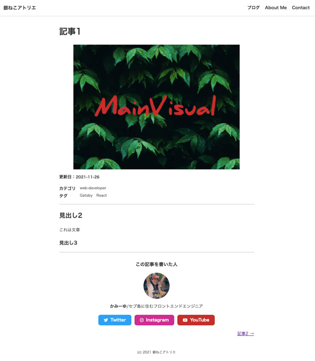
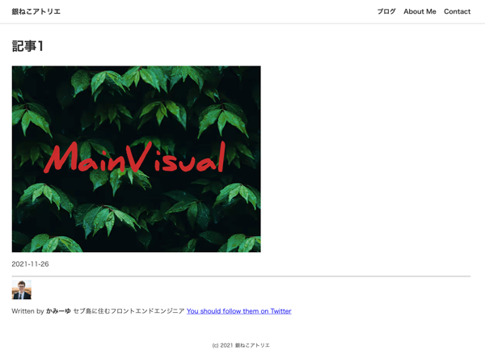
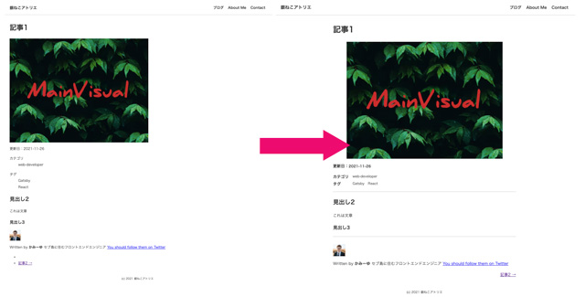

## 今までのGatsbyの記事と注意点
現在ここまで記載しています。<br>
制作するまでを目標にUPしていくので順を追ったらGatsbyサイトが作れると思います。

1. [インストールからNetlifyデプロイまで](/blogs/entry401/)
2. [ヘッダーとフッターを追加する](/blogs/entry484/)
2. *投稿テンプレにカテゴリやらキービジュアル（アイキャッチ）追加*（←イマココ）
3. [ブログ記事、カテゴリ、タグ一覧の出力](/blogs/entry408/)
4. [プラグインを利用して目次出力](/blogs/entry410/)
5. [プラグインナシで一覧にページネーション実装](/blogs/entry413/)
6. [個別ページテンプレート作成](/blogs/entry416/)
7. [プラグインHelmetでSEO調整](/blogs/entry418/)
8. [CSSコンポーネントでオリジナルページを作ろう！！](/blogs/entry421/)
9. [関連記事一覧出力](/blogs/entry430/)
11. [タグクラウドコンポーネントを作成する](/blogs/entry486/)
12. [パンくずリストを追加する](/blogs/entry487/)
13. [記事内で独自タグ（コンポーネント）を使えるようにする](/blogs/entry489/)

<small>※ Gatsbyは2021月12月、v4にバージョンアップしています。随時リライトしています。</small>

このシリーズは[Github・gatsby-blog](https://github.com/yuririn/gatsby-blog)に各内容ブランチごとで分けて格納しています。

今回のソースは[add-mainvisual](https://github.com/yuririn/gatsby-blog/tree/add-mainvisual)ブランチにあります。

### このシリーズではテーマGatsby Starter Blogを改造します
この記事は一番メジャーなテンプレート、 Gatsby Starter Blogを改造しています。同じテーマでないと動かない可能性があります。

### 今回やりたいこと
ブログ記事のmarkdownファイルだけを取得し、投稿ごとにキービジュアル画像やカテゴリなどの属性を追加し、テンプレートに表示したい。

まずは普段更新する記事用のテンプレを作ります。長いですが、目次を活用しながら読み進めてください。

今回の完成目標です。



おまけで、「この記事を書いた人」的なコンポーネントも改造しました。かなりブログっぽいページにGrade Upできます！


## 記事と記事中の画像などの格納フォルダーの設定

gatsby-node.jsのコメントから。

> Explicitly define the siteMetadata {} object<br>
> This way those will always be defined even if removed from gatsby-config.js<br>
> Also explicitly define the Markdown frontmatter<br>
> This way the "MarkdownRemark" queries will return `null` even when no blog posts are stored inside "content/blog" instead of returning an error<br><br>
> siteMetadata 内のデータ（オブジェクト）を明示的に定義します。<br>
> gatsby-config.jsから削除された場合でも、これらは常に定義され。Markdown内のfrontmatterも明示的に定義します。
> このように、「MarkdownRemark」クエリは、ブログの投稿は、エラーを返す代わりに「content/blog」内に保存されます。

つまり、`content/blog`に格納されたmarkdownファイルは記事として反映されます。

記事内本文に表示したい画像もマークダウンファイルと同じblogフォルダーに格納します。

私は今公開されているサイトにディレクトリー構造をできるだけ近づけるため、以下のように設置しました。

```
プロジェクト/
  └ content/
    ├ src
    |  └ images/ 汎用で使う画像全般を格納
    |    └ thumbnail/ 記事のキービジュアル&サムネイル用の画像
    └ blog/
      ├ 個別のページ
      └ blogs/
        ├ images/ 記事用の画像
        └ 各ブログ記事
```
gatsby-config.jsを見ると */content/blog* と */src/images* 以下に画像が格納できるようになっているのでこのまま使います。

```js{7,15}:title=gatsby-config.js
module.exports = {
  plugins: [
    `gatsby-plugin-image`,
    {
      resolve: `gatsby-source-filesystem`,
      options: {
        path: `${__dirname}/content/blog`,
        name: `blog`,
      },
    },
    {
      resolve: `gatsby-source-filesystem`,
      options: {
        name: `images`,
        path: `${__dirname}/src/images`,
      },
    },
  ]
}
```

v4以降、ディレクトリー構造の変更方が分かっておらず、blogの中にblogsがあるというちょっと気持ち悪い構造になってしまったのですが、一旦はこれで運用することにしました。

## frontmatter を設計し投稿する。
記事ごとに必要なタイトルなどの項目を設計します。

<msg txt="ここで適当に設計したら多分あとで泣きをみます。"></msg>

後々何が出力したいかよく考えて作成します。今から以下のファイルを操作します。

```
プロジェクト/
  ├ gatsby-node.js（追記）
  ├ src/
  |  └ images/
  |    ├ common/dummy.png（追加）
  |    └ thumbnail/thumbnail/main-visual.png（追加）
  └ content/
    └ blog/
      └ blogs/entry1.md （追加）
```

```md:title=mdファイル
---
title: テスト投稿
date: 2021-11-26
description: この記事はテスト投稿です
---
```

デフォルトではこんなものだと思いますので、キービジュアル（hero）、記事のタイプ(pagetypetype)を追加します。<br>
ちなみに私のブログでは**categoryは1つ、タグは複数OK**というルールとしました。

<msg txt="ルールが煩雑だと記事も破綻しますからね。。。"></msg>

#### entry1.md を新たに作り Frontmatter を編集する
```md:title=entry1.md
---
title: 記事1
date: 2021-11-26
pagetype: blog
hero: thumbnail/main-visual.png
# ↑src/images/ディレクトリを参照している↑
description: この記事はテスト投稿です
cate: web-developer
tags: ['Gatsby', 'React']
---
```
複数の値は配列で。

```js
['Gatsby', 'React']
```

今までブログをblogs/以下に公開していたので *content/blog/blogs/* ディレクトリー内に格納します。

starter blog では記事はblog以下のディレクトリ構造がページ生成時に継承されます。

domainが`http://example.com`だった場合。

```
content/blog/blogs/entry1.md
↓↓↓
http://example.com/blogs/entry1
```

### gatsby-node.js から frontmatter の設定変更

gatsby-node.js ファイルから `exports.createSchemaCustomization` 〜といいうコードを探します。

まだ何も触ってなければ、239行目あたり（結構下の方）にあるはずです。

`createTypes`内に設定された出力したいfrontmatterに応じて修正ます。

`type Frontmatter`に *cate*、*tags*, *hero*、*pagetype* を追加します。

```js{12-15}:title=gatsby-node.js
//~ 省略
exports.createSchemaCustomization = ({ actions }) => {
  const { createTypes } = actions

  //~ 省略
  createTypes(`
    //~ 省略
    type Frontmatter {
      title: String
      description: String
      date: Date @dateformat
      pagetype: String
      tags: [String]
      cate: String
      hero: String
    }

    type Fields {
      slug: String
    }
  `)
}
```
GraghQLのコメントは#を頭に付与するだけ。
```schime
# コメント
```

GraphQLは*クエリ言語*なので、markdownファイルのfrontmatter(---で囲んだ部分)の設定もここから読み取ることができます。

取得するデータは `result` に格納設定されています。 `frontmatter`に、`hero`、`pagetype`をgatsby-node.jsの上の方に追記します。

```js{17-20}:title=gatsby-node.js
// 省略

exports.createPages = async ({ graphQL, actions, reporter }) => {
  // 省略
  const result = await GraphQL(
    `
      {
        allMarkdownRemark(
          sort: { fields: [frontmatter___date], order: ASC }
          limit: 1000
        ) {
          nodes {
            id
            fields {
              slug
            }
            frontmatter {
              hero
              pagetype
            }
          }
        }
      }
    `
  )
  if (result.errors) {
    // 省略
```

さらに、上記（変数 `result`）のコードの少し下のあたりも修正。

* `hero`の値をテンプレート側で受け取れるようにします。万が一キービジュアルの設定がなかった時のために、ダミー画像用のコードもセットしておきます。
* `pagetype` `blog`だけに絞り込んで出力
* prev nextボタンも`pagetype` `blog`のみ動くように修正

```js{4,19,8-9}:title=gatsby-node.js
// 省略
if (posts.length > 0) {
  // filterでpagetypeがblogのものだけ抽出
  const blogPosts = posts.filter(post => post.frontmatter.pagetype === "blog")

  blogPosts.forEach((post, index) => {
    //書き換える
    const previousPostId = index === 0 ? null : blogPosts[index - 1].id
    const nextPostId = index === blogPosts.length - 1 ? null : blogPosts[index + 1].id

    createPage({
      path: post.fields.slug,
      component: blogPost,
      context: {
        id: post.id,
        previousPostId,
        nextPostId,
        //↓追記
        hero: post.frontmatter.hero ? post.frontmatter.hero: "common/dummy.png",
      },
    })
  })
}
// 省略
```

これでmd側に書かれている画像パスを参照できるようになります。

## 出力するテンプレートを改造し、画像を出力する。

出力するテンプレートのコードを編集します。<br>

```
プロジェクト/
  └ src/
    └ templates/blog-post.js（編集）
```

このテンプレートでは *blog/* 以下のmarkdownファイルから取得したコンテンツを出力します。

### GraghQLで受け取るクエリを変更

`pageQuery`の設定を変更します。

`$hero: String` 追加し、markdownファイルから *gatsby-node.js* 経由で画像パスを取得します。

このように取得した値は、絞り込みなどに使えます。

```js{7}:title=blog-post.js
export const pageQuery = GraphQL`
  query BlogPostBySlug(
    $id: String!
    $previousPostId: String
    $nextPostId: String
    # ↓追加
    $hero: String
  ) {
    //省略
  }
```

`allFile` にはすべてのファイル情報（mdや画像）が格納されています。
`site` と `markdownRemark` の間に **$heroの値と一致するファイルを取得する**

*gatsby-image-plugin* 出力するための値を取得しておきます。

```js{11,13}:title=blog-post.js
//省略
site {
  siteMetadata {
    title
  }
}
# ↓追加
allFile(
  filter: {
    # ↓ 画像パスが$heroと一緒のファイルを探す
    relativePath: { eq: $hero }
    # ↓ 画像を格納してある場所がimages（gatsby-config.jsで指定した名）
    sourceInstanceName: { eq: "images" }
  }
) {
  edges {
    node {
      relativePath
      childImageSharp {
        gatsbyImageData(
          width: 1000
          formats: [AUTO, WEBP, AVIF]
          placeholder: BLURRED
        )
      }
    }
  }
}
# ↑追加
markdownRemark(id: { eq: $id }) {
//省略
```

Gatsbyは *WebP（ウェッピー）* や *AVIF（エーブアイエフ）* も対応しています。`formats` を指定しなければ、従来の画像形式（pngやjpgなど）とWebPのみで出力できます。

> WebP（ウェッピー）という画像形式をご存知でしょうか？　長い間、webの静止画は大部分がJPEG/GIF/PNGのいずれかでした。WebPはこのすべてを置き換えることができる次世代のフォーマットです。2020年9月リリースのiOS 14がWebPをサポートしたことで、主要なモダンブラウザーの足並みがようやく揃いました。<br>
> [次世代画像形式のWebP、そしてAVIFへ](https://ics.media/entry/201001/)

WebPはSafariも対応したので、IEガン無視の人は十分使えます。

gatsby-image-plugin は loading Lazy 対応してあります。 `placeholder` は loading Lazy で画像が表示されるまでに、代わりに表示される画像です。`DOMINANT_COLOR`がデフォルトですが、`BLURRED` にしておくと、表示したい画像のぼやけたものを表示してくれ、代替画像から画像実物にきりわかる時が自然です。<br>
不要であれば `NONE` にしておきましょう。

```
placeholder: BLURRED
```
細かい設定（オプション）についてはこの記事の最後、[おまけ・画像のオプションなど](#おまけ画像のオプションなど)に書いてあるので、そちらも参考にしてください。

値が取れているか確認します。<br>
必要なデータは`childImageSharp`に格納されています。


```js{7}:title=blog-post.js
// 省略
const BlogPostTemplate = ({ data, location }) => {
  const post = data.markdownRemark
  const siteTitle = data.site.siteMetadata?.title || `Title`
  const { previous, next } = data
  const keyVisual = data.allFile.edges[0].node.childImageSharp;
  console.log(keyVisual) //デバッグ
  // 省略
  return (
    <Layout location={location} title={siteTitle}>
  // 省略
```
帰ってくる値はこんな感じ。
```js
{gatsbyImageData: {…}}
gatsbyImageData:
height: 480
images:
fallback: {src: '/static/77c97667947347115d267c5dfe31556f/81bb2/eye-catch.png', srcSet: '/static/77c97667947347115d267c5dfe31556f/ce13a/dum…7667947347115d267c5dfe31556f/81bb2/eye-catch.png 640w', sizes: '(min-width: 640px) 640px, 100vw'}
sources: (2) [{…}, {…}]
[[Prototype]]: Object
layout: "constrained"
//省略
```
### gatsby-plugin-imageでキービジュアルを出力

starter blog にデフォルトで入っている `gatsby-plugin-image` をインポートします。

```js{9}:title=blog-post.js
import * as React from "react"
import { Link, GraphQL } from "gatsby"

import Bio from "../components/bio"
import Layout from "../components/layout"
import Seo from "../components/seo"

// gatsby-plugin-image追加
import { GatsbyImage, getImage } from "gatsby-plugin-image"

// 省略
```

<div class="box">
<h4>gatsby-imageからgatsby-plugin-imageへ</h4>
確かv3以降、gatsby-plugin-imageに画像の取り扱いが変わりました。出力方法も変わります。
</div>

<br>今回、 `<GatsbyImage/>`でキービジュアル画像を出力するのですが、使い方は以下のように `childImageSharp`の値を丸ごと `getImage` に渡します。
```js
<GatsbyImage
  image={getImage(childImageSharp)}
  alt={alt属性}
  key={キー}
  className={必要に応じて}
/>
```

では実際にテンプレートの `header` タグ内に実装してみます。

```js{14-18}:title=blog-post.js
  // 省略
  const { previous, next } = data
  const eyeCatchImg = data.allFile.edges[0].node.childImageSharp//追加
  // 省略
  return (
    // 省略
    <article
      className="blog-post"
      itemScope
      itemType="http://schema.org/Article"
    >
      <header>
        <h1 itemProp="headline">{post.frontmatter.title}</h1>
        <GatsbyImage
          image={getImage(eyeCatchImg)}
          alt={post.frontmatter.title}
          key={post.frontmatter.title}
        />
        <p><time datetime={post.frontmatter.date}>{post.frontmatter.date}</time></p>
      </header>
    // 省略
```

出力コードはこんな感じ。何も設定しなくても、`decoding="async"`が付与されています。

```html
<div data-gatsby-image-wrapper="" class="gatsby-image-wrapper gatsby-image-wrapper-constrained"><div style="max-width: 1200px; display: block;"></div><picture><source type="image/avif" srcset="/static/734c25c8328e14e4d8df99abaea453a2/d0c69/eye-catch.avif 300w,
/static/734c25c8328e14e4d8df99abaea453a2/80f52/eye-catch.avif 600w,
/static/734c25c8328e14e4d8df99abaea453a2/410e0/eye-catch.avif 1200w" sizes="(min-width: 1200px) 1200px, 100vw"><source type="image/webp" srcset="/static/734c25c8328e14e4d8df99abaea453a2/9b21f/eye-catch.webp 300w,
/static/734c25c8328e14e4d8df99abaea453a2/9ff6b/eye-catch.webp 600w,
/static/734c25c8328e14e4d8df99abaea453a2/f2559/eye-catch.webp 1200w" sizes="(min-width: 1200px) 1200px, 100vw"></picture><noscript></noscript></div>
```

ついでに記事の公開日時も`time`タグで書き直します。`time`タグを使うと検索エンジンが「時」を表しているコンテンツであることを認識してくれます。
```html
<p><time datetime={post.frontmatter.date}>{post.frontmatter.date}</time></p>
```

CSSを追加してないのでちょっとダサいけど出力できました。



## カテゴリやタグを出力

テンプレートにカテゴリを追加します。

### タグやカテゴリも取得できるようにする

`markdownRemark` に *cate*、*tags*、を追加します。

```js{10-11}:title=blog-post.js
//省略
markdownRemark(id: { eq: $id }) {
  id
  excerpt(pruneLength: 160)
  html
  frontmatter {
    title
    date(formatString: "MMMM DD, YYYY")
    description
    cate
    tags
  }
}
```

お好みで日付フォーマットも変更しておきます。
```js
date(formatString: "YYYY-MM-DD")
```

データが取れるか確認。

```js{6-7}:title=blog-post.js
// 省略
const BlogPostTemplate = ({ data, location }) => {
  // 省略
  const { previous, next } = data
  const eyeCatchImg = data.allFile.edges[0].node.childImageSharp
  const { cate, tag } = data.markdownRemark.frontmatter//追記
  console.log(cate, tag)//デバッグ

  return (
    <Layout location={location} title={siteTitle}>
  // 省略
```
出力結果は以下の通り。ちゃんとmarkdownファイルからfrontmatterのデータが取れました。
```js
{cate: "web-developer", tags: (2) ['Gatsby', 'React']}
```

### カテゴリの出力
まずはカテゴリのみ出力します。

```js{17-20}:title=blog-post.js
  //省略
  const { cate } = data.markdownRemark.frontmatter

  return (
    <Layout location={location} title={siteTitle}>
    //省略
    <header>
      <h1 itemProp="headline">{post.frontmatter.title}</h1>
      <GatsbyImage
        image={getImage(eyeCatchImg)}
        alt={post.frontmatter.title}
        key={post.frontmatter.title}
      />
      <p><time datetime={post.frontmatter.date}>{post.frontmatter.date}</p>
    </header>
    {/* カテゴリ追加 */}
    <dl>
      <dt>カテゴリ</dt>
      <dd>{cate}</dd>
    </dl>
    <section
      dangerouslySetInnerHTML={{ __html: post.html }}
      itemProp="articleBody"
    />
    //省略
```
タグも追加。タグは複数あるので `map` で出力します。

```js{11-16}:title=blog-post.js
  const { cate, tags } = data.markdownRemark.frontmatter
  //省略
  return (
    <Layout location={location} title={siteTitle}>
    {/* カテゴリ追加 */}
    <dl>
      <dt>カテゴリ</dt>
      <dd>{cate}</dd>
    </dl>
    {/* タグ追加 */}
    <dl>
      <dt>タグ</dt>
      {tags.map((tag, index) => {
        return <dd key={`tag${index}`}>{tag}</dd>
      })}
    </dl>
    {/* 省略 */}
```
Reactではmapのようなループ系の処理で *key* がないと怒られるので、必ずセットしてください。

```
react.development.js:220 Warning: Each child in a list should have a unique "key" prop.
```

今は単に文字だけを表示してますが、次の[ブログ記事、カテゴリ、タグ一覧の出力](/blogs/entry408/)でカテゴリやタグの一覧ができるのでその時にリンクを付与します。

### next（次の記事へ） と previous（前の記事へ）の挙動
最初から実装されている next（次の記事へ） と previous（前の記事へ）のボタンが動くか確かめます。

ユーザーには基本記事のみ（pagetype: blog）を行き来して欲しいので、ちゃんと動いているか確かめます。

entry1.mdを複製してentry2.mdを作ります。

```md:title=entry2.md
---
title: 記事2
date: 2021-12-22
pagetype: blog
hero: thumbnail/eye-catch.png
description: この記事はテスト投稿です
cate: web-developer
tags: ['Gatsby', 'React']
---
```

元々あった「hello,world」などへのリンクがnext（次の記事へ） と previous（前の記事へ）に表示されなくなっていればOKです。

## 全体のスタイルをstyled-componentsで整える
前回同様、`styled-components`を使います。

インストール方法は[ヘッダーとフッターを追加する - せっかくなのでstyled-componentsでスタイルを入れてみる](/blogs/entry484/#せっかくなのでstyled-componentsでスタイルを入れてみる)を参考にしてください。

```js{4}:title=blog-post.js
// 省略
import { GatsbyImage, getImage } from "gatsby-plugin-image"

import styled from "styled-components"// 追加

const BlogPostTemplate = ({ data, location }) => {
// 省略
```
styled-components用にタグを書き直します。

1. `article`から`Article`へ
2. 画像のラッパーを増やす
3. 日付用のクラス追加と少しコード修正
3. カテゴリ、タグの`dl`を`Dl`へ
4. 記事の本文出力を内包している`section`を`BlogEntry`へ
5. ページ送りの`nav`を`BlogPostNav`にし、`ul`のインラインスタイルを削除
```js:title=blog-post.js
  // 省略
  return (
      {/* 1 articleからArticleへ */}
      <Article
        className="blog-post"
        itemScope
        itemType="http://schema.org/Article"
      >
        <header>
          <h1 itemProp="headline">{post.frontmatter.title}</h1>
          {/* 2 画像のラッパーを増やす */}
          <div className="keyvisual">
            <GatsbyImage
              image={getImage(keyVisual)}
              alt={post.frontmatter.title}
              key={post.frontmatter.title}
            />
          </div>
          {/* 3 日付用のクラス追加 */}
          <p className="date">
            更新日：
            <time datetime={post.frontmatter.date}>
              {post.frontmatter.date}
            </time>
          </p>
        </header>
        {/* 4 dlからDlへ */}
        <Dl>
          <dt>カテゴリ</dt>
          <dd>{cate}</dd>
        </Dl>
        <Dl>
          <dt>タグ</dt>
          {tags.map((tag, index) => {
            return <dd key={`tag${index}`}>{tag}</dd>
          })}
        </Dl>
        {/* 5 sectionからBlogEntryへ */}
        <BlogEntry
          dangerouslySetInnerHTML={{ __html: post.html }}
          itemProp="articleBody"
        />
        <footer>
          <Bio />
        </footer>
      </Article>
      {/* 6 navからBlogPostNavへ*/}
      <BlogPostNav>
        <ul>
          {/*省略*/}
        </ul>
      </BlogPostNav>
    {/*省略*/}

```
デザインを整えます。ファイルの下の方にスタイルを追記します。

```js:title=blog-post.js
// 省略
const Article = styled.article`
  max-width: 750px;
  margin: 0 auto;

  .date {
    font-weight: 700;

    time {
      font-size: 1.4rem;
    }
  }

  .keyvisual {
    text-align: center;
  }
`
const BlogEntry = styled.section`
  margin: 15px 0 30px;
  border-top: 1px solid #ccc;
  border-bottom: 1px solid #ccc;
`
const BlogPostNav = styled.nav`
  max-width: 750px;
  margin: 0 auto;

  ul {
    display: flex;
    justify-content: space-between;
    list-style: none;
  }
`
const Dl = styled.dl`
  display: flex;
  margin: 0;

  dt {
    width: 80px;
    font-weight: 700;
  }

  dd {
    font-size: 14px;
    margin-left: 0;
    padding-left: 0;

    & + dd {
      margin-left: 15px;
      margin-bottom: 5px;
    }
  }
`
```


## プロフィール（bio.js）のコンポーネントを改造してみよう
プロフィール用のコンポーネントをbio.jsを改造しましょう！
```
プロジェクト/
  ├ gatsby-config.js（必要に応じて修正）
  └  src/
     ├ components/
     | └ bio.js（修正）
     └ images/
       └ common/profile-pic.jpg（追加）
```

その前に、gatsby-config.jsの基本情報が設定されている `siteMetadata` を確認し、必要があれば編集、追記してください。

SNSアカウント情報を足してみました。

```js{12-13}:title=gatsby-config.js
module.exports = {
  siteMetadata: {
    title: `銀ねこアトリエ`,
    author: {
      name: `かみーゆ`,
      summary: `セブ島に住むフロントエンドエンジニアです。`,
    },
    description: `セブ島に住む女性フロントエンドエンジニアのライフログ。フロント技術を中心とした「ウェブ制作に関するチップス」、「磨耗しない人生の選択」や「海外ノマド」のライフスタイルについて発信しています。`,
    siteUrl: `https://ginneko-atelier.com`,
    social: {
      twitter: `lirioL`,
      instagram: `yurico.k`,
      youtube: `https://www.youtube.com/channel/UCbSgjkCIPucux8cFTuQcdcw`,
    },
  },
}
```
gatsby-config.js の `siteMetadata` にはどのコンポネントやテンプレートからでも、アクセスできます。

アクセス方法はいろいろありますがbio.jsでは、 `useStaticQuery` を使って取得しています。

`<StaticImage />` を使ってプロフィール画像を表示してあるので今回差し替えます。

```js{18-19,38-41,60-68,70-78}:title=bio.js
import * as React from "react"
import { useStaticQuery, graphql } from "gatsby"
import { StaticImage } from "gatsby-plugin-image"

import styled from "styled-components" //追加

const Bio = () => {
  const data = useStaticQuery(graphql`
    query BioQuery {
      site {
        siteMetadata {
          author {
            name
            summary
          }
          social {
            twitter
            instagram
            youtube
          }
        }
      }
    }
  `)

  // Set these values by editing "siteMetadata" in gatsby-config.js
  const author = data.site.siteMetadata?.author
  const social = data.site.siteMetadata?.social

  return (
    <BioWrapper>
      <h2>この記事を書いた人</h2>
      <StaticImage
        className="bio-avatar"
        layout="fixed"
        formats={["auto", "webp", "avif"]}
        {/* 画像サイズやパスを変更 */}
        src="../images/common/profile-pic.jpg"
        width={100}
        height={100}
        quality={95}
        alt="Profile picture"
      />
      {author?.name && (
        <>
          <p>
            <strong>{author.name}</strong>/{author?.summary || null}
          </p>
          <ul>
            <li>
              <a
                href={`https://twitter.com/${social?.twitter || ``}`}
                target="_blank"
                rel="noopener"
              >
                Twitter
              </a>
            </li>
            {/* insta追加 */}
            <li>
              <a
                href={`https://www.instagram.com/${social?.instagram || ``}`}
                target="_blank"
                rel="noopener"
              >
                Instagram
              </a>
            </li>
            {/* youtube追加 */}
            <li>
              <a
                href={`${social?.youtube || ``}`}
                target="_blank"
                rel="noopener"
              >
                YouTube
              </a>
            </li>
          </ul>
        </>
      )}
    </BioWrapper>
  )
}

export default Bio
```

gatsby-plugin-imageには `<GatsbyImage />` と `<StaticImage />` の画像の取得方法があります。

`<StaticImage />` コンポーネントを使うとGraphQLのコードを書かずに直接画像を指定できます。

```js
<StaticImage
  layout="fixed"
  formats={["auto", "webp", "avif"]}
  src="../images/common/camille-pic.jpg"
  width={100}
  height={100}
  quality={95}
  alt={author.name}
/>
```

難点は相対パス画像しか使えません。変数も使えないのでたまに不便。

```js
// NG
const src = '../images/common/camille-pic.jpg'

return <StaticImage src={src}/>
```

### @fortawesome/react-fontawesomeをインストールしてSNSリンクにアイコンを付与
せっかくなのでfontAwesomeを使えるようにします。

```bash:title=コマンド
npm i @fortawesome/free-brands-svg-icons @fortawesome/free-brands-svg-icons
```
以下コードを追加。
```js{3-8}:title=bio.js
import { StaticImage } from "gatsby-plugin-image"

import { FontAwesomeIcon } from "@fortawesome/react-fontawesome"
import {
  faTwitter,
  faInstagram,
  faYoutube,
} from "@fortawesome/free-brands-svg-icons"
```
アイコン用のタグを追加します。
```js{7,17,26}:title=bio.js
<li>
  <a
    href={`https://twitter.com/${social?.twitter || ``}`}
    target="_blank"
    rel="noopener"
  >
    <FontAwesomeIcon icon={faTwitter} />
    Twitter
  </a>
</li>
<li>
  <a
    href={`https://www.instagram.com/${social?.instagram || ``}`}
    target="_blank"
    rel="noopener"
  >
    <FontAwesomeIcon icon={faInstagram} /> Instagram
  </a>
</li>
<li>
  <a
    href={`${social?.youtube || ``}`}
    target="_blank"
    rel="noopener"
  >
    <FontAwesomeIcon icon={faYoutube} />
    YouTube
  </a>
</li>
```
### styled-components でスタイルを整える
styled-componentsを使うためにタグを書き換えます。
```js:title=bio.js
return (
    {/*変更*/}
    <BioWrapper>
      <h2>この記事を書いた人</h2>
      <StaticImage
        className="bio-avatar"
        layout="fixed"
        formats={["auto", "webp", "avif"]}
        src="../images/common/profile-pic.jpg"
        width={100}
        height={100}
        quality={95}
        alt="Profile picture"
      />
      {author?.name && (
        <>
          <p>
            <strong>{author.name}</strong>/{author?.summary || null}
          </p>
          {/*変更*/}
          <Sns>
            <li>
              <a
                href={`https://twitter.com/${social?.twitter || ``}`}
                target="_blank"
                rel="noopener"
                {/*クラス追加*/}
                className="tw"
              >
                <FontAwesomeIcon icon={faTwitter} />
                Twitter
              </a>
            </li>
            <li>
              <a
                href={`https://www.instagram.com/${social?.instagram || ``}`}
                target="_blank"
                rel="noopener"
                {/*クラス追加*/}
                className="insta"
              >
                <FontAwesomeIcon icon={faInstagram} /> Instagram
              </a>
            </li>
            <li>
              <a
                href={`${social?.youtube || ``}`}
                target="_blank"
                rel="noopener"
                {/*クラス追加*/}
                className="yt"
              >
                <FontAwesomeIcon icon={faYoutube} />
                YouTube
              </a>
            </li>
          </Sns>
        </>
      )}
    </BioWrapper>
  )
}

export default Bio
```
スタイルは下の方に追記します。
```js:title=bio.js
const BioWrapper = styled.div`
  text-align:center;

  .bio-avatar {
    display: block;
    border-radius: 50%;
    margin: 0 auto;
  }
  h2 {
      font-size: 18px;
  }
`
const Sns = styled.ul`
  list-style: none;
  display: flex;
  margin: 0 0 15px;
  padding: 0;
  justify-content: center;

  li {
      margin: 0 5px;
  }
  a {
      text-decoration: none;
      display: flex;
      height: 40px;
      justify-content: center;
      align-items: center;
      border: solid 2px;
      font-weight: 700;
      border-radius: 10px;
      color: #fff;
      padding: 0 20px;;

      &.tw {
          background: #04A0F6;
      }
      &.insta {
          background: #CF2E92;
      }
      &.yt {
          background:#C4302B ;
      }
  }
  svg {
      margin-right: 10px;
  }
`
```
完成はこんな感じ。


## まとめ

記事詳細ページはアレンジできるようになりました！

次回は「[ブログ記事、カテゴリ、タグ一覧の出力](/blogs/entry408/)」です。

皆さんのコーディングライフの一助となれば幸いです。

最後までお読みいただきありがとうございました。

### おまけ。画像のオプションなど
オプションがめちゃくちゃ細かいのですが、大まかなものだけ表にまとめました。全部書けないのでもっと詳しくみたい人は公式サイトの[イメージオプション](https://www.gatsbyjs.com/docs/reference/built-in-components/gatsby-plugin-image/#image-options)を参考にしてください。

#### すべてのオプション

|オプション|デフォ値|説明|
|-|-|-|
|*ayout*|"constrained" /<br>CONSTRAINED |リサイズの振る舞い|
|*width/height*||画像サイズ|
|*aspectRatio*||アスペクト比。通常は画像のアスペクト比に依存|
|*placeholder*|"dominantColor"/<br>DOMINANT_COLOR|画像がアップされるまでの一時的な画像|
|*formats*|["auto","webp"]/<br>[AUTO,WEBP]|画像のフォーマット|
|*transformOptions*|{fit: "cover",<br>cropFocus: "attention"}|グレースケールなどへ変換可能|
|*sizes*|自動作成|フルサイズの指定が欲しい時だけ使う|
|*quality*|50|画像のクオリティ0 ~ 100|
|<em><span>outputPixel</span><span>Densities</span></em>|<span>For fixed images:</span>[1, 2]<br><span>For constrained:</span>[0.25, 0.5, 1, 2]|生成する画像のピクセル密度。|
|*breakpoints*|[750, 1080,1366, 1920]|デフォで、一般的なデバイス解像度の幅が生成。ソース画像よりも大きな画像が生成されることはない。ブラウザに応じて自動かつ適切な画像サイズに切り替える。|
|*blurredOptions*|なし|プレースホルダがぼやけてない限り無視される|
|*tracedSVGOptions*|なし|SVG用のプレースホルダーオプション。|
|*jpgOptions*|なし|jpegを生成するときシャープにするオプション|
|*pngOptions*|なし|pngを生成するときシャープにするオプション|
|*webpOptions*|なし|webpを生成するときシャープにするオプション|
|*avifOptions*|なし|avifを生成するときシャープにするオプション|
